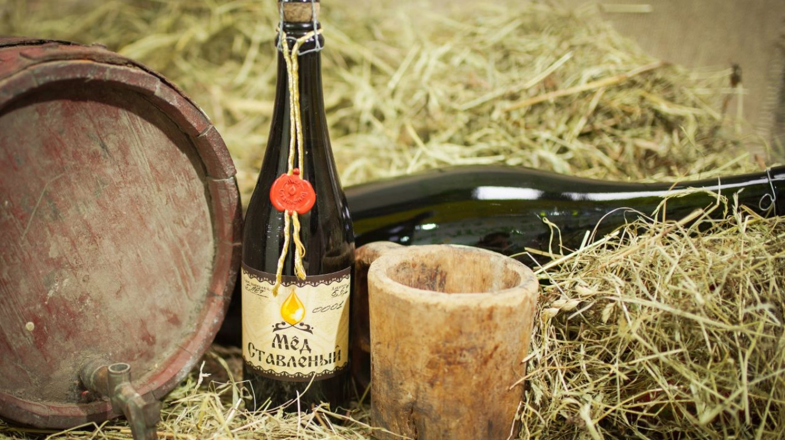

# Aging and Bottling

*Mead changes character dramatically with time. Bottled-and-drunk-young is a different drink from bottled-and-cellared-for-a-year. This page covers when to bottle, how to bottle, how to age, and how to know when the mead is ready.*

## Overview

Mead's aging window is much longer than beer (which peaks at 1-3 months) and similar to wine (which can age decades). A young 2-month mead is honey-forward, possibly slightly hot, and uncomplicated. A 12-month mead is integrated, mellow, and complex. A 24-month mead is sublime - many commercial meaderies hold their flagship meads for 2-3 years before release.

This page assumes you've finished primary fermentation (gravity stable for 2 weeks) and the mead has been sitting in secondary for at least a month.

## When to bottle

The decision is about clarity and stability:

### Clarity check
Hold the demijohn up to a light. If the mead is:
- **Crystal clear** (can read text through the bottle) - ready to bottle.
- **Slightly hazy** - wait another 2-4 weeks; consider fining.
- **Cloudy / soupy** - wait longer; consider racking and adding finings (bentonite, gelatin, or chitosan).

### Stability check
The gravity should be stable (unchanged for 2-3 weeks). If you read 1.005 today and 1.005 next week, fermentation is finished.

If you bottle while fermentation is still active, you risk:
- Continued fermentation in the bottle (over-carbonation, exploding bottles).
- Loss of subtle flavours (yeast continues to consume).

### Time minimums
- **3 months from pitch** - the earliest a mead is reasonably finished. Often still rough.
- **6 months from pitch** - the comfortable bottling minimum.
- **12 months from pitch** - premium territory. Worth the wait.

## Fining (optional but useful)

Fining agents pull suspended particles (yeast, proteins, fruit pulp) down to the bottom so the mead clears:

- **Bentonite** - clay; absorbs proteins. 4 g per 5 litres; mixed with warm water; added to the mead and stirred gently. Settles in 1-2 weeks.
- **Sparkolloid** - kieselsol-based; gentle. 5 g per 5 litres.
- **Kieselsol + chitosan** - two-part fining; very effective. Used together (kieselsol first, then chitosan 24 hours later). Clears mead in 3-5 days.
- **Gelatin** - old-school; works but less popular now. 5 g per 5 litres.

For a clear traditional mead, gelatin or kieselsol+chitosan is usually enough. Fruit meads sometimes need bentonite first to remove the fruit pulp before final clarification.

After fining: wait at least 1 week. Rack carefully off the sediment to a fresh demijohn (or directly to bottling).

## The back-sweetening decision

Most meads are fermented dry (residual sugar near zero). For sweeter mead, you have three options:

### 1. Stop fermentation early
- Add 1 g potassium sorbate per 5 litres at the point you want to stop.
- Add 5 ml of potassium metabisulfite solution (1 tablet dissolved in 50 ml water).
- This kills the yeast and prevents further fermentation.
- Then add 50-100 g of dissolved honey to taste.

### 2. Back-sweeten with honey at bottling
- Same as above: add 50-100 g of honey to taste.
- Add 1 g potassium sorbate to prevent re-fermentation in the bottle.
- Mix thoroughly before bottling.

### 3. Use a non-fermentable sweetener
- Stevia or sucralose - controversial; gives a "thin" sweetness.
- Lactose - won't ferment; gives a slight creamy sweetness.

For most home brewers, option 2 (back-sweeten with honey at bottling + potassium sorbate) is the cleanest.

## Carbonation

Mead can be still or sparkling. Sparkling mead needs to be carbonated either naturally (in-bottle fermentation of priming sugar) or by force-carbonation (CO2 from a tank).

### Natural carbonation (bottle conditioning)
1. Calculate priming sugar: 5 g caster sugar per litre for medium carbonation; 7 g for higher.
2. Dissolve sugar in 100 ml of warm water; cool.
3. Stir gently into the mead before bottling (don't whip; minimise oxygen contact).
4. Bottle in pressure-rated bottles (champagne / beer bottles with caps).
5. Bottle-age at 18-20°C for 2-3 weeks (the yeast eats the sugar; CO2 builds up).
6. Move to cellar temperature (12-15°C) for further aging.

**IMPORTANT**: only use natural carbonation if you did NOT back-sweeten with potassium sorbate. Sorbate kills the yeast and the priming sugar won't ferment. If you've back-sweetened, the mead is still.

**Pressure rating**: don't use flip-top wine bottles or non-pressurised glass for carbonated mead. Use proper beer bottles + crown caps or champagne bottles + corks/cages.

### Force carbonation
- Use a CO2 tank + a soda-water-style carbonator.
- Faster (24-48 hours) and more controllable.
- Requires kit (£100+).

## Bottle selection

### For still mead
- **500 ml flip-top bottles** - reusable, no capping kit needed. £1.50-2 per bottle.
- **375 or 500 ml wine bottles + corks** - traditional appearance.
- **Half-bottles (375 ml)** - good portion size for two people.

### For sparkling mead
- **Beer bottles (330 or 500 ml) + crown caps** - pressure-rated. £0.80 per bottle.
- **Champagne bottles + corks + wire cages** - for high-end presentation.
- **Avoid wine bottles with regular corks** - not pressure-rated, will pop.

## Bottling technique

1. Sanitise bottles and caps.
2. Set up the racking cane to siphon from the demijohn into the bottles.
3. Fill bottles to 2-3 cm below the top.
4. Cap or cork immediately.
5. Label with: name, ABV (calculate from starting/finishing gravity), bottling date.

## Cellar conditions

Mead ages best at:
- **Temperature**: 12-15°C (cellar temperature). Avoid warm rooms, attics, sunny spots.
- **Humidity**: 60-70% (irrelevant for screw-cap; matters for cork).
- **Light**: dark. UV degrades flavour.
- **Position**: lying down if corked (keeps the cork moist); upright for flip-top or crown cap.

A cellar, an unheated cupboard, or a wine fridge are all fine.

## When is the mead ready?

A few signs:
- **Visible clarity** has improved over time (clearer in month 12 than month 6).
- **Aromatic complexity** has increased - the mead smells of more than just honey.
- **Harshness has softened** - no more "alcohol burn" at the back of the throat.
- **Body** has integrated - smoother on the tongue, less sharp.

Pour a small amount into a wine glass and taste. If it's lovely, you're there. If it's still rough, give it another 2-3 months.

## Taste evaluation rubric

| Aspect | Young mead (3 mo) | Aged mead (12 mo) |
|---|---|---|
| Nose | Honey-forward, slightly hot | Honey + secondary aromatics (floral / spicy / nutty) |
| Body | Sharp, edge-y | Smooth, integrated |
| Finish | Quick, alcohol-prominent | Long, layered, lingering |
| Acidity | Sometimes harsh | Balanced |
| Sweetness | More pronounced | Integrated with other flavours |
| Colour | Light, clear if fined | Deeper, often golden-amber |

## Long-term aging

Some mead styles benefit from very long aging (18-36 months):
- **Sack mead** (high-ABV traditional) - improves continuously up to about 36 months.
- **Bochet** (caramelised honey) - the toffee notes mellow and integrate over 18+ months.
- **Sour meads / Bretts** - develop their characteristic funk over 12-24 months.

Traditional mead at standard ABV peaks around 12-18 months in most homes. Past 24 months, the gains are small but still positive; past 5 years, mead can lose freshness.

## When mead has gone bad

Bad signs (rare if you've sanitised properly):
- **Acetic / vinegar smell** - acetobacter contamination. Mead has become vinegar. Unsalvageable.
- **Solventy / nail-polish smell** - fusel alcohols from stressed fermentation. Often mellows with very long aging (2+ years); sometimes doesn't.
- **Sulphury / rotten-egg smell** - H2S. Sometimes resolves with extended aging and a splash of copper (an actual copper coin in the bottle; old-fashioned but works); sometimes doesn't.
- **Mouse / horse stable** - Brett contamination. Some people like this; most don't. Often resolves with very long aging.
- **Active mould** on the surface - open and inspect immediately. Likely lost.

If a bottle is bad, don't drink it. Learn from it; the next batch is the redemption.

## A long-term mead schedule

For a brewer thinking 1+ year ahead:

- **Month 0**: brew traditional mead (5 litres).
- **Month 1**: rack to secondary.
- **Month 3**: add fruit (if making melomel) or spices (if metheglin).
- **Month 6**: rack to fresh demijohn; consider fining.
- **Month 9**: bottle.
- **Month 12**: open the first bottle.
- **Month 18-24**: drink the rest as the mead matures.

Make a new 5-litre batch every 2-3 months and you'll always have aged mead in your cellar.
