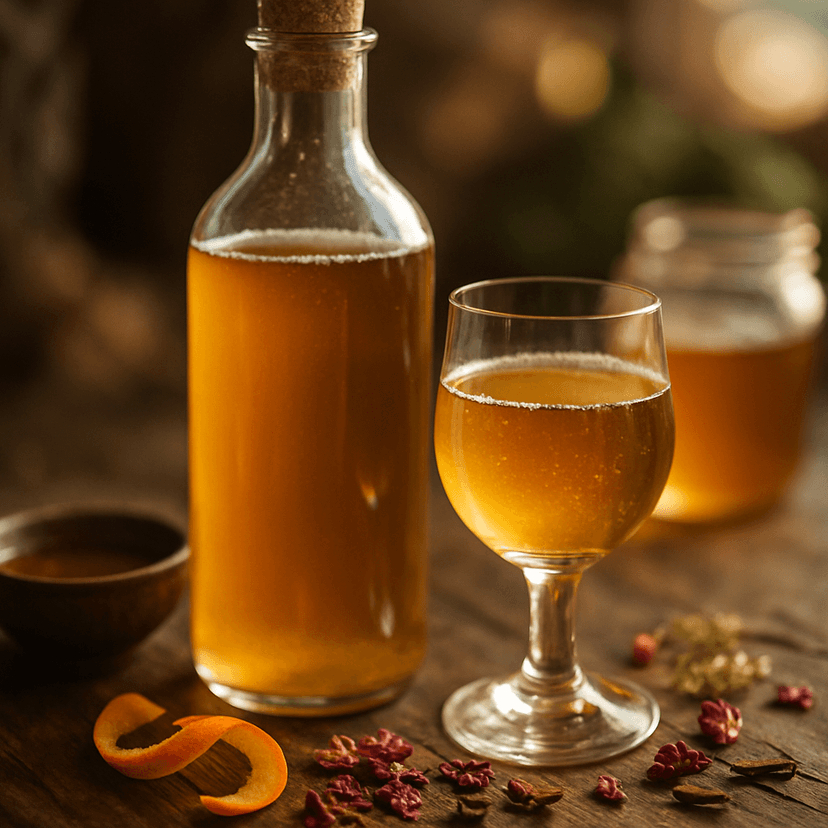

# What Mead Actually Is

*Mead is honey, water, and yeast. That's it. Five thousand years older than beer or wine, mead is the oldest fermented drink humans make. The whole craft is in choosing good honey, picking the right yeast, controlling temperature, and waiting.*

## Overview

Mead is the fermented drink of honey. The honey supplies the sugar; yeast converts that sugar into alcohol and CO2; what's left is a drink that ranges from dry to very sweet, from 6% ABV (lighter "session mead") to 18% ABV (sack mead).

Mead has been documented archaeologically from about 7000 BCE in China and about 3000 BCE in Europe. The Vikings drank it; the medieval monks made it; the British countryside made it for centuries before the Industrial Revolution; and the modern craft-mead revival has built a small but serious global industry since the 1990s.

The whole craft is small:

1. **Pick honey** — what kind of honey controls the flavour. Wildflower (most neutral), clover (sweet), orange blossom (citrus), buckwheat (dark, malty), heather (Scottish/Irish; floral and intense). Local honey is usually the best choice.
2. **Pick yeast** — wine yeast (D47, K1-V1116) for clean dry meads; champagne yeast (EC-1118) for high-ABV; English ale yeast for rounder fruitier session meads.
3. **Combine** — honey + water (typically 1:3 to 1:4 by weight) + yeast + nutrient (mead needs added nitrogen since honey doesn't have any).
4. **Ferment** — 4-8 weeks in a sealed fermenter with an airlock.
5. **Age** — 3-12 months in bulk (a glass demijohn).
6. **Bottle** — sweetened to taste; carbonate if desired; bottle-age 3-6 months more.

The patience is the main demand. A 12-month-from-pitch mead is markedly better than a 6-month one; an 18-month is markedly better still. Mead rewards waiting.

## Sub-styles

Once you know the basic technique, the variants are straightforward:

- **Traditional mead** — just honey + water + yeast.
- **Melomel** — mead with fruit (e.g. raspberry, blackberry, peach, apple). The fruit goes into the secondary ferment.
- **Metheglin** — mead with herbs and spices (e.g. cinnamon, clove, ginger, vanilla). The spices go into the secondary or in a tea added before bottling.
- **Cyser** — mead made with apple juice instead of water (apples + honey hybrid).
- **Pyment** — mead made with grape juice instead of water (essentially a sweet wine-mead hybrid).
- **Braggot** — mead with malt or beer wort added (mead-and-beer hybrid).
- **Bochet** — mead made with caramelised honey (the honey is heated to deep amber before fermentation; gives toffee notes).

This course covers traditional + melomel + metheglin. The other sub-styles are variants once the foundation is solid.

## What you need

- A 5-litre glass demijohn (carboy) with an airlock
- A 1-litre glass jar (for starter) — optional
- A digital hydrometer (essential for monitoring fermentation)
- Honey: 1-1.2 kg per 5 litres of mead (for traditional)
- Yeast: 1 sachet for a 5-litre batch
- Yeast nutrient: 5-7 g per litre
- A clean sanitiser (Star San or similar)
- Patience: minimum 4 months from start to first taste

## How to use the course

1. Make a traditional 5-litre batch following the next page.
2. Wait 8 weeks. Rack to secondary.
3. Wait another 8 weeks. Bottle.
4. Wait 3 months. Taste.
5. Then experiment with melomels and metheglins on subsequent batches.

The whole journey from "decided to make mead" to "drinking your first bottle" is about 9 months. That's the realistic mead timeline. Anyone offering a quick mead is either making something else, or making something disappointing.
