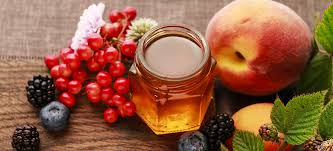

# Melomels and Metheglins

*Melomel = mead with fruit. Metheglin = mead with herbs and spices. Both are variations on the traditional mead, with the fruit or spices added at a specific moment to maximise their flavour.*

## Overview

Once you've made a traditional mead, the variant styles open up. Two big families:

- **Melomel**: mead with fruit. The fruit is added in the secondary fermentation (after primary is finished), so the yeast extracts the flavour without consuming all the fruit sugar.
- **Metheglin**: mead with herbs and spices. The spices are added in the secondary, or as a spice tea added at bottling.

The technique is identical to traditional mead until the point of secondary fermentation; that's where the divergence happens.

## Melomel (fruit mead)

### When to add fruit

Fruit in the primary fermentation gets consumed by the active yeast, most of the sugar fermented out, some of the flavour stripped. Result: a "fruity-ish" mead.

Fruit in the secondary fermentation, after primary is finished, is extracted gently. The yeast (still active but slowing) consumes some sugar but most of the fruit's aromatic compounds are preserved. Result: a clearly fruit-forward mead.

**Best practice: add fruit in secondary.**

### Choosing fruit

- **Raspberry**: strongest melomel candidate. Bold, deep flavour. Use 1-1.5 kg per 5 litres. Often combined with vanilla or chocolate notes.
- **Blackberry**: earthier than raspberry. Use 1-1.5 kg per 5 litres.
- **Blueberry**: subtle, gentle. Use 2-2.5 kg per 5 litres.
- **Cherry (sour cherry)**: bright, tart, beautiful colour. Use 1-1.5 kg per 5 litres.
- **Peach / apricot**: soft stone-fruit notes. Use 2-2.5 kg per 5 litres.
- **Apple (whole cubed)**: gives "cyser" character (apple mead, see below).
- **Strawberry**: delicate, hard to capture. Use 2 kg per 5 litres. Best paired with vanilla.
- **Pomegranate**: striking colour, slightly tart-bitter. Use 1.5-2 kg per 5 litres.

For first melomel, raspberry or blackberry are easiest. The flavour comes through clearly; the colour develops beautifully.

### Method

1. Make the base mead per the traditional recipe.
2. After primary fermentation completes (3-4 weeks), rack to secondary.
3. Add the fruit:
   - Fresh fruit: rinse; freeze overnight (the freeze-thaw breaks the cell walls); thaw; add to the secondary demijohn.
   - Frozen fruit: thaw and add directly.
   - Make sure the fruit is below the level of the liquid (use a sanitised glass weight or just press it down gently).
4. Cap and airlock. The mead will start bubbling again as the yeast consumes the fruit's sugar.
5. Leave 2-4 weeks. The fruit's colour will leach into the mead; the flavour develops slowly.
6. Rack off the fruit (the fruit acts as a filter; leave the spent fruit behind).
7. Continue aging or bottle.

### A worked example: raspberry melomel

- 1.2 kg honey + 4 litres water + 1 sachet K1-V1116 yeast + 5 g Fermaid O.
- After 3-4 weeks of primary, rack to secondary.
- Add 1.5 kg of frozen raspberries (preferably whole; mash slightly).
- Leave 3 weeks. The mead turns a beautiful deep pink-red.
- Rack off the fruit. Bottle after another month.
- Bottle-age 3 months.

The result: a fragrant raspberry mead, slightly sweet from residual raspberry sugar, deep ruby colour, around 12-13% ABV.

## Metheglin (spiced mead)

### When to add spices

Spices can go in two places:
- **Secondary fermentation**: add as whole spices in a muslin bag suspended in the secondary. Steeps for 1-3 weeks; the flavour extracts gradually.
- **At bottling**: make a strong "spice tea" by simmering spices in a small amount of water; cool; add to the mead at bottling. Quick and controllable.

The secondary approach is more traditional; the bottling approach gives finer control over intensity.

### Common metheglin spices

- **Cinnamon stick**: warm, classic. 1-2 sticks per 5 litres.
- **Vanilla bean**: split lengthwise. 1-2 beans per 5 litres.
- **Cloves**: strong, use sparingly. 4-6 cloves per 5 litres.
- **Cardamom (green pods)**: floral. 6-10 pods, lightly crushed, per 5 litres.
- **Fresh ginger**: sliced thin, 30-50 g per 5 litres.
- **Black peppercorns**: surprising and excellent. 10-15 corns per 5 litres.
- **Allspice berries**: warming. 4-6 berries per 5 litres.
- **Star anise**: sweet aniseed. 2-3 stars per 5 litres.
- **Lemon or orange zest**: strips, no white pith. From 2-3 citrus per 5 litres.
- **Hops** (yes, hops): give a beer-mead crossover called braggot. 5-10 g of low-alpha hops per 5 litres.

### A worked example: spiced wassail metheglin

- 1.2 kg orange-blossom honey + 4 litres water + 1 sachet D47 + 5 g Fermaid O.
- After 3-4 weeks of primary, rack to secondary.
- Add to a muslin bag: 1 cinnamon stick + 4 cloves + 6 cardamom pods (crushed) + zest of 1 orange + 30 g ginger sliced.
- Suspend the bag in the demijohn for 2 weeks.
- Taste; if more spice is wanted, leave another week.
- Remove bag. Bottle after another month.
- Bottle-age 3 months.

Result: a warming holiday-spiced mead, fragrant with citrus and warming spices, perfect for winter.

## Cyser, pyment, and braggot

These are variants on the same theme but use a different base liquid:

### Cyser (apple mead)
- Replace the water with apple juice (preferably fresh-pressed, unfiltered).
- Same honey amount (1-1.2 kg per 5 litres of apple juice).
- Yeast: 71B-1122 is ideal (mellows malic acid).
- Result: a deeper, more wine-like mead with apple notes.

### Pyment (grape mead)
- Replace the water with grape juice (red or white).
- Same honey amount.
- Yeast: D47.
- Result: a mead-wine hybrid, halfway between a dessert wine and a traditional mead.

### Braggot (mead + beer)
- Use a base of malt extract (1 kg malt extract + 0.8 kg honey for 5 litres).
- Hops added (5-10 g of mild hops).
- English ale yeast.
- Result: a beer-mead crossover, often used by Belgian-style brewers.

## Bochet (caramelised honey mead)

A spectacular variant. Before brewing, the honey is heated slowly in a pan to a dark amber (almost caramelised). The Maillard reactions create toffee, dark chocolate, and burnt-sugar notes. Then brewed as normal traditional mead.

The technique:
- Heat 1.2 kg honey in a heavy pan over low-medium heat, stirring constantly.
- The honey will go through stages: liquid → bubbling → light caramel → deep amber → very dark.
- Stop at "deep amber" (similar to maple syrup colour). 30-40 minutes of stirring.
- Don't let it go to black/burnt, bitter and acrid.
- Add hot water; the caramelised honey will dissolve.
- Continue with the standard mead recipe.

Result: a dark, complex mead with toffee, caramel, and roasted notes. The most exciting non-traditional mead variant. Pairs with vanilla or smoked ingredients for a dessert-mead direction.

## Variations table

| Style | Base | Add-in | Yeast |
|---|---|---|---|
| Traditional | Honey + water | None | D47 |
| Raspberry melomel | Honey + water | 1.5 kg raspberries | K1-V1116 |
| Spiced metheglin | Honey + water | Cinnamon + clove + cardamom | D47 |
| Cyser | Honey + apple juice | None | 71B-1122 |
| Pyment | Honey + grape juice | None | D47 |
| Braggot | Honey + malt extract | Hops | English ale yeast |
| Bochet | Caramelised honey + water | None (vanilla optional) | D47 |
