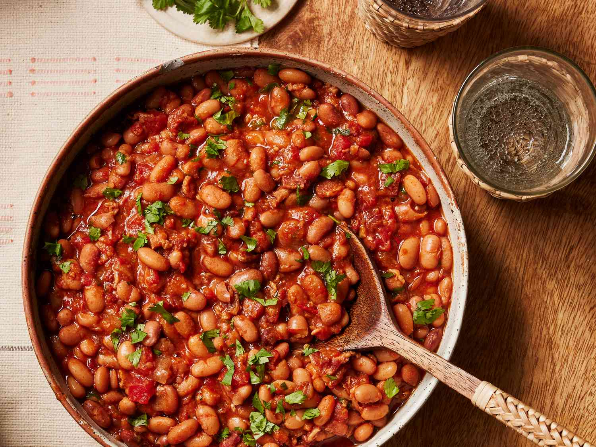

# Beans from Scratch

*Beans are the protein heart of Mexican cooking. Every household has a pot of beans on the go. Tinned beans are fine in a pinch; from-scratch beans are markedly better, take 1.5 hours of mostly unattended cooking, and once you've done it three times the technique is automatic.*

## Overview

Two beans dominate Mexican cooking:

- **Pinto beans** (frijoles pintos) — speckled brown, creamy when cooked, the traditional "Mexican bean" of the north and central regions.
- **Black beans** (frijoles negros) — dark, slightly sweeter, the traditional bean of Oaxaca, Veracruz, and the south.

Other beans in Mexican use: bayo, mayocoba, lima (small white), Peruvian. But pinto and black are 90% of the kitchen.

This page covers cooking the traditional pinto from dried + the traditional black beans + the refried version of both.

## Equipment

- A heavy pot (cast iron Dutch oven or a thick stainless-steel pot) with a tight lid.
- OR a pressure cooker (cuts time from 1.5 hours to 30 minutes).
- A wooden spoon.
- A potato masher (for refried beans).

## The basic technique (works for both pinto and black)

### Ingredients (1 kg dried beans, serves 8-10)
- 500 g dried beans (pinto OR black)
- 1.5 litres water (for cooking)
- 1 large white onion (halved)
- 4 garlic cloves (smashed)
- 1 bay leaf
- 1 tablespoon vegetable oil OR 100 g chopped bacon (for cooking richness)
- 1 teaspoon salt (added LATE — see notes)
- Optional: 1 epazote sprig (the Mexican herb specifically grown for beans; available at Mexican grocers; reduces gas from beans and adds a uniquely Mexican herbal note)

### Method (stovetop)

1. **Sort the beans** — spread on a tray; pick out any stones or shrivelled beans.
2. **Rinse** under cold water in a sieve.
3. **Soak (optional but recommended)** — submerge in cold water by 5 cm; soak 8 hours or overnight. Cuts cooking time from 90 to 60 minutes; helps with digestibility.
4. **Drain** the soaked beans.
5. **Bring to a boil** with fresh water (1.5 litres), the halved onion, smashed garlic, bay leaf, and oil/bacon. Don't add salt yet.
6. **Reduce heat** to low; cover with the lid slightly ajar.
7. **Simmer gently for 60-90 minutes**, until the beans are creamy-tender (they should crush easily between your fingers).
8. **Add salt** in the last 20 minutes of cooking. (Salting earlier toughens the bean skins.)
9. **Test for doneness** — the beans should be soft, creamy, slightly broken open, with the cooking liquid thickened.
10. **Remove the onion, garlic, and bay leaf** before serving.

### Method (pressure cooker)
1. Same prep as above (sort, rinse, soak).
2. Cook 30 minutes at high pressure (a 6-quart pressure cooker handles 500g beans + 1.5 litres water comfortably).
3. Natural release; salt in the last 5 minutes if needed.

## Refried beans (frijoles refritos)

Re-fried beans aren't fried twice. The "re-" in "refritos" means "well-fried" or "thoroughly fried". The technique:

### From cooked beans
1. In a heavy frying pan, heat 2 tablespoons of lard or vegetable oil over medium-low heat.
2. Add 500 g of cooked beans (drained but with some of their cooking liquid).
3. Mash gently with a potato masher as they fry — you want a chunky paste, not perfectly smooth.
4. Fry for 10-15 minutes, stirring often, until the beans deepen in colour, develop a thicker consistency, and start to peel off the bottom of the pan.
5. Add 100-150 ml of the cooking liquid (or stock) gradually if the beans get too dry.
6. Taste; adjust salt.

The traditional Mexican "frijoles refritos" is mashed almost smooth but with some texture. The visible-bean restaurant style is fine but the proper version is closer to a paste.

### Use
- As a layer in bean burritos.
- Underneath fried eggs at breakfast (huevos con frijoles).
- Spread on tortillas as a base.
- Inside enchiladas.

## A bowl of beans (Mexican breakfast)

A common Mexican breakfast is just:
- A bowl of cooked beans (with their broth).
- A warmed tortilla.
- A spoonful of salsa.
- Maybe a fried egg.

Eaten with a tortilla used as a spoon. Simple, satisfying, complete.

## Pot beans (frijoles de la olla) — the traditional preparation

This is the most common Mexican way to eat beans. The whole beans in their cooking liquid (the broth is part of the dish).

### Ingredients
- Same as the basic preparation above
- Optional: 1 chipotle in adobo (adds smokiness)
- Optional: a slice of bacon (for richness)

### Method
Same as the basic preparation. Serve the beans IN their broth, in a deep bowl, with a tortilla on the side. Optionally:
- Sprinkle queso fresco crumbles on top.
- Drizzle with a salsa.
- A small wedge of avocado on the side.
- A spoon of pico de gallo.

This bowl-of-beans is the traditional Mexican household meal. It's eaten 3-5 times a week in many homes.

## Charro beans / Borracho beans (cowboy / drunken beans)

A northern Mexican variant. Beans cooked with bacon + sausage + tomato + chilli + sometimes beer.

### Ingredients
- 500 g pinto beans (cooked per basic method)
- 100 g bacon (chopped)
- 1 onion (chopped)
- 2 jalapeños (chopped)
- 1 tomato (chopped)
- 2 garlic cloves (chopped)
- 250 ml lager beer
- A small handful of fresh coriander
- 1 teaspoon cumin
- Salt to taste

### Method
1. In a heavy pan, brown the bacon until crisp.
2. Add the onion, jalapeño, garlic; cook 5 minutes.
3. Add tomato; cook 3 minutes.
4. Add the cooked beans with their broth.
5. Add the beer and cumin.
6. Simmer 15-20 minutes.
7. Stir in fresh coriander before serving.

### Use
Charro beans are a side dish at carne asada or grilled-meat dinners — Northern Mexico's standard.

## Common bean mistakes

- **Salting too early** — toughens the bean skins. Add salt only in the last 20 minutes.
- **Boiling too aggressively** — breaks the beans open and turns them mushy. Low-and-slow.
- **Not soaking** — beans take 30-50% longer and digest worse. Always soak when you have time.
- **Discarding the soaking water** — the soaking water is fine to cook in (some old advice says to discard, but modern research suggests just rinsing the soaked beans before cooking is enough).
- **Using old beans** — beans older than a year take much longer to cook. Buy fresh-ish (look at packing date).

## Storage

- Cooked beans refrigerate 5-7 days.
- Refried beans 5-7 days too.
- Freeze in portions (250-500 g per bag) for 3 months.
- Frozen beans defrost overnight in the fridge; reheat with a splash of water.

## A traditional Mexican pantry of beans

A working Mexican kitchen has:
- 1 kg of pinto beans (dried) in the pantry.
- 1 kg of black beans (dried) in the pantry.
- 2-3 tins of cooked beans (for emergencies).
- Always: a tub of cooked beans in the fridge OR a portion in the freezer.

The first time you cook a pot of beans takes an hour. Once you do it weekly, the rhythm settles in — Sunday makes a pot of beans for the week.

## Why fresh beans matter

A tin of black beans and a pot of from-scratch black beans share a name but are different. The from-scratch beans:
- Have a deeper, more complex flavour.
- Have a creamier texture (the broken-open beans thicken the liquid).
- Come in their own broth (which is delicious and useful for other dishes).
- Cost half as much per gram.

The whole pot — 500 g dried beans → about 1.5 kg cooked beans → 12-15 portions — costs £2 (£4 with bacon and aromatic). The equivalent in tins is £6-8.

Cooking beans from scratch is the most important "fundamental" of Mexican cooking. Get this right and the rest follows.
