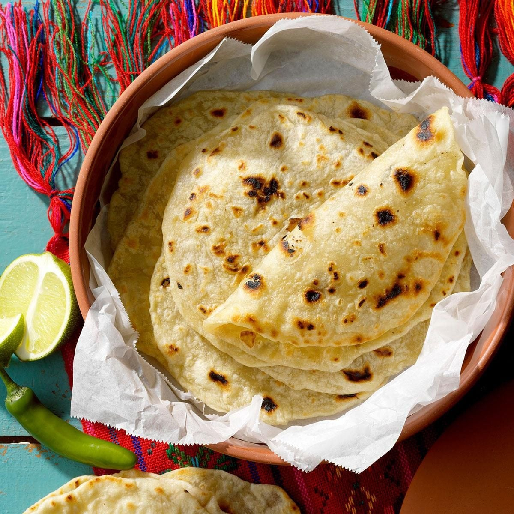

# Masa and Tortillas

*Masa is corn that's been nixtamalised — soaked and cooked in lime (calcium hydroxide). The process unlocks the corn's nutrition, transforms its flavour, and makes the tortilla possible. Without nixtamal, you have hominy or corn flour; with it, you have masa and a foundation of Mexican cooking.*

## Overview

Nixtamalisation is the pre-Columbian process that defines Mexican cooking. Dried corn kernels are soaked in an alkaline solution (water + calcium hydroxide / "cal") for several hours, drained, then ground while still wet to a smooth dough — *masa*. The process:

- **Softens the corn hulls** (so they can be removed).
- **Releases niacin** (which is locked in raw corn — without nixtamal, populations relying on corn develop pellagra).
- **Develops the iconic "masa" flavour** — toasty, alkaline, slightly nutty.
- **Creates the binding** necessary for tortilla dough.

For most home cooks, the easier route is **masa harina** — pre-nixtamalised corn flour that you hydrate with water. The Mexican brand Maseca dominates supermarkets globally; in the UK, Aytamco and other brands are also available. This page covers both routes.

## Route 1: Masa harina (the everyday method)

### Ingredients
- 200 g masa harina (Maseca or equivalent)
- 250 ml warm water
- ½ teaspoon salt

### Method
1. In a bowl, combine the masa harina and salt.
2. Pour in the warm water, mixing with a fork until a dough comes together.
3. Knead briefly with your hands for 2-3 minutes. The dough should be soft, smooth, slightly tacky but not sticky.
4. If too dry, add 1 teaspoon water at a time. If too wet, add 1 teaspoon masa harina.
5. Cover with a damp cloth; rest 15 minutes.

The masa should feel like soft play-dough — pliable, easy to press, with no cracks when you make a small ball.

### Test the consistency
Roll a small ball (3 cm diameter). Press it lightly in a tortilla press (or between cling film). If the edges crack and look ragged, the dough is too dry — add a teaspoon more water. If it sticks to the press, the dough is too wet — add a teaspoon more masa harina.

## Route 2: Real nixtamal (the traditional method)

### Ingredients
- 500 g dried corn kernels (white or yellow; specifically Mexican corn varieties like Bolita, Olotillo, Tehua — increasingly available online from specialty suppliers)
- 1 litre water
- 1.5 teaspoons calcium hydroxide ("cal" / pickling lime) — food-grade, available online or at Mexican grocers

### Method
1. In a heavy pot, combine the water and cal. Stir until dissolved (the solution will be cloudy white).
2. Add the dried corn kernels.
3. Bring to a gentle simmer over medium heat.
4. Simmer 15-20 minutes; do not boil aggressively.
5. Off heat; cover; let sit overnight (8-12 hours).
6. The next morning: drain the corn. Rinse thoroughly under cold water, rubbing the kernels between your fingers to remove the loosened hulls.
7. The drained, hulled kernels are *nixtamal*. They look slightly translucent and feel softer than the dried kernels.

### Grinding the nixtamal
The traditional method uses a *metate* (a flat stone slab + a rolling stone). The modern method uses a food processor or grinder.

For food processor:
1. Place the nixtamal in a food processor with the steel blade.
2. Add 50-80 ml water gradually.
3. Pulse, then process continuously for 3-5 minutes until you have a smooth dough.
4. Stop and scrape down the sides every minute.
5. The masa is ready when it's smooth, slightly tacky, and forms a soft pliable dough.

The freshly-ground nixtamal masa has a deeper corn flavour than masa-harina-based masa. The difference is genuinely tasteable. For a serious project, the nixtamal route is worth doing once or twice.

## Pressing tortillas

### Equipment
A tortilla press (cast iron or aluminium, about £10-15 from specialty shops). Or use 2 flat plates and a small heavy book.

### Method
1. Take a 30 g ball of masa (the size of a golf ball).
2. Place between two sheets of plastic — a freezer bag cut open, or two squares of greaseproof paper.
3. Place in the tortilla press.
4. Close the press firmly. The masa should flatten to about 3 mm thick (a 12-15 cm round).
5. Open the press; carefully peel one sheet off.
6. Flip the tortilla onto your open palm.
7. Carefully peel off the second sheet.

The tortilla is now ready to cook. Set aside on a clean cloth while you press the next.

## Cooking the tortilla

Use a comal (Mexican flat griddle) or a heavy frying pan. The tortilla cooks DRY — no oil.

1. Heat the pan / comal over medium-high heat until it sizzles when you drop a small water droplet on it.
2. Place the pressed tortilla on the hot surface.
3. Cook 30 seconds (the surface starts to dry; tiny bubbles form).
4. Flip; cook another 60 seconds (the underside develops a few brown speckles).
5. Flip again; press lightly with a spatula or your fingers. If the tortilla is well-made and the heat is right, it will puff into a balloon shape within 5-10 seconds (steam is trapped between the two cooked layers).
6. Remove; stack between a clean tea towel to keep warm and pliable.

A properly puffed tortilla is the visible mark of good masa + good heat + good technique. Each one that doesn't puff is information: too dry / too wet / pan too cold / pan too hot.

## Storage and reheating

### Fresh tortillas
- Eat within 4 hours of making.
- Keep stacked in a tortilla warmer or wrapped in a tea towel.

### Day-old tortillas
- Refrigerate wrapped in cling film, 3 days max.
- Reheat by:
  - Toasting briefly in a dry hot pan (10-15 seconds per side).
  - Microwave wrapped in a damp paper towel for 15 seconds.
  - Steaming briefly over simmering water.

### Stale tortillas
Don't throw away. Use for:
- **Chilaquiles** (cut into pieces, fried until crispy, simmered in salsa).
- **Tortilla chips** (cut into triangles, deep-fried).
- **Tostadas** (whole flat, deep-fried until crispy).
- **Migas** (broken into pieces, scrambled with eggs).

## Other masa preparations

Masa makes more than just tortillas:

### Sopes
Thicker, smaller tortillas (about 8 cm diameter, 5 mm thick) with a pinched-up rim. Topped with beans, meat, salsa, cheese.

### Tlacoyos
Oval-shaped, stuffed with refried beans or fava bean paste before pressing and cooking.

### Tetelas
Triangular folded tortillas, stuffed with beans before cooking.

### Gorditas
Thicker tortillas (about 1 cm thick) that are partially split open and stuffed with fillings.

### Tamales
Masa beaten with lard, spread on a corn husk or banana leaf, filled with meat or salsa, then steamed. A weekend project.

### Atole
A traditional Mexican drink made by thinning masa with water or milk, sweetened with sugar or piloncillo, sometimes flavoured with vanilla or chocolate. A breakfast and Christmas drink.

## Why fresh tortillas matter

A supermarket flour tortilla and a fresh corn tortilla are different foods. The fresh corn tortilla has:

- A toasty corn aroma the dried version lacks.
- A soft-and-pliable texture that holds fillings well.
- A genuine Mexican flavour rooted in nixtamal.

Once you've made fresh tortillas, the supermarket version becomes a disappointment. The pressing-and-cooking takes 20 minutes for 12 tortillas. The skill builds in a single session.

## Flour tortillas (a brief note)

Northern Mexico (and increasingly cosmopolitan Mexico City) uses flour tortillas — wheat flour + lard + water + salt — particularly for burritos and certain quesadillas. Flour tortillas are easier to make at home (no nixtamal, just wheat dough). But the **corn tortilla is the traditional Mexican tortilla**. The flour tortilla is regional and modern.

This course focuses on corn.
