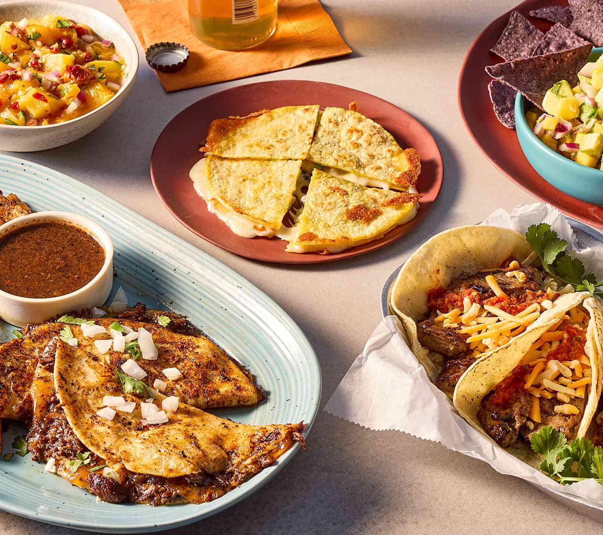

# What Mexican Cooking Actually Is

*Real Mexican cooking is unrelated to "Tex-Mex" or "Cal-Mex" or the burrito-shop chains. It's based on three ingredients (corn, beans, chillies), one process (nixtamalisation), and a few key techniques (mole, salsa, the tortilla press). Master those and you can cook the cuisine.*

## Overview

Mexican cuisine is rooted in three indigenous ingredients that predate European contact: **corn (maíz)**, **beans (frijoles)**, and **chillies (chiles)**. The Spanish brought wheat, dairy, pork, beef, and chicken; the resulting fusion is what we now call Mexican food.

Where many cuisines build around a central protein, Mexican cooking builds around the *plate composition* - a balance of:

1. **The masa element** - usually tortillas (corn) or sometimes wheat tortillas; rarely rice.
2. **The protein** - meat, fish, beans, or eggs.
3. **The salsa** - almost mandatory; ranges from raw (pico de gallo / cruda) to cooked (salsa roja, salsa verde) to slow-simmered (mole).
4. **The fresh elements** - chopped onion, coriander, lime wedges, sliced radish, avocado, chopped chilli, lettuce.
5. **The cheese / dairy** - fresh cheese (queso fresco), sour cream (crema), aged cheese (cotija) - used as a finishing accent, not the main character.

The Mexican meal is "build-your-own" within these elements: a taco is a tortilla + protein + salsa + onion + coriander + lime. A burrito is the same plus rice + beans. A quesadilla is a tortilla + cheese + filling. Every dish follows this logic.

This course covers:

1. **[Masa and tortillas](masa-and-tortillas.md)** - nixtamalisation (the process that turns corn into masa), making fresh tortillas, choosing or making masa harina.
2. **[Salsas](salsas.md)** - the four traditional salsas with technique and recipes.
3. **[Beans from scratch](beans-from-scratch.md)** - pinto, black, refried; the foundational technique.
4. **[Mole](mole.md)** - the queen of Mexican sauces, with the 7 moles of Oaxaca.
5. **[The Mexican plate](the-mexican-plate.md)** - how compositions are built; the traditional dishes.

## What Mexican cooking IS NOT

- **Tex-Mex** (chilli con carne, hard taco shells, crunchy nachos with melted cheese) - a Texan adaptation; American not Mexican.
- **Cal-Mex** (Mission burrito, fish tacos with cabbage slaw, breakfast burritos) - a California adaptation; American-with-strong-Mexican-influence.
- **Burrito-shop / Chipotle-style** - fast-food California-Mexican.
- **British / European "Mexican night"** - almost universally Tex-Mex, not actual Mexican.

This course covers Mexican-from-Mexico, which differs from all of the above.

## Regional Mexican

Mexico's cuisine varies sharply by region. The main culinary regions:

- **Oaxaca** - the mole heartland. Seven traditional moles. Mezcal country. Tlayudas, chapulines (grasshoppers), Oaxacan cheese.
- **Yucatán** - Mayan-influenced. Cochinita pibil (achiote-marinated pork). Habanero chillies. Sour orange. Pickled red onion.
- **Puebla** - the birthplace of mole poblano (the most-famous mole). Chiles en nogada. Cemitas.
- **Mexico City / Central Mexico** - the modern fusion. Tacos al pastor, chilaquiles, sopes.
- **Veracruz** - coastal. Seafood-rich. Huachinango a la veracruzana, pescado a la talla.
- **Northern Mexico (Sonora, Chihuahua, Nuevo León)** - wheat-tortilla country (rather than corn). Carne asada, machaca (dried beef). Tex-Mex influence flows both ways here.
- **Jalisco** - birria, pozole, tequila country.

This course focuses on central / Oaxacan / Pueblan Mexico (the "core" cuisine). Specific regional dishes are covered in [cuisine/mexican/](../../cuisine/mexican/).

## What you need

- **A heavy frying pan** (cast iron) or *comal* (the Mexican flat griddle for tortillas).
- **A tortilla press** (£10-20) - a cast-iron or wooden hinged press. You can also use 2 plates + a heavy book, but the press is faster.
- **A blender** - for salsas. The bartender's blender (Magic Bullet style) works; better is a high-powered VitaMix.
- **A molcajete** (Mexican mortar and pestle, made of basalt) - for crushing whole-spice salsas and guacamole. Traditional and beautiful but a regular mortar works.
- **A pressure cooker** - for beans. Saves hours.
- **Masa harina** (corn flour treated with lime) - Maseca brand is the Mexican standard. Available in UK supermarkets.
- **Dried Mexican chillies** - guajillo, ancho, pasilla, chipotle, chile de árbol. Available at Mexican grocers (Cool Chile Co, MexGrocer.co.uk) or online.

## How to use the course

1. Read all five content pages.
2. Make tortillas from masa harina. Eat them with butter and salt.
3. Make a salsa roja. Use it on tacos.
4. Make a pot of beans. Eat them with rice and tortillas.
5. Build a basic taco plate: tortilla + cooked protein + salsa + onion + coriander + lime.
6. After that, work toward mole and toward the composed Mexican plate.

Two weeks of cooking and you'll have a functional Mexican kitchen. The 5+ years to actually master mole - that's a longer journey.
