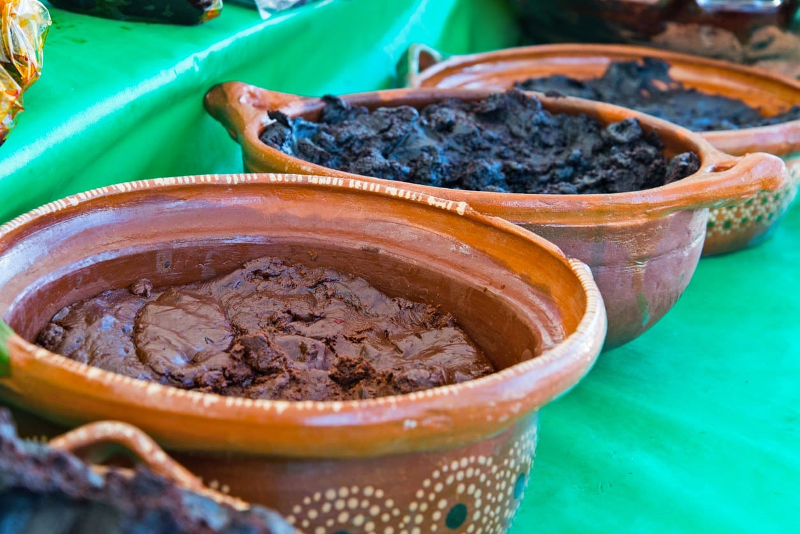

# Mole

*Mole is the queen of Mexican cooking. Twenty-plus ingredients, two-day cooking, the sauce of weddings, funerals, and Christmas. There are seven traditional moles of Oaxaca and dozens of regional variations. This page is an introduction.*

## Overview

A mole is a complex Mexican sauce built from:

- **Dried chillies** (toasted and ground)
- **Nuts and seeds** (sesame, pumpkin, peanut, almond)
- **Spices** (cinnamon, clove, allspice, cumin)
- **Aromatics** (onion, garlic, tomato or tomatillo)
- **Sometimes chocolate** (the famous "with chocolate" inclusion)
- **Sometimes dried fruit** (raisins, prunes)
- **Stock** (chicken or turkey)

The ingredients are individually toasted, then ground together, then simmered into a thick savoury sauce. Each component is treated with care: chillies are blistered then soaked; nuts are toasted; spices are bloomed; the resulting paste is fried in lard before stock is added.

A good mole takes 6-8 hours to make from scratch. The result is a sauce of unprecedented complexity - bitter, sweet, savoury, smoky, hot, spicy - that coats poultry or vegetables with a depth no other Mexican preparation matches.

This page introduces the seven moles of Oaxaca and gives a worked recipe for mole poblano (the famous one).

## The Seven Moles of Oaxaca

Oaxaca is the mole capital. Seven traditional moles, each named for its colour or character:

### 1. Mole Negro (Black Mole)
The most-famous. Deep dark black-brown. 30+ ingredients including pasilla and ancho chillies, charred tortillas, sesame seeds, pumpkin seeds, plantain, raisins, cinnamon, cocoa, and herbs. Used at weddings and Christmas. Pairs with turkey or chicken.

### 2. Mole Coloradito (Reddish-Brown Mole)
A red-brown mole; lighter than negro. Guajillo + ancho + chocolate. Often paired with chicken.

### 3. Mole Amarillo (Yellow Mole)
A yellow stew-mole. Lighter; uses chilcosle and güero chillies + masa as thickener. Often served as a hot stew with vegetables and chicken.

### 4. Mole Rojo (Red Mole)
Red, slightly less complex than coloradito. Chile guajillo + cascabel. Often used in enchiladas.

### 5. Mole Verde (Green Mole)
A green mole made with tomatillos, hoja santa, epazote, fresh chillies, and pumpkin seeds. Lighter and fresher than the others. Often with chicken or pork.

### 6. Mole Manchamantel (Tablecloth-Stainer Mole)
A red mole with tropical fruit (pineapple, plantain). Sweet-savory. Pairs with chicken or pork.

### 7. Mole Chichilo
A rare regional mole; dark brown, smoky, uses charred ingredients. Used at funerals in some Oaxacan villages.

## Mole Poblano (the famous one, NOT one of the seven Oaxacan)

Mole poblano comes from the state of Puebla (north of Oaxaca). It's the most-internationally-known mole because Mexican-American restaurants spread it widely. Distinct from Oaxacan moles but shares the general approach.

The legend: invented by nuns at the Convento de Santa Rosa in Puebla in the 17th century when they needed to host the visiting archbishop. They combined every flavourful thing they had: chillies, chocolate, nuts, spices, dried fruit. The resulting sauce became the wedding mole of Mexico.

### Ingredients (mole poblano, serves 8-10)

#### Chillies (toasted)
- 6 dried mulato chillies
- 4 dried ancho chillies
- 4 dried pasilla chillies
- 2 chipotle chillies in adobo (with 2 tablespoons of their adobo sauce)

#### Nuts and seeds (toasted)
- 60 g raw almonds
- 60 g raw peanuts
- 30 g sesame seeds (toasted; reserve some for garnish)
- 60 g pumpkin seeds
- 1 small stale corn tortilla (charred)
- 1 small stale white bread roll (charred)

#### Aromatics
- 1 large white onion (quartered)
- 6 garlic cloves
- 4 tomatoes (charred)
- 6 tomatillos (charred)

#### Spices (bloomed)
- 1 cinnamon stick
- 6 black peppercorns
- 4 cloves
- 4 allspice berries
- 1 tablespoon coriander seeds
- 1 teaspoon cumin
- 1 teaspoon dried oregano
- 1 teaspoon dried thyme

#### Sweetness and depth
- 60 g raisins
- 4 prunes
- 80 g Mexican chocolate (Mayordomo or Ibarra - sweetened, cinnamon-flavoured chocolate, NOT bittersweet)
- 1 tablespoon piloncillo (or brown sugar)
- 50 g lard (for frying the paste)

#### Stock
- 2.5 litres chicken stock (or turkey, ideally)

#### To finish
- 6 chicken legs (or 1 whole turkey, broken down) - cooked separately
- Sesame seeds for garnish
- Mexican rice + warm tortillas for serving

### Method (this is a 2-day project)

#### Day 1: Prep the mole paste

**Hour 1: Toast everything separately**
1. **Toast the chillies**: in a dry hot comal, briefly toast each chilli (mulato, ancho, pasilla) for 30 seconds per side until fragrant. Don't burn. Remove stems and seeds; reserve.
2. **Soak the chillies** in hot water for 30 minutes.
3. **Toast the nuts and seeds**: separately, dry-toast each (sesame seeds, pumpkin seeds, almonds, peanuts) until golden and fragrant. Reserve.
4. **Char the tortilla and bread** until blackened. Reserve.

**Hour 2: Cook the aromatics**
5. **Char the tomatoes, tomatillos, onion, and garlic** on a hot comal until blackened in spots. Reserve.

**Hour 3: Bloom the spices**
6. **Toast the whole spices** (cinnamon, cloves, peppercorns, allspice, coriander, cumin) in a dry pan for 1 minute. Grind in a spice mill or mortar.

**Hour 4: Blend**
7. **Blend in stages** - the dried chillies (with some of their soaking water) + nuts + seeds + tortilla + bread + raisins + prunes + ground spices + aromatic vegetables + chipotle. Blend in batches; aim for a smooth thick paste.

**Hour 5: Fry the paste**
8. In a heavy pan, melt the lard over medium heat.
9. Add the mole paste; cook 30-40 minutes, stirring frequently, until the paste deepens in colour and the lard rises to the surface.

#### Day 1 ends here. Refrigerate the mole paste overnight (the flavours develop).

#### Day 2: Assemble the mole

**Hour 1: Cook the chicken**
1. In a large pot, simmer the chicken legs in 2.5 litres of chicken stock with onion, garlic, and a bay leaf for 45 minutes until tender.
2. Lift the chicken out; reserve. Strain the stock.

**Hour 2: Finish the mole**
3. Heat the mole paste in a large heavy pot.
4. Gradually add the chicken stock (about 2 litres), whisking to incorporate. The mole should be the consistency of thick gravy.
5. Add the chocolate; let it melt in.
6. Add the piloncillo; stir.
7. Simmer 30 minutes; taste; adjust salt and chocolate.

**Hour 3: Combine and serve**
8. Return the cooked chicken to the mole. Heat through.
9. Serve over Mexican rice with warm tortillas. Sprinkle with sesame seeds.

### Notes on mole poblano

- **The 2-day technique is traditional.** The flavour after 24 hours of resting is dramatically better than fresh.
- **Mexican chocolate is critical.** It's sweetened and contains cinnamon. Don't substitute with dark unsweetened chocolate (the result will be off).
- **Lard is traditional.** The flavour the lard contributes is part of the mole. Vegetable oil works but is a step down.
- **The chillies are the foundation.** The combination of mulato + ancho + pasilla gives the bitter-deep-fruity character. Don't substitute.

## When to make mole

Mole is a special-occasion dish. You don't make mole on a Tuesday for dinner. You make it for:

- **A wedding** - the traditional mole occasion in Mexico.
- **A funeral** - the traditional alternate occasion.
- **Christmas Day** - mole is a Christmas tradition in Puebla and Oaxaca.
- **A birthday** - for a special celebration.
- **The Day of the Dead (Día de los Muertos)** - November 1-2.
- **Family reunion** - when you have a weekend and 10+ people to feed.

Making a big batch (8-10 servings) is the traditional scale. The leftovers freeze beautifully for 3 months.

## Shortcut moles

For weeknight use, jarred mole pastes exist:

- **Doña María Mole** - Mexican brand, widely available. Add chicken stock and chocolate; simmer 30 minutes. Acceptable; not great.
- **Mole Doña María Negro** - the dark variant.
- **Modern artisan mole pastes** - some specialty shops sell freshly-made mole pastes from real Mexican cooks. £8-15 per jar; serves 6-8.

A homemade mole from scratch is incomparably better than a jarred version. But for a weekday meal, the jarred is acceptable.

## Mole in other dishes

Once you've made mole, you can use it in:

- **Mole enchiladas** - corn tortillas dipped in mole, rolled with chicken filling, baked with more mole.
- **Mole over fried eggs** - for breakfast.
- **Mole tacos** - chicken cooked in mole, then in tortillas with onion and cilantro.
- **Mole over plain rice** - when you have leftover mole and no time for the proper assembly.

## Why mole matters

Mole is the cuisine's masterpiece. The list of ingredients (20-30 items), the cooking time (8+ hours, 2 days), and the depth of the resulting sauce - there's no comparable preparation in everyday cooking. Spanish cuisine has paella; Italian cuisine has ragù bolognese; Mexican cuisine has mole.

Don't expect to nail it on the first try. Expect to make 3-5 moles before they start to feel right. Each time, you understand more about the balance and the technique.

The cocktail-equivalent: if cocktails are 6 families with technique, mole is opera. Long, complex, and emotionally rich.
