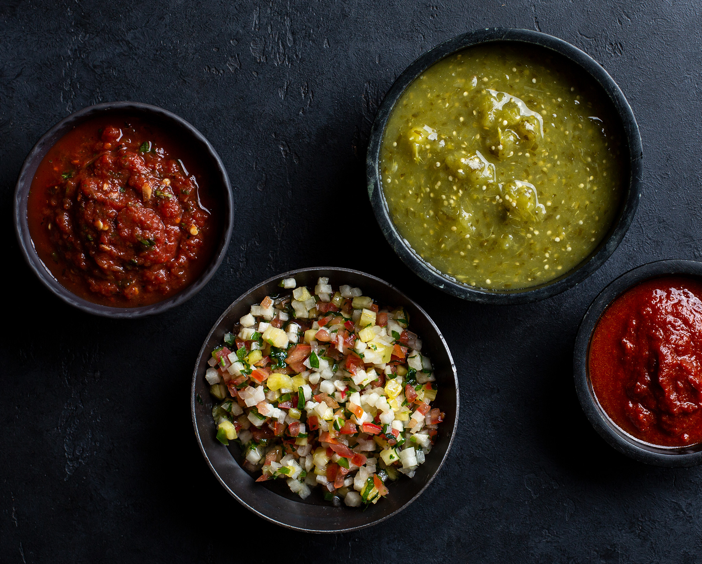

# Salsas

*A Mexican meal without salsa is incomplete. Every taco, every tortilla chip, every fried egg gets dressed. The four traditional salsas — salsa roja, salsa verde, pico de gallo, salsa cruda — cover almost everything. Master one of each style and you can build any Mexican plate.*

## Overview

A salsa is a sauce — *salsa* literally means "sauce" in Spanish. Mexican salsas range from:

- **Raw / fresh (cruda)** — chopped tomato, onion, chilli, coriander, lime. Made in 10 minutes; eaten same day.
- **Cooked / roasted (asada)** — tomatoes / tomatillos / chillies are charred over a flame or under a grill, then blended. Deeper, smokier.
- **Boiled (hervida)** — tomatoes / chillies simmered briefly then blended. Cleaner, brighter.
- **Dry-toasted chilli paste (recado / adobo)** — dried chillies toasted and ground; the foundation of mole.

This page covers the four traditional "everyday" salsas. The recado / mole approach is covered in the [mole page](mole.md).

## 1. Salsa Roja (the red salsa)

The everyday Mexican red salsa. Tomato-based, with a chilli kick, served warm or at room temperature.

### Ingredients (makes ~400 ml)
- 4 large ripe tomatoes (Roma / plum)
- 2 dried guajillo chillies (or 2 fresh jalapeños for fresh-style)
- 1 dried árbol chilli (omit for mild)
- 1 small white onion (chopped roughly)
- 2 garlic cloves
- 1 small handful fresh coriander (cilantro)
- 1 lime (juice of)
- 1 teaspoon salt
- 1 tablespoon olive oil

### Method
1. **Char the tomatoes**: hold over an open flame with tongs until the skins blister and char (or place under a hot grill / on a comal until charred).
2. **Char the chillies**: same method; if dried, remove stems and seeds first, then briefly toast on the comal.
3. **Toast the garlic and onion**: dry-toast in a small pan until golden-brown spots appear.
4. **Soak the dried chillies** in hot water for 10 minutes to soften.
5. **Blend** all the cooled ingredients in a blender with the lime juice + salt + 100 ml of the chilli-soaking water until smooth.
6. **Heat the salsa** in a small pan with the olive oil over medium heat for 5 minutes (this rounds the flavour).
7. **Adjust** salt and lime to taste.

### Variations
- **Salsa roja picante** — double the árbol chillies; add 1 chipotle in adobo.
- **Salsa roja cocida** — skip the charring; just simmer everything together for 15 minutes; blend.
- **Salsa roja tatemada** — char EVERYTHING heavily (tomatoes, onion, garlic). Smokier.

### Use
- On tacos al pastor.
- In huevos rancheros (eggs over fried tortilla with red salsa).
- As a dip for tortilla chips.
- Drizzled over enchiladas.

## 2. Salsa Verde (the green salsa)

Tomatillo-based; tart, bright, slightly tangy. Pairs with rich proteins.

### Ingredients (makes ~400 ml)
- 8-10 fresh tomatillos (the small green tomato cousins, with papery husks)
- 2 jalapeños (or serranos for spicier)
- 1 small white onion
- 2 garlic cloves
- 1 large handful fresh coriander
- 1 lime
- 1 teaspoon salt
- 2 tablespoons olive oil

### Method
1. **Husk and rinse** the tomatillos (the sticky residue rinses off).
2. **Char**: place tomatillos, chillies, onion (quartered), and garlic on a hot comal or under a grill. Char until blackened spots appear on all sides.
3. **Blend** with coriander, lime juice, and salt.
4. **Heat** in a small pan with olive oil for 5 minutes.

### Variations
- **Salsa verde cruda** — skip the charring. Just blend raw. Brighter, sharper.
- **Salsa verde con aguacate** — add half an avocado to the blend. Creamier.

### Use
- On pork tacos (the classic pairing).
- On chilaquiles verdes.
- Drizzled over rice and beans.
- In green enchiladas (enchiladas verdes).

## 3. Pico de Gallo (the raw chopped salsa)

Not blended; just chopped. Fresh, bright, completely uncooked.

### Ingredients (makes ~400 ml)
- 3 large ripe tomatoes (Roma; the firmer the better)
- 1 small white onion
- 1-2 jalapeños (deseeded if you want milder)
- 1 large handful fresh coriander (about 30 g)
- 1 lime (juice of)
- 1 teaspoon salt

### Method
1. **Dice** the tomatoes into 5-mm cubes. Drain the watery seeds (catch in a sieve over a bowl; you can use the tomato water for cooking).
2. **Dice** the onion finely.
3. **Mince** the jalapeño finely. Remove seeds for less heat.
4. **Chop** the coriander roughly.
5. **Combine** in a bowl. Add lime juice and salt.
6. **Toss** gently. Let stand 10-15 minutes for flavours to marry.

### Variations
- **Pico de gallo con mango** — replace 1 tomato with diced ripe mango. Sweet variant.
- **Pico de gallo con piña** — add diced pineapple. Pairs with pork tacos.
- **Pico de gallo de fruta** — replace tomatoes entirely with a fruit mix (mango, pineapple, kiwi, jicama).

### Use
- On any taco.
- As a dip with chips.
- Over a grilled steak.
- Scooped into a tortilla with a fried egg.

## 4. Salsa Cruda (Raw Tomato Salsa)

A blended raw salsa; smoother than pico de gallo, brighter than salsa roja. The Mexican-grandma's everyday table salsa.

### Ingredients (makes ~300 ml)
- 3 large ripe tomatoes
- 1 small white onion (chopped)
- 1 jalapeño
- 2 garlic cloves
- A small handful fresh coriander
- 1 lime (juice)
- 1 teaspoon salt

### Method
1. Place all ingredients in a blender.
2. Pulse-blend until the salsa is coarse but uniform — not a smooth purée, more like crushed tomato with visible flecks of jalapeño and coriander.
3. Taste; adjust lime and salt.
4. Let rest 30 minutes before serving (the flavours marry).

This salsa is best eaten the day it's made — by day 2 it loses brightness.

### Use
- The Mexican "table salsa" — sits in the middle of the table, dipped into for everything.
- On chilaquiles (rojas variant — see below).
- Mixed into mayonnaise as a Mexican mayo (for sandwiches).

## Other essential salsas

### Salsa Macha
A toasted chilli-and-nut oil salsa. Crunchy, smoky, mildly spicy. Made by toasting dried chillies (chile de árbol, pasilla, guajillo) + nuts (peanuts or pumpkin seeds) + garlic in olive oil; blending coarsely. Eaten as a condiment with tacos, eggs, grilled meat.

### Salsa Borracha (Drunken Salsa)
A salsa made with pulque (the ancient Mexican fermented agave beverage) or tequila. Smoky, slightly sweet. Pairs with grilled meats and tlacoyos.

### Salsa Negra (Black Salsa)
Made by charring chillies until deeply blackened, then blending with garlic, olive oil, and salt. Smoky, intense, used sparingly.

### Salsa de Mole (a related sauce)
The mole sauce reduced and used as a dipping salsa — see the [mole page](mole.md).

## Chillies: a brief guide

Mexican cooking uses many chillies. Each has a distinct character:

**Fresh chillies** (used in cruda / pico salsas):
- **Jalapeño** — medium heat; grass-green; the everyday workhorse.
- **Serrano** — hotter than jalapeño; smaller; for spicier salsas.
- **Habanero** — fiery; fruit-floral notes; Yucatán cooking.
- **Poblano** (Pasilla in California) — large, dark green, mild; for chiles rellenos and roasting.

**Dried chillies** (used in salsa roja, mole, adobo):
- **Guajillo** — moderately hot; red; the foundational mole chilli.
- **Ancho** (dried poblano) — mild, deep, slightly sweet; in mole.
- **Pasilla** (dried chilaca) — slightly hotter, dried plum flavour; in mole negro.
- **Chipotle** — smoked, dried jalapeño; in adobo (jarred chipotles en adobo are excellent).
- **Árbol** — small, very hot; for salsa picante.
- **Mulato** — dark, fruit-and-cocoa notes; in mole.
- **Cascabel** — small round; nut-and-fruit flavours; in mole.

A serious Mexican kitchen has all of the above in dried form.

## Salsa balance principles

A salsa balances four things:

1. **Tomato / tomatillo** (the body / sweetness)
2. **Chilli** (the heat)
3. **Onion / garlic** (the savory)
4. **Lime / acid** (the brightness)
5. **Coriander** (the herbal lift)

If a salsa is too:
- **Bland** → add salt and lime.
- **Too sharp** → reduce lime / add a touch of sugar.
- **Too hot** → add lime, or more tomato, or a teaspoon of olive oil (the fat carries the heat).
- **Lacking depth** → char the ingredients more aggressively.

## Storage

- **Cooked salsas (roja, verde)** — refrigerate 1 week. Often better on day 2-3.
- **Pico de gallo / cruda** — refrigerate 2-3 days max. Best day 1.
- **Macha (oil-based)** — refrigerate 2 weeks.
- Don't freeze cooked salsas — texture suffers. Refreezing tomato-based sauces is acceptable but the texture changes.

## The salsa-and-tortilla habit

The Mexican household always has at least one salsa in the fridge. The salsa appears at every meal: with eggs at breakfast, with rice and beans at lunch, with the evening tacos. Building this habit at home is the first step to thinking Mexican.

Make one salsa every weekend. Have it sitting in the fridge ready. Use it generously.
