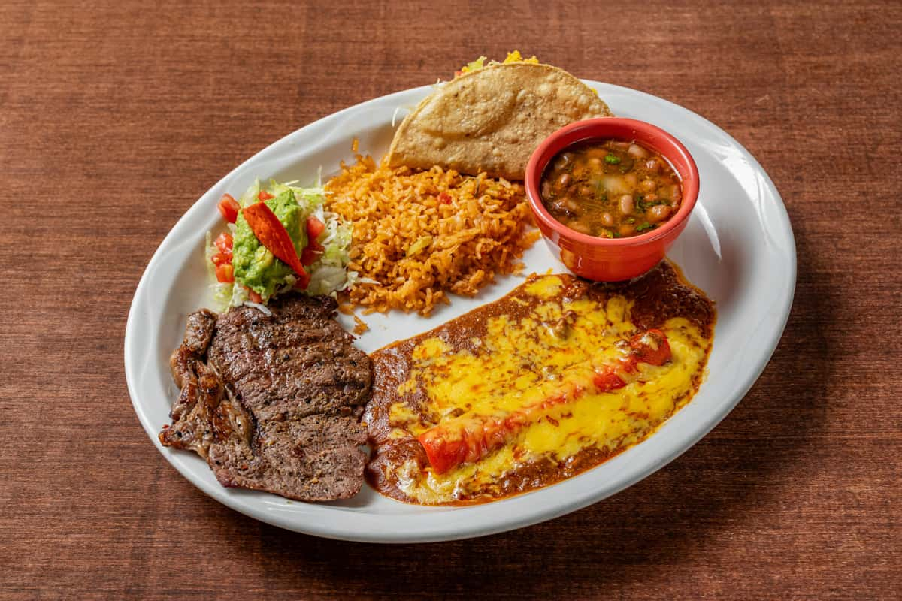

# The Mexican Plate

*A Mexican meal is composed, not designed. You don't make a "main course" with a side; you compose a plate from elements that all carry equal weight. The tortilla, the protein, the salsa, the bean, the onion, the lime, the avocado — each contributes a layer.*

## Overview

This page covers the canonical Mexican plate-construction logic. How to read what's on a plate; how to compose one yourself.

## The five elements

Every Mexican plate has some combination of:

1. **The masa element** — tortilla(s), sope, gordita, tamale, or a tostada.
2. **The protein** — meat, fish, beans, or eggs.
3. **The salsa** — at least one, often two or three.
4. **The fresh elements** — chopped onion, coriander, lime wedges, sliced radish, avocado.
5. **The dairy / fat** — queso fresco, cotija, crema, or sour cream.

A taco is: tortilla + meat + salsa + onion + lime. Five elements.
A burrito is: large flour tortilla + rice + beans + meat + salsa + cheese. Six elements.
A torta is: bread + meat + beans + lettuce + tomato + chillies + crema + avocado. Seven elements.

Each element does a specific job. The tortilla is the structure; the meat is the centre; the salsa is the seasoning; the onion / lime / coriander provide the fresh / bright lift; the cheese / crema provides the richness.

## The canonical Mexican plates

### Taco (the everyday)

The fundamental Mexican unit. Two corn tortillas (the canonical doubling for strength), a small portion of seasoned meat or vegetable filling, a sprinkle of chopped white onion + fresh coriander, a squeeze of lime, and a salsa.

The taco is meant to be eaten in 2-3 bites. Anything bigger is a burrito or a tostada.

Variations by filling:
- **Carne asada** — grilled steak, chopped.
- **Al pastor** — spit-grilled pork with pineapple, originally Lebanese-Mexican fusion.
- **Carnitas** — slow-cooked confit pork.
- **Barbacoa** — slow-cooked beef cheek or lamb.
- **Lengua** — beef tongue.
- **Sesos** — beef brain.
- **Suadero** — flank steak.
- **Pescado** — fish (often grilled or fried).
- **Camarón** — shrimp.
- **Hongos** — mushroom.
- **Frijoles** — refried beans.

### Quesadilla

A folded or sandwiched tortilla with cheese and a filling, griddled until the cheese melts. Quesillo (Oaxacan string cheese) is canonical, but any melting cheese works.

The basic quesadilla:
- Tortilla, folded, with cheese + (optional) huitlacoche (corn smut) or mushroom or chicken or squash blossom.
- Griddle on the comal for 2-3 minutes per side.

### Enchiladas

Corn tortillas dipped briefly in salsa, rolled around a filling (chicken, beef, cheese, or beans), placed in a baking dish, more salsa on top, baked with cheese.

The canonical:
- **Enchiladas rojas** — with salsa roja.
- **Enchiladas verdes** — with salsa verde.
- **Enchiladas suizas** — with cream and cheese (modern, less traditional).
- **Enchiladas mole** — with mole poblano sauce.

### Tortilla soup (sopa de tortilla)

A clear chicken stock with charred tortillas, chillies, and tomato. Garnished with fried tortilla strips, avocado cubes, lime wedges, queso fresco, and a drizzle of crema. The Mexican comfort food.

### Pozole

A hominy-and-meat stew. Three classic colours:
- **Pozole rojo** — red, with chile guajillo and ancho.
- **Pozole verde** — green, with tomatillo and pepita.
- **Pozole blanco** — white, no chilli paste, just clear broth + hominy + chicken or pork.

Served with garnishes on the table: shredded cabbage, sliced radish, lime wedges, dried oregano, chopped onion, chile flakes, fried tortilla, avocado.

### Tortas

Mexican sandwiches. A teleray (bread roll) split, with:
- Refried beans spread on one side.
- A protein (cochinita pibil, milanesa, chicken, ham + cheese, scrambled egg).
- Onion, tomato, jalapeño, avocado, sometimes lettuce.
- A spread of mayo or crema.
- Grilled in a sandwich press or under a comal.

### Chilaquiles (the Mexican breakfast)

Fried tortilla pieces simmered briefly in salsa. Topped with crema, queso fresco, and a fried egg.

- **Chilaquiles rojos** — with salsa roja.
- **Chilaquiles verdes** — with salsa verde.

The canonical Mexican-grandma's morning meal.

### Huevos rancheros

Two fried eggs on top of two warm tortillas, topped with hot salsa roja. Sides of rice, refried beans, sliced avocado.

The other canonical breakfast.

### Chiles rellenos

Whole poblano chillies, charred, peeled, stuffed (with cheese, picadillo, or chicken), dipped in egg batter, fried, served in a tomato-broth sauce. A festival dish for Mexican Independence Day (Sept 16).

### Cochinita pibil (Yucatecan slow-roasted pork)

A whole pork shoulder marinated in achiote paste + sour orange + spices, wrapped in banana leaves, slow-roasted (originally in an earth oven; now in a low oven or pressure cooker). Served with pickled red onion, habanero salsa, and tortillas. The Mayan-origin dish that's now globally famous.

### Tamales

Steamed masa packets, filled and wrapped in corn husks or banana leaves. Cooking project: 2-3 hours of prep + 1 hour steaming.

- **Tamales rojos** — filled with chicken in red sauce.
- **Tamales verdes** — filled with chicken in green sauce.
- **Tamales de mole** — filled with mole and chicken.
- **Tamales dulces** — sweet (with raisins and pineapple).
- **Tamales rancheros** — with pork and chillies.

## Building your own plate

A starter Mexican plate to build from:

### Composed plate (a "platillo")
- 2 fresh corn tortillas, warmed.
- A small portion of seasoned protein (carne asada / chicken / refried beans).
- A side of Mexican rice.
- A side of cooked beans (in their broth, not refried).
- A spoon of salsa roja.
- A spoon of salsa verde.
- A small mound of pico de gallo.
- A wedge of avocado.
- A wedge of lime.
- A sprinkle of cilantro and crumbled queso fresco.

The plate is colourful, varied, and demonstrates the elements working together. The diner builds tacos in real-time at the table — taking pieces of tortilla, scooping up meat with salsa, etc.

### Build-it-yourself taco platter

Set out:
- Warm tortillas in a tortilla warmer.
- Three different proteins (e.g. carne asada + grilled fish + refried beans).
- 2-3 salsas.
- Chopped onion + cilantro + lime wedges + sliced radish + sliced avocado.
- Crumbled queso fresco + crema.

The eater assembles their own tacos as they go. This is the canonical taquería experience.

## The Mexican meal structure

Mexican meals typically have:

### Breakfast (desayuno)
- Light: huevos rancheros + tortillas + salsa + coffee.
- OR substantial: chilaquiles + beans + crema + cheese + coffee + fresh juice.
- OR sweet: pan dulce (sweet bread) + coffee or atole.

### Lunch (comida) — the main meal of the day
- A sopa (soup) like tortilla soup or pozole.
- A main: tacos / enchiladas / quesadillas / mole.
- Beans + rice + tortillas.
- Salsas.
- A drink: agua fresca or beer or a small wine.

### Dinner (cena) — usually lighter
- Often just eggs + tortillas + salsa.
- Or tacos.
- Or a torta.

### Snacks (antojitos)
- Tamales sold from carts in the early morning.
- Elotes (corn cobs with mayo, cotija, chilli).
- Esquites (corn-cup version).
- Churros from a stall.
- Tostadas with shrimp or chicken.

## A starter cooking sequence

If you're building a Mexican kitchen from scratch:

### Weekend 1: The basics
- Make tortillas (from masa harina).
- Make a salsa roja.
- Make a pot of pinto beans.
- Eat tortillas + beans + salsa for lunch.

### Weekend 2: Adding protein
- Grill carne asada (skirt steak with cumin + lime + garlic).
- Use the tortillas + salsa + beans from week 1.
- Build a taco platter.

### Weekend 3: Stepping up
- Make salsa verde (tomatillo-based).
- Make refried beans (from your pot of beans).
- Make Mexican rice.
- Compose a plate: rice + beans + grilled chicken + salsa verde + tortillas.

### Weekend 4: A bigger project
- Make pozole rojo (the red hominy-and-meat stew) — a 3-hour weekend project.
- Or attempt enchiladas verdes — about 2 hours.

### Weekend 5+: Mole
- Attempt a mole poblano. Plan two days. Have friends over for the result.

## Pairing principles

Mexican meals pair with:
- **Mexican beer** — Pacífico, Bohemia, Modelo, Tecate, Negra Modelo (dark).
- **Mexican wine** — Baja California Cab Sauvignon, Mexican Riesling.
- **Mezcal or tequila** — sipped neat alongside food.
- **Agua fresca** — non-alcoholic fruit-water (horchata, jamaica, tamarind, lime).

## Final note

Mexican cooking rewards the cook who treats it seriously. A 10-minute taco is satisfying because the elements are in balance — not because anything was complicated. The 8-hour mole is sublime because the depth has been carefully built — not because of any single ingredient.

Real Mexican cooking starts with: tortilla, bean, salsa. Those three elements done well give you a Mexican plate. Everything else builds from there.
