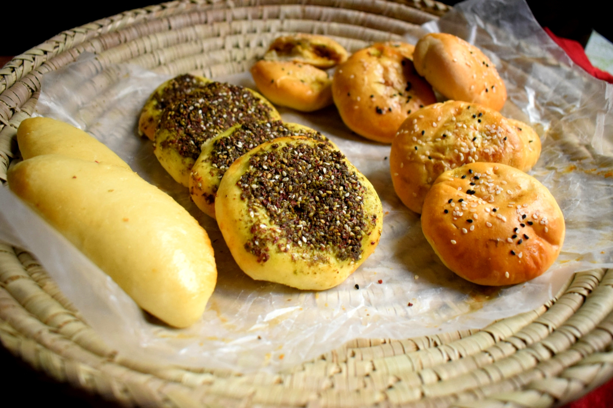

# Bread and Grain

*Bread isn't a side dish in the Middle East — it's the utensil. You tear bread to scoop hummus, wrap it around kebab, hold it under a poached egg. The right bread is half the meal. The grains (bulgur, freekeh, rice) complete the carbohydrate picture.*

## Overview

Middle Eastern bread comes in several distinct types, each suited to a different role:

- **Pita / khubz** — the round, slightly leavened pocket bread. Tears open into two thin discs. The everyday workhorse.
- **Lavash** — thin, papery flatbread. Soft when fresh, crisp when dried. Used as a wrap (lavash wraps the kebab) or for scooping.
- **Markook / saj** — extremely thin, large-diameter bread cooked on a domed griddle. Lebanese / Syrian.
- **Taboon** — a thicker, slightly chewy flatbread cooked on hot stones (the taboon is the oven). Palestinian + Jordanian.
- **Khubz Iraqi (samoon)** — football-shaped Iraqi white bread, slightly puffy.
- **Aish baladi** (Egyptian) — round wholewheat pita-like bread, the daily Egyptian bread.

And the grains:

- **Bulgur** — cracked parboiled wheat. The base of tabbouleh, kibbeh, mujadara. Sold in fine, medium, and coarse grinds.
- **Freekeh** — green wheat (young wheat) that's been smoked and dried. Earthy, smoky. Used in pilafs and stews.
- **Rice** — basmati or long-grain. Used in pilafs, mansaf, maqluba, and as everyday rice.
- **Couscous** — more North African than Levantine; small steamed semolina pellets.

This page covers pita (the everyday focus), plus the key grain preparations.

## Pita / khubz

The defining Middle Eastern bread. The puff that creates the "pocket" is from steam: high oven heat, thin rolled dough, the bread inflates within 60 seconds; once cooled, the puff collapses but the hollow remains.

### Recipe (makes 8 pita)

#### Ingredients
- 500 g strong white bread flour
- 320 ml warm water
- 1 teaspoon instant yeast
- 1 teaspoon salt
- 2 tablespoons olive oil

#### Method
1. Combine flour, yeast, salt in a bowl.
2. Add water and olive oil; mix to a soft pliable dough.
3. Knead 8-10 minutes until smooth and elastic.
4. Cover; rise 1-1.5 hours until doubled.
5. Punch down; divide into 8 balls (about 100 g each).
6. Rest balls 15 minutes covered.
7. Preheat oven to 250°C (or as hot as possible) with a baking stone or upturned heavy baking sheet on the middle rack. Preheat 30 minutes.
8. Roll each ball into a 18-20 cm circle, 4-5 mm thick.
9. Slide directly onto the hot stone (one or two at a time).
10. Bake 3-4 minutes. The pita will puff dramatically into a pillow within 90 seconds.
11. Remove from oven; the pita deflates as it cools.
12. Stack in a clean tea towel to keep warm and soft.

### Stovetop pita (no oven)
- Heat a heavy cast-iron pan over high heat.
- Cook each pita 90 seconds per side; the bread will puff.
- Wrap in a tea towel.

### Why pita puffs

The thin dough has just enough flour structure to hold its shape; the wet interior heats fast in the hot oven; steam forms and the dough inflates like a balloon. The "pocket" stays after cooling because the two surfaces have set.

### What "good pita" looks like

- 18-20 cm diameter, 1-2 cm tall (puffed).
- Pale golden, with a few brown spots from the hot oven.
- Hollow inside — split with a knife and you have a perfect pocket.
- Soft and slightly chewy; never crispy.

## Other Middle Eastern breads

### Lavash
Thin, large (30 cm+), papery. Made with flour + water + salt + a touch of yeast. Rolled super-thin (about 1 mm), cooked briefly on a hot saj or tandoor.

Used as a wrap for kebabs (the famous Armenian / Iranian / Turkish style — meat + tomato + onion + herbs rolled in lavash); torn for scooping; dried into a crisp cracker (lavash chips).

### Markook
Same as lavash but typically larger and thinner. Lebanese / Syrian. Cooked on a domed metal griddle (saj). At home, a hot upturned wok over a gas flame can substitute.

### Taboon
A small (15-18 cm) thick (about 1 cm) flatbread. Slightly leavened. Cooked on hot stones in a taboon oven (a domed clay oven). The bread develops indentations from the stones. Palestinian and Jordanian staple.

At home: a heavy cast-iron pan with stones placed on the bottom approximates the texture.

### Samoon (Iraqi)
Football-shaped white bread. Yeasted, baked. Common in Iraq, distinctly different in shape from the round Levantine breads. Used at every Iraqi meal.

### Aish baladi (Egyptian)
Wholewheat pita-style bread. Slightly thicker and more substantial than Lebanese pita. The everyday Egyptian bread.

## Bulgur

The cracked wheat that's the base of multiple Middle Eastern dishes. Available in three grades:

- **Fine bulgur (#1)** — for kibbeh, kibbeh nayyeh, tabbouleh.
- **Medium bulgur (#2)** — for mujadara, pilafs.
- **Coarse bulgur (#3)** — for pilafs, stuffings, soups.

### Basic bulgur pilaf (medium)

#### Ingredients
- 200 g medium bulgur
- 400 ml hot chicken or vegetable stock
- 1 onion (finely diced)
- 2 tablespoons olive oil or butter
- 1 teaspoon salt
- ½ teaspoon cumin

#### Method
1. Sweat the onion in oil for 8 minutes until soft.
2. Add bulgur; toast 1 minute.
3. Pour over the hot stock; add salt and cumin.
4. Bring to a boil; reduce to low; cover; cook 15 minutes.
5. Off heat; rest 10 minutes; fluff with a fork.

### Tabbouleh bulgur (fine)

For tabbouleh, the bulgur is soaked rather than cooked. Combine 60 g fine bulgur with 100 ml cold water; let stand 30 minutes; drain (squeeze excess water out); mix with chopped parsley, mint, tomato, onion, olive oil, lemon, salt.

## Freekeh

Young green wheat, smoked over fire then dried. Has a distinct smoky, earthy flavour that's unlike anything else in the Middle Eastern pantry.

### Freekeh pilaf

#### Ingredients
- 250 g freekeh (cracked or whole; cracked cooks faster)
- 700 ml chicken stock
- 1 onion (chopped)
- 4 garlic cloves (chopped)
- 2 tablespoons olive oil
- 1 teaspoon cumin
- 1 teaspoon allspice
- ½ teaspoon cinnamon
- Salt + pepper
- A handful of toasted pine nuts (for garnish)
- A handful of chopped fresh parsley

#### Method
1. Rinse freekeh; pick over for stones.
2. Sweat onion in oil; add garlic, cook 1 minute.
3. Add freekeh; toast 1 minute.
4. Add spices; cook 30 sec.
5. Add stock; bring to boil; reduce to low; cover; cook 25-35 minutes (cracked) or 45-55 minutes (whole) until tender.
6. Fluff with a fork; rest 10 min.
7. Top with pine nuts and parsley.

Freekeh is more complex than rice — slightly chewy, distinctly smoky, with a slightly tannic finish. It's the foundation of many Levantine meat-and-grain dishes.

## Rice (Middle Eastern style)

Middle Eastern rice is typically basmati or long-grain, cooked with whole spices in the pot.

### Plain Middle Eastern rice

#### Ingredients
- 300 g basmati rice (rinsed; soaked 30 min; drained)
- 450 ml water or chicken stock
- 2 tablespoons butter or olive oil
- 1 teaspoon salt
- 2 green cardamom pods
- 1 cinnamon stick
- 2 bay leaves
- A pinch of saffron (optional, but lifts the rice)

#### Method
1. Heat butter in a pot; add cardamom + cinnamon + bay leaves; sizzle 30 sec.
2. Add drained rice; stir to coat.
3. Add water + salt + saffron.
4. Bring to a boil; reduce to low; cover; cook 12 minutes.
5. Off heat; rest 10 min; fluff.

### Special rice dishes

- **Mujadara** — rice + lentils cooked together; topped with caramelised onions. A Levantine staple.
- **Maqluba** — "upside-down" rice + eggplant + chicken; cooked in a sealed pot, then flipped onto a platter. Palestinian / Jordanian celebration dish.
- **Yakhnit al lahmeh** — lamb-and-rice stew.
- **Mansaf** — Jordan's national dish: lamb cooked in jameed (fermented dried yogurt) over rice, with toasted pine nuts and parsley.
- **Kabsa** — Saudi spiced rice with chicken or lamb. The Gulf national dish (covered in [cuisine/saudi/](../../cuisine/saudi/)).

## A bread-and-grain pantry

A working Middle Eastern kitchen has:
- 1 packet of fresh / frozen pita (or the makings to bake fresh).
- 500 g fine bulgur.
- 500 g medium bulgur.
- 500 g basmati rice.
- 500 g freekeh.
- A bottle of olive oil (extra virgin for finishing; lighter for cooking).
- A jar of tahini.
- A jar of pomegranate molasses.
- The spice kit (see [spices.md](spices.md)).

## Pairing carb to dish

- **Pita** with hummus, baba ghanoush, falafel, kofta, shawarma, fattoush. The all-purpose bread.
- **Lavash / markook** with kebab wraps, shawarma (the "Armenian wrap"), or torn for mezze scooping.
- **Bulgur pilaf** with grilled meats, kibbeh, vegetable stews.
- **Freekeh pilaf** with roasted lamb, chicken, or as a standalone vegetarian dish.
- **Rice** with stews (mansaf, maqluba), grilled meats (Persian-style chelo kebab), or as a base for mahshi (stuffed vegetables).

## Common mistakes

- **Storing pita in plastic** — softens too much; goes stale fast. Use a paper bag or a clean tea towel.
- **Skipping the bulgur soak** for tabbouleh — biting into raw cracked wheat is unpleasant. 30 min soak minimum.
- **Overcooking freekeh** — gets gummy. Aim for tender-but-chewy.
- **Using sushi rice or risotto rice** — wrong starch / texture. Basmati or long-grain is canonical.
- **Buying old freekeh** — loses its smoky punch. Buy from a good Middle Eastern grocer; check the package date.

## Where to source

- **Middle Eastern grocery shops** — for fresh pita, fresh za'atar pita, lavash, fresh herbs, and the canonical brands of bulgur, freekeh, tahini, pomegranate molasses.
- **Online** — for niche items like proper Iraqi samoon, Palestinian taboon, fresh sumac.
- **Supermarket** — for everyday pita, basic bulgur, basic tahini. Acceptable but not great.

The freshness of the bread matters more than the brand. A 3-day-old supermarket pita is sad; a 30-minute-old market pita is transformative.
