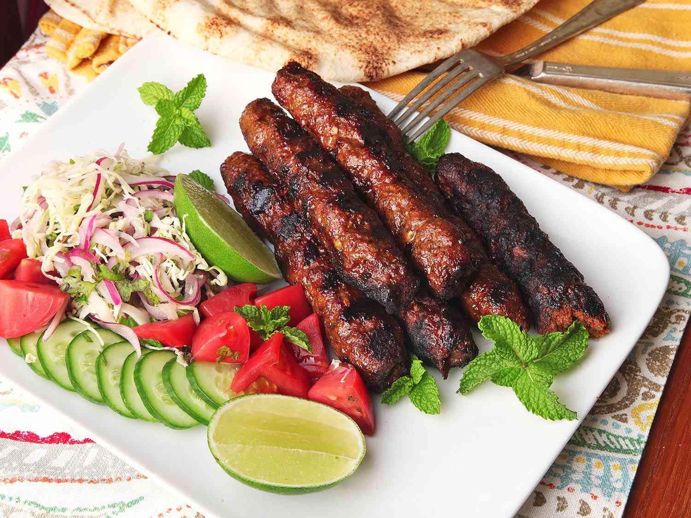

# Kebabs

*"Kebab" in Middle Eastern cooking means more than the British takeaway. There are two main families: kofta (minced and shaped) and shish (cubed and skewered). Each family has dozens of regional variations. This page covers the canonical techniques.*

## Overview

Middle Eastern kebabs split into two big families:

1. **Kofta** — minced meat shaped onto skewers or into patties. Lamb, beef, or a mix. Spiced with onion, parsley, allspice, cinnamon, sumac. The fingerprint-pinch shape is canonical.

2. **Shish** — cubed meat threaded onto skewers and grilled. Usually lamb (chunks from the shoulder) or chicken (shish taouk).

Plus the broader kebab family:
- **Shawarma** — stacked meat on a vertical rotating spit; shaved off in thin slices.
- **Kafta** — the Lebanese name for kofta.
- **Kibbeh** — minced meat + bulgur shaped into footballs, fried or grilled. A separate family but related.
- **Shish taouk** — marinated chicken cubes, grilled on a skewer.

This page covers the technique for kofta, shish (lamb), and shish taouk (chicken). The kibbeh family deserves its own deep dive; the shawarma is more restaurant than home.

## Kofta (lamb kofta)

The everyday Middle Eastern minced-meat kebab.

### Recipe (8 kebabs)
- 500 g minced lamb (20-25% fat — for proper kofta texture, don't use lean lamb)
- 250 g minced beef (optional; gives stability; some cooks use 100% lamb)
- 1 large onion (very finely grated; squeeze excess liquid)
- 1 large bunch of parsley (finely chopped)
- 3 garlic cloves (finely minced or grated)
- 2 teaspoons salt
- 1 teaspoon ground allspice
- 1 teaspoon ground cumin
- ½ teaspoon ground cinnamon
- ½ teaspoon Aleppo pepper (or paprika + a pinch of chilli)
- ½ teaspoon ground black pepper
- 2 tablespoons olive oil (for shaping)

### Method
1. **Combine** the minced meat, grated onion (squeezed dry), parsley, garlic, salt, and all the spices in a bowl.
2. **Knead for 5 minutes** — yes, knead. The kneading distributes the spices and helps the kofta stick to the skewer. The mixture becomes slightly tacky and homogeneous.
3. **Refrigerate** for 30 minutes — chilled mixture is easier to shape.
4. **Soak skewers** if using bamboo (30 minutes in water to prevent burning). Flat metal skewers are canonical (they keep the kofta from rotating).
5. **Shape**: take 1/8 of the mixture (about 90 g). Press it firmly onto a skewer, working with damp hands. Shape into a long sausage along the skewer, about 15-18 cm long and 3-4 cm thick. Make small pinches every 3 cm (the canonical fingerprint pattern that helps the kofta stay attached during cooking).
6. **Brush** with olive oil before grilling.

### Grilling
- **Charcoal grill** — the canonical method. Build the coals to medium-high heat (you can hold your hand 15 cm above the grate for 4-5 seconds).
- **Gas grill** — medium-high.
- **Cast-iron pan or grill pan** — works at home; not as smoky but the same technique.

Grill the kofta 3-4 minutes per side, turning gently, for 6-8 minutes total. The kofta should be:
- Charred on the outside
- Just-cooked through (slightly pink at the centre is fine for lamb)
- Slightly juicy

### Serving
- Slide the kofta off the skewer onto a plate.
- Serve with: warm pita + hummus + tabbouleh + sliced raw onion + sumac sprinkled on the onion + a wedge of lemon + tahini sauce.
- Build a kofta wrap: pita + kofta + tomato + onion + tahini sauce + pickles.

## Shish kebab (lamb)

Cubed lamb shoulder, marinated, skewered, grilled.

### Recipe (4 kebabs, serves 4)
- 1 kg lamb shoulder (boned and trimmed; cubed into 3-4 cm pieces — about 800 g of cubed meat)
- 1 large onion (sliced thin)
- 4 garlic cloves (crushed)
- 4 tablespoons olive oil
- 3 tablespoons plain yogurt
- 2 tablespoons pomegranate molasses
- 1 tablespoon ground allspice
- 1 tablespoon ground cumin
- 1 tablespoon Aleppo pepper or paprika
- 2 teaspoons salt
- Juice of 1 lemon
- A few sprigs of fresh thyme

### Method
1. **Marinate**: combine all marinade ingredients with the cubed lamb in a bowl. Massage well. Cover and refrigerate at least 4 hours, ideally overnight.
2. **Skewer**: thread 5-6 cubes of lamb on each skewer. For traditional Middle Eastern style, separate the cubes with pieces of onion or bell pepper (about every other cube).
3. **Grill** over medium-high heat: 4 minutes per side, total 12-16 minutes. The lamb should be medium-rare to medium (slight pink in the centre).
4. **Rest** 5 minutes before serving.

### What good shish kebab is
- Outside charred and crusty
- Inside pink, juicy, tender
- Smoky (from the charcoal)
- Slightly tart-sweet (from the pomegranate molasses)
- Aromatic (allspice + cumin + Aleppo)

### Common mistakes
- Using lean cuts of lamb (leg or saddle) — kebab needs fat for juiciness. Shoulder is canonical.
- Marinating in citrus alone (no yogurt or oil) — the citrus toughens. Yogurt + oil tenderises.
- Over-grilling — kebab should be medium, not well-done. Loses juiciness fast.
- Skewers too crowded — meat steams instead of browning. Keep some space between cubes.

## Shish taouk (Lebanese chicken kebab)

The chicken kebab. The marinade is the magic.

### Recipe (4 kebabs)
- 600 g chicken thigh fillets (boneless, skinless; cubed into 3 cm pieces)
- 3 garlic cloves (crushed)
- 4 tablespoons olive oil
- 4 tablespoons plain yogurt
- Juice of 2 lemons
- 1 tablespoon ground cumin
- 1 tablespoon Aleppo pepper or paprika
- 1 teaspoon ground allspice
- 1 teaspoon ground coriander
- 1 teaspoon salt
- ½ teaspoon ground white pepper

### Method
1. **Marinate**: combine the marinade ingredients with the cubed chicken. Cover and refrigerate at least 4 hours, ideally overnight.
2. **Skewer**: thread 5-6 cubes of chicken per skewer.
3. **Grill** over medium-high heat: 3-4 minutes per side; total 8-10 minutes (chicken cooks faster than lamb).
4. **Rest** 3 minutes.

### Why thigh, not breast
Thigh has more fat, more flavour, and stays juicy on a grill. Breast dries out fast on a high-heat grill. Thigh is canonical.

### Serving
- Pita + shish taouk + tomato + onion + tahini sauce + a generous handful of chopped parsley + sumac + lemon wedge.
- Or as part of a mixed-grill platter alongside kofta and lamb shish.

## The mixed-grill platter (mashawi)

The canonical Middle Eastern grilled-meat dinner. A platter with:

- 2 lamb kofta
- 2 lamb shish kebabs
- 2 shish taouk skewers
- Plus a small grilled tomato, a grilled onion, a grilled green pepper (each skewered separately).
- All on a bed of rice or alongside warm pita.

Garnishes: chopped parsley, sumac, lemon wedges, hummus, tahini sauce.

This is the Lebanese / Syrian / Jordanian restaurant standard. At home, scale it down: 1 lamb kofta + 1 lamb shish + 1 shish taouk per person.

## Shawarma (a brief note)

Shawarma is a vertical rotisserie — meat (lamb, chicken, or beef) stacked on a vertical spit and slowly roasted, then shaved off in thin slices as needed. At home, you can approximate shawarma by:

1. **Marinating** thinly sliced lamb shoulder or chicken thigh in the same shish marinade.
2. **Layering** the slices on a vertical or horizontal spit (some home cooks use a rotisserie attachment; others use a deep dish in the oven).
3. **Roasting** at low-medium heat (160°C) for 90-120 minutes.
4. **Shaving** thin slices off the outside as they brown.

Restaurant shawarma is hard to replicate at home — the slow vertical rotisserie with consistent heat is genuinely different. But a home-roasted shawarma is still delicious.

## Kafta (Lebanese kofta variant)

The Lebanese name for kofta. Essentially the same recipe and technique as covered above, but Lebanese cuisine has specific variants:

- **Kafta meshwiyeh** — kofta grilled on skewers. Same as the canonical kofta above.
- **Kafta bil sanieh** — kofta layered with sliced potatoes and tomatoes, baked in the oven with a tomato-pomegranate-molasses sauce. A canonical Lebanese tray dish.
- **Kafta b' kishk** — kofta in a kishk (fermented bulgur-and-yogurt) sauce. Mountain Lebanon specialty.

## Other kebab traditions

### Persian / Iranian kebabs
- **Joojeh kabab** — saffron-marinated chicken.
- **Kabab koobideh** — Iranian minced-lamb kebab; similar to kofta but with a distinct shape (pressed flat, more delicate).
- **Kabab barg** — thin filet mignon strips, very tender.
- **Soltani** — a "royal" mixed grill: one kabab koobideh + one kabab barg.

### Turkish kebabs
- **Adana kebab** — Turkish minced-meat kebab with chilli; spicier than Lebanese kofta. Canonical Turkish kebab.
- **Urfa kebab** — minced-meat kebab from southeastern Turkey; less spicy than Adana.
- **Iskender kebab** — döner meat on flatbread with tomato sauce and yogurt. Bursa-region.
- **Şiş kebab** — cubed lamb skewers; Turkish equivalent of Lebanese shish.

### Egyptian kebabs
- **Kufta meshwi** — Egyptian kofta, often with more cumin and parsley.
- **Hawawshi** — minced meat in pita, baked. Egyptian street food.

### Jordanian / Palestinian
- **Musakhan** — chicken slow-roasted with sumac and onions, served on taboon bread. Not a kebab but the canonical Palestinian dish.

## Charcoal grill technique

The canonical Middle Eastern grilling:

1. **Build a coal fire** — natural lump charcoal is best. Light 60-90 minutes before grilling.
2. **Wait for hot embers** — the coals should be glowing white-grey on the outside with red-orange beneath. No flames.
3. **Spread coals evenly** under the grilling area. Aim for 4-5 cm thickness of coal.
4. **Test the heat** — hold your hand 15 cm above the grate. Should be uncomfortable after 4-5 seconds. That's medium-high.
5. **Grill the kebabs** — direct heat, 3-4 minutes per side. Turn ONCE only (don't keep flipping).
6. **For longer-cooking items** (lamb on the bone, whole chicken), move to cooler areas of the grill or use indirect heat.

A charcoal-grilled kebab tastes different from a gas-grilled or pan-grilled one. The smoke is part of the dish. If you can grill outdoors, do.

## A kebab dinner spread

For 4-6 people:

- **Pre-marinade prep** (the day before): marinate lamb shish + shish taouk + mix kofta.
- **2 hours before**: light the coals; prepare mezze (hummus, tabbouleh).
- **30 minutes before**: skewer everything.
- **At service**: grill everything in 25-30 minutes (kofta first, then shish taouk, then lamb shish).
- **Serve**: platter with hummus, tabbouleh, pita, sliced raw onion, sumac, lemon wedges, tahini sauce.
- **Drink**: cold Lebanese beer or arak.

## Sourcing

- **Lamb shoulder** — from a good butcher. Get them to bone it and trim it for you (or do it yourself). The cubes should be from the shoulder, not the leg.
- **Chicken thighs** — boneless, skinless. From any decent butcher.
- **Skewers** — flat metal skewers from a Middle Eastern shop (better than bamboo for kebab work).
- **Charcoal** — natural lump charcoal (not briquettes). British Charcoal Company or any specialty supplier.

The investment in good meat + good skewers + good charcoal turns home kebab from "OK" to "restaurant-level". Worth doing.
