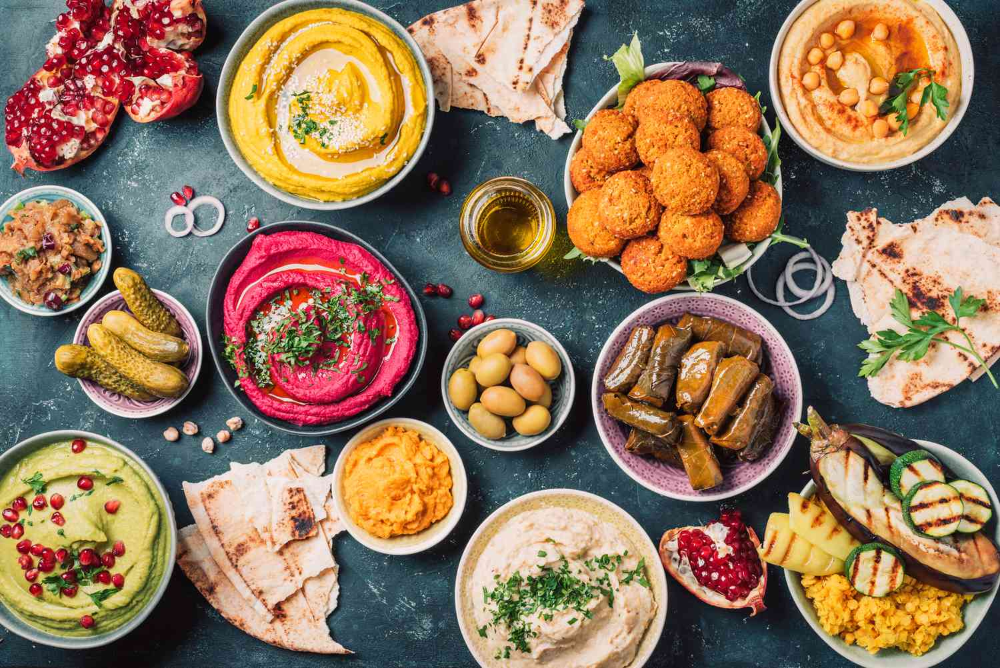

# Mezze

*Mezze is the small-plate tradition of the Middle East. Eight to fifteen small dishes spread across the table, eaten together, scooped with pita, picked over for hours. The classic Levantine mezze is hummus + baba ghanoush + labneh + tabbouleh + fattoush + pickles + olives. Once you can make those, you can host any Middle Eastern dinner.*

## Overview

A mezze is a collection of small dishes served as a starter, an appetiser course, or as the entire meal. The Lebanese / Syrian mezze tradition is the most-codified version; similar small-plate traditions exist across the region (Egyptian salatat, Iraqi maza, Persian appetisers).

A canonical mezze has:

- **2-3 dips** — hummus, baba ghanoush, muhammara, labneh.
- **2-3 salads** — tabbouleh, fattoush, shanklish salad.
- **1-2 fritters** — falafel, fried halloumi, kibbeh.
- **A pickle plate** — pickled cucumber, pickled turnips (the pink ones), pickled olives.
- **Bread** — pita, lavash, markook.
- **Sliced raw vegetables** — cucumber, tomato, radish, lettuce.
- **Olives** — cured Lebanese / Syrian / Cretan olives.
- **A herb plate** — mint sprigs, parsley sprigs, fresh thyme, fresh tarragon.

The mezze is meant to be picked over slowly. A Lebanese dinner traditionally starts with mezze + arak (anise spirit + water + ice) for 60-90 minutes; only then does the main course appear.

This page walks through the canonical mezze dips and salads.

## Hummus

The most-famous Middle Eastern dish. Pureed chickpeas + tahini + lemon + garlic + olive oil + salt. The recipe is simple; the craft is in the balance.

### Recipe (serves 4-6)
- 400 g cooked chickpeas (from dried — see below — or canned, rinsed and drained)
- 5 tablespoons good tahini
- Juice of 1-2 lemons (start with 1; adjust)
- 1 garlic clove (small; raw)
- 4-6 tablespoons ice-cold water
- 1 teaspoon salt
- ½ teaspoon cumin (optional)
- 4-6 tablespoons extra-virgin olive oil
- 1 teaspoon sumac or paprika
- Chopped fresh parsley (for garnish)

### Method
1. **Cook the chickpeas from dried for best result.** Soak overnight; cook with a teaspoon of baking soda + a chopped onion + a bay leaf + a sprig of thyme + a few peppercorns for 60-90 minutes until they're completely soft (you should be able to crush one between your fingers with no resistance). Drain (reserve some cooking liquid).
2. **Or use canned chickpeas** — rinse + drain. Optionally peel the skins (improves texture but takes 15 minutes); the skin-peel is what separates restaurant hummus from home hummus.
3. **Combine** chickpeas + tahini + lemon + garlic + ice water + salt + cumin in a food processor.
4. **Blend** for 4-5 minutes. Yes, that long. The hummus needs to be processed long enough that it goes from "chunky" to "creamy-as-air" — this is the difference. The hot or cool tahini + the long process is the secret.
5. **Taste** for salt, lemon, and garlic. Adjust.
6. **Serve** in a shallow bowl. Make a small well in the centre. Drizzle olive oil generously. Sprinkle sumac or paprika. Garnish with whole chickpeas + parsley.

### Why hummus is hard to make great

- **Tahini quality matters most.** A good Lebanese / Israeli / Palestinian tahini (Al Wadi, Joyva, Soom, Karawan) is creamy, slightly nutty, light. A cheap tahini is gritty, bitter. Spend on tahini.
- **Long processing** breaks down the chickpea skins and creates the silky texture. 4-5 minutes minimum.
- **Ice water** keeps the hummus light during processing.
- **The garlic balance** — 1 raw clove is plenty for 4-6 servings. 3+ cloves is too much (raw garlic dominates).
- **The acid balance** — fresh lemon juice; start with 1 lemon; add more to taste.

### Variations
- **Hummus with za'atar** — sprinkle za'atar on top with the olive oil.
- **Hummus with sautéed mushrooms** — modern Tel Aviv style.
- **Beetroot hummus** — add 1 cooked beetroot to the blend; pink, slightly sweet.
- **Hummus with sumac onions** — top with sliced red onion soaked in sumac.
- **Hummus with mushrooms / meat** — Lebanese hummus is sometimes topped with sautéed mushrooms or finely chopped sautéed lamb.

## Baba Ghanoush (also Baba Ganoush)

The smoky aubergine dip. Roasted/charred aubergine + tahini + lemon + garlic + olive oil.

### Recipe
- 2 large aubergines (about 700 g)
- 4 tablespoons tahini
- Juice of 1 lemon
- 1 small garlic clove
- 4 tablespoons olive oil
- 1 teaspoon salt
- A small handful of chopped parsley (garnish)
- A drizzle of pomegranate molasses (optional, for a Syrian touch)

### Method
1. **Char the aubergine.** Place whole aubergines directly on a gas flame (or under a hot grill) and roast for 15-20 minutes, turning, until the skin is completely blackened and the flesh is collapsing.
2. **Cool slightly.** Place in a covered bowl to steam for 5 minutes (loosens the skin).
3. **Peel and drain.** Remove the blackened skin; place the flesh in a colander; drain 10 minutes (the aubergine releases a lot of bitter water).
4. **Combine** flesh + tahini + lemon + garlic + salt in a bowl.
5. **Mash or pulse** (in a food processor briefly — about 30 seconds; not too smooth). Baba ghanoush should have visible texture, not be a puree.
6. **Serve** in a shallow bowl. Drizzle olive oil. Garnish with parsley. Optional drizzle of pomegranate molasses.

The "charred" flavour is the dish's identity. A baba ghanoush made with roasted (rather than charred) aubergine is just an aubergine dip — pleasant but not the same thing.

## Labneh

Strained yogurt — thicker than Greek yogurt, lighter than cream cheese. The everyday Middle Eastern spread.

### Recipe
- 1 kg full-fat yogurt (Greek-style, or Lebanese style if available)
- 1 teaspoon salt
- 1 garlic clove (optional; minced)
- A drizzle of olive oil and za'atar (for serving)

### Method
1. **Combine** yogurt + salt + garlic.
2. **Strain.** Line a sieve with cheesecloth (or a clean tea towel); place over a bowl; pour in the yogurt mixture.
3. **Refrigerate** 12-24 hours. The whey drains; the labneh thickens.
4. **Result:** about 600 g of thick labneh. Spread on a plate; create a swirl with the back of a spoon; drizzle with olive oil; sprinkle za'atar.

### Variations
- **Labneh balls (kishkah)** — once strained, roll into small balls; coat in olive oil + za'atar + chilli; refrigerate or store in oil.
- **Labneh with herbs** — mix in chopped mint + dill + parsley.
- **Labneh with smoked paprika** — top with smoked paprika for a Syrian touch.

## Muhammara

The famous Syrian / Aleppine red pepper dip. Roasted red peppers + walnuts + breadcrumbs + pomegranate molasses + Aleppo pepper + olive oil. Spicy-sweet-tangy.

### Recipe
- 3 red bell peppers (roasted, peeled, deseeded)
- 100 g toasted walnuts
- 50 g breadcrumbs (dry; from stale bread or panko)
- 2 tablespoons pomegranate molasses
- 1 garlic clove
- 1 teaspoon Aleppo pepper (or sweet paprika + a pinch of chilli)
- 1 teaspoon ground cumin
- 4 tablespoons olive oil
- 1 teaspoon salt
- A small handful of fresh pomegranate seeds (for garnish)

### Method
1. **Char or roast the peppers** until skins are black. Peel; deseed; chop roughly.
2. **Blend** all ingredients except the olive oil in a food processor to a thick paste.
3. **Drizzle in olive oil** while blending; the dip becomes glossy.
4. **Taste** for acid (more molasses?), heat (more Aleppo?), and salt.
5. **Serve** in a shallow bowl with pomegranate seeds and a drizzle of olive oil.

Muhammara is bold, complex, and deeply Syrian. Don't substitute pomegranate molasses with anything else; it's the dish's identity.

## Tabbouleh

The famous bulgur-and-parsley salad. The Lebanese standard has FAR more parsley than bulgur (the dish is 90% parsley).

### Recipe
- 60 g fine bulgur (#1)
- 100 ml cold water (for soaking the bulgur)
- 4 large bunches of fresh flat-leaf parsley (about 200 g of leaves after removing thick stems)
- 1 large bunch fresh mint (about 30 g of leaves)
- 4 spring onions (finely chopped)
- 2 ripe tomatoes (finely diced; squeezed gently to drain excess seeds)
- 4-6 tablespoons extra-virgin olive oil
- 4-6 tablespoons fresh lemon juice
- 1 teaspoon salt
- ½ teaspoon ground allspice (the Lebanese touch)

### Method
1. **Soak the bulgur** in 100 ml cold water for 30 minutes. The bulgur softens.
2. **Drain** the bulgur thoroughly (squeeze in a clean tea towel).
3. **Chop the parsley finely.** Use a sharp knife; aim for tiny shreds, not minced. The texture matters.
4. **Combine** all ingredients in a bowl.
5. **Toss** gently with the olive oil + lemon + salt + allspice.
6. **Rest** 15-30 minutes for flavours to marry.
7. **Taste** for salt and lemon; adjust.

### What good tabbouleh looks like
- More green (parsley) than any other colour.
- Tomato visible in dice (not crushed).
- Bulgur barely visible (a few grains here and there, not the dominant ingredient).
- Bright, tart, herbaceous.

Most non-Lebanese versions of tabbouleh are too bulgur-heavy; they read as "bulgur salad". The Lebanese version is parsley salad with a touch of bulgur.

## Fattoush

The toasted-bread salad. Pita is toasted, broken into pieces, and mixed with chopped salad vegetables + sumac + olive oil + lemon + pomegranate molasses.

### Recipe
- 2 pita breads (lightly toasted in a dry oven or broken into pieces and fried in olive oil)
- 1 cucumber (diced)
- 2 tomatoes (diced)
- 1 small red onion (sliced thin)
- 1 small bunch of radishes (sliced)
- 4 spring onions (chopped)
- 1 large bunch of parsley (chopped roughly)
- 1 large bunch of mint (chopped roughly)
- 1 head of romaine lettuce (chopped) — optional but adds crunch
- 4 tablespoons extra-virgin olive oil
- 4 tablespoons fresh lemon juice
- 1 tablespoon pomegranate molasses
- 1 tablespoon sumac
- 1 teaspoon salt
- ½ teaspoon black pepper

### Method
1. **Toast or fry the pita** until golden and crisp; break into bite-size pieces.
2. **Combine** all vegetables and herbs in a large bowl.
3. **Whisk** the olive oil + lemon + pomegranate molasses + sumac + salt + pepper into a vinaigrette.
4. **Dress the salad** and toss.
5. **Add the toasted pita pieces** last (so they stay slightly crispy).
6. **Serve immediately** (the pita softens within 15 minutes).

Fattoush is bright, tart, layered, and uses up day-old pita. The sumac is essential — gives the tart-tangy note that defines the dish.

## Other essential mezze

### Tahini sauce
Tahini + lemon + water + garlic + salt + parsley + cumin. A sauce used over kebabs, shawarma, falafel, roasted vegetables. The Middle Eastern equivalent of mayonnaise.

### Olives
Cured Lebanese / Syrian / Cretan olives. Green or black. Marinated with lemon zest, garlic, chilli, and herbs.

### Cheese plate
- **Halloumi** (Cypriot but ubiquitous in Lebanese mezze) — sliced and pan-fried.
- **Feta or Lebanese white cheese** — cubed.
- **Shanklish** — Lebanese aged cheese rolled in za'atar; served crumbled.

### Pickled vegetables
- **Pickled turnips** (the famous pink ones, coloured with beet juice).
- **Pickled cucumbers** (mini gherkin-style).
- **Pickled garlic** (whole cloves; mellow).
- **Pickled cauliflower** (with chilli and turmeric).

## Assembling a mezze platter

For 4-6 people:

- **2 dips**: hummus + baba ghanoush (or hummus + muhammara, or hummus + labneh)
- **1 salad**: tabbouleh OR fattoush
- **1 fritter**: halloumi (sliced + pan-fried) OR falafel
- **Pita** (warm) — 2 per person
- **Olives** + a small bowl of pickles
- **Sliced cucumber + tomato + radish** on a plate
- **A small herb plate**: mint sprigs + parsley sprigs

Total prep time: 1.5 hours (most of it for the hummus and the bulgur soak). Plates everything beautifully and feeds 4-6 generously.

## Pairing mezze with drinks

- **Arak** (anise spirit) + water + ice — the canonical Lebanese pairing. Becomes cloudy white when water is added.
- **Lebanese white wine** (Chateau Musar Blanc, Chateau Ksara Blanc de Blanc) — light, herbaceous.
- **Lebanese rosé** — surprising depth; excellent with mezze.
- **A cold beer** — Almaza or Lebanese beer; or a German pilsner.
- **Mint tea** — for a non-alcoholic pairing.

## A mezze rhythm

A Middle Eastern dinner with mezze should:

1. **Begin** with the mezze + drinks (60-90 minutes of slow grazing).
2. **Transition** to a main course (grilled kebabs, a tagine, or a stew + rice).
3. **End** with fresh fruit + Turkish coffee + a sweet (kunafa, baklava, or maamoul).

The mezze is the time when conversation happens; the food is the social glue. Don't rush it.

## Sourcing tips

A great mezze depends on great ingredients:

- **Tahini** — Joyva, Soom, Al Wadi, Karawan. Spend on this; it's the foundation of half the dishes.
- **Sumac** — fresh, deep purple. From Middle Eastern grocers or specialty spice merchants.
- **Pomegranate molasses** — Cortas (Lebanese, the classic) or Sadaf.
- **Za'atar** — Lebanese or Palestinian; fresh.
- **Aleppo pepper (pul biber)** — Syrian; mildly hot, slightly fruity.
- **Olives** — from a Middle Eastern grocer; not Mediterranean-section supermarket olives.

A well-stocked mezze pantry costs about £40-50 to set up; lasts months.
