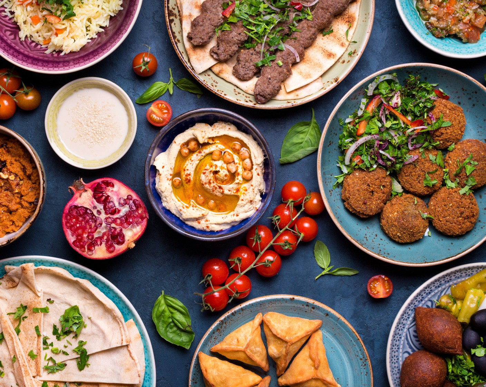

# What Middle Eastern Cooking Actually Is

*"Middle Eastern food" spans Lebanon, Syria, Palestine, Jordan, Egypt, Iraq, Yemen, Saudi Arabia, the UAE, and (depending on definition) Persia / Iran and Turkey. The dishes share roots but each country owns the variations. This course covers the shared techniques and then walks through the regional distinctions.*

## Overview

Middle Eastern cuisine sits at the crossroads of Mediterranean, North African, Levantine, and Persian traditions. Across the region you'll find:

- **The mezze tradition** — small plates of dips, salads, pickles, fritters, kibbeh, and grilled bites, eaten together with flatbreads. Mezze sits before (and often instead of) a main course.
- **Bread as the utensil** — pita, khubz, lavash, taboon, or markook bread. Bread is torn and used as a scoop, a wrapper, a plate.
- **Grilled meat** — kebabs (kofta, shish, shawarma), shish taouk, kibbeh nayyeh, kafta. The charcoal grill is traditional.
- **Yogurt + tahini** — central condiments. Yogurt drained into labneh; tahini blended into hummus; both used in countless dressings.
- **The grains** — bulgur, freekeh, rice, couscous (more North African), and the wheat-based pita / khubz.
- **The spices** — sumac, za'atar, baharat, ras el hanout (Maghrebi), Aleppo pepper, sweet cinnamon, allspice, cardamom, saffron.
- **Vegetables centre-stage** — aubergine, tomato, cucumber, courgette, pomegranate, herbs (parsley, mint, dill, coriander).

The cuisine is unified by these ingredients and techniques but distinguished sharply by region (covered in the [regional-distinctions](regional-distinctions.md) page).

## The pages

1. **[bread-and-grain.md](bread-and-grain.md)** — pita / khubz / lavash / markook + bulgur / freekeh / rice as the staple foundations.
2. **[mezze.md](mezze.md)** — the traditional small plates: hummus, baba ghanoush, labneh, muhammara, fattoush, tabbouleh, and the assembly logic.
3. **[kebabs.md](kebabs.md)** — kofta (minced) vs shish (cubed), shish taouk (chicken), kafta, and the grilling technique.
4. **[spices.md](spices.md)** — sumac, za'atar, baharat, Aleppo pepper, plus regional blends (ras el hanout, advieh).
5. **[regional-distinctions.md](regional-distinctions.md)** — Lebanese vs Syrian vs Palestinian vs Egyptian vs Iraqi vs Yemeni vs Persian: each region's signature ingredients and dishes.

## What this course is NOT

- **Turkish** — Turkey has its own cuisine (kebabs, mezes, pide, pilavs); shares roots but distinct. Existing recipes at [cuisine/turkish/](../../cuisine/turkish/).
- **North African (Maghrebi)** — Morocco, Algeria, Tunisia, Libya. Distinct cuisine: tagines, couscous as a staple (rather than pita), preserved lemons, ras el hanout. Existing recipes at [cuisine/moroccan/](../../cuisine/moroccan/) and the [cuisine/north-african/](../../cuisine/north-african/) umbrella.
- **Israeli modern** — covered briefly in [regional-distinctions.md](regional-distinctions.md); largely Levantine roots with modern Israeli innovations (shakshuka, sabich, pita-based fast food).

## What you need

- **A heavy frying pan** (cast iron) for kofta and shawarma at home.
- **A charcoal grill** (or gas grill, or a heavy cast-iron griddle) for kebabs.
- **A food processor** — for hummus, baba ghanoush, kibbeh, and herb mixes.
- **A mortar and pestle** — for grinding spices and crushing garlic.
- **A spice grinder** (or coffee grinder dedicated to spice) — for fresh-ground baharat, ras el hanout.
- **Skewers** — long flat metal skewers (the traditional Middle Eastern shape) work better than round bamboo. Flat skewers keep cubed meat from rotating.
- **A pita / khubz bread** — fresh-baked is best; supermarket pita works.
- **A tahini jar** — Soom or Joyva or Al Wadi brand; Middle Eastern grocery shops carry the best.
- **A bottle of pomegranate molasses** — the traditional Middle Eastern souring agent.
- **A jar of sumac** — the traditional Middle Eastern sour-tangy spice.
- **A jar of za'atar** — the Lebanese / Palestinian herb blend.

## How to use the course

Read all five content pages. Then:

1. **Week 1 — Mezze basics.** Make hummus, baba ghanoush, labneh, and tabbouleh. Serve with pita and olives. The traditional mezze platter.
2. **Week 2 — Kebabs.** Make a kofta + a shish taouk. Grill over charcoal if possible. Pair with hummus and pita.
3. **Week 3 — A regional dish.** Pick one from the regional-distinctions page (e.g. Lebanese mujadara, Palestinian musakhan, Egyptian koshari, Persian fesenjan). Cook the whole dish from scratch.
4. **Week 4 — Build a full mezze + main spread.** Multiple mezze items + a kebab + bread + pickled vegetables. Eaten over 2-3 hours with friends.

## Pairing principles

Middle Eastern meals pair with:
- **Arak / raki / ouzo** — anise-flavoured spirit, served diluted with cold water and ice (turns cloudy). The traditional Levantine drink.
- **Lebanese / Israeli wine** — increasingly recognised; Chateau Musar, Chateau Ksara, Vitkin.
- **Mint tea** (Lebanese / Egyptian style) — strong black tea with fresh mint sprigs + sugar.
- **Turkish coffee** — sweet, cardamom-flavoured.
- **Yogurt drink (ayran / shenineh)** — salted yogurt with water and mint.

## Why this matters

Middle Eastern food is one of the world's great cuisines — older than European cuisine, deeply codified, with techniques (the tahini-and-lemon emulsion, the kibbeh forcemeat, the slow-roast lamb) that no other cuisine matches.

The shared mezze + grilled-meat structure makes it perfect for entertaining: a Middle Eastern dinner is naturally a 2-3 hour, multi-course, conversational meal. The food is generous, social, and rewards a slow approach.
