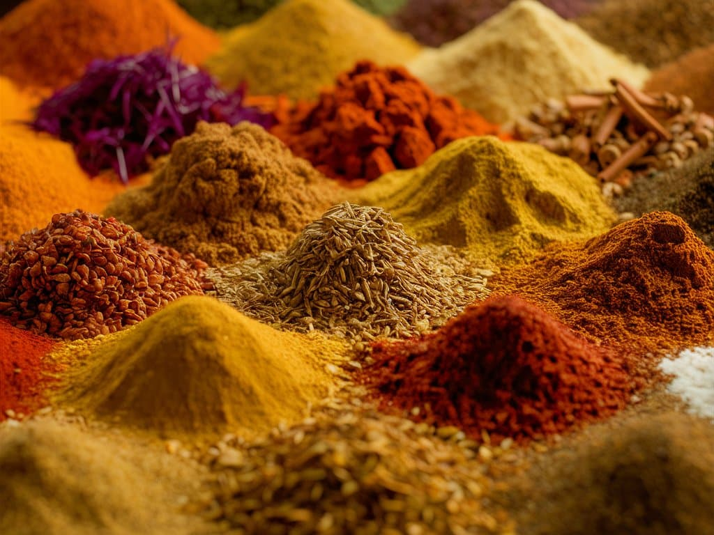

# Spices

*Middle Eastern cooking uses spices subtly — never the wall-of-flavour of Indian cooking; never the single-spice dominance of European; but a precise layered approach. Sumac for tart-tangy. Za'atar for herbal. Baharat for warmth. Aleppo pepper for fruity heat. This page covers the canonical spice kit and the regional blends.*

## Overview

The Middle Eastern spice pantry has 5-7 essential individual spices + 2-3 blends. Together they cover almost any Middle Eastern dish.

**Individual spices:**
- Sumac (tart-tangy red powder)
- Aleppo pepper (mildly hot, fruit-floral)
- Cumin (warming, earthy)
- Allspice (warm, complex)
- Cinnamon (warm-sweet)
- Cardamom (floral)
- Sweet paprika (colour + mild)

**Blends:**
- Baharat (the Levantine all-purpose blend)
- Za'atar (the Lebanese / Palestinian herb-and-sesame blend)
- Ras el hanout (Maghrebi; covered briefly here, more in the [moroccan cuisine](../../cuisine/moroccan/) tree)
- Advieh (Persian; covered briefly here, more in the [persian cuisine](../../cuisine/persian/) tree)

This page walks through each.

## Sumac

The tart-tangy berry powder. Made from the dried berries of the Rhus genus (NOT the poisonous variety; Middle Eastern sumac is Rhus coriaria, a different species). Bright red-purple powder; tastes of dried lemon + a slight bitterness + a salty edge.

### Where sumac goes
- **On fattoush** — essential.
- **Over sliced raw onions** — sumac onions are the canonical Middle Eastern garnish for kebabs.
- **On hummus or labneh** — as a finishing sprinkle.
- **In musakhan** (Palestinian sumac-chicken) — the dominant flavour.
- **On grilled meat** — sumac sprinkled over a hot kebab adds tart-tangy.
- **In dressings** — replaces (or supplements) lemon.

### What good sumac looks like
- Deep purple-red, slightly damp-looking (not dusty grey-brown).
- Tart smell immediately when opened.
- Fresh (less than 1 year from purchase) — old sumac loses its punch.

### Sourcing
- Lebanese / Palestinian sumac is canonical.
- Iranian sumac is brighter, with a slight floral note.
- Avoid generic supermarket "sumac" — often pale and dusty.
- Bald-Headed Herbs (UK), Penzeys (US), and Middle Eastern grocers carry the good stuff.

## Aleppo pepper (pul biber)

Mildly hot dried red chilli pepper, traditionally from the Aleppo region of Syria. Coarsely ground, slightly oily, with a fruity-floral character that's quite different from regular crushed red pepper flakes.

### Where Aleppo pepper goes
- **On hummus, labneh, muhammara** — finishing sprinkle.
- **In kebabs** — the kofta / kafta spice mix.
- **In stews and tagines** — gentle warmth without overwhelming.
- **On eggs** — sprinkled over fried or poached eggs.

### Substitutes
- Maraş pepper (Turkish; very similar)
- Urfa pepper (Turkish; darker, smokier)
- Crushed red pepper flakes + a pinch of paprika (passable substitute)

### Sourcing
The genuine Aleppo from Syria is harder to find since 2011 due to conflict. The Turkish Maraş pepper has filled the gap. Check that the powder is moist (the canonical Aleppo / Maraş has a slight oil; dust-dry versions are not the same).

## Cumin

Warming, slightly earthy, slightly sweet. Used whole or ground. The most-used Middle Eastern spice.

### Where cumin goes
- **In kebabs** — essential.
- **In hummus** (a small amount).
- **In stews and tagines** — foundational.
- **In rice and pilafs** — the canonical Middle Eastern rice perfume.

### Whole vs ground
- **Whole cumin** — toasted whole and ground fresh gives the best aroma. Toast in a dry pan for 30 seconds; grind in a spice grinder.
- **Ground cumin** — pre-ground; loses aroma after 6 months. Replace regularly.

## Allspice

The dried berry of Pimenta dioica. Tastes of cinnamon + clove + nutmeg combined (hence the name). Used heavily in Lebanese / Syrian / Palestinian cooking.

### Where allspice goes
- **In kofta / kafta** — essential. The Levantine "warm spice" identity.
- **In rice dishes** (mansaf, maqluba) — added to the rice pot.
- **In stews** — slow-cooked lamb, beef stews.

The Levantine love of allspice distinguishes the region from Persian / Iranian cooking (which uses more saffron) and Maghrebi cooking (which uses more ras el hanout — covered below).

## Cinnamon

Warm-sweet. Used in both savoury and sweet Middle Eastern cooking.

### Where cinnamon goes
- **In savoury rice dishes** — mansaf, mujadara, maqluba (a stick added to the rice pot).
- **In meat stews** — slow-cooked lamb with cinnamon + onion + tomato is canonical.
- **In sweet dishes** — knafeh, baklava, atayef.

Use a whole stick for savoury (added to the pot and removed before serving) and ground for sweets.

## Cardamom

Green pods, lightly crushed. Floral, slightly camphor-like, distinctively Middle Eastern.

### Where cardamom goes
- **In Arabic coffee** — the canonical use. 6-8 pods per pot of coffee.
- **In rice** — 2-4 pods in the pot.
- **In stews** — 2-3 pods in slow-cooked lamb.
- **In sweet dishes** — kunafa, rice pudding, atayef.

Black cardamom (a different variety, larger and smokier) is used in some Persian and Gulf dishes but less common in everyday Levantine.

## Sweet paprika

Mild, colour-rich. Used as a finishing sprinkle on hummus, labneh, and dips.

### Where paprika goes
- **On hummus and dips** — replaces or supplements Aleppo pepper.
- **In some kebab mixes** — Egyptian kofta uses paprika.
- **On baba ghanoush** — colour finish.

Smoked paprika (pimentón) is more Spanish than Middle Eastern. Use sparingly in Middle Eastern recipes.

## Baharat (the Levantine all-purpose blend)

Translates as "spices" — the all-purpose Middle Eastern spice mix. Each family has a version; recipes vary widely.

### Canonical baharat (Lebanese / Syrian)
- 2 tablespoons ground black pepper
- 1 tablespoon ground allspice
- 1 tablespoon ground cumin
- 1 tablespoon ground cinnamon
- 1 teaspoon ground coriander
- 1 teaspoon ground cardamom
- 1 teaspoon ground cloves
- 1 teaspoon nutmeg

Combine; store in a sealed jar.

### Where baharat goes
- **In meat dishes** — rubs for lamb, beef, chicken.
- **In rice dishes** — sprinkled over before cooking.
- **In stews** — added with the onion / tomato base.

### Regional baharat variants
- **Iraqi baharat** — more cardamom, slightly less cinnamon.
- **Gulf baharat** — heavier on dried lime (loomi), saffron.
- **Egyptian baharat** — more cumin, slightly more chilli.

## Za'atar (the Lebanese / Palestinian herb blend)

A green powder made from dried thyme + sumac + sesame seeds + salt + olive oil (sometimes). Distinctive: herbal, tangy, slightly nutty.

### Canonical Lebanese za'atar
- 4 tablespoons dried thyme (Lebanese / Syrian thyme is canonical; Greek oregano substitute works)
- 4 tablespoons sumac
- 4 tablespoons toasted sesame seeds
- 1 tablespoon salt
- 1 teaspoon ground cumin (optional)

Mix; store in a sealed jar.

### Where za'atar goes
- **On flat bread** — manakish za'atar (Lebanese breakfast bread topped with za'atar + olive oil).
- **On labneh** — sprinkled over with olive oil.
- **On feta** — labneh with za'atar is the canonical mezze.
- **On grilled chicken** — a herb rub.
- **In pita pockets** — labneh + cucumber + za'atar inside a pita.
- **Sprinkled over eggs** — fried egg + za'atar + olive oil is a Lebanese breakfast.

### Regional za'atar
- **Lebanese** — heavier on sumac and oregano.
- **Palestinian** — heavier on sumac and wild thyme.
- **Jordanian** — slightly more dried sumac.
- **Modern Israeli** — sometimes adds anise or fennel.

## Ras el hanout (Maghrebi blend)

Translates as "head of the shop" (the shopkeeper's best blend). A complex blend of 20+ spices, varying by family. Used in tagines, couscous, and Moroccan grilling.

### Canonical ras el hanout
- 1 tablespoon ground cumin
- 1 tablespoon ground coriander
- 1 tablespoon ground cinnamon
- 1 tablespoon ground ginger
- 1 tablespoon ground cardamom
- 1 tablespoon sweet paprika
- 1 teaspoon ground cloves
- 1 teaspoon ground nutmeg
- 1 teaspoon ground allspice
- ½ teaspoon ground chilli
- ½ teaspoon ground black pepper
- ½ teaspoon turmeric
- A pinch of dried rose petals (the floral note)
- A pinch of dried lavender (optional)

### Where ras el hanout goes
- **In Moroccan tagines** — lamb tagine with prunes + ras el hanout.
- **In couscous** — over the meat-and-vegetable base.
- **As a rub** — on roast lamb, chicken, or fish.

This is more Maghrebi than Levantine but worth having in a Middle Eastern pantry for crossover recipes.

## Advieh (Persian blend)

The Persian all-spice blend. Lighter, more floral than baharat.

### Canonical advieh
- 1 tablespoon ground cumin
- 1 tablespoon ground cinnamon
- 1 tablespoon ground cardamom
- 1 tablespoon ground rose petals
- 1 teaspoon ground turmeric
- 1 teaspoon ground black pepper
- 1 teaspoon dried lime (loomi) — ground

### Where advieh goes
- **In Persian rice (chelo and polos)** — sprinkled over.
- **In Persian stews (khoresh)** — fesenjan, gheimeh.
- **As a rub** — for Persian-style kebabs.

## Other Middle Eastern spices worth knowing

### Saffron
The most expensive spice on Earth, but used in tiny amounts. Iranian saffron is the gold standard. Used in rice (saffron rice is the Persian classic), stews, and sweet rice puddings.

To use: steep a pinch of saffron threads in 2 tablespoons of hot water for 10 minutes; the water turns bright orange-yellow. Add to the dish at the end.

### Dried lime (loomi / loumi)
Whole dried Persian limes, used in Gulf and Persian cooking. Earthy, citrusy, slightly fermented. Pierce with a knife before adding to stews; remove before serving.

### Pomegranate molasses
Reduced pomegranate juice. Sweet-sour-tart. Used in muhammara, fattoush, kebab marinades, and as a finishing drizzle.

### Mahlab
Ground stone fruit pits (cherry, plum). Slightly almond-flavoured. Used in sweet breads and ma'amoul cookies.

### Mastic
The dried sap of the mastic tree (from the Greek island of Chios). Pine-resin-like, slightly sweet. Used in Levantine ice cream (booza), nougat, and some sweet breads.

### Orange blossom water and rose water
Distilled flower waters. Used heavily in Middle Eastern desserts (knafeh, baklava, ma'amoul, atayef) and in some savoury dishes (Persian rice).

### Black lime powder (loomi pulverised)
A modern preparation — dried lime ground to a fine powder. Sprinkled over Gulf rice dishes or marinades.

## A Middle Eastern spice pantry

A working kitchen has:
- **Whole**: cumin seeds, coriander seeds, cardamom pods, allspice berries, cinnamon sticks, dried red chillies, bay leaves
- **Ground**: cumin, coriander, cinnamon, allspice, cardamom, paprika
- **Speciality**: sumac, Aleppo pepper, mahlab (sweets), saffron, dried limes (Gulf cooking)
- **Blends**: baharat, za'atar, ras el hanout (Maghrebi crossover)
- **Liquid / preserved**: pomegranate molasses, orange blossom water, rose water

Total cost to assemble from scratch: about £80-100 from Middle Eastern grocers; lasts 6-12 months.

## Where to source

- **Middle Eastern grocers** (UK: Sweetlands, Yummy Stamford Hill, Damascus Bite) — for fresh spices, the canonical Lebanese / Palestinian brands.
- **Online**: Bald-Headed Herbs (UK), Cool Chile Co, Sous Chef.
- **Spice merchants** — Penzeys (US), Steenbergs (UK).
- **Avoid supermarket spice aisles** — old stock, low quality, expensive per gram.

A small spice grinder (£15) + a mortar and pestle (£10) makes the difference. Whole spices toasted and ground fresh have 3x the aroma of pre-ground.

## How to use spices

The Middle Eastern approach to spice:
- **Layered, not single-spice dominant.** A dish has 4-7 spices, none dominant.
- **Bloomed in oil.** Whole spices toasted in oil before adding aromatics.
- **Salt at the end.** Many spices are salt-adjacent (sumac is partly salty; za'atar is partly salty). Adjust the final salt accordingly.
- **Fresh-ground.** Pre-ground spices are 6-12 months old; fresh-ground are 6 days old.

The next page covers how the regions use these spices differently.
