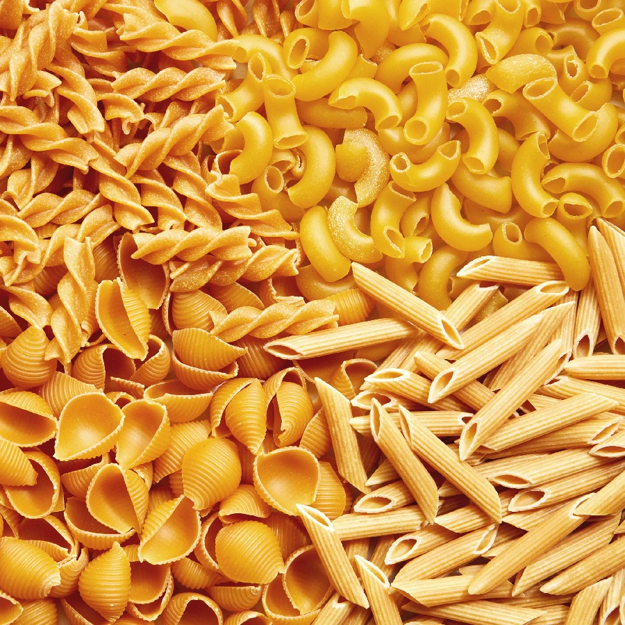

# Dried Pasta

*Dried pasta does most of the heavy lifting in Italian kitchens and probably yours. It's a different family from fresh egg pasta (just durum and water, no eggs) and the rules for cooking it are simple, but worth doing well. Properly salted water, a tall pan, a watchful eye, and a little of the cooking water saved for the sauce.*

## Overview
Dried pasta is the Italian everyday. It's also what's available in the supermarket, what most Italian restaurants use, and what almost all the canonical Italian pasta dishes were designed for: spaghetti carbonara, penne arrabbiata, bucatini amatriciana, linguine alle vongole, orecchiette con cime di rapa.

Dried pasta differs from fresh in three ways:
1. **Made from durum semolina wheat, not soft "00" wheat.** Durum has high protein; the cooked pasta is firmer and more al dente.
2. **No eggs.** Just durum and water.
3. **Dried hard.** The shapes are stable and shelf-stable for months or years.

The technique is in the cooking (boiling water, salt, time) and in the buying (the brand and shape matter).

## Buying Dried Pasta

Three things make a noticeable difference in cooked pasta quality:

### Bronze Die vs Teflon Die
The pasta is extruded through a die plate. Bronze dies produce a rough, slightly porous surface; teflon dies produce a smooth glossy surface.

The rough surface is the prize. It holds sauce 30-40% better than smooth, because sauce clings to the texture instead of sliding off.

Look for "bronzo" or "trafilata al bronzo" on Italian packets. Common UK brands with bronze-die products: De Cecco, Rummo (selectively), Garofalo, La Molisana.

### Slow Drying
Industrial pasta is dried at 90-100 C in 2-3 hours. Artisan pasta is dried at 40-60 C over 24-48 hours. The slow dry preserves more of the wheat's natural flavour and gives a better al dente bite.

Look for "essiccazione lenta" or "slow-dried."

### Durum Quality
Different brands use different grades of durum. The good brands (Rummo, De Cecco's higher lines, Setaro, Faella) use 100% Italian durum. Cheaper brands often blend.

A 500 g packet of Setaro costs £4-5; supermarket equivalent is £1. The difference is real. For everyday cooking, Rummo or De Cecco strikes the right cost-quality balance.

## The Cooking Method (Italian Standard)

### Step 1 - The Water
Use a tall narrow pot, not a wide shallow one. The pasta needs to be fully submerged.

Volume: 1 litre of water per 100 g of pasta. So a 500 g packet needs 5 litres.

The wide pot myth is wrong. The narrow tall pot keeps the water hot when the pasta hits it; the wide pot drops temperature too far.

### Step 2 - The Salt
Italian standard: 10 g salt per litre of water. So 5 litres of water = 50 g salt.

This sounds like a lot. It is. The pasta absorbs only a fraction; the rest goes down the drain. The pasta is properly seasoned through, not just on the surface.

"Salty as the sea" is the saying.

### Step 3 - The Boil
Bring the salted water to a rolling boil before adding the pasta. The pasta needs the dramatic heat to seal its surface and prevent sticking.

Don't add the pasta to lukewarm water; it slowly absorbs water and goes gluey before cooking.

### Step 4 - The Pasta In
1. Add the pasta all at once.
2. Stir immediately for 30 seconds; this prevents pieces from sticking to each other.
3. Cover briefly to bring the water back to the boil quickly (1-2 minutes).
4. Uncover. Cook at a rolling boil.

### Step 5 - Cook Al Dente
The packet's time is a maximum. Drain at the lower end of the range, or 1 minute before.

What al dente means: tender at the surface, with a thin firmness at the centre. Bite a piece; it should give cleanly with a slight resistance at the heart. Over-done = soft throughout, mushy. Under-done = chalky at the centre.

For most pasta shapes:
- Tagliatelle (fresh: 2 min; dried: 5-7 min).
- Spaghetti, linguine: 8-10 min.
- Penne, rigatoni, fusilli: 10-12 min.
- Orecchiette (dried): 12-14 min.
- Filled pasta (ravioli, tortellini): 3-4 min if fresh.

Start tasting 1 minute before the packet time. Drain when al dente.

### Step 6 - The Pasta Water

Before draining, reserve at least 250 ml of the cooking water. The starchy salted water is essential for finishing sauces; without it, the sauce won't bind to the pasta.

This is the secret most home cooks miss. The pasta water is what makes restaurant pasta dishes look glossy and creamy without needing additional cream or butter.

### Step 7 - Drain (Briefly)
Don't drain too thoroughly. A bit of clinging water helps with the sauce. Tip into a colander; shake once or twice; transfer to the sauce pan immediately.

### Step 8 - Finish in the Sauce
The pasta should finish cooking in the sauce, not on a plate.

1. Transfer the drained pasta to the pan of warm sauce.
2. Add a ladle (about 100 ml) of pasta water.
3. Toss vigorously for 30-60 seconds. The pasta absorbs the sauce; the starchy water emulsifies with the fat in the sauce; the dish becomes glossy and coated.
4. If too dry, add another splash of pasta water.
5. Plate immediately.

This is the "mantecare" step in Italian cooking; it's the difference between pasta with sauce poured on top (amateur) and pasta-and-sauce combined as one dish (professional).

## Common Dried Pasta Shapes

| Shape | Cross-section | Best with |
|---|---|---|
| Spaghetti | Round, 1.5-2 mm | Carbonara, tomato sauces, pesto |
| Linguine | Oval, 2-3 mm | Vongole (clams), pesto, seafood |
| Bucatini | Round with hole, 3 mm | Amatriciana, carbonara |
| Tagliatelle | Flat ribbon, 6 mm | Ragu, cream sauces |
| Pappardelle | Flat ribbon, 25 mm | Heavy game ragu |
| Penne | Tube, ridged | Arrabbiata, tomato-based |
| Rigatoni | Tube, larger | Carbonara, baked pasta |
| Fusilli | Spiral | Pesto, light vegetable sauces |
| Orecchiette | Bowl shape | Sprouting broccoli, sausage |
| Conchiglie | Shell | Tomato-based, baked |
| Farfalle | Bow-tie | Light cream sauces |
| Macaroni | Short tube | Cheese, baked |

The shape determines how the sauce sits. See [Matching Sauce to Shape](matching-sauce-to-shape.md) for the underlying principle.

## Common Mistakes

**The pasta is sticky and clumped.**
Not enough water (use 1 litre per 100 g), didn't stir at the start (stir for 30 seconds immediately), or rinsed in cold water (don't; the starch on the surface helps the sauce cling).

**The pasta is bland.**
Not enough salt in the water. Use 10 g per litre; "salty as the sea."

**The sauce doesn't stick to the pasta.**
Used teflon-die pasta (smooth surface), or drained too thoroughly (no clinging water). Buy bronze-die; don't shake the colander too much.

**The pasta is mushy.**
Cooked too long. Pull at the lower end of the packet time; finish in the sauce.

**The dish is dry.**
Drained too thoroughly; didn't add pasta water. Reserve and add.

**The cooked pasta sticks together while you finish the sauce.**
Don't drain ahead of time. Time the pasta to finish cooking when the sauce is ready.

## Where Next
- [Fresh Pasta Dough](fresh-pasta-dough.md): the egg-pasta alternative.
- [Shapes](shapes.md): the dried-pasta shape gallery is broader than fresh.
- [Matching Sauce to Shape](matching-sauce-to-shape.md): the next layer.
- [Regional Italian](regional-italian.md): why southern Italy dries its pasta and northern Italy doesn't.
- [Pasta Course landing](pasta.md): back to the main course.

## Storage
- Fresh pasta dough keeps 2 days refrigerated, wrapped in cling film
- Cut fresh pasta dries on a rack in 30 minutes; store dried for up to 1 week in an airtight container
- Freeze fresh pasta in portioned nests up to 2 months; cook from frozen, adding 1-2 minutes to the boil time
- Dried pasta keeps indefinitely in a sealed container in a cool, dry cupboard
