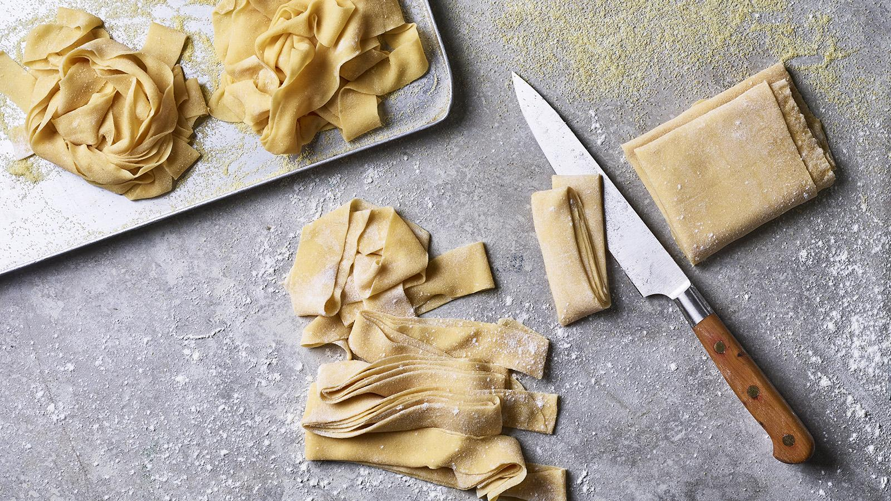

# Fresh Pasta Dough

*Three ingredients: eggs, flour, salt. The northern Italian rule is one egg per 100 g of flour, and you don't add water. Knead it silky, rest it an hour, roll it paper-thin, and you can make tagliatelle, ravioli, lasagne sheets, tortellini. Almost everything fancy in the pasta world starts here.*

## Overview
Fresh pasta dough is one of the simplest doughs in cooking: just flour and eggs. The technique is in the handling. Properly made, the dough is silky and elastic; properly rolled, it's translucent enough to read a newspaper through.

The classical northern Italian ratio is 1 egg per 100 g of "00" flour. A medium egg weighs about 55 g; so the dough is roughly 55% hydration from the egg alone. No added water (well-tempered eggs and good flour mean none needed).

Southern Italian dried pasta is different: water and durum semolina flour, no eggs. That's covered in the [dried pasta](dried-pasta.md) page. This page is the fresh-egg-pasta tradition.

## The Master Recipe

For 4 portions (about 400 g of dough):

### Ingredients
- 400 g "00" flour (or strong bread flour as substitute)
- 4 medium eggs
- 1 teaspoon fine sea salt
- 1 tablespoon olive oil (optional; some traditions include it for elasticity)

The "00" designation refers to flour milled very fine, with a low ash (mineral) content. Italian "tipo 00" is the standard for pasta. UK substitute: strong bread flour or fine "00" pasta flour from Italian delis.

## Method

### Stage 1 - Form the Well

The traditional way (without a stand mixer):

1. Tip 400 g flour onto a clean work surface in a heap.
2. Make a deep well in the centre with your fingers; the well should be wide enough to hold all the eggs (about 15 cm wide, 5 cm deep).
3. Crack the 4 eggs into the well.
4. Add salt and olive oil if using.

If you have a stand mixer with a dough hook, you can do this in the mixer bowl with similar effect.

### Stage 2 - Mix

Using a fork or your fingertips:
1. Beat the eggs gently in the well, breaking the yolks.
2. Gradually pull flour from the inner walls of the well into the egg mixture; this thickens the egg.
3. Continue pulling flour in slowly, working in concentric circles outward.
4. As more flour is incorporated, the mixture becomes a sticky paste, then a shaggy dough.
5. Once most of the flour is in (some flour will be left on the bench; that's fine), gather everything together with both hands.

### Stage 3 - Knead

1. Knead the dough on the floured bench for 10 minutes.
2. The dough should transform from rough and lumpy to smooth, silky and slightly elastic.
3. If too dry (cracking, won't come together): dampen your hands slightly and knead more.
4. If too wet (sticking to the bench): dust a bit of flour. Be sparing; over-flouring makes the dough tough.

A correctly-kneaded dough passes a simple test: press a finger into the surface; it should spring back slowly. Rough lumpy dough that won't smooth out = under-kneaded (keep going); tight elastic dough that resists rolling = over-worked or under-rested (rest longer); slack non-springy dough = over-hydrated.

### Stage 4 - Rest

1. Wrap the dough tightly in cling film.
2. Rest at room temperature for at least 30 minutes; ideally 1 hour.
3. The rest lets the gluten relax (so the dough rolls without springing back) and lets the flour fully hydrate (so the dough becomes uniformly smooth).

Do not skip this step. Unrested pasta dough rolls badly and shrinks back constantly.

### Stage 5 - Roll

Two methods: by hand with a long rolling pin, or with a pasta machine (manual or stand-mixer attachment).

#### By Hand (Traditional)

1. Cut the dough into 4 portions.
2. Wrap 3 portions back up; work with 1 at a time.
3. Roll on a lightly floured bench, turning a quarter turn between strokes, from the centre outward.
4. Continue until the dough is roughly the thickness you want.

A pasta dough rolled by hand is rarely perfectly uniform; small variations are part of the rustic character. Aim for 1-2 mm thick for ribbon pastas; 1 mm or thinner for stuffed pastas (the dough doubles when folded over filling).

#### With a Pasta Machine

1. Cut the dough into 4 portions.
2. Flatten one portion into a rough rectangle, dusting with flour.
3. Start at the widest setting (usually #1 or #2 on a manual machine). Pass through.
4. Fold into thirds (letter fold). Pass through the widest setting again.
5. Repeat the fold-and-pass twice more at the widest setting; this kneads the dough further and aligns the gluten.
6. Now start reducing the thickness setting one notch at a time. Pass once through each setting. Don't fold between settings.
7. Continue to the desired final thickness: #6 or #7 (out of 9) for ribbon pastas; #8 or #9 for ravioli.

The dough sheet stretches longer with each pass. By the final settings, the sheet may be 80-100 cm long; cut it in half if it gets unmanageable.

### Stage 6 - Cut or Fill

Use immediately while the dough is still pliable. The longer fresh pasta sheets sit, the more they dry and the harder they crack. Cover any sheet you're not actively working with under a damp tea towel.

See [Shapes](shapes.md) for the cutting and filling techniques.

## Cooking Fresh Pasta

Fresh pasta cooks much faster than dried.

1. Bring a large pot of well-salted water (1 tablespoon salt per 4 litres) to a rolling boil.
2. Drop in the fresh pasta.
3. Cook 90 seconds to 4 minutes, depending on thickness:
   - Filled pasta (ravioli, tortellini): 3-4 minutes; check by tasting one.
   - Ribbon pasta (tagliatelle, fettucine, pappardelle): 2 minutes.
   - Thin sheets (lasagne): 90 seconds.
4. Drain (reserving 250 ml of pasta water).
5. Toss immediately into sauce.

Fresh pasta should still have a tender bite. Over-cooked, it goes mushy fast.

## Variations

### Wholemeal Fresh Pasta
- Replace 100 g of the white flour with wholemeal flour. The dough is browner, more rustic, slightly heavier.

### Spinach Pasta (Verde)
- Add 80 g cooked-squeezed-finely-chopped spinach to the dough with the eggs. The dough goes bright green; the colour stays through the cook.

### Squid Ink Pasta (Nero)
- Add 2 tablespoons squid ink with the eggs. The dough is jet-black; pairs especially well with seafood sauces.

### Egg-Yolk Only (Pasta all'Uovo)
- Replace whole eggs with 6 yolks per 400 g flour. The dough is richer, more yellow, slightly less elastic. The Piedmontese tradition.

### Pizza Dough (Different)
- A different beast entirely; see the [pizza course / dough](../pizza/dough.md).

## Common Mistakes

**The dough is sticky and won't come together.**
Too many eggs, or eggs too large. Add 1-2 tablespoons of flour at a time; knead in.

**The dough is dry and won't come together.**
Eggs too small, or flour too absorbent. Add water, 1 teaspoon at a time, kneaded in. Or add another egg yolk.

**The dough cracks when rolled.**
Under-rested, or under-kneaded. Rest longer (1 hour minimum); if you can't see the dough is uniformly smooth before resting, knead another 5 minutes.

**The dough springs back during rolling.**
Under-rested. Rest another 30 minutes; the gluten needs to relax.

**The dough is patchy in colour or texture.**
Under-kneaded; the flour wasn't fully hydrated. Knead another 5 minutes; the dough smooths out.

**The dough goes through the pasta machine but breaks at the thinner settings.**
Under-kneaded, or too dry. The gluten isn't developed enough to stretch. Re-knead by re-folding and passing through the widest setting 3-4 times.

**The cooked pasta is rubbery.**
Over-kneaded, or over-cooked. Cook to al dente; under-cook by 10 seconds if uncertain.

**The cooked pasta is mushy.**
Over-cooked. Fresh pasta cooks fast; taste at 90 seconds.

## Where Next
- [Shapes](shapes.md): cutting and filling the dough.
- [Dried Pasta](dried-pasta.md): the everyday alternative.
- [Matching Sauce to Shape](matching-sauce-to-shape.md): which sauce for which shape.
- [Pasta recipe](../../bread-pasta/pasta.md): traditional master dough.
- [Pasta Course landing](pasta.md): back to the main course.

## Storage
- Fresh pasta dough keeps 2 days refrigerated, wrapped in cling film
- Cut fresh pasta dries on a rack in 30 minutes; store dried for up to 1 week in an airtight container
- Freeze fresh pasta in portioned nests up to 2 months; cook from frozen, adding 1-2 minutes to the boil time
- Dried pasta keeps indefinitely in a sealed container in a cool, dry cupboard
