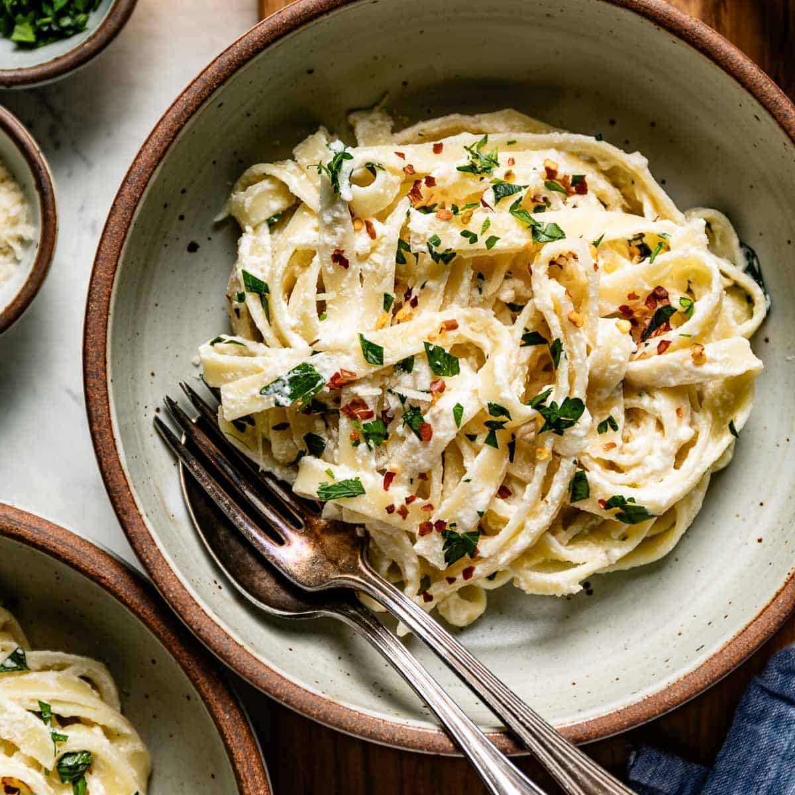

# Matching Sauce to Shape

*There's a reason Italians get fussy about which sauce goes with which pasta. The shape was designed alongside the sauce: long thin pastas catch slick oily sauces, tubes catch chunks, bowls scoop small bits, wide ribbons carry rich meaty ragus. Once you see the principle, the pairings stop feeling like rules and start feeling like common sense.*

## Overview
Why bucatini with amatriciana and not arrabbiata? Why fettucine with cream and not chunky tomato? Why orecchiette with sprouting broccoli and not bolognese? The answer is shape: each pasta was developed alongside a sauce, and the shape determines how the sauce sits.

The wrong shape ruins a dish. Bolognese on spaghetti is unwieldy: the meat slides off. Carbonara on penne is wrong: the sauce coats the inside of the tube but not the outside; the bite is asymmetric. Long thin pasta with chunky sauce: the chunks fall off the strands.

Once you understand the principle, the pairings become obvious. This page covers the principle.

## The Five Sauce Types

Almost every Italian pasta sauce falls into one of these categories:

1. **Sticky-thin sauces.** Oil-based, slick, no chunks. Cling to long thin pastas.
2. **Cream and butter sauces.** Rich, coating. Pair with ribbons.
3. **Tomato-based with no chunks.** Smooth or finely-chopped tomato. Pair with anything but really suit long strands.
4. **Chunky sauces.** Meat ragu, vegetable chunks. Need tubes or wide ribbons.
5. **Small-chunk sauces.** Small peas, broccoli florets, sausage crumbles. Need pockets to scoop them.

## The Universal Rules

### Long Thin Pasta + Thin Sticky Sauces

Spaghetti, linguine, capellini, bucatini. The thin strand has limited surface area; it needs sauce that clings without chunks.

- **Carbonara:** egg yolk + cured pork + pasta water + pecorino. Coats every strand.
- **Aglio e olio:** olive oil + garlic + chilli + parsley. Slicks the pasta.
- **Cacio e pepe:** pecorino + black pepper + pasta water. The simplest pasta sauce, the ultimate test of pasta cooking.
- **Aglio olio peperoncino:** as above but with more chilli.
- **Pesto** (on linguine, not penne): the Genoese standard. The oil-rich pesto coats long strands.

The pasta water is critical here. The starch in the water emulsifies with the oil and pecorino, creating a creamy sauce-like coating.

### Long Thin Pasta + Tomato (No Chunks)

Spaghetti is the canonical home of tomato sauce. Marinara, puttanesca, arrabbiata (if smooth), simple tomato.

- **Spaghetti marinara:** the everyday tomato pasta.
- **Spaghetti puttanesca:** with anchovies, capers, olives, garlic, chilli. The bold version.
- **Linguine alle vongole:** with clams. Olive oil-based with white wine, chilli, parsley.

### Long Thin Pasta with Seafood

Linguine and spaghetti are the seafood-pasta defaults. The thin strands wrap around small seafood (mussels, clams, prawns) without dwarfing them.

- **Linguine with crab:** see [linguine-with-crab](../../cuisine/italian/linguine-with-crab.md).
- **Spaghetti with prawns and chilli.**
- **Linguine vongole** (clams).

### Bucatini (The Outlier)

Bucatini is spaghetti-thick but has a hole through the middle. The hole catches sauce. Specifically suited to:

- **Amatriciana:** tomato + guanciale + pecorino. The Roman classic.
- **Carbonara** (alternative to spaghetti).
- **Cacio e pepe** (alternative).

### Ribbon Pasta + Cream / Meat Sauces

Tagliatelle, fettucine, pappardelle. The wide ribbons have a large surface area and need substantial sauce.

- **Tagliatelle al ragu:** the Bolognese ragu sauce. Wide ribbons catch the meat. NEVER with spaghetti (despite what most people think; spaghetti bolognese is not an Italian dish).
- **Fettucine alfredo:** butter + parmesan + cream. The cream coats the ribbons.
- **Pappardelle al cinghiale:** wild-boar ragu on the widest ribbons; rich game sauce on hearty pasta.
- **Tagliolini al tartufo:** thin ribbons with truffle butter. The delicacy of the tartufo wants thinner pasta.

The rule: rich sauce, wide ribbon. The bigger the sauce flavour, the wider the pasta.

### Tubes + Chunky Sauces

Penne, rigatoni, ziti, macaroni. The tubes catch chunks inside and out.

- **Penne arrabbiata:** spicy tomato. The tubes hold the sauce.
- **Penne all'amatriciana:** good with this pairing too.
- **Rigatoni al ragu:** larger tubes, larger meat chunks.
- **Pasta al forno** (baked): tubes are the standard. They hold their shape through the bake.

The rule: chunky sauce needs a vessel. Tubes are the vessel.

### Bowls + Vegetables / Small Chunks

Orecchiette, conchiglie. The bowl shape catches small ingredients.

- **Orecchiette con cime di rapa:** sprouting broccoli + garlic + chilli + anchovy. The classic Pugliese. Small broccoli florets nestle in the bowl. See [pasta-with-sprouting-broccoli](../../cuisine/italian/pasta-with-sprouting-broccoli.md).
- **Orecchiette con salsiccia:** sausage crumbles + greens.
- **Conchiglie ai piselli:** shells with peas and ham. Each shell holds 2-3 peas.

The rule: the bowl/shell is for small ingredients you want to scoop.

### Spirals / Twists + Light Vegetable

Fusilli, trofie. The twists catch light sauces without overwhelming.

- **Trofie al pesto:** the Genoese classic. Pesto in the twists.
- **Fusilli with tomato-and-vegetable.**

### Filled Pasta + Simple Sauce

Ravioli, tortellini, cappelletti. The filling is the centrepiece; the sauce supports.

- **Ravioli with brown butter and sage:** the universal default. Lets the filling shine.
- **Tortellini in brodo:** simply served in clear chicken broth.
- **Lobster ravioli with lemon butter:** delicate sauce for delicate filling.

The rule: filled pasta has its own flavour; don't drown it in a heavy sauce.

## The Visual Test

Look at how the sauce-and-pasta lifts off a plate:

- **Right:** the sauce comes up with the pasta. Each bite has both, in proportion.
- **Wrong (chunks fall off):** wrong shape. The sauce needs a vessel.
- **Wrong (no sauce):** drained too thoroughly. Add pasta water.
- **Wrong (puddle of sauce, naked pasta):** finishing technique failed. The pasta wasn't tossed in the sauce.

## When to Break the Rules

Italian tradition has the rules above, but cooking is flexible. Reasonable departures:

- **Use what you have.** Penne when the recipe calls for rigatoni: fine. Long thin pasta when you don't have ribbons: fine.
- **Personal preference.** If you prefer spaghetti with everything: also fine. The shape-matching is a guideline, not a law.
- **Regional variants.** Northern Italian recipes use butter and cream where southern ones use olive oil. Each region's customs evolved with their pasta shapes.

The unfair pairings (the ones that genuinely don't work):
- Long thin pasta with chunky meat: the meat falls off.
- Wide ribbons with thin-and-slick oil sauces: the oil pools at the bottom.
- Filled pasta with heavy meat ragu: the ragu dominates the filling.

If you're unsure: ask yourself "how does this sauce sit on this shape?" If it slides off, it's wrong.

## The Italian Approach to Pairing

A few cultural notes:

- **Italians do not put parmesan on seafood pasta.** Cheese over-powers fish. The Italian dining rule: no parmesan with seafood.
- **Spaghetti bolognese is not Italian.** The traditional Bolognese ragu is served on tagliatelle. Spaghetti bolognese is a British (and American) invention.
- **No cream in carbonara.** Real Italian carbonara has no cream. Just egg yolks, cured pork, pecorino, pepper, pasta water. The "creamy" appearance is the emulsion, not added cream.
- **Long thin pasta is twirled on a fork.** Never cut with a knife. Tubes and shapes are speared.

## Where Next
- [Fresh Pasta Dough](fresh-pasta-dough.md): the master dough.
- [Shapes](shapes.md): the form gallery.
- [Dried Pasta](dried-pasta.md): the everyday version.
- [Regional Italian](regional-italian.md): why northern Italy uses cream and southern Italy uses olive oil.
- [Pasta Course landing](pasta.md): back to the main course.
