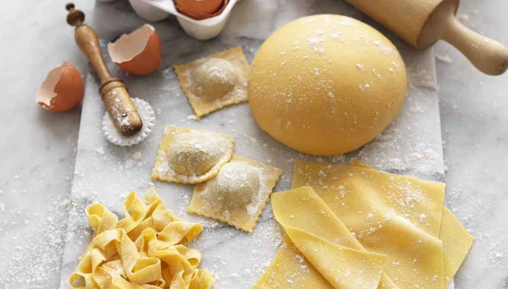

# Pasta Course

*The Italian foundation. Fresh pasta dough, the shape gallery (rolled, cut, filled), dried pasta as the everyday workhorse, matching sauce to shape, the regional traditions that distinguish northern butter-and-cream from southern olive-oil-and-tomato. Master these and the Italian canon opens.*

## Overview
Pasta sits beside bread, rice and pizza in the global short list of foundational starches. Like bread, it has a master dough (eggs + flour, plus variations) plus a shape gallery (tagliatelle, ravioli, pappardelle, gnocchi, fresh-cut shapes) plus a cooking technique that takes practice.

Unlike bread, pasta has a fixed companion: sauce. Each pasta shape was designed for a specific sauce. Bucatini for amatriciana (the hole catches sauce); orecchiette for sprouting broccoli (the bowl scoops up the small florets); ribbons (tagliatelle, fettucine, pappardelle) for cream-and-butter sauces; tubes (penne, rigatoni) for chunky tomato sauces. The shape-sauce matching is a major part of why some pastas work and others don't.

This course covers: the master dough, the shapes, the dried pasta cooking, the matching, and the regional context.

## Course Outline

### The Foundations
- [Fresh Pasta Dough](fresh-pasta-dough.md): eggs, flour, salt; the master dough technique with the kneading, resting and rolling.
- [Shapes](shapes.md): how to roll, cut and fill the dough into the classical Italian shapes.

### The Everyday
- [Dried Pasta](dried-pasta.md): what to buy, how to cook al dente, the salt-and-water question.

### The Skill
- [Matching Sauce to Shape](matching-sauce-to-shape.md): the underlying principle of Italian pasta cooking.
- [Regional Italian](regional-italian.md): the north-south divide that explains most of the canon.

## Master Recipes
The course refers back to these:

- [Pasta](../../bread-pasta/pasta.md): the master dough recipe.

## A Lot of Italian Recipes Are Pasta Dishes

The Italian section is heavily pasta-led; almost half the recipes are pasta dishes. The standouts to know:

### Long-Strand Pastas
- [Linguine with Pesto](../../cuisine/italian/linguine-with-pesto.md): the simplest summer pasta.
- [Linguine with Crab](../../cuisine/italian/linguine-with-crab.md): the seaside Italian standard.
- [Linguine with Pancetta](../../cuisine/italian/linguine-with-pancetta.md): the carbonara-adjacent.
- [Cacio e Pepe](../../cuisine/italian/cacio-e-pepe.md): the Roman classic, three ingredients (pasta, pecorino, black pepper).
- [Bucatini Carbonara](../../cuisine/italian/bucatini-carbonara.md): the classical Roman, with guanciale.
- [Spaghetti Puttanesca](../../cuisine/italian/pasta-puttanesca.md): the sharp, salty, briny Naples pasta.

### Ribbon Pastas
- [Fettuccine Chicken](../../cuisine/italian/fettuccine-chicken.md): with cream sauce.
- [Fettucine with Rosemary Lamb](../../cuisine/italian/fettucine-with-rosemary-lamb.md): hearty central-Italian.

### Tubular Pastas
- [Penne Arrabbiata](../../cuisine/italian/penne-arrabbiata.md): the fiery tomato pasta.
- [Penne with Chicory](../../cuisine/italian/penne-with-chicory.md): the bitter-leaf pasta.
- [Penne with Salami](../../cuisine/italian/penne-with-salami.md): cured-pork-led.
- [Pasta with Sprouting Broccoli](../../cuisine/italian/pasta-with-sprouting-broccoli.md): the orecchiette-and-broccoli classic.

### Filled and Ribbon Pastas
- [Crab Ravioli](../../cuisine/italian/crab-ravioli.md): fresh-pasta filled with crab.
- [Ham Filled Pasta](../../cuisine/italian/ham-filled-pasta.md): a tortellini-style.
- [Lasagne](../../cuisine/italian/lasagne.md): the layered baked pasta with bechamel + ragu.
- [Cannelloni](../../cuisine/italian/cannelloni.md): the rolled-and-filled tubes.

### Gnocchi (Pasta-Adjacent)
- [Gnocchi](../../cuisine/italian/gnocchi.md): the potato dumpling.
- [Ragu with Gnocchi](../../cuisine/italian/ragu-with-gnocchi.md): with the slow-cooked meat sauce.
- [Gnoccheti](../../cuisine/italian/gnoccheti.md): tiny gnocchi variant.

## Where to Start

- New to pasta: [Dried Pasta](dried-pasta.md) first. The everyday workhorse; learn to cook it al dente before you fool with fresh.
- Want the deeper skill: [Fresh Pasta Dough](fresh-pasta-dough.md). The technique that opens fresh ribbon pastas and filled pastas.
- Want to think like an Italian: [Matching Sauce to Shape](matching-sauce-to-shape.md). The single most important principle.

## Where Next
- [Bread course](../bread/bread.md): the parallel skill set. Both bread and pasta are flour-and-water foundations.
- [Pizza course](../pizza/pizza.md): the third Italian dough.
- [Stocks and Sauces course](../stocks-sauces/stocks-sauces.md): some pasta sauces (creamy ones especially) are bechamel or veloute derivatives.
