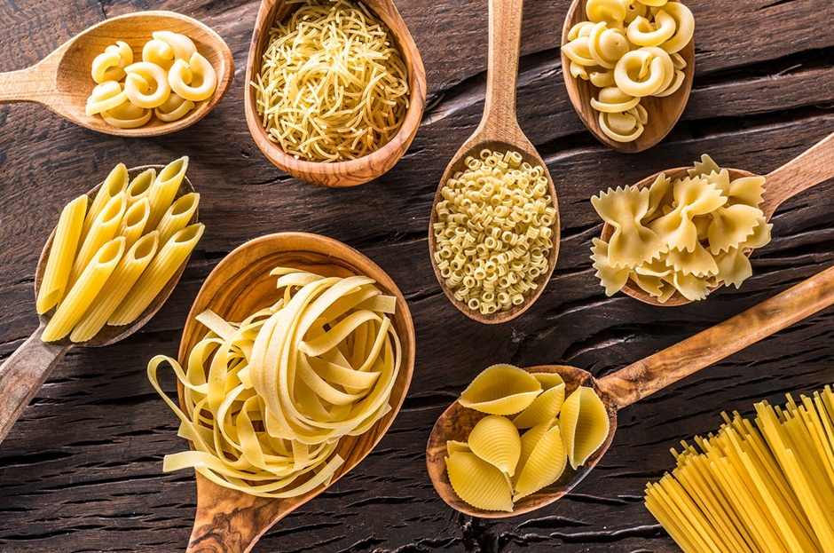

---
allergens:
  - gluten
tags:
  - vegetarian
  - vegan
  - dairy-free
  - make-ahead
  - one-pan
mentions:
  - bread-pasta/pasta
  - cuisine/italian/bolognese
  - cuisine/italian/gnocchi
  - cuisine/italian/lasagne
  - cuisine/italian/pesto
  - tutorials/pasta/dried-pasta
  - tutorials/pasta/fresh-pasta-dough
  - tutorials/pasta/matching-sauce-to-shape
  - tutorials/pizza/dough
  - tutorials/pizza/sauce
---

# Pasta Shapes

*Once you have the dough, you can take it in any number of directions. Ribbons (tagliatelle, fettucine, pappardelle), filled little pockets (ravioli, tortellini, cappelletti), hand-shaped curls (orecchiette, trofie, cavatelli). Each one has a region it comes from and a sauce that grew up alongside it.*

## Overview
Italy has hundreds of regional pasta shapes. Most cookery books focus on the big-name ribbon and filled pastas because those are what's possible at home with a pasta machine. This page covers the home-doable shapes; the regional hand-shaped pastas (orecchiette, trofie, cavatelli) are simple in concept but take practice.

The shapes split into three categories:
1. **Ribbons**, cut from a thin sheet of pasta dough.
2. **Filled**, sealed pockets of dough around a stuffing.
3. **Hand-shaped**, formed without a roller (orecchiette, trofie, gnocchi).

## Before You Start

You need [fresh pasta dough](fresh-pasta-dough.md), rested at least 30 minutes. The dough should be rolled to about 1-2 mm thick (the thinnest settings on a manual pasta machine; #7 or #8 of 9).

Work in batches: cut one sheet, transfer to a tray dusted with semolina (not flour; semolina stays drier and prevents the pasta from sticking), continue with the next sheet.

## Ribbon Pastas

The home pasta-maker's standard. A sheet of pasta dough cut into long strips of varying widths.

### Tagliatelle (5-8 mm wide)
The northern Italian standard. Hand-cut: roll the pasta sheet into a flat tube (like a swiss roll), use a sharp knife to slice across at 6 mm intervals, then shake the cut strips loose to reveal the ribbons.

Pair with: ragu (the Bolognese standard), creamy mushroom sauces, butter-and-sage.

### Fettucine (3-5 mm wide)
The Roman version, slightly narrower than tagliatelle. Same cut technique but at 4 mm intervals.

Pair with: alfredo (cream-and-parmesan), prawn sauces, simple butter.

### Pappardelle (2-3 cm wide)
The widest ribbon. Cut at 25 mm intervals. The ribbons are floppy and substantial.

Pair with: rich game ragu (boar, hare, beef shin), heavy sauces that need a wide canvas.

### Tagliolini (1-2 mm wide)
The narrowest ribbon. Cut at 1.5 mm intervals; this needs a very sharp knife or a tagliolini cutter on a pasta machine.

Pair with: delicate seafood sauces, broth-based preparations, truffle butter.

### Linguine (3 mm wide, oval cross-section)
Technically dried; pressed through a die into the oval shape. Possible as fresh by cutting tagliatelle thinner and rolling each strand slightly between palms.

### How to Cut Ribbon Pastas

1. Lightly dust the sheet of pasta with flour or semolina (both sides).
2. Roll the sheet loosely into a flat tube. The roll should be loose; tight rolls compress and stick.
3. With a sharp knife, slice the tube into ribbons of the chosen width.
4. Lift each batch of ribbons; shake gently to unfurl.
5. Place on a tray dusted with semolina, in nests, separated.
6. Cover with a tea towel until ready to cook.

If you have a pasta machine with cutting attachments, run the sheet through the appropriate cutter; the machine cuts cleanly without rolling.

## Filled Pastas

Two main families: stamped (cut from a sheet around a filling) and shaped (tied or folded by hand).

### Ravioli (Square or Round)

A square or round of dough enclosing a small mound of filling.

**Method:**
1. Roll out two sheets of pasta dough to 1 mm thick (the thinnest pasta machine setting).
2. On one sheet, pipe or spoon walnut-sized mounds of filling at 5 cm intervals, in rows.
3. Brush around each mound with beaten egg wash.
4. Lay the second sheet on top.
5. Press around each mound to seal, pushing out air.
6. Cut between the mounds with a sharp knife, fluted pastry wheel, or square ravioli cutter.

**Classical fillings:** ricotta and spinach, ricotta and pumpkin, mushroom and parmigiano, lobster, crab. See: [Crab Ravioli](../../cuisine/italian/crab-ravioli.md).

**Pair with:** brown butter and sage; light tomato; a delicate cream sauce. NOT a heavy ragu - the ravioli is the centrepiece, not the canvas.

### Tortellini (Folded Rings)

Small filled pastas folded into ring shapes. The shape comes from an emilian legend (it's said to mimic the navel of Venus).

**Method:**
1. Cut small squares (5 cm) from a thin pasta sheet.
2. Place a small dab of filling in the centre (pea-sized, not larger).
3. Fold corner to corner, making a triangle. Press to seal.
4. Bring the two long-edge corners around the filling and pinch them together at the back.

The result is a small ring with a fold across the top.

**Classical fillings:** prosciutto and mortadella (the bolognese), ricotta and parmigiano, mushroom.

**Pair with:** broth (tortellini in brodo is the classical), or a simple butter-and-sage.

### Cappelletti (Folded Hats)

A larger version of tortellini, with the fold making a "hat" shape (cappello = hat).

### Mezzelune (Half-Moons)

Round dough disc folded over filling. Simpler than tortellini; sometimes called "the lazy ravioli."

### Cannelloni and Manicotti

Sheets of pasta rolled around a filling and baked in a sauce. Larger, often pre-cooked rather than served boiled. See: [Cannelloni](../../cuisine/italian/cannelloni.md).

### Lasagne Sheets

Flat sheets used in layered baked pastas. See: [Lasagne](../../cuisine/italian/lasagne.md).

## Hand-Shaped Pastas

These don't go through a roller; they're formed by hand.

### Orecchiette ("Little Ears")
The signature pasta of Puglia. Small bowl-shaped pastas. Traditionally made with durum-and-water dough (no eggs), pressed and turned over the thumb.

**Method:**
1. Roll the dough into a thin rope, 1 cm diameter.
2. Cut into 1 cm sections.
3. Place each section on a floured bench. With your thumb (or the rounded end of a butter knife), press and drag the dough across the bench, then flip it inside-out over the thumb to form a bowl shape.

The bowls catch sauce. Pair with: [pasta-with-sprouting-broccoli](../../cuisine/italian/pasta-with-sprouting-broccoli.md), peas-and-pecorino, sausage ragu.

### Trofie
Genoese pasta. Hand-rolled into small spiralled twists.

**Method:** roll the dough into a 1 cm rope; cut into 2 cm sections; with the side of the hand, roll each section against the bench at an angle, creating a slight twist.

Pair with: pesto. The classical Genoese pairing.

### Cavatelli
Calabrian. Small ridged shells, made by pressing a thumb across a small dough section against a ridged board (or the back of a fork).

### Gnocchi (Potato Pasta)
Strictly potato-and-flour, not classical pasta dough, but lives in the same family. See: [Gnocchi](../../cuisine/italian/gnocchi.md).

## Storing Fresh Pasta

Fresh pasta is best cooked the day it's made. For storage:

- **Short term (same day):** lay on a semolina-dusted tray, cover with a tea towel. Cook within 4 hours.
- **Overnight:** lay on a tray, freeze for 1 hour to firm up, then transfer to a freezer bag. Cook from frozen; add 60-90 seconds to the cook time. Lasts 1 month frozen.
- **Drying:** lay tagliatelle or fettucine over a wooden dowel or chair back to dry for 24-48 hours. Once fully dry, store in an airtight container for 1-2 weeks.

## Common Mistakes

**The pasta sticks together.**
Not enough semolina dust, or the strips were laid touching each other. Dust generously; separate immediately after cutting.

**The pasta tears when lifted.**
Dough too thin, or under-rested so it lacks elasticity. Roll to a slightly thicker setting; rest the dough longer next time.

**The filled pasta bursts during cooking.**
Air trapped inside, or the seal wasn't tight. Press out air carefully when sealing; brush the edges with egg wash to help adhesion.

**The filling leaked out.**
Filling too wet, or too much per pocket. Drain the filling well before piping (especially ricotta); use less per pocket.

**The orecchiette won't stay bowl-shaped.**
The dough rope is too thin, or the press wasn't firm enough. Roll thicker (1 cm); use more wrist pressure when pressing-and-flipping.

## Where Next
- [Fresh Pasta Dough](fresh-pasta-dough.md): the master dough technique.
- [Matching Sauce to Shape](matching-sauce-to-shape.md): which sauce for which shape.
- [Dried Pasta](dried-pasta.md): the everyday alternative.
- [Pasta Course landing](pasta.md): back to the main course.
