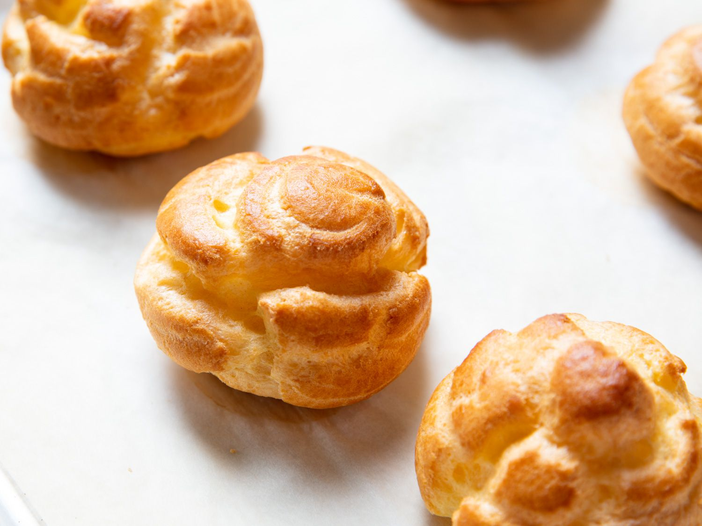

---
allergens:
  - gluten
tags:
  - vegetarian
  - vegan
  - dairy-free
---

# Choux Pastry

*Choux is the dough that gets cooked twice. First a quick boil-and-stir on the hob, then eggs beaten in off the heat, then into a hot oven where it puffs up into a hollow shell. It looks like a magic trick the first time you do it. Eclairs, profiteroles, paris-brest, savoury gougeres: same dough, different shapes.*

## Overview
Choux is a unique dough. It contains no leavening (no yeast, no chemical), yet it rises dramatically in the oven. The rise is entirely steam-driven: water and eggs flash to steam in the hot oven, the dough is elastic enough from the cooked starch and beaten eggs to inflate but not burst, and the result is a hollow puffed shell with a thin crisp crust.

The technique has two parts:
1. **Panade.** Water, butter and salt are brought to a boil. Flour is dumped in all at once. The dough is stirred vigorously over heat until it pulls away from the sides of the pan in a single ball. This cooks the starch and dries the dough out.
2. **Beating in eggs.** Off the heat, eggs are beaten in one at a time until the dough reaches the right consistency, judged by the ribbon test.

Both parts have to go right. The panade must be cooked enough; the eggs must be added in the right amount. The dough is then piped into shapes, baked at high heat to drive the rise, then dropped to a lower heat to dry the shell.

## The Recipe

For about 30 small puffs, 12 medium eclairs, or 1 large gateau ring.

### Ingredients
- 125 ml water
- 50 g unsalted butter
- 1 pinch fine sea salt
- 1 teaspoon caster sugar (optional, for sweet applications)
- 75 g plain flour (sifted)
- 2-3 medium eggs (lightly beaten in a jug)

## Method

### Stage 1 - Panade

1. In a heavy-based saucepan, combine the water, butter, salt and sugar.
2. Bring to a rolling boil. The butter must be fully melted before the boil; if it is not, the panade will not work.
3. Off the heat, tip in all the flour at once.
4. Stir vigorously with a wooden spoon. The mixture forms a thick lumpy paste, then quickly comes together into a smooth ball.
5. Return to a low heat. Continue stirring for 1-2 minutes. The paste should pull cleanly away from the sides and base of the pan, leaving a thin film of dough on the pan bottom (the "membrane" test).
6. Transfer to a bowl. Let it cool for 5 minutes; the dough should be warm but not hot enough to scramble eggs.

### Stage 2 - Eggs

1. Crack 2 eggs into a small jug. Beat lightly. Crack a third egg into a separate small bowl, beat, and reserve.
2. Pour about a third of the 2-egg mixture into the warm panade.
3. Beat hard with a wooden spoon. The dough breaks up into ugly slimy lumps at first. Keep beating; it comes back together into a smooth shiny paste.
4. Add another third. Beat in.
5. Add the rest of the 2-egg mixture. Beat in.

At this point, test consistency with the ribbon test:
1. Lift the wooden spoon out of the dough.
2. Watch how the dough falls.
3. The dough should fall in a slow ribbon that drops a "V" shape from the spoon as it goes. If the V drops within 2-3 seconds and disappears smoothly into the rest, the consistency is right.

If the ribbon does not form (dough falls in a thick lump, no V): the dough is too dry. Beat in some of the reserved third egg, a tablespoon at a time, testing after each addition.

If the dough is runny and slumps off the spoon without holding any shape: the dough is too wet. There is no recovery; the panade absorbs only so much liquid. Start over with a slightly drier panade next time.

The reserved third egg lets you titrate the consistency rather than crack a whole egg at risk of overshoot.

## Piping

Transfer to a piping bag fitted with a plain or star nozzle (8-10 mm for puffs and eclairs; 12 mm for larger pieces). Line a baking sheet with parchment.

### Profiteroles (Small Puffs)
- Plain nozzle. Pipe walnut-sized blobs, well spaced.
- The peak left by the nozzle should be smoothed down with a wet fingertip; otherwise it browns to a point.

### Eclairs
- Plain or star nozzle. Pipe straight 12-15 cm lengths, well spaced.
- Cut the end of the piped line with a wet knife so it does not trail.

### Paris-Brest
- Star nozzle. Pipe a ring (about 18 cm diameter) directly on the parchment.
- Pipe a second concentric ring inside, touching the first.
- Pipe a third ring on top, sitting in the groove between the first two.
- Three rings of choux that share walls; bakes into a hollow ring.

### Gougeres (Savoury Cheese Puffs)
- Plain nozzle, walnut-sized. Add 75 g grated gruyere to the panade before adding eggs. Salt a touch more.

## Baking

Choux needs a fierce initial blast then a slow dry.

1. Preheat the oven to 200 C (180 fan).
2. Brush the piped choux with beaten egg, smoothing any peaks with the brush.
3. Bake at 200 C for 15-20 minutes. The pastries puff dramatically in the first 8-10 minutes; do not open the oven during this period or the rise collapses.
4. Drop the temperature to 170 C (150 fan). Bake another 15-20 minutes, until deeply golden and hollow-sounding when tapped.
5. Pierce the side of each puff with the tip of a knife to release steam. Return to the oven for 5 more minutes with the door cracked, so the interior dries fully.
6. Cool on a wire rack.

The piercing step is the difference between a hollow crisp shell and a soggy collapsed one. Most home choux failures are at this step (or the lack of it).

## Fillings

Choux is a vessel; it has no flavour of its own. Fill it with:

- **Creme patissiere** (vanilla pastry cream): the classic profiterole or eclair filling. See [creme patissiere](../../baking/cremes/creme-patissiere.md).
- **Chantilly cream** (sweetened whipped cream): the lighter filling for cream puffs.
- **Ice cream**: the profiterole's most decadent partner.
- **Praline cream** (praline + creme patissiere): the classic paris-brest filling.
- **Savoury custards or mousses**: gougeres are usually eaten plain, but can be split and filled with smoked salmon mousse, foie gras, etc.

## Common Mistakes

**The choux did not rise.**
Either the panade was under-cooked (too wet, no membrane), the dough was too wet from too many eggs, or the oven was opened during the first 10 minutes. Each one stops the rise dead.

**The choux rose then collapsed.**
Pulled from the oven too early. Bake longer, and pierce-and-return for the final drying step.

**The interior is wet and doughy.**
Under-baked, or not pierced after baking. Always pierce; always dry in the cracked oven.

**The exterior is flat and lopsided.**
Egg wash too thick, smoothing the peaks unevenly. Apply lightly with a soft brush.

**The dough was too thick to pipe.**
Not enough egg. Beat in some of the reserved third egg.

**The dough was too thin to pipe.**
Too much egg. There is no recovery; bake what you have as drop-shaped puffs and start over for piped shapes next time.

**The puffs cracked along the sides.**
Oven too hot. Drop the initial temperature to 190 C.

**The bottoms are dark.**
Pastry too close to the bottom of the oven, or sheet placed directly on a hot stone. Use a fresh cool sheet; middle rack.

## Where Next
- [Sweet Short Pastry](sweet-short.md): the patisserie tart base, often paired with choux in composite desserts.
- [Choux Pastry recipe](../../baking/pastry/choux-pastry.md): canonical recipe.
- [Creme Patissiere](../../baking/cremes/creme-patissiere.md): the classic choux filling.
- [Profiteroles](../../cuisine/french/desserts/profiteroles.md): the canonical finished dessert.
- [Pastry Course landing](pastry.md): back to the main course.
