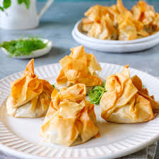

# Filo Pastry

*Paper-thin stretched dough, layered with butter or oil between sheets, then baked or fried into the shatteringly-crisp wraps of the Mediterranean and Middle East. Spanakopita, bourekas, baklava, b'stilla, strudel. Almost no one makes their own; the technique is in the assembly, not the dough.*

## Overview
Filo (phyllo, phylo, yufka, yufak: same dough across the Mediterranean and Middle East) is the thinnest pastry in any tradition. A single sheet, properly stretched, is translucent. Twenty sheets stacked are about 5 mm thick. Baked, they shatter into the most delicate flaky crust.

The dough itself is just flour, water, salt and a little oil. It is the stretching that takes skill: a small ball is rolled, then stretched over the back of the hands until it is as wide as a tablecloth and thin enough to read newsprint through. The traditional Turkish yufka maker can do this in 90 seconds. A first-time home cook would take 30 minutes and probably tear the sheet.

For this reason, almost no one makes their own filo. Shop-bought is excellent, comes in 400 g packs of 12-15 sheets, costs little, and is the standard in every Greek-Turkish-Lebanese-Levantine kitchen. The skill that matters is the assembly: handling the fragile sheets, layering with butter or oil, and baking to the right colour.

## Where to Buy

Look in the chilled or frozen section of supermarkets, or Middle Eastern and Greek delis. The most common UK brand is "Jus-Rol", though specialist brands (Antoniou, Tipiak, the various Turkish brands) are noticeably better. Indian shops sometimes carry hand-stretched filo of remarkable quality.

The pack contains roughly 12-15 sheets, each about 30 x 50 cm. Thawed filo keeps 4-5 days in the fridge; once opened it dries out within a day.

If you want to make it yourself, see [Filo Pastry recipe](../../baking/pastry/filo-pastry.md). Use a clean cloth-covered table and a long thin rolling pin (oklava in Turkish).

## The Core Rule: Keep It Covered

This is the single most important thing to know. Filo sheets dry out in about 3 minutes once exposed to air. A dry sheet crumbles, cracks and tears the moment you try to fold it.

Workflow:
1. Open the pack of filo on the counter.
2. Cover with a slightly damp clean tea towel (not wet; just damp).
3. Peel off one sheet at a time as you need it.
4. Re-cover the stack between sheets.

No exceptions. Even taking three sheets at once will partially dry the third while you handle the first.

## The Brush: Butter or Oil

Each filo sheet needs a thin coat of fat between it and the next sheet. The fat keeps the sheets distinct during the bake (so they stay flaky) and seasons the pastry.

**Butter:** the classic choice for Greek and Turkish sweet pastries (baklava, kataifi, galaktoboureko). Melt 100-150 g unsalted butter, brush each sheet thinly. Some recipes use clarified butter (ghee or sade yag) for a higher-temperature bake without burning.

**Olive oil:** the classic for savoury Greek and Levantine pies (spanakopita, tyropita, bourekas). Use the best olive oil you can; it is a major flavour. About 100 ml total for a tray.

**Mixed:** half olive oil, half butter. Common for "modern" pastries that want some butter flavour but less weight.

Apply with a soft brush, lightly. Heavily-buttered filo bakes greasy, not crisp.

## Three Assembly Patterns

### 1. Tray-Layered (Baklava, Galaktoboureko, Spanakopita)

The dish is filled with stacked sheets of filo on either side of a filling.

1. Brush the base of a baking dish with butter.
2. Lay one sheet of filo in the dish, fold or trim to fit. Brush with butter.
3. Repeat for 8-10 sheets. This is the base layer.
4. Add the filling (nut paste for baklava, custard for galaktoboureko, spinach-and-feta for spanakopita).
5. Lay another 8-10 sheets on top, each brushed.
6. Trim or tuck overhanging edges.
7. Score the top into portions before baking (otherwise the bake-set pastry tears the filling apart when cut).

### 2. Cigar / Pinwheel (Bourekas, Cigars, Roulade)

A long thin filo sheet rolled around a filling.

1. Lay one filo sheet on the bench, brush with butter.
2. Fold in half along the long edge (a double-thick rectangle).
3. Place a thin line of filling along one short edge, leaving 2 cm clear at top and bottom.
4. Fold the short sides in.
5. Roll up tightly from the filling edge to form a cigar 12-15 cm long.
6. Place seam-side down on a tray.

### 3. Triangular Parcels (Spanakopita Triangles, Sambousek)

Filo sheet cut into long strips and folded into triangles like a flag.

1. Lay one filo sheet, brush with butter.
2. Cut into long strips 8 cm wide.
3. Place a teaspoon of filling on the bottom-right corner of a strip.
4. Fold the filling corner up to the left edge, creating a triangle.
5. Fold straight up.
6. Fold the new bottom corner to the right edge, making another triangle.
7. Continue folding flag-style up the strip until you reach the end.
8. Brush the outside with butter, place seam-side down on a tray.

## Baking

Filo bakes at moderate heat. Too hot and the outer layers burn before the centre cooks; too cool and the layers do not crisp.

- Tray-layered: 170-180 C for 30-45 minutes (longer for big trays with wet fillings).
- Cigars and triangles: 180-190 C for 20-25 minutes.
- Brush the top with extra butter halfway through for deep colour.

For sweet pastries that get a syrup (baklava, galaktoboureko): pour the cooled syrup over the pastry while the pastry is still hot from the oven. The contrast between hot pastry and cool syrup gives the best soak; reversed (cold pastry, hot syrup) produces a soggy result.

## Filo vs Puff: When to Use Which

| | Filo | Puff |
|---|---|---|
| Texture | Many distinct flaky layers, shatters | Tall puffed layers, lifts dramatically |
| Skill | Easy if you can keep sheets covered | Hard; full lamination is a half-day project |
| Suitable for | Pies, tarts, wrapped fillings, baklava | Vol-au-vents, mille-feuille, palmiers, sausage rolls |
| Buttering | Brush each sheet | Built into the dough |
| Bake heat | Moderate, 170-180 C | High, 200-220 C |
| Rise | Minimal (it gets crispy, not tall) | Major (4-5x rise) |

In short: filo for layered flatness, puff for height.

## Common Mistakes

**The filo cracked when folded.**
Dried out. Cover the stack with a damp towel and work faster.

**The pastry came out greasy.**
Too much butter brushed on each sheet. Apply a thin coat; you should see the sheet through the butter, not the butter over the sheet.

**The baklava is soggy.**
Hot syrup on hot pastry, or pastry that did not fully bake before saturation. Cool the syrup completely; bake the pastry to deep gold first.

**The pie filling leaked.**
Too few base layers. Wet fillings need at least 8 layers underneath them to prevent leak-through.

**The middle is pale, the edges are dark.**
Oven runs hot at the edges. Rotate the tray halfway through; reduce temperature by 10 C.

**The pastry has soggy patches between crispy ones.**
Uneven buttering. Brush each sheet edge-to-edge, including the corners.

**The pastry tastes oily, not buttery.**
Used regular salted butter without clarifying it (or used poor-quality olive oil for a butter recipe). Use unsalted butter; consider clarifying for sweet pastries.

## Where Next
- [Puff and Rough Puff](puff.md): the laminated alternative.
- [Baklava](../../cuisine/turkish/desserts/baklava.md): the canonical layered filo dessert.
- [Spanakopita](../../cuisine/greek/spanakopita.md): the spinach-and-feta classic.
- [Filo Pastry recipe](../../baking/pastry/filo-pastry.md): if you want to make your own.
- [Pastry Course landing](pastry.md): back to the main course.
