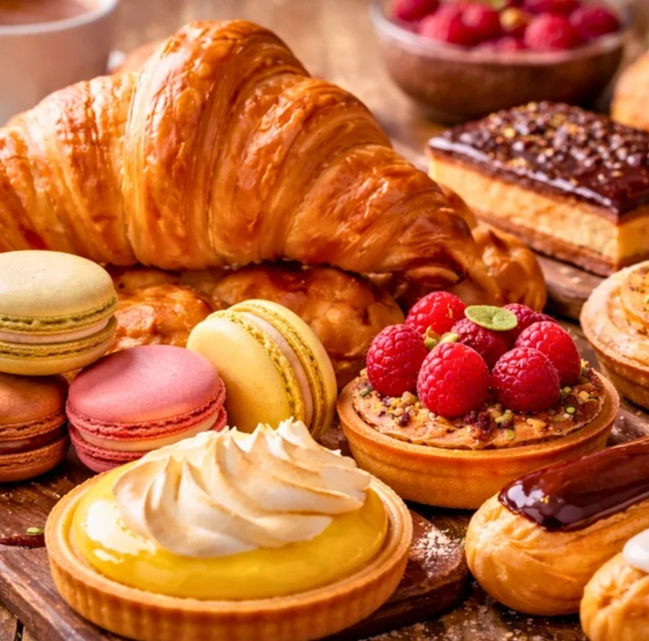

# Pastry Course

*A course on the doughs that underpin patisserie. Shortcrust holds a tart; puff and rough puff lift a vol-au-vent; choux puffs into eclairs and profiteroles; laminated croissant dough yields layered breakfast pastries; filo wraps the Mediterranean and Middle Eastern world. Six doughs, five techniques, dozens of finished bakes.*

## Overview
Pastry sits between bread and cake. Bread is leavened; cake is aerated chemically. Pastry is layered, laminated or rubbed-in to deliver crispness, shortness or flakiness, with butter (or another solid fat) doing most of the structural work. Get the fat-handling right and the dough behaves; get it wrong and the pastry is tough, greasy or collapses.

Six doughs cover almost everything you will meet. Each has one critical handling rule. Once you know which rule applies to which dough, the recipes themselves become almost incidental.

## Course Outline

### Short Doughs (Fat Rubbed Into Flour)
- [Shortcrust Pastry](shortcrust.md): the everyday tart and pie base. Sweet, savoury, sturdy, blind-bake-able.
- [Sweet Short Pastry](sweet-short.md): pate sucree. Sugar in the dough, biscuit-like, the patisserie standard for fruit tarts and tartlets.

### Laminated Doughs (Butter Folded Through Layers)
- [Puff and Rough Puff](puff.md): vol-au-vents, mille-feuille, the leg of every tarte fine. Hundreds of paper-thin layers.
- [Croissant and Danish](croissant-and-danish.md): puff plus yeast plus eggs. The breakfast-pastry family.

### Paste Doughs (Cooked or Stretched)
- [Choux Pastry](choux.md): the doubly-cooked dough that puffs into eclairs, profiteroles, gougeres and paris-brest.
- [Filo Pastry](filo.md): the paper-thin stretched sheet that wraps baklava, spanakopita, bourekas and strudel.

## Master Recipes
These are the recipes the course refers back to:

- [Shortcrust Pastry](../../baking/pastry/shortcrust-pastry.md): the everyday savoury base.
- [Sweet Short Pastry](../../baking/pastry/sweet-short-pastry.md): pate sucree.
- [Flan Pastry](../../baking/pastry/flan-pastry.md): a slightly richer sweet short.
- [Puff Pastry](../../baking/pastry/puff-pastry.md): full classical lamination.
- [Rough Puff Pastry](../../baking/pastry/rough-puff-pastry.md): the cheat's version, 80% of the puff in 30% of the time.
- [Croissant Dough](../../baking/pastry/croissant-dough.md): the master enriched laminated dough.
- [Choux Pastry](../../baking/pastry/choux-pastry.md): the master cooked-paste dough.
- [Filo Pastry](../../baking/pastry/filo-pastry.md): the stretched sheet.
- [Brioche Dough](../../baking/pastry/brioche-dough.md): enriched, not laminated. Covered in the bread course under [Enriched Doughs](../bread/enriched-doughs.md).
- [Shortbread Dough](../../baking/pastry/shortbread-dough.md): the biscuit variant.

## The One Critical Rule for Each Dough

| Dough          | The rule                                          |
|----------------|---------------------------------------------------|
| Shortcrust     | Keep the butter cold and the handling minimal.    |
| Sweet short    | Same as shortcrust, plus rest in the fridge.      |
| Puff           | Cold dough, cold butter, no melt during lamination. |
| Rough puff     | Generous chunks of butter folded, not creamed in. |
| Croissant      | Cold during lamination, warm during proof.        |
| Choux          | Beat the eggs in gradually until ribbon, not soup.|
| Filo           | Cover the unused sheets; they dry out in minutes. |

## Where to Start
- New to pastry: [Shortcrust](shortcrust.md) first. The everyday workhorse and the foundation for understanding fat-in-flour.
- Want flaky: [Rough Puff](puff.md) is a faster route to layered pastry than full classical lamination.
- Want patisserie: [Sweet Short](sweet-short.md) then [Choux](choux.md). The two doughs that build most of the French canon.
- Want filo: [Filo Pastry](filo.md). Skip the cooking and buy good shop-bought; the technique is in the assembly.

## Where Next
- [Bread course](../bread/bread.md): brioche (enriched bread) sits at the border of pastry.
- [Pizza course](../pizza/pizza.md): pizza dough is a third dough family altogether (yeasted, low-fat).
- [Stocks and Sauces course](../stocks-sauces/stocks-sauces.md): a savoury tart needs a sauce; the sauce course covers what to fill the pastry with.
