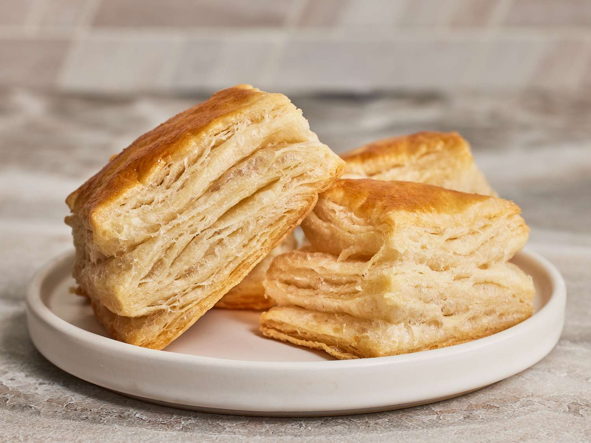

# Puff and Rough Puff

*Hundreds of paper-thin layers, butter folded between every one, puffing tall and crisp under high heat. Classical puff is a half-day project, quietly meditative. Rough puff is the home-cook compromise: chunk the butter in rather than laminate it, and you get most of the magic for a fraction of the work.*

## Overview
Puff pastry works on physics, not chemistry. Cold butter is folded into a thin dough, then rolled out and folded again, and again, and again. By the end of the process you have somewhere between 300 and 1500 alternating layers of dough and butter, each only a few microns thick.

When the pastry hits a hot oven, the water in the dough turns to steam, which pushes the layers apart. The butter melts simultaneously and is absorbed into the surrounding dough. The result is a tall, crisp, multi-layered pastry that lifts to four or five times its raw thickness.

The skill is keeping the butter cold and distinct throughout the lamination. Warm butter merges into the dough and the layering is lost; cold butter stays as discrete sheets between the dough layers.

## Two Approaches

### Classical Puff (Pate Feuilletee)

The patisserie standard. Six "turns" (each turn is fold + roll-out), totalling 729 dough layers when finished. Takes 3-4 hours of work spread across most of a day, with chill times between turns.

### Rough Puff (Pate Feuilletee Rapide)

The home cook's compromise. Chunks of cold butter are tossed into the dough at the start, rather than laminated in. The dough is rolled and folded 3-4 times. Faster, less consistent, but produces 80% of the rise and most of the flakiness for 30% of the effort.

This page covers both. Decide which to use by what you are making:
- Vol-au-vents, mille-feuille, pithivier, palmiers, tarte fine: classical puff. The presentation demands the height.
- Sausage rolls, savoury turnovers, cheese straws, beef wellington: rough puff is plenty.

## Classical Puff Method

For about 750 g finished pastry.

### Ingredients

**The detrempe (base dough):**
- 250 g strong bread flour
- 250 g plain flour
- 200 ml cold water
- 1 tablespoon white wine vinegar (relaxes the gluten)
- 1 tablespoon melted butter (just to lubricate)
- 1 teaspoon fine sea salt

**The butter block (beurrage):**
- 350 g unsalted butter (good quality, high-fat European)

### Method

**Day 1 morning - Make the detrempe.**
1. Combine flours and salt in a large bowl.
2. Mix the water, vinegar and melted butter in a jug.
3. Make a well in the flour, add the liquid, mix to a rough dough.
4. Knead briefly (2 minutes) to bring together. Do not over-develop the gluten.
5. Cut a cross in the top, wrap, refrigerate 1 hour.

**Day 1 morning - Make the butter block.**
1. Take the 350 g butter from the fridge. It needs to be cold but pliable.
2. Place between two sheets of greaseproof paper.
3. Beat with a rolling pin into a flat square, about 15 x 15 cm.
4. Wrap, refrigerate until the detrempe is ready.

**Day 1 - Enclose the butter (the envelope fold).**
1. Roll the detrempe into a cross shape: a central square slightly larger than the butter block, with four flat flaps extending outward.
2. Place the butter block in the centre.
3. Fold the flaps over the butter, sealing it inside like an envelope.
4. Press the edges with the rolling pin to seal.
5. You now have a small square parcel with butter completely enclosed.

**Day 1 - First turn (a "letter fold" or "single turn"):**
1. With the seam underneath, roll the parcel into a rectangle three times as long as wide.
2. Fold in thirds like folding a letter: bring the top third down, then the bottom third up over it.
3. Rotate 90 degrees so the open seam is on the right.
4. Wrap and refrigerate 30 minutes.

That is one turn. The dough now has 3 layers of butter and 4 layers of dough.

**Day 1 - Second turn (another single turn):**
Same as above. Now 9 layers of butter, 12 layers of dough. Refrigerate 30 minutes.

**Day 1 afternoon - Third and fourth turns:**
Same again. After turn 3: 27 / 36 layers. After turn 4: 81 / 108. Refrigerate 30 minutes between.

**Day 1 evening - Fifth and sixth turns:**
After turn 5: 243 layers butter, 324 dough. After turn 6: 729 layers butter, 972 dough.

The dough is now ready. Wrap, refrigerate overnight. Use within 3 days, or freeze in 250 g portions for up to 3 months.

### Critical Rules for Classical Puff

- **Cold everything.** Detrempe out of the fridge cold. Butter cold but pliable. Bench cold (a marble slab if you have one). Work fast between turns; if the butter starts to soften, refrigerate immediately.
- **Same direction every turn.** Each turn starts with the open seam on the right. This means you are rolling in the same direction each time, which spreads the layers evenly.
- **Even pressure on the rolling pin.** Uneven rolling makes the layers thicker on one side; the bake comes out lopsided.
- **No skipped rests.** Every 30 minutes of rest is non-negotiable. Working too soon means the gluten resists; the dough tears, butter pokes through.

## Rough Puff Method

For about 500 g finished pastry, taking about 1 hour active time.

### Ingredients
- 250 g plain flour
- 200 g unsalted butter (cold, cubed into 1 cm pieces)
- 1/2 teaspoon fine sea salt
- 120 ml cold water

### Method

1. In a large bowl, combine flour and salt.
2. Add the cold butter cubes. Do NOT rub in; you want the cubes to stay intact.
3. Toss with your hands so each butter cube is coated with flour.
4. Add the cold water. Mix with a butter knife until a shaggy, lumpy dough forms with visible butter chunks. Do not knead.
5. Tip onto a lightly floured bench. Form into a rough rectangle.
6. **Turn 1:** Roll the rectangle out to 3 times its length. Fold in thirds (letter fold). Rotate 90 degrees.
7. **Turn 2:** Roll out again, fold again, rotate. Refrigerate 20 minutes.
8. **Turn 3:** Roll, fold, rotate.
9. **Turn 4:** Roll, fold. Refrigerate 30 minutes before use.

The butter chunks become flatter and more sheet-like with each fold. By turn 4 you have something close to laminated dough, just less uniform.

## Rolling and Cutting

Take the rested pastry from the fridge. Roll on a lightly floured surface to 3-4 mm thick (puff is rolled thinner than other pastries; the rise will easily multiply the thickness).

Cut with a very sharp knife or pastry wheel pressed straight down. Do not drag the blade or twist; both seal the layers shut and the cut edge will not puff.

For vol-au-vents and other shapes that need to rise straight up: cut, then refrigerate 30 minutes before baking. Cold pastry rises taller and straighter.

## Baking

Puff pastry needs a hot oven and steam.

- Oven temperature: 200-220 C. Higher than most other bakes.
- Position: middle rack, hot air all around the pastry.
- Steam: most domestic ovens have enough internal humidity from the pastry itself. For dramatic puff, place an empty oven dish on the bottom rack as you preheat, then pour 250 ml of boiling water into it just before loading the pastry.
- Time: 15-20 minutes for small pieces (palmiers, vol-au-vents), 25-35 minutes for larger pieces (mille-feuille, pithivier).
- The pastry is done when deeply golden across the entire surface and the centre is no longer pale or doughy.

## Egg Wash

For glossy golden tops, brush the rolled pastry with beaten egg yolk diluted with 1 teaspoon water. Apply with a soft brush. Do NOT let the egg wash drip down the cut edges; it seals the layers shut and they will not puff.

## Common Mistakes

**The pastry did not rise.**
Either the butter melted during lamination (no layers left) or the oven was too cool. Check oven temperature with a thermometer.

**The pastry rose unevenly.**
Uneven rolling, or the rest steps were skipped and the dough was under tension. Always rest after each turn.

**The pastry rose then collapsed.**
Removed from the oven too early. Pastry needs to be cooked through to the centre or it sinks as it cools.

**Butter leaks out during the bake.**
Detrempe and butter block were not at the same temperature when enclosed. They tear apart unevenly during rolling. Next time bring both to the same softness before the envelope fold.

**The dough is greasy and hard to roll.**
Butter has gone too warm. Refrigerate immediately for 30 minutes before continuing.

**The bottom is soggy.**
Pastry was placed on a cold tray, or the filling soaked through. Use a preheated baking sheet; egg-wash the inside of a filled pastry before baking.

## Where Next
- [Croissant and Danish](croissant-and-danish.md): laminated dough with yeast and eggs, the enriched cousin.
- [Choux Pastry](choux.md): completely different cooked-paste dough.
- [Puff Pastry recipe](../../baking/pastry/puff-pastry.md): canonical full lamination recipe with exact quantities.
- [Rough Puff Pastry recipe](../../baking/pastry/rough-puff-pastry.md): the cheat's-version recipe.
- [Pastry Course landing](pastry.md): back to the main course.
