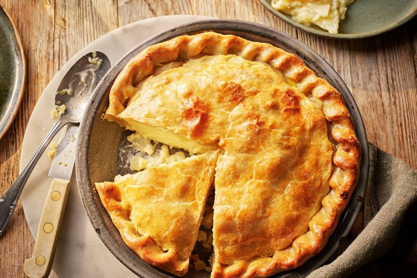

---
allergens:
  - gluten
tags:
  - vegetarian
  - vegan
  - dairy-free
---

# Shortcrust Pastry

*Shortcrust is the friendly workhorse of pastry. Half flour, half cold butter, a splash of water, almost no handling. Once you get the rub-in into your fingers and the cold-everything rule into your bones, you can make a tart, a pie or a quiche without much fuss. It's a forgiving dough as long as you stop fiddling with it.*

## Overview
Shortcrust gets its name from its texture: short, meaning crumbly and tender rather than chewy or flaky. The shortness comes from butter coating the flour particles so the gluten can never fully develop. The crumbly bite is the result of pockets of fat between layers of flour-and-water; the lack of gluten means the dough sits down rather than shrinking back when rolled.

The dough has six ingredients (sometimes five) and two techniques. Get them right and the pastry holds its shape, blind-bakes cleanly and tears tenderly under the fork. Get them wrong and the result is either greasy and tough (over-mixed) or sandy and crumbly (under-bound).

## The Ratio

Classical proportions for a savoury shortcrust:

- 250 g plain flour
- 125 g butter (cold, cubed)
- 60 ml cold water
- 1 pinch fine sea salt

This is the 2:1:0.5 ratio: flour, butter, water by weight. It scales perfectly. For a 22 cm tart shell you need about 250 g total; for a deep pie or a tarte du jour use 350-400 g.

Variations:
- **Half-and-half lard and butter** (the classic British pie pastry): swap 50 g of the butter for an equal weight of lard or beef suet. Gives a flakier, sturdier crust.
- **Whole-egg shortcrust**: replace the water with 1 small egg plus a tablespoon of water. Richer, slightly more golden, slightly more cake-like.
- **Wholemeal shortcrust**: replace 50 g of the plain flour with wholemeal. Nuttier, slightly heavier, holds a savoury filling well.

## The Method (Rub-In)

The classic hand method. It is also the most reliable because you can feel the fat-flour ratio shift in your fingers.

### Step 1 - Prepare

Cube the butter into 1 cm pieces. Place in a small bowl in the fridge for 10 minutes until very cold. Sift the flour into a large bowl with the salt.

The single most common shortcrust failure is butter that has warmed up by the time it meets the flour. Cold is non-negotiable.

### Step 2 - Rub In

Tip the cold butter cubes into the flour. Using your fingertips (not palms; palms are warm), pick up small pinches of butter-and-flour and rub them between your thumb and three fingers, releasing the mixture back into the bowl.

Continue until the mixture looks like coarse breadcrumbs, with no butter pieces larger than a small pea. You want some 5 mm fragments of butter still visible; these are what give the finished pastry its short texture. A bowl with no visible butter has been over-rubbed; the pastry will be tough.

Time: 3-5 minutes by hand. If your hands feel warm, dip them in cold water and dry them between rubs.

### Step 3 - Bind

Add 4 tablespoons of cold water. Using a butter knife or palette knife (not your hands; not yet), cut through the dough in a series of strokes, turning the bowl. The water disperses through the crumbs.

Tip the contents onto a lightly floured work surface. Bring it together with one or two firm presses with the heel of your hand, just until it forms a rough ball. Do not knead. Do not knead. Do not knead.

If the dough is still cracking and dry, add another 1 tablespoon of water. If it is sticky, dust with a teaspoon of flour. The right consistency is a dough that holds together when pressed but still shows pebbly butter speckles on the surface.

### Step 4 - Rest

Wrap in cling film, press into a flat disc (not a ball; a disc rolls out faster). Refrigerate for at least 30 minutes, ideally 1 hour. The rest lets the gluten relax and the water distribute evenly, so the dough does not shrink during baking.

Cold-rested dough also rolls out without sticking. Warm dough cracks and tears.

## The Method (Food Processor)

Faster, more consistent, slightly less feel. Equally good results if you watch the pulse.

1. Place 250 g flour and a pinch of salt in the bowl. Pulse twice to combine.
2. Add 125 g cold cubed butter. Pulse 8-10 times, 1 second per pulse, until the mixture looks like coarse breadcrumbs with pea-sized butter fragments.
3. With the motor running, pour 4 tablespoons of cold water through the feed tube. Stop the moment the dough starts to clump (5-10 seconds). Do not let it form a ball in the bowl; that means over-mixed.
4. Tip onto a lightly floured bench. Press together with the heel of the hand. Wrap, chill, rest as above.

## Rolling

Take the chilled disc from the fridge. Dust both sides with flour. Place on a lightly floured surface or a sheet of cling film (cling film is faster for fragile doughs).

Roll outward from the centre in short strokes, rotating the disc a quarter turn between strokes. The disc stays roughly circular and the thickness stays even. Do not push down too hard or the butter spots will smear; you want them to stay as discrete bits.

Aim for 3-4 mm thick for a tart shell, 5 mm for a robust pie crust.

Lift the dough by rolling it loosely around the rolling pin, then unrolling onto the tart tin. Press gently into the corners; do not stretch (stretched dough shrinks back during the bake). Run the rolling pin across the top of the tin to trim the overhang. Refrigerate the lined tin for another 30 minutes before baking; this prevents shrinkage.

## Blind Baking

Most shortcrust applications need the shell pre-baked before adding a wet filling. Otherwise the bottom stays raw and the filling soaks through.

1. Line the chilled shell with a piece of baking paper, scrunched and unscrunched first so it folds into the corners easily.
2. Fill with baking beans (ceramic, dried beans, rice, or coins).
3. Bake at 190°C for 15 minutes. Lift out the paper and beans.
4. Return to the oven for 5-7 minutes until the base is dry and pale gold. This is "par-baked".
5. For a fully baked shell (e.g. a no-bake filling): continue another 7-10 minutes until deeply golden.
6. Cool on a rack before filling.

## Troubleshooting

**The dough cracks and tears when rolling.**
Under-hydrated, or rolled while too cold straight from the fridge. Let the dough sit on the bench for 5-10 minutes to take the chill off before rolling.

**The dough is sticky and unrolllable.**
Over-hydrated, or warmed up. Dust generously with flour, refrigerate 15 minutes, try again.

**The pastry is tough and chewy.**
Over-handled. The gluten developed. Next time stop the rub-in earlier and use a knife to mix in the water rather than hands.

**The pastry is greasy and pale.**
The butter melted before the dough went into the oven. Either the kitchen is too warm, or the dough was not rested enough. Chill the lined tin for an extra 30 minutes before baking next time.

**The shell shrunk away from the sides of the tin.**
Insufficient rest, or the dough was stretched into the tin rather than gently pressed. Both cause the gluten to spring back during bake. Rest longer; press, do not stretch.

**The bottom is soggy.**
Wet filling on under-blind-baked shell. Either par-bake longer, or brush the par-baked shell with egg-wash and return to the oven for 2 minutes before filling; the egg seals the surface against moisture.

**The pastry tastes flat.**
Under-salted. Even sweet pastry wants a small pinch of salt to balance the butter. Try 1/2 teaspoon per 250 g flour next time.

## Where Next
- [Sweet Short Pastry](sweet-short.md): the patisserie variant, sweeter and shorter.
- [Puff and Rough Puff](puff.md): the laminated cousin, totally different technique.
- [Pastry Course landing](pastry.md): back to the main course.
- [Shortcrust Pastry recipe](../../baking/pastry/shortcrust-pastry.md): the canonical recipe with exact quantities.
