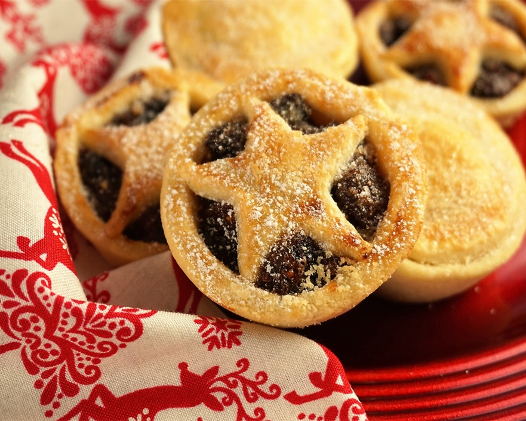

# Sweet Short Pastry

*Pate sucree is shortcrust's dressier cousin. Sugar in the dough gives it a biscuit-snap when baked, an egg gives it richness, and the case it makes is the one you see under every glossy fruit tart in a patisserie window. A little fussier to handle than plain shortcrust, but the pay-off is real.*

## Overview
Sweet short (pate sucree, or pate sablee at its richest) is the dessert cousin of shortcrust. The difference is sugar. Sugar makes the dough behave differently: it browns more deeply, it tenderises further, and it makes the dough more fragile to handle. The pay-off is a finished case with a snap-when-bitten, almost-biscuit texture that holds creams and fruit beautifully.

The basic ratio shifts. Classical pate sucree is roughly:

- 250 g plain flour
- 125 g butter (cold, cubed)
- 100 g icing sugar
- 1 medium egg
- 1 small pinch fine sea salt
- 1/2 teaspoon vanilla extract (optional)

Notice: more sugar than water (the egg replaces the water of shortcrust), the use of icing sugar (caster sugar leaves a slight grit), and the explicit vanilla. Some recipes add a tablespoon of ground almonds for richness; others use only egg yolks for a deeper colour. Variations are the rule, not the exception.

## The Two Methods

Two classical ways to mix the dough: the rub-in (like shortcrust) and the cream-in (like cake). They produce slightly different textures.

### Method 1: Rub-In (Pate Brisee Sucree)

Like shortcrust but with sugar added. Crumblier, more rustic.

1. Sift flour, icing sugar and salt into a large bowl.
2. Add cold cubed butter. Rub in until the mixture resembles coarse breadcrumbs with small butter speckles.
3. Beat the egg lightly with the vanilla in a small bowl.
4. Make a well in the centre. Add the beaten egg.
5. Use a butter knife to cut the egg through the dry mix.
6. Bring together by hand, pressing once or twice. Do not knead.
7. Wrap, flatten to a disc, chill 1 hour.

### Method 2: Cream-In (Pate Sucree)

Cream butter and sugar first, then add flour. Smoother, more uniform, less crumbly. The patisserie standard.

1. Beat 125 g soft butter with 100 g icing sugar until pale and creamy (2-3 minutes with a wooden spoon or stand mixer).
2. Beat in the egg until smooth.
3. Add 1 teaspoon vanilla. Stir.
4. Sift in 250 g flour. Fold gently with a spatula until just combined; the dough should be soft and slightly sticky.
5. Turn onto a lightly floured surface. Bring together quickly. Wrap, flatten to a disc, chill at least 2 hours (this dough is softer than the rub-in version and needs more rest before rolling).

The cream-in method gives a slightly more uniform dough that rolls more cleanly. The rub-in gives a crisper, sandier crumb. Both work for the same applications; pick by preference.

## Rolling and Lining

Sweet short is more fragile than shortcrust. The sugar makes it more prone to cracking.

- Roll between two sheets of baking parchment if it cracks on a floured bench. The parchment supports the fragile sheet and stops it sticking.
- Roll thinner than shortcrust (2-3 mm) for tartlets, 4 mm for a full tart.
- Lift into the tin by peeling away the top parchment, draping the dough onto the tin (using the bottom parchment to support it), then pressing into place.
- If it tears, patch with offcuts. The seam will be invisible after baking.

## Blind Baking

Almost every sweet short application is blind-baked, then filled cold (a curd, a creme, a fruit topping). Method as for shortcrust:

1. Line with paper and beans.
2. Bake at 180-190°C for 15 minutes.
3. Remove paper and beans.
4. Return for 5-10 minutes until deep gold (the sugar makes this colour deeper and faster than shortcrust).
5. Cool completely before filling.

For very wet fillings (lemon curd, ganache, custard): brush the still-warm par-baked shell with beaten egg white. The egg seals the surface so moisture cannot soak through.

## Variations

### Pate Sablee (Sandier)

- More butter, less liquid. Replaces the egg with just an egg yolk and a tablespoon of cream. Produces an even shorter, more crumbly, almost shortbread-like texture.

- 250 g flour
- 175 g butter
- 100 g icing sugar
- 1 egg yolk
- 1 tablespoon double cream
- pinch salt

- Cream-in method only (rub-in would not bind without enough liquid). Best for tartlets where the case is almost a biscuit in its own right.

### Pate Sucree au Cacao (Chocolate)

- Substitute 30 g of the flour with 30 g cocoa powder. The dough darkens dramatically. Pair with a vanilla creme patissiere for the classic chocolate-vanilla mille tartelette.

### Pate Sucree aux Amandes (Almond)

- Add 50 g ground almonds with the flour. Slightly nuttier, slightly heavier, holds heavier fillings (poached pear, almond cream) well.

## Common Mistakes

**The dough is too soft to roll.**
Insufficient rest. Sweet short needs longer rest than shortcrust (the egg keeps it softer). Chill another hour and try again.

**The shell cracked during the blind bake.**
Stretched into the tin. Press, do not stretch. Patch with offcuts; the seam disappears.

**The shell is dark brown at the edges, pale in the middle.**
Too much heat from the top of the oven, or oven hotter than 180. Drop temperature, move to a lower rack.

**The shell is pale and undercooked at the centre.**
Under-baked. Sweet short needs the full bake (15 min + 5-10 uncovered) to fully crisp. The colour at the base is the cue, not the colour at the rim.

**The pastry tastes bland.**
Forgot the salt, or used flavourless butter. Salt makes the sweetness pop; high-quality cultured butter (lurpak, etc.) makes a noticeable difference.

**The pastry is greasy.**
Butter melted during handling. Work cooler or chill more often.

## Where Next
- [Shortcrust Pastry](shortcrust.md): the savoury cousin.
- [Puff and Rough Puff](puff.md): laminated pastry, the next family.
- [Sweet Short Pastry recipe](../../baking/pastry/sweet-short-pastry.md): traditional recipe with exact quantities.
- [Flan Pastry](../../baking/pastry/flan-pastry.md): a slightly richer sweet short.
- [Pastry Course landing](pastry.md): back to the main course.

## Storage
- Unbaked pastry doughs keep 2-3 days refrigerated, wrapped tightly in cling film
- Freeze raw doughs in flat discs up to 3 months; thaw overnight in the fridge before rolling
- Baked pastry items keep 2 days at room temperature in an airtight container; re-crisp in a 180°C oven for 5 minutes
- Filled pastries (cream, custard) refrigerate and eat within 2 days
