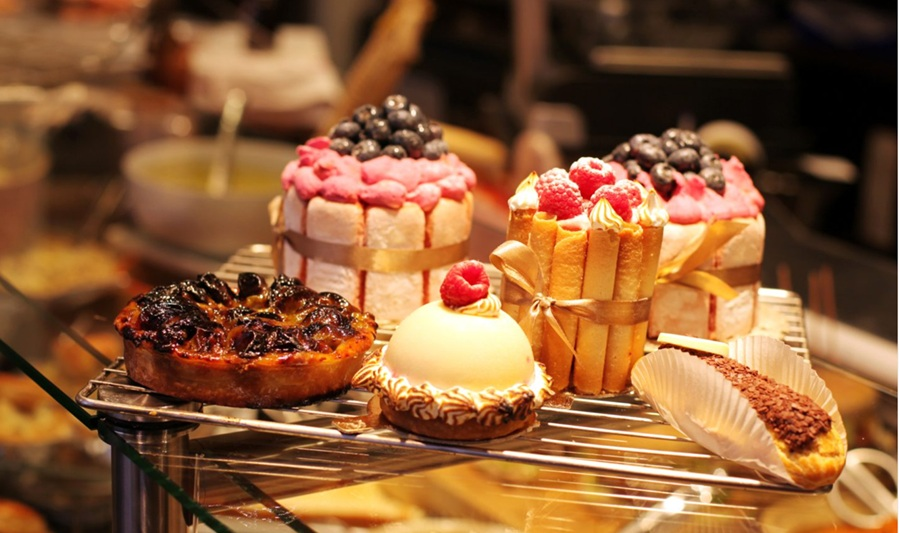

# Classical Cakes

*The named cakes you see in the patisserie window: mille-feuille, opera, gateau saint-honore, paris-brest, fraisier, charlotte. Each one is built from the same handful of things (pastry, sponge, cream, glaze) in different proportions. Learn the language of one and the others read easily.*

## Overview
Classical French cakes are structured compositions with named forms. Each is a fixed recipe (with regional variants), and each is a worked example of the composition principles: pastry as the structure; cream as the soft middle; sponge as the absorbent layer; glaze as the finish.

This page covers the named cakes most worth knowing. Each lists its components, the build, and the cross-reference to the technique it requires.

## Mille-Feuille

"A thousand leaves." Three layers of puff pastry, sandwiched with vanilla creme patissiere or chantilly. The top is glazed with white fondant and feathered with chocolate or dragged with a knife.

### Build
1. **Pastry:** Three rectangles of [puff pastry](../pastry/puff.md), about 10 x 25 cm each, baked between two sheets to keep them flat. The classical method weights the pastry under a second tray during the bake to compress the layers.
2. **Cream:** A thick batch of [creme patissiere](../../baking/cremes/creme-patissiere.md), often lightened with whipped cream into "creme legere".
3. **Glaze:** Warm white fondant, applied while the pastry is still slightly warm.
4. **Decoration:** Hot chocolate piped in straight lines across the fondant while it's still wet; a knife or skewer drags perpendicular through the lines to create the feathered pattern.

### Assembly
- Bottom pastry, half the cream, middle pastry, the other half, top pastry.
- Apply glaze + feathering to the top pastry BEFORE building.
- Refrigerate 30 minutes before slicing.

### Common Mistakes
- The pastry shrinks during the bake (didn't weight it; baked too hot).
- The cream is too soft and the layers slide (use thicker patissiere; refrigerate after assembly).
- Cutting the slice causes the layers to compress (use a serrated knife; saw gently).

## Opera Cake

A dense rectangular layered cake from Paris. Almond sponge (joconde), coffee buttercream, chocolate ganache, layered repeatedly, finished with a glaze of chocolate.

### Components
- Joconde sponge (almond sponge)
- Coffee syrup (for soaking the sponge)
- Coffee French buttercream
- Chocolate ganache
- Chocolate glaze

### Build
Six layers: sponge / coffee buttercream / sponge / ganache / sponge / coffee buttercream. Topped with mirror-glaze of dark chocolate.

The opera is one of the more advanced cakes; every layer is precise. A traditional opera is 2-3 cm tall, cut into perfect rectangles 8 x 4 cm.

## Gateau Saint-Honore

A theatrical cake. A disc of puff pastry as the base; a ring of choux puffs around the edge, each glazed with caramel; a piped chiboust cream (a meringue-enriched creme patissiere) in the centre.

### Build
1. **Base:** A disc of [puff pastry](../pastry/puff.md), about 22 cm diameter, baked flat.
2. **Choux puffs:** 12-15 small [choux](../pastry/choux.md) buns, baked, filled with creme patissiere.
3. **Caramel:** Each filled puff is dipped in dry caramel; cooled to a glassy coat.
4. **Ring:** The caramel-glazed puffs are placed around the rim of the pastry base, each one stuck down with a dab of remaining caramel.
5. **Filling:** Creme chiboust (creme patissiere folded with Italian meringue) piped or spooned into the centre, often with a saint-honore tip that produces "petal" piping.

See [Gateau Saint-Honore](../../cuisine/french/desserts/gateau-st-honore.md) for the canonical recipe.

## Paris-Brest

A ring-shaped choux cake. Filled with praline cream (creme patissiere folded with praline paste). The shape commemorates the Paris-Brest-Paris cycle race; the ring is the wheel.

### Build
1. **Choux:** Piped into three concentric rings on parchment (see [choux pastry](../pastry/choux.md) for the technique). Bakes into one large ring.
2. **Splice:** Once cooled, sliced horizontally with a serrated knife.
3. **Filling:** Praline cream (creme patissiere + praline paste + whipped cream) piped generously into the bottom half.
4. **Top:** Replace the top half; dust with icing sugar.

The praline cream is the soul; without good praline paste, the cake is just nice.

## Fraisier

The French strawberry cake. A genoise sponge base, a layer of strawberries cut into perfect uprights, a creme mousseline (creme patissiere + butter) filling, a marzipan or fondant top.

### Build
1. Two thin discs of genoise sponge (yellow sponge cake, light and dry).
2. Bottom disc placed in a cake ring.
3. Halved strawberries placed cut-side against the cake ring, all the way around, like a row of teeth.
4. Creme mousseline (rich, butter-stable patissiere) piped between the strawberries and over the top, filling all gaps.
5. More halved strawberries in the centre.
6. More creme mousseline on top.
7. Second sponge disc placed on top.
8. Marzipan or fondant disc rolled out, placed over the top sponge.
9. Refrigerate; remove the cake ring to reveal the strawberry pattern.

The fraisier is the visually most-striking patisserie cake; the strawberry pattern around the edge is what people remember.

## Charlotte

A cake-mould lined with sponge fingers, filled with a bavarois (a mousse-style cream stabilised with gelatin) and fruit.

### Build
1. Cake mould lined around the sides with sponge fingers (boudoir biscuits), upright.
2. Bavarois filling (creme anglaise + whipped cream + bloomed gelatin) poured in.
3. Top with more sponge fingers and fruit.
4. Refrigerate to set the bavarois.
5. Invert onto a plate to serve.

Classical fillings: raspberry, strawberry, chocolate. The bavarois is the technique to master; once you can make it, the variations write themselves.

## Croquembouche

A pyramid of choux puffs cemented with caramel, traditionally served at weddings and christenings. Not a cake exactly; more an installation.

### Build
1. 50-80 small choux puffs, each filled with vanilla creme patissiere.
2. A dry caramel cooked to amber, removed from heat.
3. Each puff dipped one at a time and stacked into a cone shape (use a tall ring mould as a guide).
4. Spun sugar caramel threads decorate the top.

See [Mini Croquembouche](../../cuisine/french/desserts/mini-croquembouche.md) for a smaller-scale version.

## Common Patterns Across All These Cakes

- **Sponge or pastry as a structural base.**
- **A cream as the soft middle.** (Creme patissiere shows up everywhere; learn it.)
- **A finishing element** (glaze, dust, fruit, marzipan).
- **The texture contrast principle.** Crisp pastry against soft cream, every time.
- **Pre-built components, assembled near service.** Each cake is the sum of multiple separately-made things.

This is why patisserie books are big: each finished cake has 3-5 component recipes underneath it. Knowing the foundations from the [pastry course](../pastry/pastry.md) and [eggs course](../eggs/eggs.md) does most of the work.

## Where Next
- [Tarts](tarts.md): the smaller, often simpler tart family.
- [Set Creams and Mousses](set-creams-and-mousses.md): the dessert-as-cream form.
- [Petit Fours](petit-fours.md): the small bites that complete a French meal.
- [Composing a Dessert](composing-a-dessert.md): the framework underneath these cakes.
- [Patisserie Course landing](patisserie.md): back to the main course.
