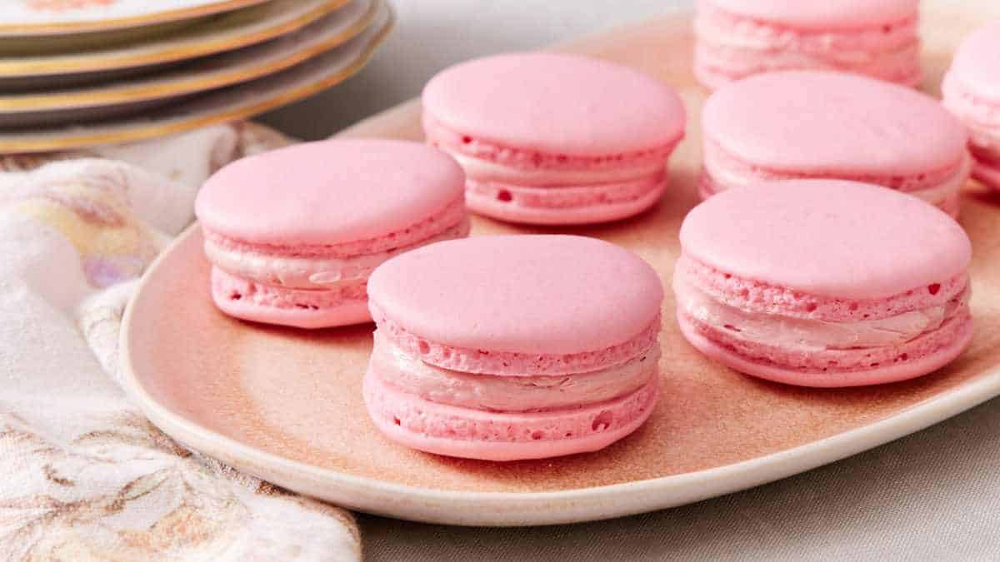

# Composing a Dessert

*Once you understand the bits a French dessert is made of (texture, temperature, colour, flavour balance), you stop following recipes and start adapting them. This page is the framework: what to think about, what to combine, when to say "that's enough."*

## Overview
A finished French dessert is rarely one thing. It's a small composition of two to five elements: a base (pastry or sponge), a cream (custard, mousse, ganache), a fruit or chocolate accent, sometimes a meringue or a streusel for texture, sometimes a sauce for the plate.

The art is making the elements work together. A pavlova is meringue + cream + fruit; the meringue is sweet and chewy, the cream is rich and soft, the fruit is sharp and juicy. Each one needs the others to be in balance. Remove the fruit and the pavlova is one-note sweet. Remove the cream and the meringue is hard work to eat.

This page covers the four dimensions that govern composition:

1. **Texture contrast.** Crisp + soft + creamy + cold + warm = the four-or-five-texture rule.
2. **Temperature contrast.** Warm pastry + cold cream is more interesting than uniform-temperature.
3. **Flavour balance.** Sweet, sour, bitter, salt; the same balance principles as savoury food.
4. **Visual balance.** Colour, height, shape on the plate.

## 1. Texture Contrast

The single most important principle. A good dessert has at least three distinct textures.

### The four classic textures
- **Crisp:** baked pastry edges, tuile, caramel shards, candied nuts.
- **Soft:** sponge, brioche, jelly.
- **Creamy:** mousse, set cream, ice cream, ganache.
- **Juicy/wet:** fresh fruit, sauce, coulis.

A pavlova is crisp meringue + creamy cream + juicy fruit. A tarte tatin is crisp pastry + soft caramelised apple + creamy cream alongside (the ice cream or creme fraiche). An eclair is crisp choux + creamy patissiere + crisp glaze (chocolate or fondant) again. Each has the contrast.

Same-texture desserts are boring. A bowl of mousse is creamy and only creamy; the seasoned cook adds a tuile, a coulis, a dust of cocoa.

### The textures-with-the-cream rule

When the centrepiece is creamy (mousse, set cream, ice cream), pair with something crunchy:
- Mousse + tuile.
- Creme brulee + the torched-sugar crust (the crunch is built-in).
- Panna cotta + biscotti.
- Ice cream + caramel shards.

When the centrepiece is crisp (a tart shell, baked pastry), pair with something soft and creamy:
- Tart + creme patissiere underneath the fruit.
- Mille-feuille + creme chantilly between the layers.
- Choux + creme patissiere inside.

## 2. Temperature Contrast

Most French desserts use temperature contrast deliberately.

### Warm pastry + cold cream
- Apple tart warm from the oven + creme fraiche or vanilla ice cream cold.
- Tarte tatin warm + cold cream.
- Souffle warm + ice cream cold on top (the contrast brings the dessert to life).
- Hot chocolate fondant + cold ice cream.

### Cold dessert + warm sauce
- Cold mousse + warm chocolate sauce.
- Cold ice cream + warm caramel.
- Cold pavlova + warm berry compote (sometimes; the cold-on-cold version is more common).

The temperature contrast makes the eating more interesting. The same dessert at uniform temperature reads as flat.

### When NOT to use temperature contrast
- Creme brulee: the cold cream + cold crisp top is the point. Don't warm.
- Macaron: room temperature throughout. Warming the cream filling makes it weep.
- Most petit fours: room temperature is correct.

## 3. Flavour Balance

The same principles as savoury food, with sweet instead of salt as the centre. The four corners:

- **Sweet:** sugar, honey, fruit, chocolate.
- **Sour:** citrus, vinegar (rarely in pastry but sometimes), sour cream, berries.
- **Bitter:** dark chocolate (high cocoa), coffee, caramel cooked dark, cocoa powder.
- **Salty:** the pinch of salt in every pastry, fleur de sel finishing, salted caramel.

A good dessert hits at least three of these. A lemon tart is sweet + sour. A salted caramel pot is sweet + bitter + salt. A flourless chocolate cake is sweet + bitter (the dark chocolate). A pavlova with passion fruit is sweet (meringue, cream) + sour (passion fruit) + a pinch of salt in the meringue.

### When the dessert is one-note
- All sweet (sponge cake with sugar glaze): boring. Add a sour fruit (raspberry) or bitter (cocoa) accent.
- All bitter (a bar of 90% chocolate): unpleasant. Add a sweet element (caramel) or sour (cherry).
- All sour (a lemon curd alone): too sharp. Add a sweet meringue, or pair with a sweet shortbread.

The balance is what makes the dessert eat-able for a portion-sized helping, not just a single bite.

## 4. Visual Balance

Patisserie also operates at a visual level. The plate is part of the dessert.

### Height
A flat plate of food is boring. Most patisserie creates height: a tower of choux, a slice of mille-feuille on its edge, a quenelle of ice cream perched on top.

### Colour
The classic French dessert is restrained in colour: cream, gold, brown, with one accent. A lemon tart is gold (pastry) + pale yellow (curd) + maybe a small berry as accent. A chocolate mousse is dark brown with maybe a gold leaf or a raspberry. Too much colour reads as cluttered or childish.

### Negative space
Restaurant plating uses negative space deliberately. A small composed dessert at the centre of a large plate reads as elegant. Home plating can copy this for effect: a slice on a smaller plate looks more controlled than the same slice on a dinner plate.

### Shape
Asymmetric or off-centre placement looks more considered than centred. A long rectangular slice running diagonally on the plate looks intentional; the same slice laid square reads as everyday.

## Worked Example: Composing a Lemon Pavlova

If you wanted to build a lemon pavlova, the components might be:

| Element | Texture | Temperature | Flavour | Role |
|---|---|---|---|---|
| French meringue base | Crisp shell, soft inside | Room temp | Sweet | The structure |
| Lemon curd | Smooth, creamy | Cold | Sweet-sour | The main flavour |
| Whipped cream | Soft, fluffy | Cold | Sweet, neutral | The richness |
| Lemon zest | Crunchy bits | Room temp | Sour, aromatic | The brightness |
| Mint leaves | Soft, fresh | Cold | Bitter-aromatic | The herb-lift |

That's five textures (crisp, soft, creamy, crunchy, fresh) plus two temperatures (room, cold) plus three flavour notes (sweet, sour, bitter-aromatic) plus visual variety (gold meringue, yellow curd, white cream, yellow zest, green mint).

The result is a complete dessert. Drop any one element and it gets simpler; drop two and it gets boring; drop three and it's hardly a dessert.

## The Inverse: Simplifying

The opposite skill is also worth knowing: making a dessert with as few elements as possible. The classics here:

- **A bowl of berries with creme fraiche.** Two elements; perfect on a summer evening.
- **A square of dark chocolate with espresso.** Bitter + bitter, but balanced because both are short of sweet.
- **Fresh fruit at peak season.** A single perfect peach with nothing on it is sometimes the dessert.

Patisserie doesn't have to be complicated. The framework above tells you when to add elements; sometimes it tells you when to take them away.

## Where Next
- [Tarts](tarts.md): the tart family.
- [Classical Cakes](classical-cakes.md): the named cakes that demonstrate composition.
- [Set Creams and Mousses](set-creams-and-mousses.md): the cream centre of many desserts.
- [Petit Fours](petit-fours.md): the small-scale composition.
- [Patisserie Course landing](patisserie.md): back to the main course.
