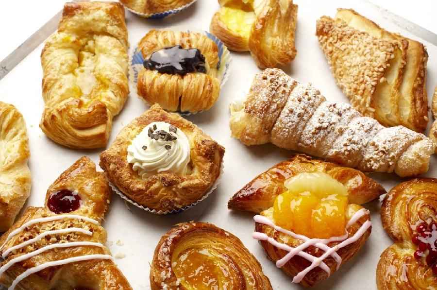

# French Patisserie Course

*Patisserie is really a course on putting things together. Once you have the pastry, the creams and the meringues from the other courses, this is where they meet: tarts, cakes, petit fours, set creams, mousses. We'll spend most of the time on how to compose a dessert; the components are covered elsewhere.*

## Overview
French patisserie is a layered tradition. Each finished dessert is built from a small number of foundational doughs, creams and meringues, combined in different ways. A mille-feuille is puff pastry + creme patissiere + glaze. A tarte au citron is sweet-short pastry + lemon curd. A paris-brest is choux + praline cream. A souffle au chocolat is custard base + meringue. The doughs and creams themselves are covered in their own courses; this course is about composing them.

The advantage of having the foundations in place: once you can make sweet-short pastry and creme patissiere, you can make a fruit tart, a custard tart, a flan, and any of the smaller tartlets. Once you can make choux and creme patissiere, you can make profiteroles, eclairs, religieuse, and gateau saint-honore. The patisserie canon is combinatorial.

## Course Outline

### How To Compose
- [Composing a Dessert](composing-a-dessert.md): the principles of building a finished patisserie from the doughs and creams. How they balance: textures, temperatures, flavours.

### The Finished Forms
- [Classical Cakes](classical-cakes.md): opera, mille-feuille, gateau saint-honore, paris-brest, fraisier. The named cakes of the patisserie counter.
- [Tarts](tarts.md): tarte au citron, tarte tatin, tarte aux fruits, tarte au chocolat, tarte normande. Sweet-short pastry plus a filling.
- [Petit Fours](petit-fours.md): macarons, financiers, madeleines, palmiers, friands. Small bites for after-dinner coffee.
- [Set Creams and Mousses](set-creams-and-mousses.md): creme brulee, creme caramel, panna cotta, chocolate mousse, fruit mousse. Egg-yolk and dairy compositions.

## The Foundations (Covered in Other Courses)

The patisserie canon rests on three other courses:

### Pastry
- [Shortcrust Pastry](../pastry/shortcrust.md)
- [Sweet Short Pastry (pate sucree)](../pastry/sweet-short.md)
- [Puff and Rough Puff](../pastry/puff.md)
- [Choux Pastry](../pastry/choux.md)
- [Filo Pastry](../pastry/filo.md)
- [Croissant and Danish](../pastry/croissant-and-danish.md)

### Eggs
- [Custards](../eggs/custards.md) (creme anglaise, creme patissiere, creme caramel, creme brulee)
- [Meringues](../eggs/meringues.md) (French, Italian, Swiss)
- [Souffles](../eggs/souffles.md)

### Bread-Pastry Crossover
- [Enriched Doughs](../bread/enriched-doughs.md) (brioche, challah, hot cross buns, panettone)

Most of the technique work happens in those courses. This course assumes you've read them.

## What Patisserie Is Not

The course is about the classical French canon. It is NOT about:

- **Cake decoration** (icing, piping skills): that's a different craft.
- **Chocolate work** (tempering, ganache for moulded chocolate): a specialist topic deserving its own course.
- **Plated restaurant desserts** (the modern composed plate with gels, foams, dehydrated elements): newer school, different rules.
- **Bread** (covered in the [bread course](../bread/bread.md), even where it crosses into patisserie via brioche and croissant).

What it IS about: the form-by-form study of patisserie classics, with cross-references to the technique courses that cover the components.

## The Three Skills of Patisserie

If you want to learn patisserie, three skills cover most of what you need:

1. **Pastry handling.** Rolling sweet-short, blind-baking, lifting cleanly. See [pastry course](../pastry/pastry.md).
2. **Cream-making.** Creme anglaise, creme patissiere, creme chantilly. The five-base creams of the patisserie kitchen. See [custards](../eggs/custards.md).
3. **Composition.** Knowing what goes with what, when to add height, when to add contrast. See [Composing a Dessert](composing-a-dessert.md).

The rest is recipes.

## Where to Start

- New to patisserie: [Composing a Dessert](composing-a-dessert.md) first. The framework for thinking about how things go together.
- Want to make a specific dessert: jump to the relevant form page above (tarts, cakes, petit fours, set creams).
- Want the techniques first: go back to the [pastry](../pastry/pastry.md) and [eggs](../eggs/eggs.md) courses; this course assumes them.

## Some Defining French Patisserie

The dishes the course refers back to:

### Cakes
- [Gateau Saint-Honore](../../cuisine/french/desserts/gateau-st-honore.md): choux + caramel + creme chiboust.
- [Mini Croquembouche](../../cuisine/french/desserts/mini-croquembouche.md): tower of caramel-coated choux puffs.
- [Chocolate Roulade](../../cuisine/french/desserts/chocolate-roulade.md): rolled sponge with chocolate cream.

### Tarts
- [Lemon Tart](../../cuisine/french/desserts/lemon-tart.md): the canonical tarte au citron.
- [Apple Tart](../../cuisine/french/desserts/apple-tart.md): the everyday tarte aux pommes.
- [Tarte Tatin](../../cuisine/french/desserts/tarte-tatin.md): upside-down caramelised apple tart.
- [Apple Turnover](../../cuisine/french/desserts/apple-turnover.md): chausson aux pommes, puff pastry filled.

### Set Creams and Mousses
- [Creme Brulee](../../cuisine/french/desserts/creme-brulee.md)
- [Coffee Creme Caramel](../../cuisine/french/desserts/coffee-creme-caramel.md)
- [Chocolate Mousse](../../cuisine/french/desserts/chocolate-mousse.md)
- [Lime Mousse](../../cuisine/french/desserts/lime-mousse.md)

### Souffles
- [Chocolate Souffle](../../cuisine/french/desserts/chocolate-souffle.md)
- [Frozen Pineapple Souffle](../../cuisine/french/desserts/frozen-pineapple-souffle.md)
- [Banana Souffle](../../cuisine/french/desserts/banana-souffle.md)

### Petit Fours and Smaller
- [Chocolate Truffles](../../petit-four/chocolate-truffles.md)
- [Chocolate Dipped Langues](../../petit-four/chocolate-dipped-langues.md)
- [Candied Fruit](../../petit-four/candied-fruit.md)

## Where Next
- [Composing a Dessert](composing-a-dessert.md): the framework.
- [Classical Cakes](classical-cakes.md): the named cakes.
- [Tarts](tarts.md): the tart family.
- [Pastry course](../pastry/pastry.md): the doughs underneath patisserie.
- [Eggs course](../eggs/eggs.md): the creams, meringues and souffles.

## Storage
- Cream-filled and custard-filled desserts keep 2 days refrigerated; bring to room temperature before serving
- Sponge cakes keep 3-4 days at room temperature in an airtight container; freeze unfilled up to 1 month
- Set creams and mousses are best within 24 hours; gelatine continues to firm on day two
- Petit fours keep 1 week in an airtight tin; some (pâtes de fruits, caramels) considerably longer
