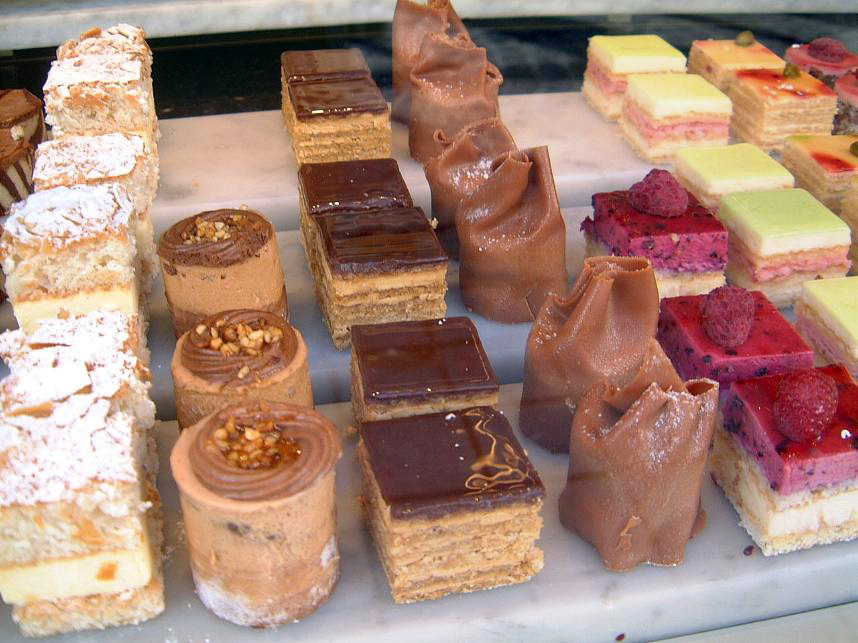

# Petit Fours

*The small things that arrive with coffee at the end of a French meal. Macarons, financiers, madeleines, palmiers, friands, tuiles, sables, truffles. They look simple and they're not, particularly. Every flaw shows on something this small, but the pay-off is making people happy with two bites.*

## Overview
Petit fours ("little ovens") are the bite-sized patisserie. They're served after the main dessert, with coffee or tea, often as a small plate of 3-5 varieties. The size is the point: each is one or two bites, perfectly executed, dense with flavour.

The technical demand per gram is high. A wonky macaron with cracked shells, an over-baked financier dry at the centre, a flat madeleine: these flaws show ruthlessly at small scale. There's no large dessert to hide behind.

Most petit fours are simple in concept and exacting in execution. The recipes are usually three or four ingredients; the technique determines the outcome.

## The Categories

### Dry Petit Fours (Petit Fours Secs)
Biscuit-like, room-temperature stable, often last several days in a tin.
- **Madeleines:** shell-shaped sponge cake, baked in a special mould.
- **Financiers:** rectangular almond cake with brown butter.
- **Palmiers:** sugared puff pastry, twice-folded, sliced into hearts.
- **Sables / Sablés:** sandy short cookies.
- **Tuiles:** thin almond crisps, curved like roof tiles.
- **Langues de chat:** thin pale tongues of butter cookie.

### Glazed Petit Fours (Petit Fours Glaces)
With cream, jam, glaze; less shelf-stable.
- **Macarons:** two French meringue shells sandwiched with ganache or buttercream.
- **Friands:** moist mini cakes, slightly cake-like, often with raspberries.
- **Petits choux:** mini choux puffs filled and glazed.
- **Eclairs:** smaller versions of the full eclair.

### Confections (Confiseries)
Chocolate-based, candy-adjacent.
- **Chocolate truffles:** ganache rolled into spheres, dusted in cocoa.
- **Pates de fruits:** fruit jellies set firm and rolled in sugar.
- **Marrons glaces:** candied chestnuts.
- **Caramels:** soft toffee bites.

## Madeleines

The classic French shell-shaped sponge. Baked in a moulded tray; cooked at high heat for the famous "bump" on the flat side.

### Recipe
- 100 g unsalted butter (melted, cooled)
- 100 g caster sugar
- 2 medium eggs
- 100 g plain flour
- 1 teaspoon baking powder
- 1 teaspoon vanilla extract
- Zest of 1 lemon (optional)

### Method
1. Whisk eggs and sugar to pale and slightly thickened (3 min).
2. Sift in flour and baking powder. Fold gently.
3. Pour in melted butter, vanilla, zest. Fold to combine.
4. Refrigerate the batter 30 minutes minimum (this is the key to the bump).
5. Heat oven to 220 C.
6. Butter and flour a madeleine tray.
7. Spoon batter into the moulds, about 3/4 full.
8. Bake 8-10 minutes; the bump develops.
9. Tip out onto a rack; eat the same day, ideally within 2 hours.

The bump (la bosse) is the visual signature of a good madeleine; it forms because the cold batter hits the hot mould and the steam rises in the centre.

## Financiers

Rectangular almond cakes with brown butter. The classic shape is rectangular (like a bar of bullion, hence the name); some recipes use small loaf-shaped moulds or oval.

### Recipe
- 75 g unsalted butter
- 75 g ground almonds
- 100 g icing sugar
- 30 g plain flour
- 3 egg whites
- Pinch of salt

### Method
1. Brown the butter: melt over medium-low heat until the milk solids brown and the butter smells nutty (beurre noisette). Strain.
2. In a bowl, combine ground almonds, icing sugar, flour, salt.
3. Add egg whites; whisk briefly to combine.
4. Add the brown butter; mix smooth.
5. Refrigerate 1 hour (the resting deepens flavour).
6. Heat oven to 200 C.
7. Pipe or spoon into a buttered financier mould (or mini-loaf tin).
8. Bake 10-12 minutes; the tops should be golden, the centres just set.

The browned butter is essential. Plain melted butter gives bland financiers.

## Palmiers

Sugared puff pastry, folded twice, sliced into heart shapes, baked until caramelised.

### Method
1. Roll out [puff pastry](../pastry/puff.md) to a 20 x 30 cm rectangle.
2. Sprinkle generously with caster sugar.
3. Fold each long side toward the middle so they meet in the centre (the "book" fold).
4. Fold the two halves together along the central line.
5. The pastry is now a long thin log with sugar between layers.
6. Slice across into 5 mm sections.
7. Lay flat on a parchment-lined tray; the cut surfaces face up.
8. Bake at 200 C for 12-15 minutes; flip halfway. The sugar caramelises into a glassy coat.

Palmiers should be deep golden on both sides, with the heart shape clearly visible.

## Tuiles

Wafer-thin almond crisps. Named for roof tiles ("tuiles" in French) because they're curved over a rolling pin while still warm.

### Recipe (Tuiles aux Amandes)
- 60 g icing sugar
- 60 g plain flour
- 1 egg white
- 30 g butter (melted)
- 50 g flaked almonds

### Method
1. Mix all ingredients except almonds to a smooth batter.
2. Spread thin discs onto a silicone mat or non-stick tray (a stencil helps).
3. Scatter with flaked almonds.
4. Bake at 180 C for 6-8 minutes until golden at the edges.
5. While still hot, lift each disc with a palette knife and drape over a rolling pin. Cools in the curved shape within 30 seconds.

Tuiles are fragile; store in an airtight tin; consume same day if possible.

## Macarons

The icon. Two domed French-meringue almond shells sandwiched with ganache or buttercream. Notoriously fussy. A separate book in itself; this section covers the basics.

### Recipe (Italian Meringue Method, More Reliable)
- 150 g ground almonds
- 150 g icing sugar
- 55 g + 55 g egg whites (separated)
- 150 g caster sugar
- 50 ml water
- Gel food colouring (optional)

### Method
1. Sift ground almonds and icing sugar together twice (this is critical; lumps ruin macarons). Mix with the first 55 g of egg whites to a paste.
2. Make Italian meringue: heat 150 g sugar + 50 ml water to 118 C. Whip the second 55 g egg whites to soft peaks. Pour the hot syrup onto the whites; continue whipping until cool and very stiff.
3. Fold the meringue into the almond-paste in three additions. The "macaronage" is the key step: fold until the batter falls in a ribbon and the line can be drawn through it slowly. Under-fold and they're domed; over-fold and they're flat.
4. Pipe 3 cm discs onto silicone-lined trays.
5. Rest 30-60 minutes at room temperature; the surface develops a skin.
6. Bake at 150 C for 15-18 minutes; the famous "feet" (pied) form at the base.
7. Cool completely; lift carefully.
8. Sandwich with ganache or buttercream (chocolate, vanilla, pistachio, raspberry are classical).

Mature macarons in an airtight box in the fridge overnight before serving. The shells absorb moisture from the filling and reach the right tender-chewy texture.

## Chocolate Truffles

The simplest petit four. Ganache rolled in cocoa or coated in tempered chocolate.

### Recipe
- 200 g good dark chocolate (70%)
- 200 ml double cream
- 30 g unsalted butter
- (Optional) 2 tablespoons spirits (rum, cognac, whisky)
- Cocoa powder for rolling

### Method
1. Chop chocolate finely; place in a bowl.
2. Bring cream to a simmer; pour over the chocolate. Wait 2 min, stir to a smooth ganache.
3. Stir in butter until incorporated.
4. Refrigerate 4 hours until firm enough to scoop.
5. With a teaspoon or small ice-cream scoop, form into walnut-sized balls.
6. Roll each ball in cocoa powder.

Stored: 1 week in the fridge in a sealed box.

See: [Chocolate Truffles](../../petit-four/chocolate-truffles.md).

## Friands

The Australian-French cake. Mini muffin-style cakes with almond meal, often baked in oval moulds. Often filled with a fresh berry pressed into the top.

### Recipe
- 100 g unsalted butter (melted, cooled)
- 100 g ground almonds
- 100 g icing sugar
- 30 g plain flour
- 3 egg whites
- 1 teaspoon vanilla

Mix as for financiers; bake in oval friand moulds at 180 C for 15-18 minutes. Press a fresh raspberry into the top of each one before baking.

## Common Mistakes Across Petit Fours

**The shape is wrong.**
Under-baked (collapses) or over-baked (cracks). Petit fours are unforgiving; one minute over or under matters.

**The texture is dry.**
Over-baked, or wrong ingredient ratio. Most petit fours use ground almonds which absorb moisture during the bake; under-bake slightly for a moister centre.

**The colour is pale.**
Oven not hot enough, or the petit four needs a higher initial blast (madeleines especially want 220 C for the bump).

**The macarons cracked.**
Over-folded the batter, or oven too hot. Macarons need 150 C for 15-18 min; bigger ovens may need 140 C.

**The macarons are hollow inside.**
Under-baked, or under-developed meringue. The Italian meringue method is more reliable than French for beginners.

**Tuiles broke when shaping.**
Cooled too long on the tray. Lift and shape within 60 seconds of removing from oven; if they harden flat, return to a warm oven for 30 seconds to soften.

## Where Next
- [Classical Cakes](classical-cakes.md): the larger forms.
- [Tarts](tarts.md): the tart family.
- [Set Creams and Mousses](set-creams-and-mousses.md): the cream-centred desserts.
- [Eggs course / Meringues](../eggs/meringues.md): the meringue technique for macarons.
- [Patisserie Course landing](patisserie.md): back to the main course.
