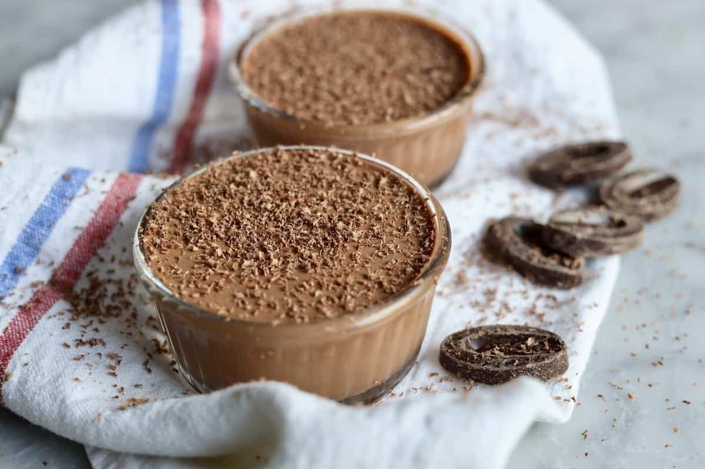

# Set Creams and Mousses

*The desserts where cream is the whole point. Creme brulee, creme caramel, panna cotta, chocolate mousse, bavarois. The underlying technique (yolks, dairy, a setting agent, gentle heat) is covered in the [eggs course / custards](../eggs/custards.md) page. This one's about turning those creams into something you'd plate up.*

## Overview
Set creams and mousses sit at the cream-rich end of patisserie. No pastry, no sponge; just an aerated or set-firm cream as the entire dessert.

Three setting mechanisms cover the family:

1. **Cooked yolks.** The proteins coagulate at 75-82 C and thicken the cream into a custard. Creme brulee, creme caramel, baked custards.
2. **Gelatin.** Set by gelatin leaves bloomed in water and stirred into the warm cream. Panna cotta, bavarois, jellied mousses.
3. **Aeration.** Stiffly-whipped cream or whipped egg whites folded into a flavoured base. Chocolate mousse, fruit mousse, parfait.

Each mechanism gives a different texture. The cooked-yolk family is dense, custardy, set firm. The gelatin family is wobbly, lighter, dome-able. The aeration family is light, airy, almost foam.

## The Cooked-Yolk Family

### Creme Brulee
A chilled, dense egg-yolk-and-cream custard, topped with a torched-sugar lid. The sugar lid shatters when tapped with a spoon; the cool custard underneath is rich and silky.

The technique is in the [custards page](../eggs/custards.md). The form is a 4-ramekin baked custard, refrigerated overnight, sugared and torched just before serving.

The classical flavours: vanilla (the original), coffee, ginger, lemon-zest.

See: [Creme Brulee](../../cuisine/french/desserts/creme-brulee.md), [Ginger Creme Brulee](../../cuisine/french/desserts/ginger-creme-brulee.md).

### Creme Caramel
Same family as creme brulee but with a caramel layer at the bottom of each ramekin. Inverted onto a plate to serve; the caramel becomes a sauce around the custard.

Whole eggs (not just yolks) are used; the custard is set firmer than creme brulee and holds its shape when turned out.

See: [Coffee Creme Caramel](../../cuisine/french/desserts/coffee-creme-caramel.md).

### Pots de Creme
A French version of baked custard, made in small lidded pots. Richer and silkier than creme caramel, no caramel layer. Often chocolate or coffee flavoured.

### Floating Islands (Iles Flottantes)
The strangest of the family. A poached meringue floats on a pool of creme anglaise; the meringue is shaped into a quenelle and gently cooked in milk or water. The contrast: soft cool custard underneath, light cool meringue on top, often with a thin caramel thread drizzled over.

See: [Floating Islands](../../cuisine/french/desserts/floating-islands.md).

## The Gelatin Family

### Panna Cotta
Italian, not French, but the technique crossed the border. Cream + sugar + gelatin + vanilla. Set in a mould; turned out to serve as a dome.

The classical pairing: panna cotta + a fruit coulis. Berries, peach, passion fruit, coffee.

### Bavarois (Bavarian Cream)
A creme anglaise enriched with gelatin and folded with whipped cream. Sets firm enough to mould and turn out. The classical filling for charlottes.

The flavour variations are endless: chocolate, vanilla, fruit (raspberry, strawberry), coffee, liqueur (Grand Marnier, Cointreau).

### Jellied Fruit Mousses
A fruit purée + gelatin + sometimes whipped cream + sometimes Italian meringue, set in a mould. Light, dome-shaped, brightly coloured.

See: [Lime Mousse](../../cuisine/french/desserts/lime-mousse.md), [Apricot Cognac Mousse](../../cuisine/french/desserts/apricot-cognac-mousse.md), [Chestnut Creme](../../cuisine/french/desserts/chesnut-creme.md).

## The Aerated Family

### Chocolate Mousse
The classic. Two main methods:

**Method 1: French (egg whites)**
- Dark chocolate melted with butter.
- Egg yolks whisked into the warm chocolate.
- Egg whites whipped to stiff peaks, folded in.
- Optional: a small amount of whipped cream folded in for extra softness.
- Refrigerated 4+ hours.

The texture is light, airy, almost foam-like. Eats with a single spoon.

**Method 2: Italian (whipped cream)**
- Dark chocolate melted.
- Whipped cream folded in.
- No egg whites; no eggs at all.

The texture is denser, richer, more cream-forward. Holds its shape longer.

The French method is classical; the Italian method is easier and slightly more stable. Both are correct.

See: [Chocolate Mousse](../../cuisine/french/desserts/chocolate-mousse.md).

### Fruit Mousse
Fruit purée + Italian meringue + whipped cream. The result is a light fruit foam that sets if it includes gelatin, or stays soft if not.

See: [Lime Mousse](../../cuisine/french/desserts/lime-mousse.md), [Raspberry Mousse](../../cuisine/french/desserts/raspberry-mousse.md), [Apricot Cognac Mousse](../../cuisine/french/desserts/apricot-cognac-mousse.md).

### Parfait
A French parfait is a frozen mousse: aerated cream-and-yolk-and-flavour mixture, frozen without churning. The egg yolks prevent ice crystals from forming. Lighter than ice cream but with similar coldness.

See: [Anise Parfait](../../cuisine/french/desserts/anise-parfait.md), [Limoncello Parfait](../../cuisine/french/desserts/limoncello-parfait.md).

### Souffle (Hot)
Technically aerated, technically cooked. Covered in detail in the [souffles page](../eggs/souffles.md). The bridge between cream-aeration and baked custard.

## How to Choose

For a dinner-party menu where you want one dessert from this family:

- **Want impressive and dramatic:** Creme brulee. The torched-sugar moment.
- **Want elegant and turn-out-able:** Panna cotta. Wobbly, beautifully simple.
- **Want chocolate-rich:** Chocolate mousse. Decadent.
- **Want light and refreshing:** Fruit mousse. Light, bright, fruit-forward.
- **Want to use up egg whites:** A floating island (uses both yolks for anglaise and whites for the meringue).

## The Universal Plating

A set cream or mousse needs a textural contrast on the plate. Without it the dessert is just smooth. Standard accompaniments:

- A tuile or shortbread biscuit for crunch.
- A fruit coulis as a sauce pool.
- A scatter of fresh berries.
- A dust of cocoa or icing sugar.
- A sprig of mint or microgreen.
- A spoonful of compote.

Pick one or two; don't crowd the plate.

## Common Mistakes

**The cream didn't set.**
Not enough gelatin (for the gelatin family), or under-cooked (for the cooked-yolk family). For gelatin: 2 leaves per 200 ml cream is the rule. For cooked: take to coat-the-back-of-spoon consistency, no less.

**The cream set rubbery.**
Too much gelatin, or over-cooked. For gelatin: less next time. For cooked: pull at 82 C max.

**The mousse collapsed.**
Egg whites or cream not whipped enough, or over-folded so the air came out. Stiff peaks (not soft) for whites; medium-stiff for cream; fold gently.

**The chocolate seized when cream was added.**
Cold cream + hot chocolate breaks the emulsion. Warm the cream to lukewarm before adding to chocolate. Or pour the hot chocolate onto cool cream gradually.

**The bavarois separated when turned out.**
Insufficient gelatin, or under-set. Test the firmness by tilting the mould; it should hold completely flat.

**The torched sugar lid is cloudy.**
Too much sugar in too thick a layer; the heat couldn't penetrate to caramelise. Sprinkle a thin even layer; torch evenly.

## Where Next
- [Eggs course / Custards](../eggs/custards.md): the cooked-yolk technique.
- [Eggs course / Meringues](../eggs/meringues.md): the meringue base used for fruit mousses.
- [Composing a Dessert](composing-a-dessert.md): the framework for matching texture and temperature.
- [Tarts](tarts.md): the alternative dessert form.
- [Patisserie Course landing](patisserie.md): back to the main course.
