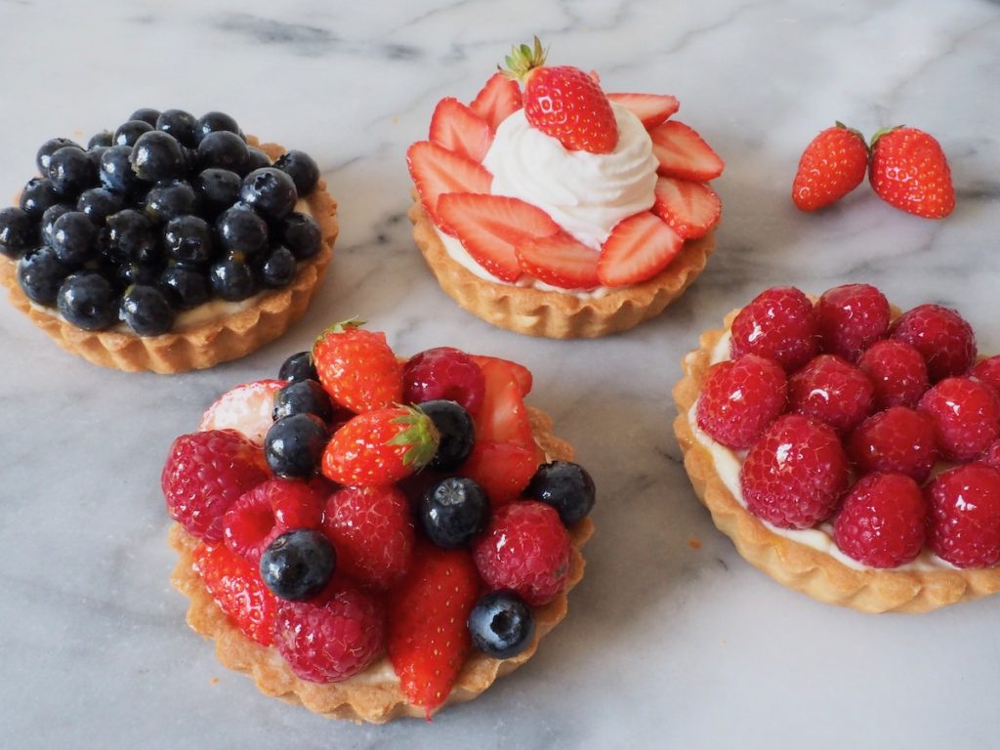

# Tarts

*Tarts are the easiest patisserie to make properly at home. A sweet-short shell, a filling, sometimes a glaze, and you have something that wouldn't look out of place in a Paris window. Lemon, fruit, chocolate, custard, almond, caramelised apple: the variations are wide and the technique stays the same.*

## Overview
Tarts are the most home-cook-friendly patisserie. The structure is fixed: a blind-baked sweet-short pastry shell, plus a filling. The variations come from the filling. Once you can make a clean blind-baked shell (see [sweet short pastry](../pastry/sweet-short.md)), the tart canon opens.

This page covers the main categories of classical French tart, with cross-references to the canonical recipes for each.

## The Universal Shell

For a standard 22-24 cm tart shell, blind-baked, ready to fill:

- 250 g [sweet short pastry](../pastry/sweet-short.md)
- Rolled to 3-4 mm thick
- Lined in a tart tin, refrigerated 30 minutes
- Blind-baked with paper and beans at 190 C for 15 minutes
- Beans removed, returned for 5-10 minutes to fully bake (cool completely before filling)
- For wet fillings: brushed with beaten egg white and returned to oven 2 min to seal

This is the universal starting point for every tart in this section.

## Curd Tarts (Lemon, Lime, Passion Fruit)

The classical citrus tart. Lemon curd poured into a cooled shell, baked briefly to set, cooled.

### The lemon curd

For one 22-24 cm tart:
- 175 g caster sugar
- 4 medium eggs + 2 extra yolks
- 150 ml lemon juice (from 4-5 lemons)
- Zest of 2 lemons
- 175 g unsalted butter (cubed, cold)

### Method
1. Whisk eggs, yolks, sugar in a heatproof bowl. Add lemon juice and zest.
2. Place over a simmering bain-marie. Stir constantly with a wooden spoon or rubber spatula.
3. Cook for 12-15 minutes, until thick enough to coat the back of the spoon (the [creme anglaise test](../eggs/custards.md)).
4. Off heat, beat in the cold butter cubes one at a time. The butter melts into the warm curd, enriching it.
5. Pass through a fine sieve to remove the zest pulp.
6. Pour into the pre-baked shell. Smooth.
7. Refrigerate 4 hours minimum.

For a slightly set curd (the French style): bake the filled tart at 110 C for 15-20 minutes after pouring; it sets to a custard-like firmness. For a soft set: don't bake; refrigerate longer.

See: [Lemon Tart recipe](../../cuisine/french/desserts/lemon-tart.md).

### Variants
- **Tarte au citron meringuee:** lemon tart topped with Italian meringue, torched golden. Adds sweet to balance sour.
- **Tarte au passion:** replace half the lemon juice with passion fruit pulp.
- **Tarte au lime:** all lime, plus a touch of lime zest in the pastry.

## Fruit Tarts (Aux Fruits)

The patisserie counter classic. Sweet short pastry, filled with [creme patissiere](../../baking/cremes/creme-patissiere.md), topped with arranged fresh fruit, glazed with apricot jelly.

### Build
1. Blind-baked sweet short shell.
2. Cooled.
3. 250 g creme patissiere spread evenly in the shell (about 1.5 cm deep).
4. Fresh fruit arranged on top in concentric circles or a pattern. Common combinations:
   - Strawberries halved
   - Raspberries with blueberries
   - Mango slices with kiwi
   - Stone fruit (peach, apricot) cut into wedges
5. Apricot glaze brushed over the fruit (warmed apricot jam thinned with a little water, strained).
6. Refrigerated 30 minutes before slicing.

The patissiere prevents the fruit from soaking the pastry; the glaze keeps the fruit from drying out.

## Tarte Tatin

Upside-down caramelised apple tart. A French invention from the late 1800s. Apples are caramelised in butter and sugar in the pan, puff pastry is laid over the top, then baked. To serve, inverted onto a plate so the caramelised apples are on top.

### Method
1. 6-8 firm dessert apples (Cox or Granny Smith), peeled, cored, halved.
2. In a heavy ovenproof pan (cast-iron, copper), make a dry caramel: 100 g caster sugar melted to amber.
3. Off heat, dot 100 g butter into the caramel.
4. Arrange the apple halves cut-side up in the caramel, snug together.
5. Cook on low heat for 15-20 minutes; the apples soften and caramelise.
6. Roll out [puff pastry](../pastry/puff.md) to a disc slightly larger than the pan.
7. Lay over the apples; tuck the edges down into the pan.
8. Bake at 200 C for 25-30 minutes until the pastry is golden.
9. Cool 10 minutes.
10. Invert onto a plate (this is the dramatic moment; expect a small amount of hot caramel to escape).

The apples are now on top, glistening with caramel. Serve warm with creme fraiche or vanilla ice cream.

See: [Tarte Tatin recipe](../../cuisine/french/desserts/tarte-tatin.md).

## Tarte Normande (Apple Custard)

A Norman classic. Apple slices in a sweet short shell, custard poured over, baked.

### Build
1. Blind-baked shell (par-baked only; the bake will finish in the oven).
2. Fan of thinly-sliced apple in the shell.
3. Custard mixture: 200 ml double cream + 100 ml milk + 3 egg yolks + 50 g caster sugar + 1 tablespoon Calvados + 1 teaspoon vanilla.
4. Pour over the apples; the custard fills the gaps and creates a layer over the top.
5. Sprinkle with caster sugar.
6. Bake at 180 C for 35-40 minutes; the custard sets, the top browns.
7. Cool to room temperature.

## Tarte au Chocolat (Chocolate)

The simplest chocolate tart. A blind-baked shell + a chocolate ganache filling, set, served cold.

### Build
1. Blind-baked shell, cooled.
2. Ganache: 200 g good dark chocolate (70%) chopped finely; pour over 200 ml hot double cream. Wait 2 min, then stir until smooth.
3. (Optional) Beat in 20 g cold butter and 1 tablespoon dark rum for shine.
4. Pour into the shell. Refrigerate 4 hours.

Serve at room temperature, not cold. The ganache sets in the fridge but eats best warm. Take out 30 minutes before serving.

See: [Chocolate Raspberry Tart](../../cuisine/french/desserts/chocolate-raspberry-tart.md) for a tart that pairs the ganache with fresh raspberries.

## Tarte aux Pommes (The Classic Apple Tart)

Differs from tarte normande in that there's no custard; it's just apples on pastry.

### Build
1. Blind-baked shell.
2. Apple compote (peeled, cored apples cooked down with a touch of sugar, butter and Calvados; about 30 minutes; mashed roughly).
3. Compote spread in the shell.
4. Thinly-sliced raw apples fanned over the top in overlapping rows.
5. Brushed with melted butter and dusted with caster sugar.
6. Baked at 180 C for 25 minutes; the top apples brown and crisp.
7. Optionally glazed with apricot jam.

See: [Apple Tart](../../cuisine/french/desserts/apple-tart.md).

## Frangipane Tarts

The almond-cream tart. Frangipane is creamed butter + sugar + eggs + ground almonds + flour. Filled into a sweet short shell with fruit pressed in, baked. The almond cream sets around the fruit.

### Build
1. Blind-baked shell.
2. Frangipane: 100 g soft butter + 100 g caster sugar + 2 eggs + 100 g ground almonds + 30 g flour.
3. Spread in the shell.
4. Sliced fresh fruit (peach, apricot, plum, fig, pear) pressed gently into the frangipane.
5. Baked at 180 C for 30-35 minutes until golden on top and just set.

The classical pairings: apricot frangipane, pear frangipane, raspberry frangipane.

See: [Apricot Tart](../../cuisine/french/desserts/apricot-tart.md), [Apple Passion Fruit Tart](../../cuisine/french/desserts/apple-passion-fruit-tart.md).

## Lemon-Meringue and Variations

Hybrid tarts that combine multiple components.

- **Tarte au citron meringuee:** lemon tart + Italian meringue torched on top.
- **Lemon-orange meringue pie:** Levantine variation with orange in the curd.

See: [Lemon Orange Meringue Pie](../../cuisine/french/desserts/lemon-orange-meringue-pie.md).

## Common Mistakes Across All Tarts

**The pastry is soggy.**
Either under-baked, or filled too soon. Always blind-bake to deep gold; cool before filling. For wet fillings, egg-wash the still-warm shell and return to the oven 2 minutes to seal.

**The curd / custard cracked.**
Over-baked. Pull the tart while the centre still wobbles slightly; it sets as it cools.

**The fruit on top looks shrivelled.**
Used unripe or refrigerated fruit. Best fruit is room-temperature and ripe. Slice and arrange just before serving; brush with glaze to retain freshness.

**The chocolate ganache cracked when cut.**
Set too cold. Take the tart out of the fridge 30 min before serving; the ganache softens to its right texture.

**Tarte tatin: the caramel hardened.**
Too long between caramelisation and inverting, or inverted onto a cold plate. Warm the serving plate slightly first; invert promptly after cooling 10 min.

## Where Next
- [Classical Cakes](classical-cakes.md): the larger composed cakes.
- [Set Creams and Mousses](set-creams-and-mousses.md): cream-centred desserts.
- [Pastry course / Sweet Short](../pastry/sweet-short.md): the shell technique.
- [Eggs course / Custards](../eggs/custards.md): the curd and patissiere technique.
- [Patisserie Course landing](patisserie.md): back to the main course.
