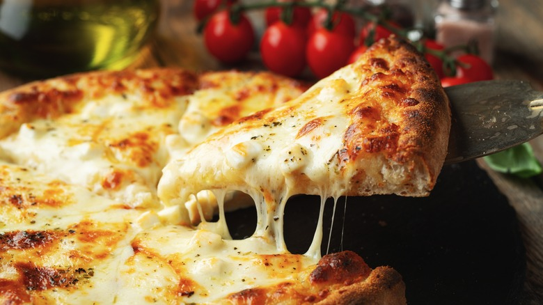

# Cheese

*Cheese is the third axis of a pizza, and it can carry or sink the whole thing. Should you use bufala or fior di latte? Where does burrata fit in? Is some cheese best added after the bake? This page sorts out which goes with what and how much of any of them you actually want.*

## Overview
Cheese on a pizza does three jobs at once: melts and binds the toppings together; adds salt and creaminess; browns to develop the caramelised colour patches that read as "well-baked". Different cheeses do these jobs in different proportions, and most home pizzas suffer from using the wrong cheese rather than the wrong amount.

The first split: fresh vs hard-aged. Almost every classic pizza uses a fresh cheese as the main melt (mozzarella, fior di latte) and sometimes a hard cheese as a counter-note (parmigiano, pecorino). The fresh cheese melts and stretches; the hard cheese adds savoury depth that the fresh cheese alone lacks.

## The Fresh Cheeses (Melt Cheeses)

### Fior di Latte
The default mozzarella for most pizzas. Made from cow's milk. Drier than mozzarella di bufala, which makes it better suited to baking (less water released into the dough).

- **Texture when raw:** firm, sliceable, slightly elastic.
- **Texture when baked:** stretchy, even melt, golden patches.
- **When to use:** the everyday standard. Margheritas, classics, anything where you want consistent melt across the surface.
- **How to use:** tear by hand into 1-2 cm pieces. Distribute evenly. Do not slice with a knife (the cut edge releases more moisture during the bake).

### Mozzarella di Bufala
The bufala (water-buffalo) version. Higher butterfat, higher water content, much more flavour.

- **Texture when raw:** soft, almost custardy, releases moisture when squeezed.
- **Texture when baked:** intensely creamy if added in moderation; floods the pizza if used too much.
- **When to use:** premium margheritas, where the cheese is the star and not a background layer.
- **How to use:** drain on muslin or paper towel for 30 minutes before tearing. Use less than you would fior di latte (60 g instead of 80 g for a 30 cm pizza). Some Neapolitan pizzaiolos place the bufala on the pizza AFTER it comes out of the oven, taking advantage of residual heat for melt while keeping the cheese pristine.

### Burrata
Mozzarella outer skin with a creamy stracciatella interior. Soft, rich, decadent.

- **Texture when raw:** firm skin, runny middle.
- **Texture when baked:** never bake burrata. It splits, the cream renders out, the result is greasy and broken.
- **When to use:** finishing cheese. Always added AFTER the pizza is out of the oven, never before.
- **How to use:** tear open a ball, place 2-3 torn chunks on the hot pizza. The residual heat softens the burrata without splitting it. See [Burrata and Herb Pizza](../../cuisine/italian/pizza/burrata-and-herb-pizza.md).

### Ricotta
A fresh whey cheese. Mild, slightly grainy, custardy when baked.

- **Texture when raw:** soft, creamy, holds shape when scooped.
- **Texture when baked:** sets into custardy pockets where dolloped. Goes nicely golden where exposed.
- **When to use:** white pizzas, pizzas where you want pockets of creaminess. Often paired with greens or sausage.
- **How to use:** drain on muslin for 15 minutes if loose. Dollop in 5-6 spots across the pizza; do not spread.

## The Hard Cheeses (Counter Cheeses)

### Parmigiano-Reggiano
The savoury counterpoint. Salt, umami, depth.

- **Texture when raw:** hard, crystalline, granular.
- **Texture when baked:** stays grainy, browns slightly, does not melt.
- **When to use:** finishing grate over a cooled pizza, or sprinkled before the bake for extra savoury crust patches.
- **How to use:** grate fresh; never use pre-grated (the anti-caking agents make it gritty). 10-15 g per pizza.

### Pecorino Romano
Sharper, saltier cousin of parmigiano. Sheep's milk.

- **Texture when raw:** similar to parmigiano.
- **Texture when baked:** very salty, can dominate.
- **When to use:** Roman-style pizzas, or when the topping is mild and needs assertion.
- **How to use:** light hand. Half what you would use of parmigiano. Often added in addition to (not instead of) parmigiano.

## The Special-Case Cheeses

### Gorgonzola Dolce
A young, soft blue. Melts well, brings a sweet-savoury tang.

- **Texture when baked:** melts into pools.
- **When to use:** pizzas with bold complementary flavours: walnut, pear, honey, prosciutto.
- **How to use:** small dabs (1 tsp pieces), distributed in 4-5 spots. Bake the pizza halfway, then add the gorgonzola so it melts but does not burn.

### Provolone
Sharper, harder cheese. Common in American-style pizza.

- **Texture when baked:** strong melt, bold flavour.
- **When to use:** American pizzas, layered under mozzarella for extra savoury depth.

### Fontina
Alpine cheese. Smooth, nutty, exceptional melt.

- **Texture when baked:** silky, even melt, mild golden colour.
- **When to use:** four-cheese pizzas, white pizzas where mozzarella alone feels too one-note.

### Taleggio
Northern Italian washed-rind cheese. Strong aroma, soft melt.

- **Texture when baked:** runs flat across the pizza, very flavourful.
- **When to use:** assertive pizzas with mushroom or truffle. Pungent; not for shy palates.

### Goat Cheese (Chèvre)
Fresh chèvre. Tangy, soft.

- **Texture when baked:** holds shape, browns lightly.
- **When to use:** sweet-savoury combinations (fig, honey, beetroot). Dollop in 5-6 spots.

### Halloumi
Greek-Cypriot brining cheese. Does NOT melt.

- **Texture when baked:** browns and crisps at the edges, stays firm in the centre. Squeaky.
- **When to use:** Mediterranean-style pizzas. Diced or cubed, distributed.

### Cheddar
The American-pizza standard. Sharp, strong melt.

- **Texture when baked:** melts into pools, browns into deep colour patches.
- **When to use:** American-style deep-pan, never on a Neapolitan or Italian pizza.

## Cheese Combinations

A single cheese is fine and often best (margherita, white pizza). Two cheeses add complexity. Three or more is "stunt pizza" and rarely improves things, but a few work.

### Two-Cheese Combinations That Work

- **Fior di latte + parmigiano-reggiano** (the workhorse combination, almost any pizza)
- **Fior di latte + gorgonzola** (sweet-savoury, pairs with walnuts and pears)
- **Mozzarella di bufala + burrata** (cream on cream, ultimate margherita)
- **Fior di latte + taleggio** (mushroom or truffle pizzas)
- **Ricotta + mozzarella** (white pizza, spinach, sausage)

### The Four-Cheese Pizza (Pizza ai Quattro Formaggi)

The classic four: fior di latte, gorgonzola, parmigiano, fontina (sometimes taleggio replaces fontina). No tomato. The cheeses are distributed in quarters rather than mixed; each quarter shows its character clearly.

## How Much

For a 30 cm pizza:

- Single-cheese (margherita-style): 80-100 g fior di latte.
- Premium single-cheese (with mozzarella di bufala): 60 g.
- Two-cheese combination: 70 g main melt + 15-20 g counter cheese.
- Four-cheese: 25-30 g of each cheese, spread in quarters.

Too much cheese is the second-most-common home-pizza mistake (after too much sauce). The cheese pools, the pizza becomes greasy, and you can no longer taste the toppings.

## Distribution

How the cheese is placed matters as much as how much.

- **Torn pieces, scattered:** the Neapolitan way. Some 1-2 cm chunks, some smaller. Distributed in a roughly even pattern, but with deliberate gaps so the sauce shows through.
- **Diced, sprinkled:** the American way. Even, smaller pieces, full coverage. Easier to handle, less character.
- **Whole slices:** rare. Used only with thicker slabs of fresh mozzarella, deliberately spaced.

The Italian rule: every slice of pizza should have some cheese, some sauce, some bare crust visible. Full coverage produces a less interesting bite.

## Common Mistakes

**The cheese pooled into a greasy lake.**
Too much cheese, or too much butterfat (used bufala for everyday pizza). Reduce quantity by a quarter, or switch to fior di latte.

**The cheese went bubbly but never browned.**
Oven not hot enough. The Maillard reaction that browns cheese needs 220°C+. See [Cooking Methods](cooking-methods.md).

**The cheese flooded the base.**
Used wet fresh mozzarella di bufala without draining. Drain on muslin or paper towel for at least 20 minutes before using.

**The burrata split into oily curds.**
Burrata was baked. Never bake burrata. It goes on AFTER the pizza is out of the oven.

**The cheese tastes bland.**
Used pre-grated cheese, or skipped the salty hard-cheese counter (parmigiano). Grate fresh; add 10-15 g of parmigiano on top of the mozzarella.

**The cheese formed rubbery bands on a cooled pizza.**
Used low-moisture mozzarella (the American pre-shredded style), which firms up unpleasantly when cooled. Switch to fior di latte, eat hot.

## Where Next
- [Sauce](sauce.md): the layer below.
- [Toppings](toppings.md): what sits with the cheese.
- [Cooking Methods](cooking-methods.md): how heat shapes the cheese.
- [Burrata and Herb Pizza](../../cuisine/italian/pizza/burrata-and-herb-pizza.md): the burrata-after-bake reference.
- [Margherita](../../cuisine/italian/pizza/margherita.md): the traditional single-cheese pizza.

## Storage
- Pizza dough balls keep 3 days refrigerated; bring to room temperature 2 hours before stretching
- Freeze portioned dough balls up to 1 month; thaw overnight in the fridge
- Pizza sauce keeps 5 days refrigerated and 3 months frozen
- Baked pizza is best the day it's made; reheat slices in a hot oven (200°C, 4-5 min) to re-crisp the base
