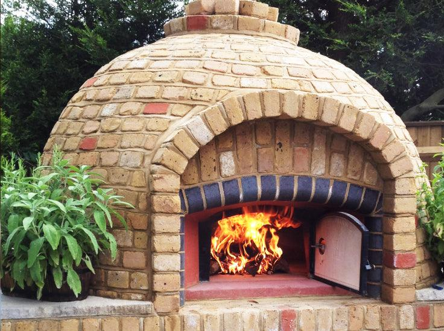

# Cooking Methods

*Restaurant pizza is mostly about heat, and home ovens just can't get there. But you can get a lot closer than you'd think. This page covers what to use (steel, stone, pan, outdoor oven) and how to push each one as hard as it'll go.*

## Overview
Pizza is a heat problem. The dough wants to spring up and the crust wants to char before the toppings dry out. To achieve this in 90 seconds (the Neapolitan ideal), you need 430-485°C. Most home ovens cap at 250-275°C. Bridging that gap is the central craft of home pizza-making.

The techniques below are listed in order of cost, with notes on how close each gets to wood-fired pizza.

## 1. Home Oven on Bare Steel (Best Home Result)

A pizza steel is a 5-6 mm slab of mild steel that goes in the oven for 45 minutes at maximum temperature, then bakes the pizza in 4-6 minutes. The steel stores heat much better than a stone and transfers it more aggressively to the dough.

### Setup
- Pizza steel (or thick cast-iron skillet flipped over).
- Pizza peel (wooden or metal).
- Semolina flour for dusting the peel.

### Method
1. Place the steel on the middle-upper rack of the oven.
2. Heat the oven to its maximum setting (typically 250-275°C) for at least 45 minutes. Do not skip this. The steel needs to be saturated with heat.
3. Stretch the dough, top fast (under 90 seconds from peel to oven).
4. Slide the topped pizza onto the steel. Close the door.
5. Bake 4-6 minutes. The cheese should bubble and char in spots. The cornicione should puff and blister. Rotate halfway through if the back of your oven is hotter.
6. Remove with the peel. Slice immediately. Eat hot.

Result: very close to Neapolitan. About 80% of the way there.

### Switching to Broil for the Top
At the 3-4 minute mark, flip the oven from convection bake to broiler (top heat). The 30-60 seconds under the broiler crisps and chars the cheese. Watch closely; the line between perfect and burnt is 15 seconds.

## 2. Home Oven on Pizza Stone

The traditional approach. A ceramic or cordierite stone (1.5-2.5 cm thick) acts as a thermal mass that mimics a wood-fired oven floor.

### Setup
- Pizza stone, full pre-heat.
- Pizza peel.
- Semolina flour.

### Method
Identical to the steel method, with two differences:
- Stones take longer to heat fully (60+ minutes preheat).
- Stones transfer heat slightly less aggressively than steel. Pizzas take 6-9 minutes.

Result: about 70% of Neapolitan. The dough crisps well, but the cornicione may not blister as dramatically as it does on steel.

### Stone vs Steel
- **Stone:** cheaper, more even heat, less likely to scorch.
- **Steel:** faster bake, more dramatic spring, easier to clean. The better choice if you bake pizza weekly.

## 3. Home Oven on a Baking Sheet (Default Home Cook)

The lowest-cost approach. No special equipment.

### Setup
- Heavy-gauge baking sheet (the heaviest you have).
- Cooking oil or non-stick spray.

### Method
1. Heat the oven to maximum, 250°C+, with the baking sheet inside, for 30 minutes.
2. Stretch the dough on a piece of baking parchment.
3. Top the pizza on the parchment.
4. Lift the parchment with the topped pizza, lower onto the hot baking sheet.
5. Bake 10-14 minutes.

Result: about 50% of Neapolitan. The base never gets as crisp as on a stone or steel. Reasonable for casual home pizza, especially American-style or deep-pan where the base is meant to be softer.

### Skillet-and-Broiler Method
A variation that approximates the steel/stone approach without specialised equipment.

1. Heat a heavy cast-iron skillet on the highest hob setting for 5 minutes.
2. Heat the oven broiler.
3. Drop the stretched, topped pizza into the dry skillet (no oil; you want char marks).
4. Cook on the hob for 2 minutes; the base will crisp.
5. Transfer the skillet to under the broiler for 3-4 minutes.

Result: about 65% of Neapolitan. Closer than the baking sheet, no special tools needed.

## 4. Outdoor Pizza Oven (Wood-Fired, Gas, Pellet)

Once consumer pizza ovens dropped in price (Ooni, Gozney and similar from 2018 onwards), home pizza got radically better. These ovens reach 430-485°C, which is the Neapolitan ideal.

### Setup
- Outdoor pizza oven, fully heated to maximum (45-minute preheat for wood; 20 minutes for gas).
- Pizza peel.

### Method
1. Stretch and top the pizza fast.
2. Slide onto the floor of the oven.
3. Bake 60-90 seconds. Rotate the pizza 90 degrees every 20-30 seconds with the peel. The intense heat means one side will char fast; rotation is mandatory.
4. Remove when the cornicione is puffed and slightly charred, the cheese is bubbled and spotted, and the base lifts cleanly.

Result: full Neapolitan, indistinguishable from a pizzeria. The dough thresholds for this technique are higher (65-72% hydration); standard home pizza dough at 60% can scorch.

### Wood-Fired vs Gas Outdoor Oven
- **Wood-fired:** the most flavour. Smoky undertone from the wood. Steeper learning curve.
- **Gas:** more consistent temperature, easier setup, less flavour character. The pragmatic choice.
- **Pellet (Ooni Karu, etc):** middle ground. Good flavour, easier than wood.

## 5. Frying Pan (Single Burner Method)

Useful if you have neither an oven nor outdoor cooker. Surprisingly effective for thin pizzas.

### Setup
- Heavy-based frying pan (cast iron or thick stainless), 28-30 cm diameter.
- Lid that fits.

### Method
1. Heat the dry pan on highest heat for 3-4 minutes.
2. Stretch the dough to fit the pan.
3. Drop into the dry pan. Cook for 1-2 minutes until the base starts to brown.
4. Top the pizza quickly while in the pan: sauce, cheese, toppings.
5. Cover with the lid. Cook for 3-4 minutes; the steam helps cook the cheese.
6. Optional: finish under a broiler for 1 minute to char the top.

Result: about 60% of Neapolitan. The base crisps well; the top cooks unevenly without the broiler finish.

## Heat and Time Comparison

| Method | Temperature | Bake time | Closeness to Neapolitan |
|--------|-------------|-----------|-------------------------|
| Wood-fired outdoor oven | 430-485°C | 60-90 s | 100% |
| Gas outdoor oven | 400-480°C | 80-120 s | 95% |
| Home oven, steel | 250-275°C | 4-6 min | 80% |
| Home oven, stone | 250-275°C | 6-9 min | 70% |
| Skillet + broiler | 250-275°C (broiler) | 5-7 min | 65% |
| Frying pan, lidded | hob | 5-7 min | 60% |
| Home oven, baking sheet | 250°C | 10-14 min | 50% |
| Home oven, no stone or steel | 220°C | 15-20 min | 35% |

## The Crucial Rules (Any Method)

1. **Preheat aggressively.** Whatever your stone/steel/pan, give it 30+ minutes at maximum heat.
2. **Bake the pizza HOT.** Most home ovens lose 30-50°C in the first minute after opening. Open the door for 5 seconds maximum, slide the pizza in, close.
3. **Don't over-top.** A heavy pizza takes longer to bake, and the longer the bake, the more the base dries out. Aim for 100 g toppings max on a 30 cm pizza (see [Toppings](toppings.md)).
4. **Watch and rotate.** Almost every oven has hot spots. Rotate the pizza 90-180 degrees halfway through.
5. **Pull at the right moment.** A pizza pulled 30 seconds early has a soft underside. A pizza pulled 30 seconds late has a dry top. Aim for the moment when the cheese is just-melted-and-bubbled, the cornicione is puffed and spotted, the base is golden.

## Common Mistakes

**The base is white and soft underneath.**
Pan or stone not hot enough, or pizza not on it long enough. Preheat 15 more minutes, or extend bake 1-2 minutes.

**The base is burnt black; the top is barely cooked.**
Pan too close to direct heat, or stone too thin. Move pizza up a rack, or get a thicker stone.

**The top is browned but the centre is wet.**
Too much sauce or cheese (see [Sauce](sauce.md), [Toppings](toppings.md)), or oven temperature too low for the topping load.

**The dough sticks to the peel mid-launch.**
Did not dust the peel with semolina (better than flour for sliding). Or topped too slowly and the dough had time to absorb moisture from the toppings. Be fast.

**The pizza came out flat with no cornicione puff.**
Either over-stretched (rolled the rim flat) or oven not hot enough for the dough to spring. Higher heat next time; preserve the rim during shaping.

**The cheese pooled greasily but never browned.**
Oven not hot enough, or used a low-fat cheese that does not brown well. Switch to fior di latte or add 10 g parmigiano on top for the Maillard reaction.

**The whole pizza tastes raw.**
Oven door opened too many times, or pizza pulled too soon. Bake another 1-2 minutes. The internal dough temperature should be at least 95°C.

## Where Next
- [Dough](dough.md): the input that determines what the bake can produce.
- [Sauce](sauce.md): less is more, especially under high heat.
- [Toppings](toppings.md): heavy topping loads need longer bakes.
- [Cheese](cheese.md): cheese choice affects browning behaviour.
- [Margherita](../../cuisine/italian/pizza/margherita.md): the canonical reference.
- [Bread / Scoring and Oven Spring](../bread/scoring.md): the same physics governs both pizza and bread.
