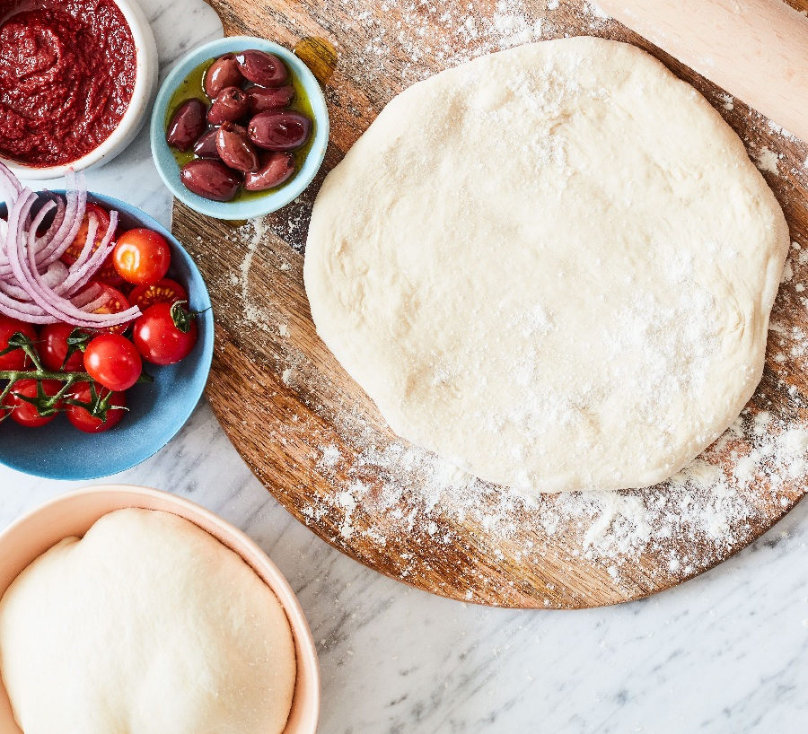

# Dough

*Five ingredients, a couple of days, and a dough that bakes into something with a crisp underside and a charred puffy rim. Most of the work happens while you're not in the kitchen at all (it's in the fridge). The bit that matters is the cold ferment, and skipping it is where most home pizza falls short.*

## Overview
Pizza dough is bread dough with restraint. The hydration is moderate (60-65% for home oven, 65-70% for stone or wood-fired), the yeast is low, the ferment is long. The lower yeast and longer ferment build flavour. The moderate hydration gives a dough that can be stretched thin without tearing.

Three things separate a good home pizza dough from a great one:

1. **Cold ferment.** 24-72 hours in the fridge after the initial mix. Builds flavour, improves the crumb structure, makes the dough easier to handle.
2. **Hand stretching.** Never a rolling pin. The pin crushes the air pockets that the long ferment built; the hand stretch preserves them.
3. **Wet, sticky tolerance.** A pizza dough that feels uncomfortable to handle when fresh becomes silky after a day's rest.

## The Master Recipe

For 4 pizzas (about 220 g per ball, enough for a 25-30 cm pizza each).

### Ingredients
- 500 g strong bread flour (12-13% protein), plus extra for shaping
- 325 g cold water (65% hydration)
- 10 g fine sea salt (2%)
- 3 g instant yeast (0.6% - yes, that low)
- 1 tbsp olive oil (optional, gives a softer crumb)

### Method

**Day 1, evening.**

1. In a large bowl, combine the flour and salt. Stir to distribute.
2. In a separate jug, mix the cold water and yeast. Stir until the yeast dissolves.
3. Pour the water into the flour. Add the oil if using. Mix with a wooden spoon or your hand for about 2 minutes, until no dry flour remains. The dough will be shaggy and rough.
4. Cover the bowl with a damp tea towel. Leave at room temperature for 20 minutes. This is the autolyse.
5. Wet your hands. Reach under one side of the dough, lift, stretch up and fold over to the opposite side. Rotate the bowl a quarter turn. Repeat for a total of 4 folds.
6. Cover, wait 30 minutes.
7. Repeat the stretch-and-fold cycle three more times, at 30-minute intervals. The dough becomes notably smoother and more elastic with each round.
8. After the fourth stretch-and-fold (2 hours total room-temp ferment), the dough should be smooth, slightly tacky and clearly elastic.
9. Divide the dough into 4 equal portions (about 215 g each). Shape each into a tight ball by tucking the edges under itself. Place each ball in its own lightly oiled container (a small tupperware works well) or arrange spaced out on a lightly oiled tray.
10. Cover. Refrigerate 24-72 hours.

**Day 2 or 3, 2 hours before serving.**

1. Remove the dough balls from the fridge. Let warm to room temperature, covered, for 2 hours. Cold dough cannot be stretched.
2. Heat the oven (and stone/steel if using) to the highest temperature it goes. See [Cooking Methods](cooking-methods.md) for setup details.
3. Shape and top one pizza at a time. See the shaping section below.

## Hydration Choices

Hydration shapes the finished crust.

| Hydration | Suits          | Texture                         | Notes                  |
|-----------|----------------|---------------------------------|------------------------|
| 55-58%    | Deep-pan, American | Soft, breadlike, biscuity   | Easier to handle, less puff |
| 60-63%    | Home oven       | Crisp underside, soft chew     | The all-rounder        |
| 64-68%    | Pizza stone, steel | Open crumb, blistered rim   | Wetter, harder to shape|
| 70-75%    | Wood-fired oven | Very open, charred, light      | Needs 450°C+ heat to set |
| 80%+      | Pinsa, focaccia | Almost flatbread, big bubbles  | Different dish entirely |

The master recipe above is at 65%, comfortable for home ovens and stones. For an American deep-pan, drop to 58% and add 2 tbsp olive oil for a softer crumb.

## Shaping

The single biggest skill-jump in home pizza making. A rolling pin gives an even but dead crust. A hand stretch gives an irregular, open, alive crust.

### The Technique

1. Flour the bench lightly. Place a room-temperature dough ball in the middle. Dust the top.
2. Press the centre flat with your fingertips, leaving a 1 cm rim around the edge untouched. This rim becomes the puffed crust (the cornicione).
3. Continue pressing outward with the heels of your hands, gradually expanding the disc to about 15 cm diameter. The dough should be about 5 mm thick at the centre.
4. Pick the dough up. Rest it on the backs of your knuckles, hands close together at the centre. Slowly move your hands apart, letting gravity pull the dough outward to a 25-30 cm disc.
5. Rotate as you stretch so the expansion is even.
6. Lay the dough on a floured (or semolina-dusted) pizza peel or baking sheet. The base should be thin and slightly translucent in the centre, with a clearly raised rim.

Do not stretch all the way to thin holes. A few tiny perforations are fine; a hole the size of a thumb means re-shape (gather and re-rest 10 minutes).

### Why Not a Rolling Pin?

The pin compresses the dough uniformly. It pushes out the small CO2 pockets that the long ferment built, leaving a flat, dense crust. The hand stretch preserves the bubbles in the rim, which is where most of the pizza-eating pleasure lives.

If you must use a pin (for deep-pan, where the crumb matters less), use it gently and only on the centre. Leave the rim untouched.

## Top It Fast

A stretched dough does not wait. Within 5 minutes, it starts to relax and lose its tension. Within 10, it sags into the work surface and sticks. The rule is: shape the dough only when the oven is hot, the toppings are prepped and you are ready to bake within 90 seconds.

The mise-en-place principle from BIR curry applies here too. Everything ready before you start shaping.

## Common Mistakes

**The dough is wet and unworkable straight from the bowl.**
Normal for the first 20 minutes after mixing. Let the autolyse and stretch-and-folds happen; the dough firms up considerably.

**The dough tears when stretched.**
Either under-fermented (give it a longer rest), under-developed (more stretch-and-folds), or too cold (warm to room temperature first). Patch any tears by pinching the edges together.

**The dough springs back and refuses to stretch.**
Gluten is too tight. Rest the disc, covered, for 10 minutes, then resume. Hand-shaping always involves periods of rest.

**The cornicione (rim) is flat after the bake.**
You either rolled the rim flat during shaping, or under-fermented the dough. The puff comes from gas trapped in the rim during the bake; you cannot recover it after the fact.

**The base is gummy in the middle.**
Either the dough was too wet for your oven, the oven was not hot enough, or the bake was too short. See [Cooking Methods](cooking-methods.md) for fixes.

**The dough sticks to the peel.**
Did not flour or semolina-dust the peel before shaping on top. Tip a little flour onto the dough and try to slide it (do not pick it up). A semolina-dusted peel slides best.

**The pizza is mostly crust around an undercooked centre.**
Stretched too small (let the dough disc be bigger), or topped too heavily (less is more, see [Toppings](toppings.md)).

## Cold Ferment Schedule

Pick by time available:

| Schedule        | Result                       | Notes                |
|-----------------|------------------------------|----------------------|
| Same day, 4 hr  | Bready, decent               | Last resort          |
| 24 hr cold       | Good                         | The standard         |
| 48 hr cold       | Better, more open crumb      | Best home result     |
| 72 hr cold       | Best, most complex flavour   | Watch for over-fermenting |
| 96 hr cold       | Risky; gluten weakens        | Skip                 |

Most home recipes (including supermarket pizza kits) skip the cold ferment entirely. This is the biggest single upgrade you can make.

## Where Next
- [Sauce](sauce.md): what to put on the base.
- [Toppings](toppings.md): how to balance the load.
- [Cheese](cheese.md): the third axis.
- [Cooking Methods](cooking-methods.md): the bake.
- [Basic Pizza Dough](../../cuisine/italian/pizza/basic-pizza-dough.md): the master recipe.
- [Bread / Hydration](../bread/hydration.md): everything about hydration also applies here.
- [Bread / Proving](../bread/proving.md): the cold ferment is just an extended prove.
