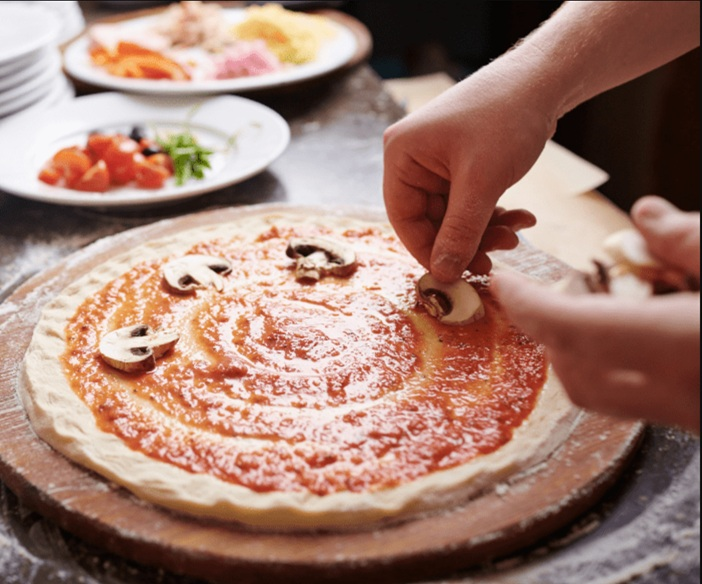

# Pizza Course

*Five things make a pizza: dough, sauce, toppings, cheese, oven. Each of them is genuinely simple on its own. The trick is in how they meet. We'll go through them one at a time, and by the end you'll be making the kind of pizza you used to order in.*

## Overview
Pizza is a study in restraint. Five ingredients in the dough (flour, water, salt, yeast, optional olive oil), three or four on top, a screaming-hot oven, and ten minutes. Done well, it is the most satisfying single dish in the European canon. Done badly, it is dry, gummy, soggy or burnt.

This course breaks pizza into its component techniques. Read the dough page first; everything else depends on having a good base under it. The sauce, toppings, cheese and cooking-method pages each handle one variable; combine them as you like.

## Course Outline

### 1. The Base
- [Dough](dough.md): mixing, hydration, fermentation, shaping. The 24-hour cold-ferment that separates a good base from a great one.
- [Sauce](sauce.md): the three classic bases (red, white, no-sauce), why San Marzano matters, what to skip.

### 2. The Toppings
- [Toppings](toppings.md): the balance question, less-is-more, what to add before vs after the bake.
- [Cheese](cheese.md): mozzarella vs fior di latte vs burrata vs the rest. Hot melt vs cold finish. What to scatter, what to torn-place, what to omit.

### 3. The Bake
- [Cooking Methods](cooking-methods.md): home oven, pizza stone, pizza steel, outdoor pizza oven, frying pan. Temperature targets and timing for each.

## Master Doughs and Recipes
The course refers back to these:

- [Basic Pizza Dough](../../cuisine/italian/pizza/basic-pizza-dough.md): the everyday standard, 60% hydration, suitable for most home ovens.
- [Pizza Dough](../../bread-pasta/pizza-dough.md): a higher-hydration version for stone or outdoor oven.
- [Pizza Sauce](../../cuisine/italian/pizza/pizza-sauce.md): the no-cook San Marzano base.
- [Margherita](../../cuisine/italian/pizza/margherita.md): the canonical reference pizza.
- [Ultimate Margherita Pizza](../../cuisine/italian/pizza/ultimate-margherita-pizza.md): the upgraded version.

## The Finished Pizzas

Once you have the course components in hand, all of these are 15-20 minute builds (after the dough is made):

### Classic Neapolitan
- [Margherita](../../cuisine/italian/pizza/margherita.md): tomato, mozzarella, basil, olive oil.
- [Ultimate Margherita](../../cuisine/italian/pizza/ultimate-margherita-pizza.md): upgraded version.
- [Burrata and Herb](../../cuisine/italian/pizza/burrata-and-herb-pizza.md): burrata added after the bake.

### Roman and Regional Italian
- [Calabrese](../../cuisine/italian/pizza/calabrese.md): nduja and salami, from southern Italy.
- [Pancetta and Rocket](../../cuisine/italian/pizza/pancetta-and-rocket-pizza.md): rocket leaves dressed after the bake.
- [Sausage and Fennel](../../cuisine/italian/pizza/sausage-fennel-pizza.md): pork sausage with fennel seed.
- [Spinach and Pine Nut Pinsa Romana](../../cuisine/italian/pizza/spinach-and-pine-nut-pinsa-romana.md): the Roman flatbread cousin.
- [Pissaladiers](../../cuisine/italian/pizza/pissaladiers.md): the Provençal anchovy-olive-onion close cousin.

### American and Cross-Style
- [American Deep Pan Pizza](../../cuisine/italian/pizza/american-deep-pan-pizza.md): Chicago / deep-dish style.
- [Chilli Beef Pizza](../../cuisine/italian/pizza/chilli-beef-pizza.md): heat-led with red onion.
- [Chorizo Pizza](../../cuisine/italian/pizza/chorizo-pizza.md): Spanish chorizo and Manchego.
- [Sloppy Joe Pizza](../../cuisine/italian/pizza/sloppy-joe-pizza.md): bolognese-meets-pizza.
- [Meatball Pizza](../../cuisine/italian/pizza/meatball-pizza.md): a New York staple.

### Calzone (Folded)
- [Calzone](../../cuisine/italian/pizza/calzone.md): the basic folded pizza.
- [Calzone Pollo Spinaci](../../cuisine/italian/pizza/calzone-pollo-spinaci.md): chicken and spinach.
- [Kale and Chilli Calzone](../../cuisine/italian/pizza/kale-chilli-calzone.md): greens-led.
- [Spicy Sausage Calzone](../../cuisine/italian/pizza/spicy-sausage-calzone.md): with hot Italian sausage.
- [Stromboli](../../cuisine/italian/pizza/stromboli.md): the rolled American cousin.

## How to Approach the Course

If you have never made pizza from scratch: make a batch of [basic dough](../../cuisine/italian/pizza/basic-pizza-dough.md) on a Saturday morning, let it cold-prove for 24 hours, then make a [margherita](../../cuisine/italian/pizza/margherita.md) Sunday evening. Read the [dough](dough.md) and [cooking methods](cooking-methods.md) pages first. The other pages add depth as you go.

If you already make pizza but want a better bake: skip to [Cooking Methods](cooking-methods.md). The home-oven section explains how to get a stone or steel close to wood-fired heat.

If your pizza is good but boring: [Toppings](toppings.md) and [Cheese](cheese.md) cover the topping-design questions (what to layer, how much, what to add fresh after the bake).

## Where to Start
- [Dough](dough.md): the foundation. Master this first.
- [Cooking Methods](cooking-methods.md): the heat that finishes it.
- [Basic Pizza Dough](../../cuisine/italian/pizza/basic-pizza-dough.md): the everyday master recipe.

## Storage
- Pizza dough balls keep 3 days refrigerated; bring to room temperature 2 hours before stretching
- Freeze portioned dough balls up to 1 month; thaw overnight in the fridge
- Pizza sauce keeps 5 days refrigerated and 3 months frozen
- Baked pizza is best the day it's made; reheat slices in a hot oven (200°C, 4-5 min) to re-crisp the base
