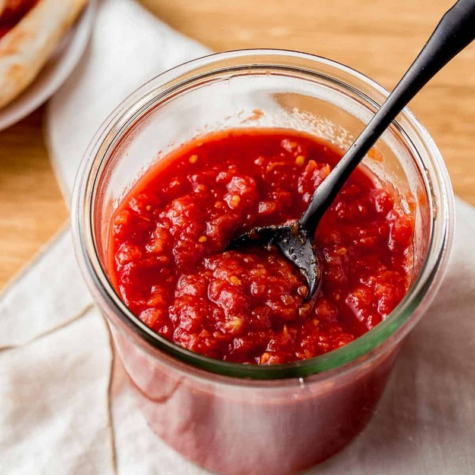

# Sauce

*The three sauce styles (red, white, no-sauce), why San Marzano matters, what to leave out. The sauce sits between dough and toppings; it has the least real estate but does the most heavy lifting on flavour.*

## Overview
Pizza sauce is a study in restraint, even more than the dough. The classical Neapolitan red sauce has three ingredients: tomato, salt, fresh basil. No garlic, no oregano, no sugar, no cooking. The brightness of raw tomato is the point; cooking it for two hours with herbs produces a pasta sauce, not a pizza sauce.

Three sauce styles cover almost every pizza:

1. **Red (tomato).** The default. Raw, lightly seasoned, generously applied but never deeply layered.
2. **White (bianca).** Garlic-infused olive oil, sometimes ricotta or béchamel as a base. Used for pizzas where tomato would clash.
3. **No-sauce.** Cheese and oil directly on dough, often with herbs. Used for pinsa, focaccia and certain regional pizzas.

## The Red Sauce

### Standard Recipe (Enough for 4 Pizzas)

- 1 × 400 g tin whole San Marzano tomatoes (or another good quality plum tomato)
- 1 tsp fine sea salt
- 4-5 fresh basil leaves (added when topping the pizza, not now)
- 1 tbsp extra virgin olive oil (added to the finished pizza, also not now)

### Method

1. Open the tin. Pour the tomatoes into a wide bowl.
2. Using clean hands, crush each tomato individually. Squeeze them through your fingers until the sauce is roughly chunky, with some smaller bits and some 5 mm pieces. The texture should look like a chunky passata, not a smooth puree.
3. Add the salt. Stir. Taste; the sauce should be vibrantly tomato, slightly bright, just-salted.
4. Discard any tough cores or skin pieces that did not break down. The sauce is finished.

That is it. No cooking. The 90 seconds in a screaming-hot oven is all the cooking the sauce gets.

### Why San Marzano

San Marzano DOP tomatoes (or genuine alternatives) have:
- Lower water content than standard plum tomatoes. Less moisture means a less soggy base.
- Higher natural sugar. Balances acidity without adding sugar.
- Less of the bitter compound that supermarket tinned tomatoes develop. No cooking out needed.

Look for "San Marzano dell'Agro Sarnese-Nocerino DOP" on the label. Look for the DOP seal. Genuine San Marzano is more expensive than mass-market plum, but the difference is visible on the plate.

If you cannot find genuine San Marzano: any good Italian-source whole plum tomato in a tin. Avoid: passata (too smooth), supermarket value-brand tinned tomato (often watery and bitter), cherry tomatoes (different flavour profile entirely), fresh tomatoes (water content is wrong unless you cook them down, in which case use a different recipe).

### What to Skip

A surprising amount of common pizza-sauce advice is wrong for the no-cook approach.

- **Cooking the sauce.** Pasta sauce is cooked. Pizza sauce is not. The 90 seconds in the oven do the cooking.
- **Garlic in the sauce.** Goes raw on the pizza if at all, sliced very thin. Cooked garlic in the sauce muddies the flavour.
- **Oregano in the sauce.** Goes on top of the pizza, not in the sauce. Dried oregano in sauce tastes dusty.
- **Sugar.** A good tomato does not need it. If yours does, your tomato is wrong.
- **Onion.** Belongs on top of the pizza if at all, not in the sauce.
- **Anchovy paste.** Belongs on top of certain pizzas (pissaladiers, marinara), not in the base.
- **Tomato paste/concentrate.** Belongs in Italian-American "pizza sauce" recipes, which are different from Neapolitan and not worse but different. If using, dilute heavily and accept that the sauce is now cooked-style.

### How Much to Use

Less than you think.

- 25 cm pizza: 3-4 tbsp sauce.
- 30 cm pizza: 5-6 tbsp sauce.
- Spread thinly in a spiral from centre to rim, leaving 1.5 cm of bare dough around the edge for the cornicione.

If the sauce pools on the surface or runs off the edge when stretched, you used too much.

See: [Pizza Sauce](../../cuisine/italian/pizza/pizza-sauce.md) for the canonical recipe.

## The White Sauce (Bianca)

A pizza bianca is white because there is no tomato. The "sauce" is often olive oil plus ricotta or béchamel, but the simplest version is just garlic-infused oil.

### Garlic Oil (For Pizza Bianca)

- 4 tbsp extra virgin olive oil
- 2 garlic cloves, sliced paper thin (not minced)
- Pinch of chilli flakes (optional)
- Pinch of sea salt

Combine. Let stand 30 minutes for the garlic to infuse. Strain or leave the slices in. Brush over the stretched dough before topping.

### Ricotta Base

- 200 g whole-milk ricotta (drained on muslin if loose)
- 1 tbsp olive oil
- Pinch of salt
- Black pepper

Mix. Dollop in 5-6 spots across the stretched dough, leaving gaps. Bake; the ricotta sets into custardy pockets.

### When to Use White
- When the toppings are delicate and a tomato base would dominate (potato pizza, white truffle, four-cheese).
- When you want a richer, creamier mouthfeel.
- When you have a single hero topping that needs space (prosciutto, fig, mortadella).

## The No-Sauce Style

Some pizzas (and pizza-like things) have no sauce layer at all. Olive oil and herbs go directly on the stretched dough; cheese and toppings sit on the oil.

- **Pinsa Romana:** rosemary, olive oil, sea salt, no cheese. Just a herbed flatbread.
- **Focaccia:** olive oil, sea salt, sometimes rosemary or olives. A bread, not a pizza.
- **Pizza al Taglio:** Roman style, often topped with potatoes or simple flavoured oils.

See: [Spinach and Pine Nut Pinsa Romana](../../cuisine/italian/pizza/spinach-and-pine-nut-pinsa-romana.md) for the Roman flatbread.

## Choosing the Style

The sauce style should match the pizza concept.

| Pizza Concept                | Sauce Style |
|------------------------------|-------------|
| Classic Neapolitan (margherita, marinara) | Red, raw |
| Tomato-led with seafood or meat (calabrese, sausage) | Red, raw |
| Cream- or cheese-led (four-cheese, white pizza) | White |
| Delicate single-hero topping (prosciutto, truffle, fig) | White |
| Roman flatbread (pinsa, al taglio) | No-sauce |
| American deep-pan | Red, often slightly cooked |
| Calzone (filled) | Red OR no-sauce inside; brush oil on the outside |

## Common Mistakes

**The sauce is watery and the base is gummy.**
Either too much sauce, or the tomatoes had too much liquid. Drain the tomatoes briefly before crushing (5 minutes in a sieve), or reduce the quantity used.

**The sauce tastes flat.**
Under-salted. The tomato needs salt to come alive. Add ¼ tsp at a time, stir, taste, repeat.

**The sauce tastes harsh and acidic.**
The tomatoes were not San Marzano (or equivalent). Switch brands. As a last resort, add a pinch of sugar, but only as a fix for bad tomatoes, never as standard.

**The pizza bianca came out dry.**
Not enough olive oil, or no ricotta/béchamel layer at all. White pizzas need fat to compensate for the missing tomato moisture.

**There are bare patches on the finished pizza.**
The sauce did not cover well, or was applied too thickly in some spots and not at all in others. Spread in a spiral with the back of a spoon, evenly, all the way to within 1.5 cm of the edge.

## Where Next
- [Dough](dough.md): the base under the sauce.
- [Toppings](toppings.md): what goes on top of the sauce.
- [Cheese](cheese.md): the next layer.
- [Pizza Sauce](../../cuisine/italian/pizza/pizza-sauce.md): the master recipe.
- [Margherita](../../cuisine/italian/pizza/margherita.md): the canonical red-sauce reference.
