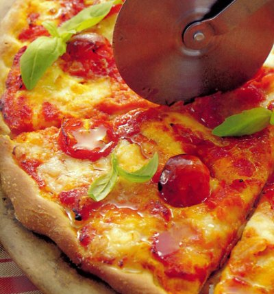

# Toppings

*The balance question. Too much topping turns the pizza into a sandwich on bread. Too little leaves the dough dominant. This page covers what to layer, how much, and which toppings go in raw vs cooked-first vs added after the bake.*

## Overview
The Italian phrase that governs pizza topping is *poche cose, ma buone*: few things, but good ones. A great pizza has 3-4 toppings beyond the sauce and cheese, and each is there because it brings something specific. A pizza with eight different toppings tastes muddled at best and like a salad-sandwich at worst.

The rules:
1. **Less is more.** Resist the urge to add another ingredient.
2. **Layer thoughtfully.** Sauce, then cheese, then heavy toppings, then light toppings, then oil. Each layer at its right moment.
3. **Topping size matters.** Most pizza toppings are sliced thin or torn small. Whole cherry tomatoes are an outlier; everything else is bite-size or smaller.
4. **Three things bake well together.** A pizza loaded with seven ingredients does not bake evenly; the top is dry while the bottom is wet.

## When Toppings Go On (And When They Don't)

Toppings split into four categories by when they meet the pizza.

### 1. Goes on Before the Bake

The classics. They benefit from the oven's heat or melt-and-merge into the cheese.

- **Sliced meats:** salami, pepperoni, chorizo, prosciutto cotto, ham, pancetta.
- **Cooked meats:** browned sausage (broken into pieces), meatballs (halved or quartered), shredded chicken.
- **Sturdy cheeses:** mozzarella di bufala, fior di latte, fontina, taleggio.
- **Hardy vegetables:** thin onion slices, sliced red pepper, mushroom (small caps; large ones release water), olives (pitted), capers.
- **Herbs:** dried oregano, fresh thyme, fresh rosemary.
- **Oil:** a light drizzle of extra virgin olive oil over everything.

### 2. Goes on Halfway Through the Bake

A small set of toppings benefit from less heat than the rest of the pizza gets.

- **Cherry tomatoes:** halved, scattered after 3-4 minutes. Cook just enough to soften but not collapse.
- **Soft-melt cheeses:** gorgonzola dolce, fresh ricotta dollops. Added halfway so they melt without splitting.

### 3. Goes on After the Bake

The "raw" finishing toppings. They are not for cooking; they are for contrast.

- **Cured / fresh meats not meant for heat:** prosciutto crudo, mortadella, bresaola, lardo, raw 'nduja.
- **Burrata:** torn pieces dropped onto the hot pizza. The cream interior should melt against the cheese but the casing should stay distinct.
- **Salad / herb leaves:** rocket, basil (whole leaves), micro-herbs.
- **Citrus zest:** lemon or orange zest grated over the hot pizza.
- **Acidic finishing oils:** chilli oil, truffle oil, garlic oil.
- **Truffle:** thinly shaved, never baked.
- **Fresh ricotta dollops:** if not melted in.
- **Toasted nuts:** pine nuts, walnuts, hazelnuts (scattered after bake so they don't burn).

### 4. Never Goes on a Pizza (Personal Rule, Take It or Leave It)

- **Pineapple.** The ham-and-pineapple wars are old; the case for pineapple is texture and sweet-savoury contrast, the case against is that the water content makes the base soggy and the fruit overpowers everything else.
- **Sweetcorn.** Watery and small enough to roll off; rarely improves anything.
- **Raw garlic, in quantity.** A few paper-thin slices fine; a sprinkle of fresh-pressed garlic burns and turns bitter.
- **Pre-cooked frozen vegetables.** They release water during the bake and turn the pizza soggy.

These are conventions, not rules. Disregard if you have a clear reason.

## How Much

The single most common home-pizza mistake: too much topping.

A guide for a 30 cm pizza:
- **Sauce:** 5-6 tbsp.
- **Cheese:** 80-100 g (sliced thinly or torn small).
- **Heavy savoury topping (salami, sausage, etc):** 50-70 g.
- **Light topping (mushroom, pepper, onion):** 30-50 g.
- **Fresh herb / salad finish:** a small handful.

Total weight of topping (excluding sauce and cheese): no more than 100-120 g for the pizza to bake evenly. Past that, the centre stays wet.

## Topping by Recipe (Worked Examples)

### Margherita
- Sauce: red
- Cheese: 80 g torn fior di latte or mozzarella di bufala (the latter only added after the bake)
- Topping (before bake): nothing
- Finish: fresh basil leaves, olive oil drizzle
- The simplest pizza. The cheese-tomato-basil triangle is the whole point. See [Margherita](../../cuisine/italian/pizza/margherita.md).

### Pancetta and Rocket
- Sauce: red
- Cheese: 80 g torn mozzarella
- Topping (before bake): 50 g sliced pancetta
- Finish: handful of rocket leaves dressed with olive oil and lemon, scattered on after the bake
- The rocket is fresh and dressed. See [Pancetta and Rocket](../../cuisine/italian/pizza/pancetta-and-rocket-pizza.md).

### Burrata and Herb
- Sauce: red, thin
- Cheese: 60 g mozzarella (under the burrata for melting)
- Topping (before bake): nothing
- Finish: 1 ball burrata, torn over the hot pizza; fresh basil; olive oil; cracked black pepper
- See [Burrata and Herb](../../cuisine/italian/pizza/burrata-and-herb-pizza.md).

### Calabrese
- Sauce: red
- Cheese: 80 g mozzarella
- Topping (before bake): 50 g sliced spicy salami, 1 tsp nduja dabbed in spots, sliced red onion (thin)
- Finish: fresh basil, olive oil
- See [Calabrese](../../cuisine/italian/pizza/calabrese.md).

### Sausage and Fennel
- Sauce: red
- Cheese: 80 g mozzarella
- Topping (before bake): 80 g Italian sausage (skins removed, crumbled raw), 1 tsp fennel seeds, thin red onion
- Finish: fresh basil, olive oil
- See [Sausage and Fennel](../../cuisine/italian/pizza/sausage-fennel-pizza.md).

### Pissaladier (Provençal)
- Sauce: no tomato; thick layer of slow-cooked caramelised onion
- Cheese: none
- Topping (before bake): anchovy fillets arranged in a lattice, pitted black olives
- Finish: olive oil drizzle, thyme
- See [Pissaladiers](../../cuisine/italian/pizza/pissaladiers.md).

## The Water Problem

Most home pizzas come out wet in the middle. The cause is almost always too much water in the toppings.

Wet offenders:
- **Fresh mozzarella, dripping:** drain on muslin or paper towel for 10 minutes before topping. Tear into pieces; do not slice with a knife (slicing seals the cut edge and traps moisture).
- **Mushrooms:** dry-sauté or roast briefly first, then top.
- **Cherry tomatoes:** halved is fine; whole release more water.
- **Wet greens (spinach, kale):** wilt and squeeze first, or omit and add raw after the bake.
- **Bell peppers:** slice thin so they cook through; thick slices stay watery.

The two-line rule: anything with visible surface moisture goes on dry. Anything that releases water in the oven goes on after.

## Common Mistakes

**The pizza is wet in the middle.**
Too many wet toppings, or too much cheese. Drain anything that drains; reduce cheese by a quarter.

**The toppings burned but the centre is undercooked.**
Either oven too cool overall, or too much topping. Reduce topping next time; oven hotter.

**The base soaked through.**
Too much sauce, too wet a cheese, too long a bake. Less sauce, drained cheese, faster bake. See [Cooking Methods](cooking-methods.md).

**The pizza tastes muddled.**
Too many toppings. Pick three things and trust them.

**Salami / pepperoni cupped into rigid curls.**
That is actually correct for traditional pepperoni (the curl holds oil pockets). For salami, slice slightly thicker (3-4 mm).

**The fresh herbs withered.**
Added before the bake. Fresh basil, rocket, etc. go on after the bake, never before.

**The base is overpowered by raw garlic.**
Used too much, or used minced rather than thin-sliced. Garlic should be present, not aggressive.

## Where Next
- [Dough](dough.md): the structure under everything.
- [Sauce](sauce.md): the layer beneath toppings.
- [Cheese](cheese.md): the dedicated cheese deep-dive.
- [Cooking Methods](cooking-methods.md): the bake that brings it all together.
- [Margherita](../../cuisine/italian/pizza/margherita.md): the canonical topping-restraint example.
