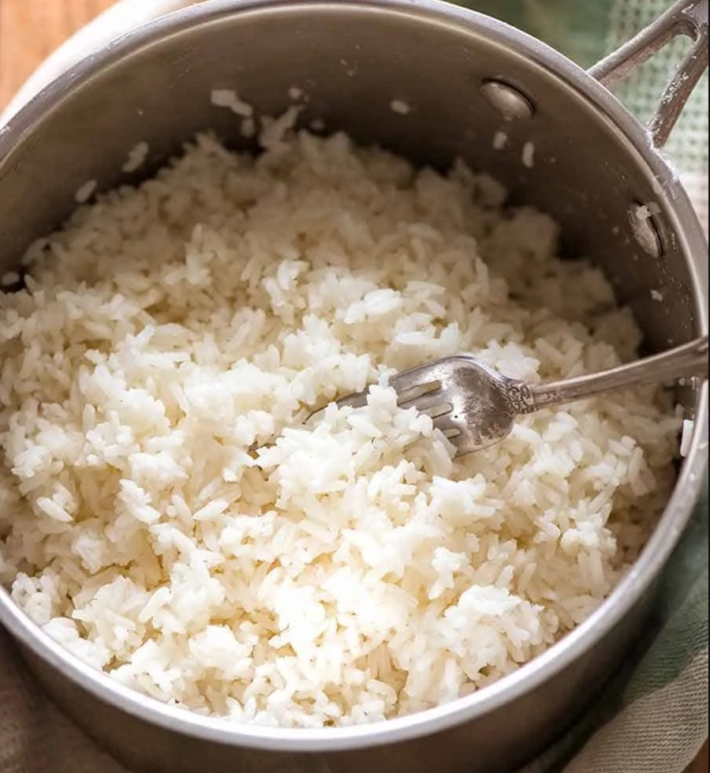

# Absorption Method

*This is the method most of the world uses for rice. The rice goes in with the right amount of water, the lid goes on, and nothing leaves the pan. Once you get the ratios right, you can cook rice without thinking about it. It works for basmati next to curry, jasmine next to a Thai dish, and short-grain for sushi.*

## Overview
Absorption cooking is the opposite of boiling. There is no draining. The rice goes in with the precise amount of water it needs, the pan is sealed, and the rice cooks until every drop is gone. What you take off the heat is what you serve.

It is the most-used rice method on the planet. Done well, it gives separate, fluffy grains with full flavour (nothing is poured down the drain). Done badly, it gives sticky, gluey, undercooked or scorched rice. The difference is technique, not the rice.

## The Science

When rice cooks in water, three things happen:

1. **Hydration.** Water penetrates the grain. The starch granules swell.
2. **Gelatinisation.** Once hydrated, the starch transitions from rigid to soft. The grain becomes edible.
3. **Resting.** The grain stabilises. Moisture redistributes evenly. The texture firms slightly.

The absorption method maximises all three because nothing leaves the pan. The aromatic oils, the natural sugars and the surface starch all end up in the finished rice. Boiling, by contrast, sends those compounds down the sink with the cooking water.

The cost is precision. You cannot fix a misjudged water ratio mid-cook. The pour-and-walk-away nature of the method demands you get the inputs right at the start.

## The Five Steps

### Step 1 - Rinse
Place the rice in a sieve or wide bowl. Rinse under cold running water, stirring with your fingertips, until the water runs from milky to mostly clear (not perfectly clear). Drain thoroughly.

The rinse removes surface starch. Skipped, the starch glues the grains together as they cook. Done excessively (until water runs perfectly clear), you wash away aromatic compounds.

This step applies to long-grain rices (basmati, jasmine, Carolina). Skip for short-grain (Japanese, sticky rice, Korean) and risotto rice.

### Step 2 - Measure
The standard ratios:

| Rice              | Water Ratio | Cook + Rest        |
|-------------------|-------------|--------------------|
| Basmati (white)   | 1 : 1.5     | Boil + 40 min rest |
| Jasmine (white)   | 1 : 1.5     | Boil + 12 min rest |
| Long-grain (Carolina) | 1 : 2   | 18 min covered     |
| Short-grain (Japanese) | 1 : 1.2 | Boil + 10 min rest |
| Brown rice (any)  | 1 : 2.5     | 40 min covered     |

Measure by volume or weight. By volume is easier with a measuring cup. By weight is more precise: 1 g rice = 1 ml water for the base case, multiply by the ratio.

Use cold water. Starting with hot water rushes the gelatinisation and produces uneven grains.

### Step 3 - Combine and Cover
Place the rinsed rice in a heavy-based pan with a tight-fitting lid. Add the measured cold water. Add a pinch of salt (¼ tsp per cup of rice; this is salting the rice itself, not the cooking water).

Add fat now if you want it: 1 tbsp ghee, butter or vegetable oil per cup of rice gives a richer mouthfeel and helps separate the grains. Optional, not required.

Stir once to distribute. Then cover with the tight lid. From this moment until the rest is over, you do not lift the lid.

### Step 4 - Bring to Boil, Then Rest
Place over high heat. Listen for the steam pushing through the lid (5-10 minutes depending on pan and quantity). The moment you hear vigorous bubbling and see steam escaping:

- **Indian basmati**: remove from heat immediately. Leave covered, off the heat, for 40 minutes.
- **Jasmine / Japanese / short-grain**: turn to lowest heat for 10-12 minutes, then off the heat, covered, 5 more minutes.
- **Long-grain Carolina**: turn to lowest heat for 15-18 minutes, then off the heat, covered, 5 more minutes.

The off-heat rest is what separates absorption from any other method. The trapped steam continues to cook the rice from above while the heat retained in the pan cooks from below. Lifting the lid at any point during this rest releases the steam and stops the cook. The rice undercooks.

### Step 5 - Fluff
After the rest, remove the lid carefully (watch for escaping steam). Use a fork or chopstick (not a spoon) to gently lift the rice and separate the grains. Work upwards, not in a stirring motion. Stirring crushes the grains and releases starch.

The rice should look glossy, separate and slightly puffed. Transfer to a warm bowl and serve.

## The Pan and Lid Matter

The single most common reason absorption fails is the wrong pan. You need:

- **A heavy base.** Thin-bottomed pans heat unevenly; the rice at the centre scorches before the edges are done. A cast-iron, ceramic or thick aluminium pan is ideal.
- **A tight lid.** Loose-fitting lids release steam, and the rice never gets enough heat to finish the cook. If your lid wobbles, wrap a tea towel around the pan under the lid to seal it (folding the corners up on top so they do not catch fire).
- **The right size.** The pan should be no more than one-third full of rice plus water. A pan that is half-full or more cooks unevenly; the rice at the bottom over-cooks while the top is still raw.

Buy a dedicated rice pan if you cook rice more than twice a week. A 16 cm heavy-based saucepan with a tight lid will pay for itself.

## Variations on the Theme

### Persian Tahdig
After the standard cook, the rest is replaced with a low, sustained heat on a thick layer of fat at the bottom of the pan. The rice in direct contact with the fat crisps into a golden crust (the tahdig, "bottom of the pot"), eaten in pieces at the table. Saffron, sliced potato or thin flatbread can be laid down before the rice for variations.

### Japanese Rinse-and-Soak
Japanese rice is rinsed three to four times then soaked in measured cold water for 30 minutes before the heat is applied. The grains hydrate evenly before the cook, producing the bright, plump grains a sushi chef looks for.

### Indian Pilau / Pulao Start
The rice is first sautéed in ghee with whole spices (cumin, cardamom, bay) for a minute or two, then water is added and the absorption method continues as normal. The frying step coats the grains in flavoured fat. See [Pilau Rice](../../cuisine/indian/rice/pilau-rice.md) for the master recipe.

## Troubleshooting

**The rice is wet at the bottom and dry at the top.**
The pan was too tall and narrow, or you started with too much rice for the pan. Use a wider, shallower pan, or split into two batches.

**The rice is undercooked.**
Either the water ratio was too low for this rice, or you lifted the lid mid-rest and lost steam. Try the same recipe with 5% more water and resist the lid next time.

**The rice is mushy.**
Too much water, or rested too long. Reduce water by 5%; reduce rest by 5 minutes. If the rice was rinsed inadequately, the surface starch broke down during the long cook.

**The rice scorched at the bottom.**
Either the heat was too high during the boil, or the pan is too thin. Drop the heat earlier in the boil step (as soon as you hear vigorous bubbling), or use a thicker pan.

**The grains stuck together.**
Surface starch was not rinsed off. For long-grain rices, rinse until the water is no longer milky.

**The rice tastes flat.**
You used too much water and the flavour leached out, or you forgot the salt. The pinch of salt at Step 3 makes a noticeable difference.

## What This Method Is Not For

Absorption is not for:

- **Risotto**: risotto requires constant stirring and slow stock addition; the starch release is the whole point.
- **Paella**: paella is unstirred absorption on a wide, shallow pan with a deliberate caramelised bottom (socarrat).
- **Sticky desserts**: Thai mango-and-sticky-rice and similar use a steaming basket, not a sealed pan.

For those, use the specialist methods. Absorption is the everyday foundation.

## Where Next
- [Steamed Rice](../../cuisine/indian/rice/steamed-rice.md): the master recipe in detail.
- [Pilau Rice](../../cuisine/indian/rice/pilau-rice.md): absorption with a fried-rice start.
- [Kashmiri Pulao](../../cuisine/indian/rice/kashmiri-pulao.md): festive, with nuts and dried fruit.
- [Rice Course landing](rice.md): back to the main course page.
