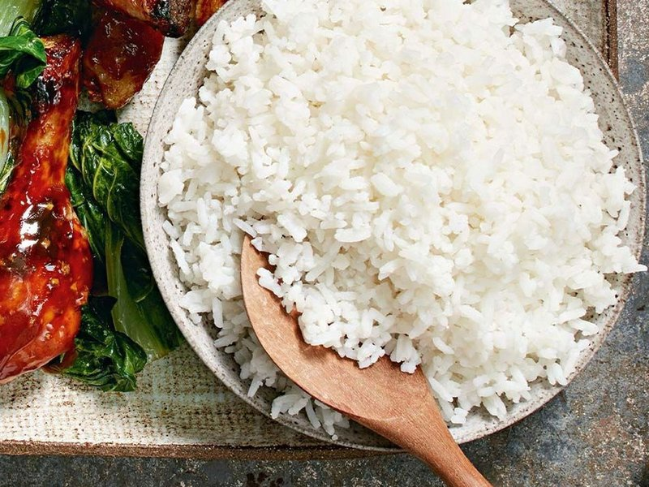

# Boiled Rice

*The pasta-style cooking method: rice goes into plenty of boiling water, drains when al dente. Faster than absorption, more forgiving, but loses some aromatic compounds with the cooking water. The right choice for biryani layers, rice salads and any time you need par-cooked rice as a stepping stone.*

## Overview
Boiled rice (also called pasta-method, or excess-water method) treats rice the way you treat dried pasta. A big pan of water comes to a rolling boil, the rice goes in, you cook to taste, you drain the water away. No measured ratio, no lid, no rest period.

It is the most forgiving method (impossible to scorch, hard to overcook badly), and the fastest (15-18 minutes start to finish for white rice). The compromise is flavour: the cooking water carries off some aromatic compounds and surface starch. For everyday eating with a punchy curry or sauce that brings its own flavour, the loss is invisible. For a clean, fragrant rice next to plain proteins, absorption is better.

## When to Use It

Boiled rice is the right call for:

- **Biryani assembly.** Layered biryanis call for rice that is parboiled (about 70% cooked) then finished by steaming on top of the meat. The drain step gives precise control over the parboil level.
- **Rice salads.** A salad wants cold, separate grains, not creamy ones. Drain, rinse with cold water, dress.
- **Rice with a strong sauce.** If the rice is going under a curry, jus or stew, the sauce dominates and the rice contributes texture more than flavour.
- **When you are not sure how much water the rice needs.** Mixed bags, old rice, unfamiliar varieties: the boil method works regardless.
- **Quick weeknight cooking.** Faster than absorption (no 40-minute rest).

It is the wrong call for:

- Plain rice as a clean side (use absorption).
- Risotto (the starch matters; you do not want to drain it).
- Sticky rice or sushi rice (the texture comes from the absorption method).
- Coconut rice (the coconut milk would be drained off).

## The Standard Method (Plain Boiled Rice)

For long-grain white rice (basmati, jasmine, Carolina), serving 4.

### Ingredients
- 300 g (1 ½ cups) long-grain rice
- Salt for the water (about 10 g per 2 litres, like pasta)
- 2 litres water

### Method

1. Bring 2 litres of water to a rolling boil in a wide pan. Add a tablespoon of salt.
2. Rinse the rice briefly under cold water (until the water runs milky but not perfectly clear).
3. Tip the rice into the boiling water. Stir once to prevent clumping at the bottom.
4. Reduce to a steady simmer. Do not cover.
5. Cook for 10-14 minutes, depending on the rice:
   - Basmati: 10-12 minutes
   - Jasmine: 11-13 minutes
   - Long-grain Carolina: 13-14 minutes
6. Test after 9 minutes by tasting a grain. It should be tender but with a tiny firm bite at the very centre (al dente). Cook 1-2 more minutes if needed.
7. Tip the rice into a colander or sieve. Let drain for 1 minute. Shake gently.
8. Tip the drained rice into a warmed serving bowl. Fluff with a fork. Serve immediately.

For brown rice, increase cooking time to 30-35 minutes. For wild rice, 45-50 minutes. Otherwise the method is identical.

## Parboiling for Biryani

Layered biryanis (lahori, hyderabadi, lucknowi) call for rice that is half-cooked, then finished by steaming over the meat.

### Method
1. Bring a large pan of heavily salted water to a rolling boil (2 tbsp salt per 2 litres). The salt seasons the rice in this single step.
2. Add whole spices to the water: 4 cardamom pods, 1 cinnamon stick, 4 cloves, 2 bay leaves. The rice picks up perfume in the cooking water.
3. Tip in the rinsed rice.
4. Cook for 5-7 minutes. The grains should still have a hard centre when squeezed between two fingers. The outside is tender, the inside is raw.
5. Drain immediately. Spread on a tray to stop the cooking. Discard the spices.
6. Layer over the cooked meat. Cover the pot, finish on dum (low heat, sealed) for 25-30 minutes.

The trick is stopping the boil before the rice is fully cooked. Over-parboiled rice produces a mushy biryani. Under-parboiled produces crunchy rice in the finished dish.

See: [Lahori Mutton Biryani](../../cuisine/lahori/rice/lahori-mutton-biryani.md), [Goan Chicken Biryani](../../cuisine/goan/rice/goan-chicken-biryani.md).

## Rice for Salad

A cold rice salad needs grains that hold their shape and stay separate. Boil-and-drain gives exactly this.

### Method
1. Boil the rice as above (full cook, 10-14 minutes for white).
2. Drain through a sieve.
3. Rinse under cold running water for 30 seconds, fluffing the rice with your fingers. This stops the cooking and washes away surface starch.
4. Drain thoroughly. Spread on a tray lined with a clean tea towel for 10 minutes to dry.
5. Dress immediately. Cold rice absorbs dressing better when slightly damp than when bone dry.

Good rices for salad: basmati (fragrant), wild rice (texture), brown rice (chew), red rice (visual).

## The Salt Question

Boiled rice can be salted in three places:
- **In the cooking water** (like pasta): seasons the grain through and through. Best for the most penetrating flavour.
- **Just before draining:** less seasoned, more delicate.
- **After draining, stirred in:** controls the level precisely but the salt sits on the surface only.

Most professional kitchens salt the cooking water heavily. The rice absorbs maybe 10% of the salt during the boil; the rest goes down the drain. So 2 tbsp salt per 2 litres seasons the rice gently.

For rice that goes under a heavily-salted sauce (curry, ragu), use unsalted water; the sauce brings the salt.

## Common Mistakes

**The rice is mushy.**
Over-cooked. Drain earlier next time. The rice should still have a hint of firmness when you taste it; carry-over heat from the drain step takes it the rest of the way.

**The rice is grainy and starchy.**
Under-rinsed. Rinse the raw rice until the water runs from milky to mostly clear before boiling.

**The rice is sticky in clumps.**
Not enough water (use more next time, 6-8 times the rice weight), or no initial stir to separate the grains.

**The rice tastes flat.**
Not enough salt in the cooking water. Try the pasta-method salt level: water should taste like the sea.

**The rice has a starchy crust at the bottom of the pan.**
You forgot to stir at the start, or the heat was too high. Stir once when adding the rice, keep at a steady simmer not a hard boil.

**The rice cooked through but is still hard at the centre.**
Old rice. Old rice needs longer cooking and more water. Soak it in cold water for 20 minutes before boiling next time, and add 2-3 minutes to the cook.

## Where Next
- [Absorption Method](absorption-method.md): the standard sider for everyday rice.
- [Pilaf](pilaf.md): rice that is fried first, then absorbed.
- [Fried Rice Technique](fried-rice-technique.md): what to do with leftover boiled rice.
- [Lahori Mutton Biryani](../../cuisine/lahori/rice/lahori-mutton-biryani.md): the classic parboil-then-steam preparation.
