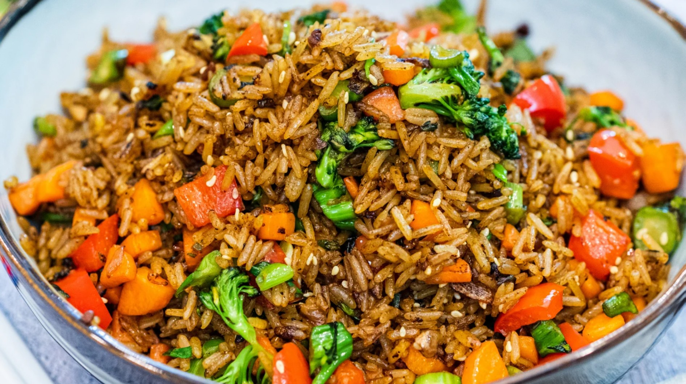

# Fried Rice Technique

*If your fried rice always ends up gluey and disappointing, there's one simple fix: cook the rice yesterday. Cold day-old rice from the fridge is what restaurants use, and it makes all the difference. Once you know that, the rest is just wok work, and we'll cover that too.*

## Overview
Fried rice is the most-cooked rice dish on earth. Every country east and south-east of the Himalayas has its version: Chinese egg fried rice, Thai khao phad, Indonesian nasi goreng, Filipino sinangag, Korean bokkeumbap. The technique is the same everywhere: cold, dry, day-old cooked rice goes into a screaming-hot wok with flavoured oil, aromatics and small pieces of protein or vegetable, gets tossed for two minutes, lands on the plate.

The thing the technique is NOT is "rice cooked in a frying pan". Freshly cooked rice fried in oil produces a gluey, wet, sticky mass, not separated grains with caramelised edges. The cold-rice rule is non-negotiable.

## Why Day-Old Rice

Freshly cooked rice is full of water and surface starch. The starch is gelatinised (soft, sticky) from the cooking. Try to fry it and the starch glues everything together; the water steams off and turns the rice mushy.

After a night in the fridge, two things have happened:

1. **Surface moisture has evaporated.** The grains are noticeably drier.
2. **The starch has retrograded** (recrystallised). The grains have firmed up and become structurally distinct from each other. They will not glue together when stirred.

This is exactly what fried rice needs: separate, firm, dry grains that can absorb the seasoning without collapsing.

### How Long Is "Day Old"?

- **Minimum:** 4-6 hours in the fridge. Long enough for the rice to fully cool and start drying.
- **Optimum:** overnight. 8-12 hours covers it.
- **Maximum:** 3-4 days. After that the rice is too dry and breaks up.

If you must make fried rice the same day: cook the rice, spread it on a tray in a single layer, and fan it cool or put it in a low oven (60°C) for an hour. The drying step approximates an overnight fridge stay. Not as good, but workable.

## What Rice to Use

The same rices that work for absorption work for fried rice. The defaults:

- **Jasmine** (Thai, Chinese): the standard. Long-grain, mildly sticky when cooked, separates cleanly when dry.
- **Basmati** (Indian fried rice): more aromatic, slightly drier. Often used for Indian fried rice.
- **Short-grain** (Japanese, Korean): used for some Korean fried rice. More starchy, more sticky; the wok work has to be more aggressive to keep it separate.

Avoid: risotto rice (too starchy), instant rice (too uniform a texture), brown rice (works but takes longer and produces a denser dish).

For 4 portions of fried rice: 600 g of cooked rice (which is about 200 g of raw rice cooked).

## The Wok Setup

Fried rice wants very high heat: 240°C plus. A home gas burner on full produces about 200°C. An induction hob produces less. Restaurant fried rice tastes different than home fried rice largely because of this temperature gap.

The fix:
1. **Use the smallest pan that fits the volume.** A small wok or large frying pan that the burner can fully heat.
2. **Pre-heat the pan empty for 2 minutes** until it just starts to smoke. Then add the oil.
3. **Cook in small batches.** Half the rice at a time. A heavily loaded pan drops temperature too far.
4. **Use a high-smoke-point oil.** Vegetable, groundnut, sunflower, ghee. Olive oil burns at this heat.

## The Universal Method

A baseline egg fried rice. Variations follow.

### Ingredients (Serves 2)

- 300 g cooked, cold, day-old rice (long-grain, fluffed and separated)
- 2 tbsp neutral oil
- 2 eggs, beaten
- 2 spring onions, white and green parts separated, both sliced thinly
- 2 garlic cloves, finely chopped
- 1 tsp soy sauce
- ½ tsp sesame oil
- Pinch of white pepper
- Pinch of salt (taste before adding; the soy is salty)

### Method

1. Heat a wok or large frying pan over highest heat for 2 minutes. The pan should smoke faintly.
2. Add 1 tbsp of oil. Swirl to coat.
3. Pour in the beaten eggs. Let them set for 5 seconds, then stir-scramble with a spatula, breaking into small curds. Tip out onto a plate when just set, about 30 seconds. Do not overcook.
4. Add the remaining 1 tbsp oil. Add the white parts of the spring onion and the garlic. Stir-fry 10 seconds; do not brown the garlic.
5. Add the cold rice. Press it down with the back of the spatula, then break up any clumps with a chopping motion. Toss the rice for 2 minutes, keeping every grain in contact with the hot pan as much as possible. The rice should turn from clumpy and pale to separate and lightly golden.
6. Add the soy sauce and white pepper. Toss to distribute.
7. Return the eggs to the pan. Toss for 20 seconds to combine.
8. Off the heat: add the sesame oil and the green parts of the spring onion. Toss once. Plate immediately.

Total time from oil hits the pan: about 4 minutes.

## Variations by Cuisine

### Chinese Yangzhou Fried Rice
The classic "house" fried rice. Add 100 g diced char siu (Chinese roast pork), 60 g cooked prawns, 50 g frozen peas (defrosted), at step 4 with the aromatics. Otherwise as above.

See: [Chinese Fried Rice](../../cuisine/chinese/fried-rice.md).

### Thai Khao Phad
Add 1 tsp fish sauce instead of soy sauce. Garnish with cucumber slices, lime wedges, and chopped coriander. Often served with a Thai chilli-and-fish-sauce condiment (prik nam pla) on the side.

### Indonesian Nasi Goreng
Add 1 tbsp kecap manis (sweet soy sauce) and 2 tsp sambal (chilli paste) at step 6. Garnish with a fried egg, a sprinkle of fried shallots and prawn crackers.

### Korean Kimchi Bokkeumbap
Add 200 g chopped kimchi at step 4 with the aromatics. Use the kimchi liquid as part of the seasoning (1 tbsp). Top with a fried egg and a sprinkle of gochujang.

### Filipino Sinangag (Garlic Fried Rice)
Strip back to just rice, garlic and salt. Lots of garlic (6-8 cloves per portion), fried until pale gold, then the rice. Served at breakfast with eggs and tocino (cured pork).

### Indian Fried Rice
Add curry powder or garam masala to the oil, plus diced vegetables (carrot, peas, capsicum) fried separately first. Often served as part of an Indo-Chinese meal.

See: [Indian Fried Rice](../../cuisine/indian/rice/fried-rice.md).

## Wok Hei (the Breath of the Wok)

The distinctive smoky char of restaurant Chinese fried rice. It comes from droplets of oil vaporising on the wok's surface and the rice scorching slightly at contact points.

How to chase it at home:
- Get the wok hot before adding oil (2-minute pre-heat on full).
- Toss the rice rather than stir. Lift, drop, toss again. Each toss exposes new grains to the hot pan.
- Do not overcrowd. Cook half the volume in two batches if the pan struggles.
- Add a small splash (1 tsp) of Shaoxing rice wine to the pan during the rice fry; the alcohol vapour ignites briefly and flavours the rice.

True wok hei needs a 100,000-BTU professional burner. Home cooks get a respectable approximation.

## Common Mistakes

**The rice is wet and clumpy.**
Used fresh rice. Use day-old.

**The rice is greasy.**
Too much oil, or the pan was not hot enough. Less oil, more heat.

**The rice tastes flat.**
Not enough sauce or aromatics, or no high-heat fry. Push the heat harder.

**The garlic burned and tastes bitter.**
Added the garlic to oil that was too hot, or fried for too long. Garlic goes in for 10 seconds, no more.

**The pan smokes immediately and the food chars.**
Wok or pan is too thin for the high heat. Use a heavier pan, or reduce heat slightly.

**The eggs are tough and rubbery.**
Eggs over-cooked. They should be just set, soft-scrambled, removed in 30 seconds.

**The rice is dry and tough.**
Old rice that has dried out too much (4+ days), or fried too long. Use rice no more than 3 days old; cook the rice no more than 2 minutes after adding to the pan.

## Where Next
- [Absorption Method](absorption-method.md): how to cook the rice the night before.
- [Boiled Rice](boiled-rice.md): an alternative cook method for the base rice.
- [Pilaf](pilaf.md): if the leftover rice is pilau, the fried rice picks up its spices for free.
- [Chinese Fried Rice](../../cuisine/chinese/fried-rice.md): the canonical Yangzhou version.
- [Indian Fried Rice](../../cuisine/indian/rice/fried-rice.md): Indo-Chinese fusion.
