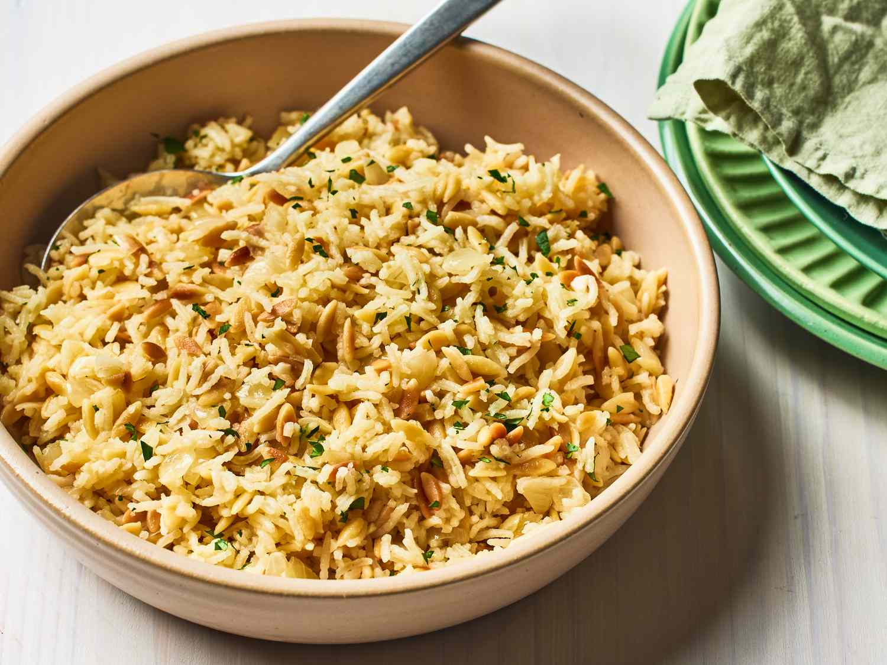

# Pilaf

*Pilaf is rice with a head start: a quick fry in fat with whole spices before any water touches it. The grains pick up flavour, stay separate as they cook, and gain a nutty edge that plain steamed rice never quite gets. Persians, Indians, Afghans, Turks and East Africans all have their own version, and once you've got the basic move, theirs slot right in.*

## Overview
Pilaf (also spelled pilau, pulao, polow, plov, depending on the cuisine) is the most versatile of the rice methods. It is the standard for everyday eating across an enormous swathe of the world: from Iranian polo through Indian pilau, Lebanese rice-and-vermicelli, Afghan kabuli pulao, Uzbek plov, East African pilau and Turkish pilav. Every cuisine has its own version, but they share the same two-step technique:

1. **Fry first.** Rice is sautéed in fat (ghee, butter, oil) with whole spices until the grains turn translucent at the edges and smell toasted.
2. **Absorb after.** Hot liquid (stock or water) is added; the pan is covered; the rice cooks by absorption until the liquid is gone.

The fry step is what separates pilaf from plain steamed rice. The fat coats each grain in a thin film, which keeps the grains from sticking together during the absorption phase. The spices fried in the oil give the dish its flavour profile.

## The Universal Template

This is the form pilaf takes everywhere. Different cuisines vary the spices and the liquid.

### Ingredients (Serves 4)
- 300 g long-grain rice (basmati for Indian, jasmine for Thai, long-grain Carolina for Persian/Lebanese)
- 2 tbsp ghee, butter or vegetable oil
- 1 small onion, finely chopped
- Aromatic spice base (varies by cuisine — see below)
- 450 ml hot stock (chicken, vegetable, or water)
- ½ tsp salt

### Method

1. Rinse the rice under cold water until the water runs from milky to mostly clear. Drain thoroughly.

2. Heat the fat in a heavy-based pan over medium heat. Add the chopped onion, cook for 3-4 minutes until softened and translucent.

3. Add the whole spices. Fry for 30-45 seconds until aromatic. Do not burn them.

4. Add the rinsed, drained rice. Stir to coat every grain in the oil. Continue stirring on medium heat for 2-3 minutes. The rice should turn slightly translucent at the edges and smell faintly toasted. This is the bhuna step; do not skip it.

5. Pour in the hot stock. Stir once. Add the salt.

6. Bring to a boil. As soon as it boils, reduce to the lowest heat. Cover with a tight-fitting lid.

7. Cook covered for 12-15 minutes. Do not lift the lid.

8. Off the heat, leave covered for another 10 minutes. The rice continues to absorb steam during this rest.

9. Lift the lid. Fluff with a fork. Serve.

Total time: 35 minutes (mostly hands-off).

## Variations by Cuisine

### Indian Pilau
Whole spices in step 3: 4 cardamom pods (bruised), 1 cinnamon stick, 4 cloves, 2 bay leaves. Liquid: chicken or vegetable stock. Garnish: fried onion, raisins, sliced almonds.

See: [Pilau Rice](../../cuisine/indian/rice/pilau-rice.md), [Kashmiri Pulao](../../cuisine/indian/rice/kashmiri-pulao.md).

### Jeera (Cumin) Rice
A simpler Indian version. Spices in step 3: 1 tsp cumin seeds, 1 bay leaf. Nothing else. The cumin dominates and pairs beautifully with dal.

See: [Jeera Rice](../../cuisine/indian/rice/jeera-rice.md).

### Persian Polo
The rice is parboiled (boiled briefly in plenty of water) for 5 minutes first, then drained and steamed over a thick layer of fat. The bottom layer crisps into the tahdig. Saffron infused in hot water is drizzled over the cooked rice. Different technique to the universal template, but the principle (fry + absorb) holds.

### Lebanese Rice and Vermicelli
A handful of broken vermicelli noodles is fried in butter until golden brown before the rice goes in. The vermicelli adds nutty flavour and visual interest. No whole spices.

### Afghan Kabuli Pulao
The pilau is built around shredded carrots, sultanas and lamb. Carrots and raisins are first caramelised in fat, then the rice is added on top with the cooking liquid. Saffron tints the top layer.

### Uzbek Plov
Cooked in a kazan (a wide pot). Lamb and fat are seared first, then onions and carrots, then rice goes on top in a thick layer and the liquid is added carefully so as not to disturb the layering. The finished dish has visible strata.

### East African Pilau
A Swahili-coast preparation, Indian and Arab influence. Whole spices: cinnamon, cardamom, cloves, black pepper. Cooked with cubes of beef or goat. Often served with kachumbari (a fresh tomato-onion-chilli salad).

### Turkish Pilav
Often made with bulgur instead of rice. Method otherwise identical: fry the bulgur in butter, add hot stock, cover, absorb.

## The Aromatic Base

Different cuisines layer different aromatics in the fry step. The standard rotation:

- **Onion:** the foundation. Chopped fine, fried until soft and translucent (but not browned, unless making Persian polo).
- **Whole spices:** the cuisine signature. Always added after the onion is softened, fried just 30-45 seconds to release oils.
- **Garlic and ginger:** optional. Goes in with the onion in Indian versions.
- **Tomato puree:** optional. Adds depth in Uzbek and East African pilau. Goes in after the onion, before the rice.
- **Saffron:** infused in hot water or milk separately, drizzled over the finished rice (Persian) or added with the liquid (Indian festive versions).
- **Bay leaves, curry leaves:** added with the whole spices.

The order is: fat → onion (and any wet aromatics) → whole spices → rice → liquid.

## The Rice-to-Liquid Ratio

Pilaf is an absorption method, so the ratio matters as much as for plain steamed rice.

- Basmati pilaf: 1 : 1.5 (rice to liquid)
- Long-grain Carolina pilaf: 1 : 1.75
- Brown rice pilaf: 1 : 2.25
- Bulgur pilaf: 1 : 2

Cooking liquid is almost always hot when added. Cold liquid drops the pan temperature and lengthens the cook unevenly.

## Common Mistakes

**The rice is wet and sticky.**
Too much liquid, or the lid was lifted during the cook. Use less liquid next time; resist the lid.

**The rice is dry and the bottom scorched.**
Not enough liquid, or heat was too high. Drop the heat as soon as the boil starts. Pilaf wants a whisper of heat, not a roar.

**The grains are mushy and broken.**
The rice was over-rinsed (washed away all surface starch and protective coating) or stirred during the absorption phase. Stir only once after adding the liquid, never again.

**The flavour is flat.**
Spices were not fried long enough. They need 30-45 seconds in hot oil to release their flavour into the fat. Underfried spices taste raw and grainy in the finished rice.

**The spices burned and tastes bitter.**
Spices fried too long, or oil was too hot. The window between aromatic and burnt is 30 seconds. Watch and listen; pull from heat the moment the smell turns nutty.

**The rice is undercooked at the centre.**
Liquid was not hot enough when added, or rest period after the cook was skipped. The off-heat 10-minute rest is essential.

## Where Next
- [Absorption Method](absorption-method.md): the underlying technique pilaf uses for the second half.
- [Boiled Rice](boiled-rice.md): different method, useful as a stepping stone for biryani.
- [Fried Rice Technique](fried-rice-technique.md): what to do with leftover pilaf.
- [Pilau Rice](../../cuisine/indian/rice/pilau-rice.md): the classic Indian pilau.
- [Kashmiri Pulao](../../cuisine/indian/rice/kashmiri-pulao.md): festive, with nuts and dried fruit.
- [Lahori Chana Pulao](../../cuisine/lahori/rice/lahori-chana-pulao.md): with chickpeas.
- [BIR Curry Course](../bir-curry/bir-curry.md): pilau is the standard rice for a BIR plate.
