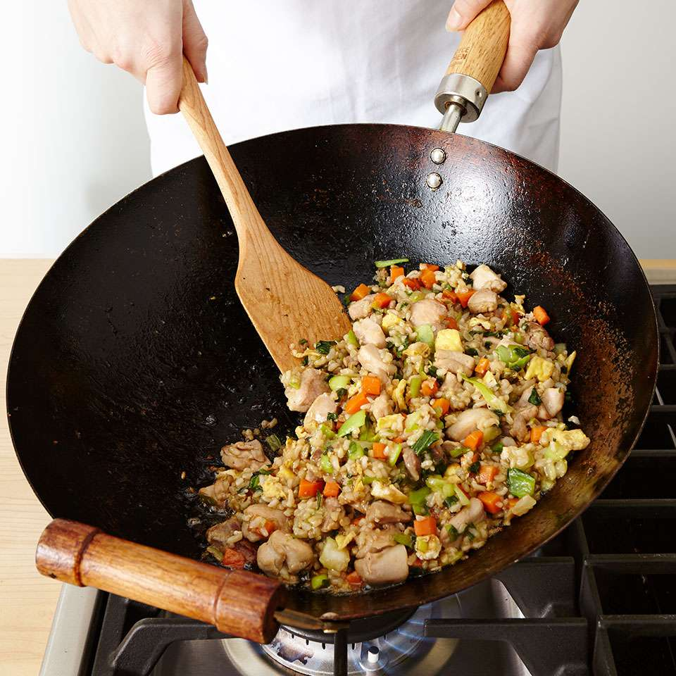

# Rice Course

*A bag of rice can become four very different dishes depending on how you cook it. Your stir-fried rice would be wetter than it should be; your basmati next to a curry would be drier and fluffier than the same grains would be in a paella. We'll walk through the four methods so you can match the right one to what you're cooking.*

## Overview
A bag of rice can be cooked four very different ways. Each method gives a different finished texture, fits a different cuisine and pairs with a different style of food. The mistake most home cooks make is using one method (usually the rice-cooker absorption) for everything. The reason your fried rice is wet, your risotto is gluey or your basmati clumps into a starchy mass is not the rice. It is the technique.

This course walks through the four methods, explains the science behind each, and shows you which to use when.

## The Four Methods

### 1. Absorption (Steamed)
The rice cooks in a measured amount of water that all gets absorbed. No draining. The grains stay separate, dry and fluffy. This is the gold standard for basmati served alongside curry, and for any long-grain rice intended to be a clean side. Requires a tight-fitting lid and the discipline not to lift it.

See:
- [Absorption Method](absorption-method.md): the deep-dive.
- [Steamed Rice](../../cuisine/indian/rice/steamed-rice.md): the master recipe.

### 2. Boiled (Pasta-Style)
The rice cooks in plenty of unsalted boiling water (like pasta) and is drained when al dente. Faster and more forgiving than absorption; less aromatic because the cooking water carries flavour away. Suited to short-cook applications: rice salads, the second-bake stage of biryani, or any time you need par-cooked rice for a later step.

See:
- [Boiled Rice](boiled-rice.md): the deep-dive.
- [Lahori Mutton Biryani](../../cuisine/lahori/rice/lahori-mutton-biryani.md): uses parboiled rice as a layer.

### 3. Pilaf (Pilau, Pulao)
The rice is fried first in oil or ghee with whole spices, then water is added and the pan is covered. The frying step coats each grain in fat, which keeps them separate during the cook and adds a nutty toast. Hugely versatile: pilau accompanies almost every cuisine from Persia through India and out to East Africa.

See:
- [Pilaf Method](pilaf.md): the deep-dive.
- [Pilau Rice](../../cuisine/indian/rice/pilau-rice.md): the classic Indian version.
- [Kashmiri Pulao](../../cuisine/indian/rice/kashmiri-pulao.md): with nuts and dried fruit.
- [Jeera Rice](../../cuisine/indian/rice/jeera-rice.md): cumin-flecked, the simplest pilau.

### 4. Fried Rice
Starts with cold, day-old, already-cooked rice. High heat, fast wok work, dry rice tossed in flavoured oil with aromatics and bite-sized fillings. The defining technique of Chinese, Thai and Indonesian rice dishes. The wet, sticky fried rice most home cooks produce is from using freshly cooked rice; old rice is the trick.

See:
- [Fried Rice Technique](fried-rice-technique.md): the deep-dive.
- [Chinese Fried Rice](../../cuisine/chinese/fried-rice.md)
- [Indian Fried Rice](../../cuisine/indian/rice/fried-rice.md)

## Which Method for Which Cuisine

| Cuisine            | Default Method  | Notes                                                   |
|--------------------|-----------------|---------------------------------------------------------|
| Indian (everyday)  | Absorption      | Basmati, often with a knob of ghee.                     |
| Indian (festive)   | Pilaf / Biryani | Saffron, whole spice, sometimes layered with meat.      |
| Persian / Afghan   | Absorption + tahdig | Long bulk soak, layered with butter, crispy bottom. |
| Chinese            | Absorption then fry | Steam first, cool, then wok the next day.           |
| Japanese           | Absorption (short-grain) | Sticky on purpose; the sushi standard.         |
| Thai (jasmine)     | Absorption      | Sticky-fluffy, holds curry sauce.                       |
| Italian (risotto)  | Specialist absorption | Stirred constantly, stock added in stages.        |
| Spanish (paella)   | Unstirred absorption | The opposite of risotto; never touch the rice.     |
| Middle Eastern     | Pilaf           | With vermicelli, the basis of "rice and lentils".       |
| West African       | Boiled or jollof | Jollof is parboiled then cooked in tomato base.        |

If you only know one method, you can fake any cuisine's rice. If you know all four, you can match each cuisine on its own terms.

## Rice Types

Not all rice cooks the same way. The starch profile of the grain shapes the method.

### Long-Grain
Basmati, jasmine, Carolina. High amylose starch. Cooks dry and fluffy when treated correctly. The default for absorption and pilaf. Pre-rinsing is important (removes surface starch that would otherwise glue the grains together).

### Medium-Grain
Arborio, carnaroli, valencia. Higher amylopectin. Holds shape but releases starch into the cooking liquid, which is what makes risotto creamy. Used unrinsed (you want that starch).

### Short-Grain
Japanese (koshihikari), Thai sticky rice, Korean. Highest amylopectin. Cooks sticky on purpose. Used unrinsed or only lightly rinsed.

### Specialty
- **Brown rice**: any of the above, with the bran left on. Takes 40-45 minutes (vs 20-25 for white), needs about 20% more water.
- **Wild rice**: not technically rice (a grass seed). 45-55 minute cook, very high water ratio.
- **Red and black rice**: visible-bran rices used decoratively or in mixed-grain salads. Treat like brown rice.

## The Universal Rules

Three rules apply no matter which method you use:

### 1. Rinse Long-Grain, Not Medium- or Short-
Long-grain rices need a rinse under cold water (until the water runs clearer, not perfectly clear) to remove surface starch. Medium- and short-grain rices are usually unrinsed because you want their starch.

### 2. Match the Water to the Rice
The standard ratios:
- Basmati / jasmine: 1.5 parts water to 1 part rice (absorption).
- Long-grain (carolina, etc): 2 parts water to 1 part rice.
- Brown rice: 2.5 parts water to 1 part rice, plus 20 min longer.
- Pilaf: 1.5-2 parts liquid (often stock), depending on rice and whether you have added other ingredients.

### 3. Don't Lift the Lid
For absorption, lifting the lid during the cook releases steam. The cook stops. The rice never finishes. Every minute you check is a minute the rice undercooks. Set a timer, walk away, come back when it rings.

## Where to Start
- If you cook Indian, Persian or Asian food regularly: start with [Absorption](absorption-method.md). It is the everyday method and it is what most home cooks get wrong.
- If you want to use up leftover rice: jump to [Fried Rice Technique](fried-rice-technique.md).
- If you have a stew or biryani to layer: read [Boiled Rice](boiled-rice.md).
- If you want one technique that lifts any midweek meal: [Pilaf Method](pilaf.md).

## Where Next
- [Absorption Method](absorption-method.md): the foundation.
- [Steamed Rice](../../cuisine/indian/rice/steamed-rice.md): the master recipe.
- [BIR Curry Course](../bir-curry/bir-curry.md): rice is half the BIR plate.
