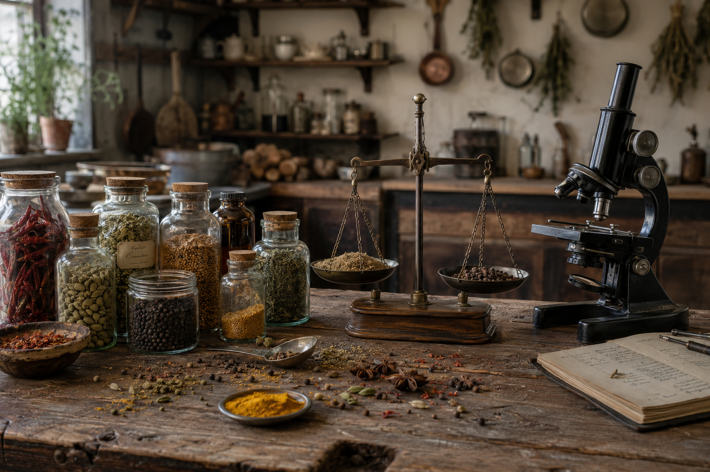

# Aroma and Science

*Every spice's smell is a small chemistry set of volatile oils. Understanding which compound does what helps you predict how a spice will behave in heat, in fat, in time, and in storage.*

## Overview
The aroma of a spice is not metaphorical. It is a measurable cocktail of small molecules - essential oils, terpenes, phenols, aldehydes - sitting in microscopic glands in the plant tissue. When the spice is whole and dry, those oils are trapped and stable. When the spice is ground, exposed to heat, or sitting in oxygen for months, the oils evaporate or oxidise and the spice fades.

You do not need to learn the chemistry to cook well. But knowing which compound is doing the work explains a lot of the rules of thumb that otherwise look arbitrary: why ground cumin fades in six months, why you bloom cardamom in milk, why black pepper added at the end tastes different from pepper cooked in for an hour, why turmeric stains everything yellow and what colour you can expect from saffron.

## The Volatile Oils

A spice's smell lives in tiny oil glands inside the plant tissue. These are called essential oils (also volatile oils, etheric oils, ethereal oils - same thing, different traditions). They are not oily in the slick-on-your-fingers sense; they are aromatic compounds that evaporate easily, which is why you can smell them.

Three things destroy them:

1. **Air.** Oxygen oxidises essential oils into less aromatic, sometimes off-tasting compounds.
2. **Light.** UV breaks down terpenes and other unstable molecules.
3. **Heat.** Volatile oils evaporate. A jar of ground cumin near the hob fades twice as fast as one in a cool cupboard.

A fourth thing - grinding - exposes the previously protected interior of the spice to all three at once. Ground spice always fades faster than whole.

## Where Heat Comes From (the Burning Kind)

Five chemicals are responsible for most of the burn we feel in spices:

- **Capsaicin** - chillies. Binds to TRPV1, the heat-and-pain receptor in your mouth. Fat-soluble, not water-soluble: milk and yoghurt cut chilli heat, water and beer barely do.
- **Piperine** - black pepper. Different receptor, milder bite, more bitter and resinous than capsaicin.
- **Allyl isothiocyanate** - mustard, horseradish, wasabi. Volatile and water-soluble; the burn goes up into the nose rather than staying on the tongue, and it fades fast.
- **Gingerol** (fresh ginger) and **shogaol** (dried ginger). Gingerol converts to shogaol during drying and cooking, which is why dried ginger is hotter than fresh.
- **Hydroxy-alpha-sanshool** - Sichuan pepper. Not a burn at all but a tingling, near-electric sensation that makes the lips and tongue feel anesthetised. Unique to the prickly ash family.

These are not interchangeable. Substituting black pepper for chilli changes the dish completely; the heat is there but the receptor pathway and the persistence are different.

## Where Warmth Comes From (the Non-Burning Kind)

"Warming" spices feel warm without burning. The compounds are different:

- **Eugenol** - cloves, allspice, nutmeg, cinnamon. The classic "Christmas spice" smell. Mild anaesthetic on contact (dentists use clove oil); very small amounts go a long way.
- **Cinnamaldehyde** - cinnamon and cassia. Sweet, slightly woody, the dominant aroma of a cinnamon stick.
- **Anethole** - star anise, fennel, anise seed. Sweet, liquorice-adjacent. The same compound is the basis of pastis, ouzo, sambuca and absinthe.
- **Cardamom oil (a mix)** - dominated by alpha-terpineol and a cineole that gives the slight menthol-cool sensation.
- **Cuminaldehyde** - cumin. Earthy, slightly bitter, the signature of any food cooked with cumin seed.

These compounds layer beautifully with the burning spices. The chilli-and-cinnamon combination of Mexican mole, or the cardamom-and-pepper combination of Indian biryani, work because the receptors are different and the brain reads the result as both warm and bright.

## Where Citrus Comes From

A surprising amount of spice aroma is citrussy. Lemon notes come from **limonene** (mostly) and **citral**. Both are terpenes - 10-carbon hydrocarbons - and they show up in:

- Coriander seed (the citrus character that distinguishes it from cumin)
- Cardamom (alongside the menthol-cool)
- Lemongrass, lemon verbena, lemon thyme (the herb side)
- Caraway and cumin (lower amounts, blended into the earthy notes)

Terpenes are particularly volatile. They are the first compounds to disappear from a stored spice; an old jar of ground coriander has lost most of its citrus and now tastes flat and earthy.

## Where Earthy and Resinous Come From

The "musty old herbarium" quality of cumin, turmeric, asafoetida and a lot of curry-leaf cooking comes from **sesquiterpenes** - bigger 15-carbon molecules than the terpenes above. These are less volatile, more stable in storage, and dominate the back-of-the-nose impression of a spice rack.

Turmeric's curcumin is in the same family. It is not very volatile (you do not smell turmeric strongly from a closed jar) but it is intensely coloured and bioavailable, which is why turmeric is used as much for colour as for flavour.

## Why Old Spices Taste Like Sawdust

Three things have happened to the bottle of ground cumin that has been at the back of your cupboard for two years:

1. Volatile terpenes have evaporated. The brightness is gone.
2. Eugenol and aldehydes have oxidised into less aromatic compounds.
3. Essential oils have polymerised - linked up into larger, less volatile molecules that smell of nothing.

The spice itself is not unsafe. It is just inert. Cooking with a flat spice does not give you back the missing aromas; heat releases what is there, and what is there is increasingly nothing. This is why [Storage](storage.md) matters more than home cooks tend to think.

## A Quick Reference Table

| Compound                | Found in                          | Sensation                    |
|-------------------------|-----------------------------------|------------------------------|
| Capsaicin               | Chillies                          | Burning, lingering, fat-soluble |
| Piperine                | Black pepper                      | Sharp bite, slightly bitter  |
| Allyl isothiocyanate    | Mustard, horseradish, wasabi      | Nasal burn, brief            |
| Gingerol / shogaol      | Ginger (fresh / dried)            | Warm bite                    |
| Hydroxy-alpha-sanshool  | Sichuan pepper                    | Tingling, numbing            |
| Eugenol                 | Clove, allspice                   | Warm, slightly anaesthetic   |
| Cinnamaldehyde          | Cinnamon, cassia                  | Sweet, woody                 |
| Anethole                | Star anise, fennel, anise         | Sweet, liquorice             |
| Limonene / citral       | Coriander seed, cardamom          | Citrus, lifted               |
| Cuminaldehyde           | Cumin                             | Earthy, bitter-edged         |
| Curcumin                | Turmeric                          | Mild aroma, intense colour   |

## Where Next
- [Blooming and Toasting](blooming-and-toasting.md): how to use heat to release the volatile oils described here.
- [Storage](storage.md): how to slow down the evaporation and oxidation that ages a spice.
- [Mixes](mixes.md): how regional blends layer the compound families above to produce a distinct flavour profile.
