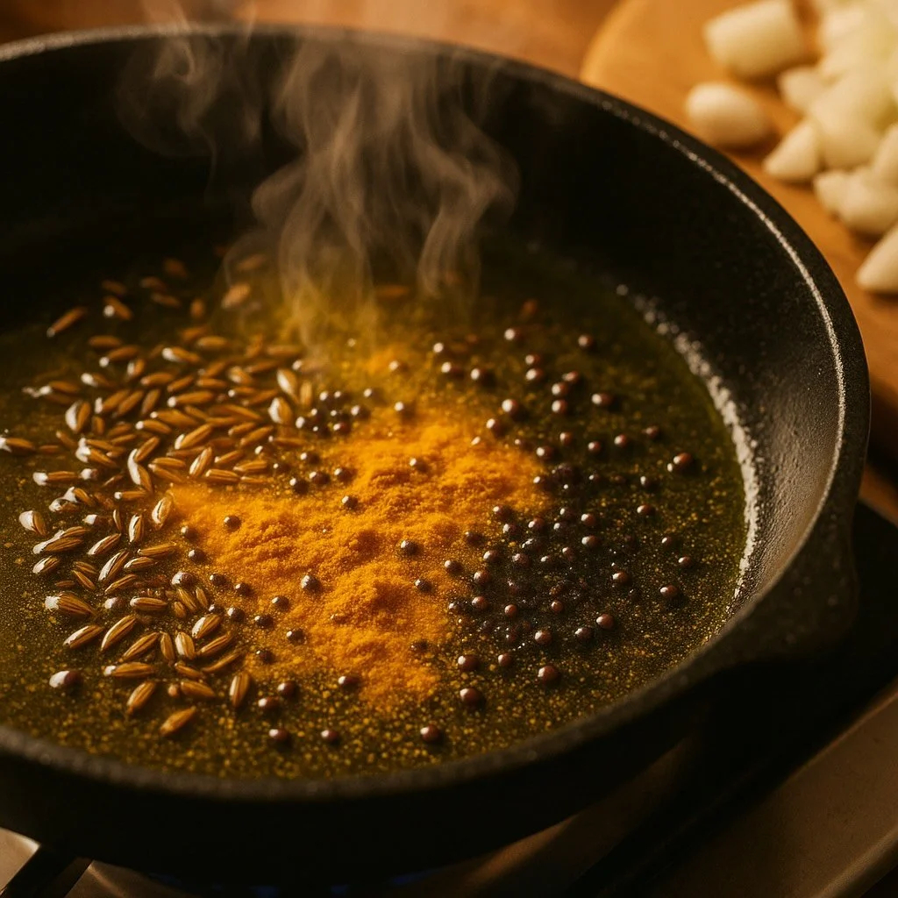

# Blooming and Toasting

*Heat is the easiest way to wake spices up. Dry-toasting amplifies aromatic compounds; oil-tempering extracts and disperses them; ghee-blooming sets them up to coat everything else in the pan.*

## Overview
If you only learn one thing from this course, learn this. The same teaspoon of cumin, added cold to a stew at the end versus dropped into hot oil at the start, is two completely different ingredients. Whole spices in particular hide most of their aroma until heat releases it; using them cold is like buying a wine and never opening the bottle.

There are three techniques that matter, used in different traditions but underlying the same principle: drive heat into the spice until the volatile oils boil out of the plant tissue, then capture them in fat or in the dish.

## Why Heat Matters

The essential oils that make a spice smell are held inside microscopic glands in the plant tissue. At room temperature, only a small fraction of them are free to evaporate; the rest stay locked in. Heat does two things:

1. It vapourises the oils, freeing them into the air around the spice.
2. It cracks open the cell walls, exposing the interior to whatever cooking medium is around.

When the heat is dry (a hot pan, no fat), the oils evaporate into the surrounding air and your kitchen smells incredible; some of the aroma sticks to the surface of the spice for use later. When the heat is in fat (oil, ghee, butter), the oils dissolve into the fat and disperse through the dish.

Fat-soluble compounds (most volatile oils) move into oil readily; this is what makes oil-tempering work. Water-soluble compounds (allyl isothiocyanate in mustard, sanshool in Sichuan pepper) are different, they can be released into oil too but they are also happy in water-based sauces and do not need fat at all.

## Dry-Toasting

The technique: heat a dry pan to medium-low. Add whole spices in a single layer. Toast, swirling the pan or stirring gently, until the spices smell fragrant and a thin wisp of smoke starts to rise. Tip onto a plate immediately, the pan stays hot enough to scorch them if you leave them in.

The signs of doneness:

- **Smell.** This is the main one. A toasted cumin seed smells dramatically richer than a raw one; you cannot miss it.
- **Sound.** Mustard seeds pop, fenugreek crackles, coriander shifts from silent to slightly sizzling.
- **Colour.** Cumin and coriander darken from beige to deep tan. Fenugreek goes from yellow-tan to a fox-red brown. Black mustard seeds turn grey on the inside as they pop.

What to toast: any whole seed (cumin, coriander, fennel, fenugreek, mustard, ajwain, nigella, caraway), peppercorns, allspice. Toasted spices then go into a mortar or grinder for an Indian or North African dry mix, or directly into a stew.

What not to toast dry: anything ground (it scorches in seconds), turmeric (it turns bitter quickly when over-heated), saffron (water-bloom only), cinnamon sticks (waste of heat; they release in the eventual simmer).

## Oil-Tempering (Tadka, Chaunk, Tarka)

The Indian technique. Heat a small amount of ghee, mustard oil, or neutral oil in a small pan until shimmering. Drop in the spice (whole, usually) and let it bloom for 10-30 seconds. The moment the aroma rises sharply, kill the heat or pour the whole pan over the finished dish.

The order matters. Tougher spices that need longer in the oil go first; delicate ones go last. A typical sequence for an Indian dal finisher:

1. **Mustard seeds.** Hit the hot oil; they pop within 5-10 seconds. Wait until popping slows.
2. **Cumin seeds and dried red chillies.** 5-10 more seconds; the cumin darkens, the chillies darken and puff slightly.
3. **Asafoetida and turmeric.** Pinch of each, swirled in off-heat. Both burn quickly; both are added at the end.
4. **Curry leaves.** Fresh curry leaves go in last and crackle dramatically; this is the signature note of south Indian cooking. Aim a lid at the pan: the splatter is real.

The entire tadka takes 30-60 seconds. You then pour it (oil and all) over a finished dal, raita, vegetable side or chutney, and it transforms the dish from gentle to vivid.

## Ghee-Blooming (Curry Base)

The technique behind every long-cooked Indian curry. Heat ghee or oil in a heavy pan, fry onions until deeply browned (20-30 minutes), add garlic-ginger paste, then add ground spices (turmeric, coriander, cumin, chilli, garam masala) and stir continuously over medium-low heat for 30-60 seconds until the spices have darkened in colour and the oil starts to separate at the edges of the paste.

The key difference from tempering: this is for ground spices, not whole. Ground spices have already had their cell walls broken (by the grinding) so they release their oils much faster and burn much faster. You need a wet onion-and-fat base under them to moderate the heat; ground spices in dry oil are a disaster within seconds.

The signs of doneness:

- **Colour deepens.** The paste shifts from bright to deeper, darker shades; turmeric goes from yellow to ochre, paprika from red to deep red-brown.
- **Oil separates.** Small pools of clear coloured oil start to bead at the edges of the mass. This is the visual cue for "the spices are bloomed; add the liquid now."
- **The kitchen smells of cooked-spice depth.** The raw, slightly mealy edge of ground spice disappears and a deeper, more rounded aroma takes its place.

## Order Matters: Whole Before Ground

A general rule across all the techniques above:

1. Whole spices first (they take longer to release; survive longer in heat).
2. Ground spices after the whole have started releasing (they bloom in seconds; burn in not many more).
3. Anything ground onto the finished dish at the end (Aleppo pepper, Sichuan pepper, sumac, smoked paprika garnish) goes on after the heat is off.

Reversing the order, dumping ground spices into bare hot oil and waiting, turns spices to ash quickly. The flavour is acrid, bitter, irrecoverable.

## The Smoke Point Question

Different oils handle spice-tempering differently. Ghee has a high smoke point (250° C) and is the traditional Indian medium for a reason: you can get it screamingly hot without it breaking down. Mustard oil is also high (250° C) and adds its own pungent character. Neutral vegetable oils sit around 220-230° C and work fine. Olive oil smokes at 190-210° C and is not the right choice for tempering hard whole spices; the oil burns before the spice releases.

For long-cooked curries with ground spices, the temperature is moderate (the wet base keeps it below 130° C) and any decent oil works.

## When NOT to Heat

Some uses are deliberately cold:

- **Rubs.** Spice rubs on meat are heated by the meat's cooking, not pre-heated. Pre-toasting them is fine and intensifies the flavour; not strictly necessary.
- **Garnishes.** Sumac on hummus, Aleppo on a salad, ground sansho on grilled meat, these are added at the table for the lift, not cooked into the dish.
- **Pickling brines.** Cold pickling extracts spice character into vinegar slowly over days; that is the point.
- **Cold infusions.** Cardamom in cold milk, vanilla in cold cream, given enough time, the cold-extraction draws out the volatile oils into the dairy.

## Where Next
- [Mixes](mixes.md): now that you can bloom them, the regional blends are the next thing to learn.
- [Cuisines](cuisines.md): how each cuisine uses tempering, blooming or dry-toasting as a default starting move.
- [Fresh vs Dried](fresh-vs-dried.md): which version of a spice to reach for when blooming.
