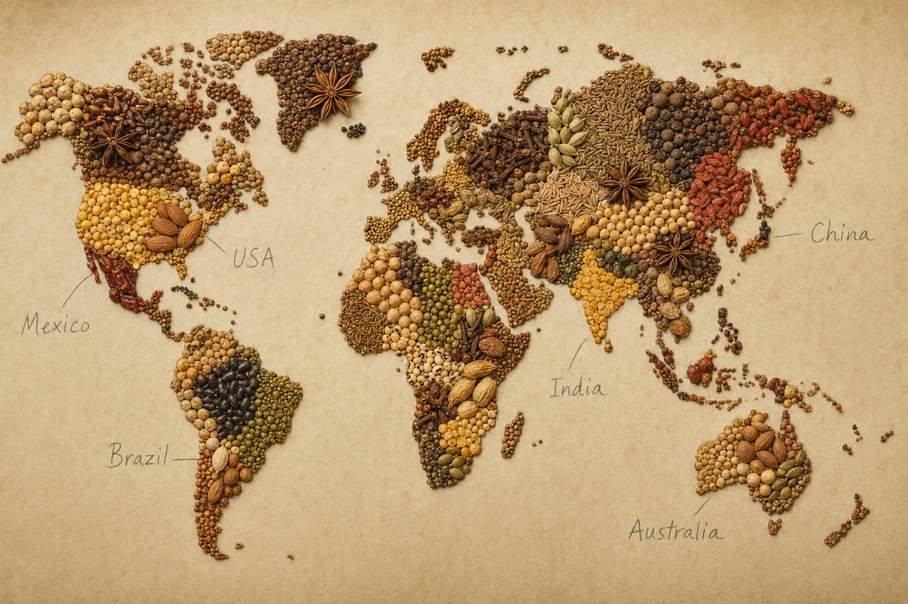

# Spice Fingerprints by Cuisine

*Every cuisine has a spice fingerprint, a small set of recurring aromas that you can taste through a hundred dishes. Recognising the fingerprint lets you place a dish, and helps you reach for the right additions in your own cooking.*

## Overview
This lesson is a quick reference. Each section gives a cuisine's signature aromatic profile, the workhorse spices it relies on, the spice mix that most defines it, and a sentence about how the spice base is built into the cooking method. The patterns are easier to remember when you taste them; cook your way through one or two dishes per cuisine and the fingerprints become instantly recognisable.

A note on what is omitted. Many great cuisines (Argentinian, Brazilian, Korean, the wider African continent, the Pacific) get short entries because their spice profile is either narrow (Argentinian leans heavily on salt and oregano with not much else) or their character comes more from fermentation, fresh herbs or technique than from dry spice. That does not make them less worthwhile; it just means the spice fingerprint is not the dominant signature.

## Indian

**Signature aromatics:** Cumin, coriander, turmeric, ginger, garlic, garam masala, mustard seed (south), asafoetida (south), fenugreek (south).

**Hero blend:** Garam masala (the warming blend used at the end). Plus a base of cumin-coriander-turmeric ground spices that go into the curry early.

**Method:** Indian cooking is built on layered spice. Whole spices temper in oil (tadka). An onion-tomato base is browned. Ground spices bloom in the fat. The protein or vegetable goes in. Liquid is added and simmered. Garam masala is sprinkled at the end. Fresh coriander leaves and lemon finish. The architecture changes by region (south Indian uses curry leaves, mustard seed, asafoetida and coconut; Punjabi uses cream, ginger, garam masala; Bengali uses panch phoron, mustard oil and fish), but the build-it-up-in-layers approach is universal.

## Thai

**Signature aromatics:** Galangal, lemongrass, kaffir lime leaf, Thai basil, chilli, garlic, shrimp paste, fish sauce.

**Hero blend:** Curry pastes, red, green, yellow, massaman, panang. These are not dry spice mixes but wet pastes pounded from fresh aromatics (galangal, lemongrass, lime, shrimp paste, dried chilli, garlic, coriander root, white peppercorn).

**Method:** Thai cooking leans on fresh aromatics rather than dry spice. The dry spice that does appear (cumin, coriander seed in some curries; white pepper; star anise in northern dishes) plays a supporting role to the fresh galangal-lemongrass-lime triumvirate. See [Thai Curry](../thai-curry/thai-curry.md) for the worked technique.

## Chinese

**Signature aromatics:** Ginger, garlic, scallion, Shaoxing wine, soy, sesame oil, star anise (north), Sichuan pepper (Sichuan), dried chilli (Sichuan, Hunan), five-spice, white pepper, fermented black beans.

**Hero blend:** Chinese five-spice (star anise, fennel, clove, cinnamon, Sichuan pepper). For Sichuan cooking, the ma-la (numbing-spicy) combination of Sichuan pepper plus dried chilli.

**Method:** Stir-fries lean on the fresh ginger-garlic-scallion-Shaoxing base with relatively little dry spice. Braises and red-cooked dishes use star anise, cinnamon and five-spice for long-simmered depth. Sichuan and Hunan cooking is the exception: heavy on dried chillies, Sichuan pepper, fermented bean paste (doubanjiang) and an aromatic intensity that other regional Chinese cooking does not match.

## Japanese

**Signature aromatics:** Sansho pepper, shichimi togarashi, wasabi, ginger, yuzu zest, mustard (karashi), shiso.

**Hero blend:** Shichimi togarashi (seven-spice: chilli, sansho, dried orange peel, sesame, hemp seed, ginger, nori). For curry-house ramen and Japanese curry, S&B Golden Curry blocks are a defining mass-produced blend.

**Method:** Japanese cooking is the most spice-restrained of the major Asian cuisines. The Japanese aesthetic prizes clean single flavours; the dashi-soy-mirin base does most of the work. Where spice appears it is finishing: a pinch of shichimi over noodle soup, a smear of wasabi with sashimi, ground sansho on grilled chicken. The exception is curry rice (kare raisu), which uses a fairly intense Japanese-style curry powder based on a colonial-era British blend.

## Korean

**Signature aromatics:** Gochugaru (Korean dried chilli flakes), gochujang (fermented chilli paste), garlic, ginger, sesame oil, sesame seeds, soy.

**Hero blend:** Gochujang is the centrepiece, not a dry blend but a fermented paste that does the work a blend would do elsewhere.

**Method:** Korean cooking is fermentation-led (kimchi, doenjang, gochujang) and uses dry spice sparingly. The chilli character comes from the slow-fermented gochujang plus the bright-red coarse gochugaru. Garlic, ginger, sesame and soy do the supporting work; black pepper appears in small amounts; no other dry spice plays a major role.

## Vietnamese

**Signature aromatics:** Fish sauce, lime, chilli, mint, Thai basil, sawtooth coriander, lemongrass, star anise (in pho), cinnamon (in pho), ginger.

**Hero blend:** Pho broth seasoning, star anise, cinnamon, cloves, cardamom pods, coriander seed, fennel, charred ginger and onion. Plus the table herbs that finish every dish.

**Method:** Vietnamese cooking is the lightest of the South-East Asian cuisines on dry spice. The flavour profile comes from fresh herbs (table-loaded by the bowl), fish sauce, lime, sugar, chilli. Pho is the great exception, the broth is heavily spiced and slowly built.

## Middle Eastern (Levantine and Gulf)

**Signature aromatics:** Cumin, coriander, allspice, sumac, baharat, za'atar, cardamom (for coffee and rice), saffron, dried lime (loomi), Aleppo pepper.

**Hero blends:** Baharat (paprika-anchored warming blend), za'atar (the sumac-sesame-thyme finisher).

**Method:** Middle Eastern cooking layers cumin and coriander as the workhorses, adds warming depth with allspice and baharat, and finishes with sumac and za'atar at the table. Slow-cooked dishes (mansaf, kabsa, machbous) build a heavy spice base early; mezze and grilled dishes finish with za'atar dipping and sumac garnish. See [Middle Eastern Fundamentals](../middle-eastern-fundamentals/middle-eastern-fundamentals.md).

## Moroccan / North African

**Signature aromatics:** Cumin, paprika, ginger, cinnamon, saffron, ras el hanout, preserved lemon, harissa.

**Hero blend:** Ras el hanout (sweet-warm blend of 10-30 spices including cardamom, clove, nutmeg, allspice, rosebud). Plus harissa as a chilli-paste counterpart.

**Method:** Moroccan tagines build a paste of garlic, ginger, paprika, cumin and ras el hanout that goes onto the meat (often lamb), with preserved lemon and olives for the finish. The long-cook tagine method extracts the spice slowly; the addition of dried fruit (apricots, prunes) plus the sweet warmth of cinnamon and allspice gives a sweet-savoury balance that distinguishes the cuisine from anything else in the region.

## Mexican

**Signature aromatics:** Dried chillies (ancho, guajillo, chipotle, pasilla, mulato), cumin, oregano (Mexican oregano specifically, which is different from Mediterranean), achiote (annatto), cinnamon, allspice, cloves, cocoa.

**Hero blend:** Mole. Specifically mole poblano (the great Pueblan blend with chocolate, dried chillies, plantain, sesame, pumpkin seed, almonds, raisins, cinnamon, clove, anise, peppercorn) but there are dozens of regional moles. Plus simpler adobo rubs (chilli powder, cumin, oregano, garlic).

**Method:** Mexican cooking is dried-chilli led. Different chillies dry into different flavour profiles: ancho is fruity and raisin-sweet, guajillo is bright and slightly tart, chipotle is smoky, pasilla is earthy. A salsa or mole layers two or three different chillies for depth. Cumin and oregano are the supporting spice; cinnamon and clove appear in moles and in pork dishes (cochinita pibil, carnitas).

## Caribbean

**Signature aromatics:** Allspice (Jamaican pimento), scotch bonnet chilli, thyme, ginger, garlic, scallion, jerk seasoning, curry powder (Trinidad-style), nutmeg.

**Hero blend:** Jerk seasoning (allspice-heavy with thyme, scotch bonnet, garlic, scallion, brown sugar, cinnamon). Plus Trinidad curry powder for the Indo-Caribbean strand.

**Method:** Caribbean cooking is allspice-dominated. The allspice berry (called pimento in Jamaica) is the signature note. Scotch bonnets supply intense heat with a fruity character; thyme, scallion and garlic supply the herbal base. Long-marinated jerk pork or chicken takes the spice all the way through.

## Ethiopian

**Signature aromatics:** Berbere, mitmita, dried chilli, fenugreek, niter kibbeh (spiced clarified butter), korarima (Ethiopian cardamom), turmeric, ginger.

**Hero blend:** Berbere (chilli-fenugreek-cardamom-warm spice blend). Plus niter kibbeh, a spiced butter that flavours nearly every dish.

**Method:** Ethiopian cooking starts with niter kibbeh and onion cooked slowly to caramelisation, adds berbere and tomato to make a wat base, then the protein. The cuisine eats on injera (sourdough teff flatbread) which absorbs the sauce. Doro wat (chicken stew with hard-boiled eggs) is the signature dish.

## French

**Signature aromatics:** Black pepper, bay, thyme, parsley, tarragon, chervil, chives (the herb side); nutmeg in bechamel; cloves stuck in onion; juniper in game.

**Hero blend:** Herbes de Provence (south); bouquet garni (thyme + bay + parsley stems) for stocks and braises across the country.

**Method:** French cooking is the most herb-leaning rather than spice-leaning of the major European cuisines. The aromatic build is usually a mirepoix (onion, carrot, celery) plus bouquet garni in stocks and stews, with light grating of nutmeg in sauces and a few cloves stuck in an onion for studded braises. Heavy spice is reserved for game (juniper, allspice), for cured meats, and for North African colonial-influenced dishes.

## Italian

**Signature aromatics:** Fennel seed (in sausage, in pork), dried oregano, dried chilli (peperoncino), black pepper, nutmeg (in stuffed pasta), bay, parsley, basil, sage, rosemary.

**Hero blend:** No formal blend dominant. The "Italian spice" jar in supermarkets is an Anglo-American invention. Italian cooking uses individual herbs in characteristic combinations (basil with tomato; sage with butter; rosemary with lamb; fennel with pork).

**Method:** Italian cooking is relatively spice-light. Fresh tomato, garlic, olive oil and herbs do most of the work; cured meats supply depth; dried chilli (peperoncino) gives a small heat. The exception is Sicilian and southern Italian cooking, which uses cumin, fennel seed, saffron and cinnamon in ways the rest of Italy does not, the legacy of Arab presence.

## Cajun and Creole (Louisiana)

**Signature aromatics:** Paprika, cayenne, garlic powder, onion powder, black pepper, white pepper, thyme, oregano, bay, filé (ground sassafras, Cajun).

**Hero blend:** Cajun seasoning (paprika-heat-thyme-oregano-garlic); Creole is similar but adds basil and uses more black-and-white pepper than cayenne.

**Method:** Cajun cooking starts with a dark roux (flour browned in oil to a chocolate colour), adds the "holy trinity" (onion, celery, green pepper) and then layers the dry spice plus stock for gumbo, etouffee, jambalaya. The dish is paprika-and-cayenne forward without losing the herbal supporting cast.

## Other Notable Profiles in Brief

- **Hungarian:** Sweet and hot paprika dominant; caraway; bay. Goulash, paprikash.
- **Polish/Eastern European:** Dill, caraway, marjoram, allspice, bay. Less spice-heavy than Mediterranean or Asian cooking.
- **Spanish:** Paprika (smoked and sweet, pimenton); saffron; bay; in some regions cumin (Andalusia).
- **Portuguese:** Piri piri (chilli); saffron; coriander; cinnamon (in egg desserts); paprika.
- **German:** Caraway; juniper; bay; mustard; horseradish. Low-spice; pickling-heavy.
- **Scandinavian:** Dill; caraway; juniper; allspice; cardamom (sweet baking).
- **Russian/Slavic:** Dill; bay; mustard; coriander seed.
- **Persian:** Saffron; dried lime (loomi); cinnamon; cardamom; sumac; rosewater.
- **Turkish:** Sumac; paprika (Aleppo, Maras); cumin; dried mint; allspice; black pepper.

## Where Next
- [Spices Course Intro](spices.md): the top of the course.
- [Mixes](mixes.md): the blends listed above, with home recipes.
- [Pairing](pairing.md): how the spice fingerprints work as combinations.
