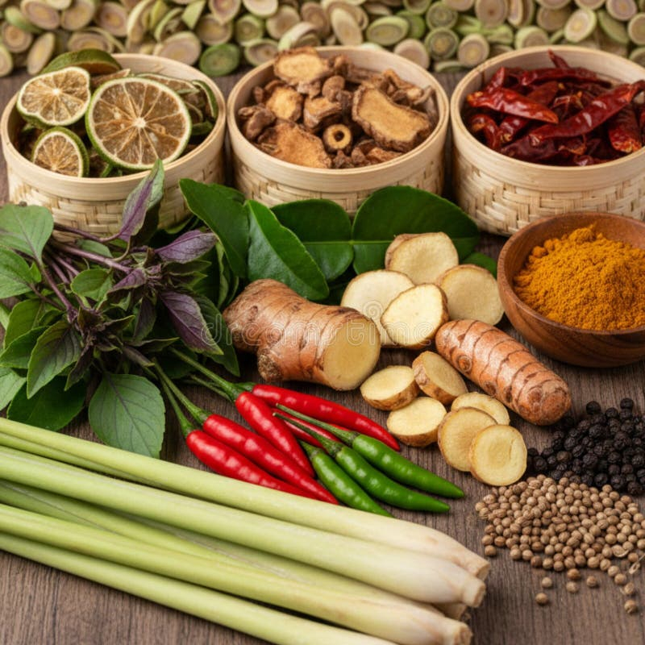

# Fresh vs Dried

*Most spices come dried; their fresh counterparts taste like a different ingredient. Knowing when each is right keeps the kitchen flexible and the shopping focused.*

## Overview
For a lot of spices, the question does not arise. You will never see fresh cumin seed or fresh coriander seed in a market; both are dried by definition (the green leaf you call coriander or cilantro is the herb, not the spice). But for a handful, peppercorns, chillies, ginger, turmeric, galangal, bay, the fresh and dried versions both exist, and they are not interchangeable.

The general principle: drying concentrates some compounds and loses others. Dried versions are usually more pungent, more bitter, more shelf-stable; fresh versions are usually brighter, more citrussy, more delicate. The decision is dish-by-dish, not preference-by-preference.

## The General Rule

Fresh contains volatile, citrus-leaning compounds (terpenes like limonene, linalool, citral) plus water. Drying drives the water off and takes most of the terpenes with it; what is left is dominated by larger, less volatile compounds (sesquiterpenes, longer-chain aromatics, sometimes new compounds formed by Maillard browning during the drying itself).

So: **fresh leans citrus and bright; dried leans earthy and warm.** A dish that wants both should use both.

## Where Fresh Wins

These ingredients are noticeably better fresh, even when a dried form exists:

### Green Peppercorns
The unripe pepper berry, picked before it browns. Bright, herbaceous, distinctly peppery without the burn of the dried black pepper. Brined fresh green peppercorns in jars are the practical home form; truly fresh ones are rare outside producing regions. Use in pates, sauces (steak au poivre vert), peppercorn-mustard cream sauces.

### Fresh Ginger
The fresh rhizome has gingerol, which has a sharp, citrussy heat. Drying converts gingerol to shogaol, which is hotter but rounder and sweeter. Fresh ginger is the answer for Asian and South Asian cooking where the brightness matters, stir-fries, curries, pickles, raitas. Dried ground ginger is the answer for baking and Western spice cookies, where the rounder, sweeter compound suits the long-cooked context. They are not substitutes for each other.

### Fresh Turmeric
The rhizome looks like a small orange ginger. Mild, slightly resinous, earthy without the bitterness of dried. Sometimes available in Indian or South-East Asian markets. Slice or grate into curries for a brighter, less yellow result. Dried ground turmeric will always be more available and is what most Indian recipes assume; the fresh is a treat.

### Fresh Chillies
Fresh chillies (bird's eye, jalapeno, scotch bonnet, habanero, serrano) and dried chillies (ancho, guajillo, chipotle, Kashmiri) are different ingredients. Fresh has bright vegetable character + heat; dried has fruity, raisinous, smoky character + heat. Mexican cooking uses both, often in the same dish; Thai cooking leans fresh; Korean leans dried (gochugaru). See [Cuisines](cuisines.md).

### Fresh Galangal, Lemongrass, Kaffir Lime Leaves
The aromatic triumvirate of Thai cooking. Dried galangal slices exist and are usable for the long-cook backbone of a Thai soup, but the brightness comes from fresh. Lemongrass loses its citrus character on drying; only fresh delivers. Kaffir lime leaves dry decently but the fresh leaves have a sharper lift; freeze fresh leaves rather than buy dried.

### Fresh Curry Leaves
Available frozen if not fresh; the dried ones are nearly inert. The bloom of a tadka over fresh curry leaves is the signature note of south Indian cooking and cannot be replicated dry.

### Fresh Bay Leaves
A rare case where fresh is dramatically better, partly because most dried bay sold in supermarkets is years old and has lost most of its aroma. A fresh bay leaf is herbal and lifted; old dried bay tastes of nothing at all. A bay tree in a pot is the simplest fix; it lives outdoors year-round in most temperate climates.

## Where Dried Wins (or Is the Only Option)

These are dried-by-definition or so dramatically different fresh that the dried form is the spice:

### Cumin, Coriander Seed, Fennel, Caraway, Anise
All seeds. Fresh "cumin" does not exist as a culinary ingredient; the plant is grown, the seed is harvested, the seed is dried. Same for coriander seed (the fresh leaf is the herb; the seed is the spice). These all need toasting and grinding to release their oils; they reward whole purchase and fresh grinding.

### Dried Mediterranean Herbs
Oregano, thyme, rosemary, sage, marjoram, here, dried is sometimes sharper than fresh. Greek oregano in particular concentrates dramatically on drying; the small dried sprigs of wild oregano sold in bunches at Mediterranean markets are aromatic in a way fresh oregano rarely is. Fresh oregano is milder, more grassy. For pizza, for grilled lamb, for Greek salad dressing, dried is often the right call. For pesto-style preparations and finishing fresh dishes, fresh wins.

### Saffron
Always dried. The threads (the stigmas of the crocus flower) lose their colour and aroma rapidly if not dried within hours of picking; saffron has never been a fresh ingredient in the kitchen.

### Sumac
The dried ground berries of the sumac bush. The fresh berries are sour but waxy and astringent; the spice we cook with is always dried.

### Cinnamon, Cassia, Cloves, Nutmeg, Mace, Allspice
All tree-derived spices that are processed (dried, sometimes fermented) before they reach the kitchen. There is no fresh form in any practical sense.

## Where Both Work (in Different Dishes)

Some ingredients give different dishes when you use the fresh versus dried form, and you would use both depending on what you wanted:

### Black Pepper
Whole peppercorns (ground fresh from a mill) vs pre-ground pepper. This is not "fresh vs dried" in the botanical sense, both are dried, but it is the same idea. Ground pepper loses most of its piperine in weeks; whole peppercorns ground at the table hit completely differently.

### Mustard Seeds vs Made Mustard
Whole mustard seeds (toasted, tempered) deliver one thing; made mustard (mustard seeds plus liquid, ground into paste) delivers another. Both are dried at the seed stage but the soaking-then-grinding step changes the compound profile, allyl isothiocyanate develops in the presence of water and acid. A teaspoon of mustard seeds in a tadka and a teaspoon of made Dijon in a vinaigrette are not the same.

## Reconstituting Dried

Dried chillies in particular benefit from soaking before use. Toast briefly, then steep in hot water (or stock, or vinegar) for 15-30 minutes; the chilli softens and the soaking liquid takes on much of the flavour. Both go into the dish: chilli puree from the rehydrated flesh, soaking liquid as part of the sauce base. Mexican mole-style cooking depends on this.

Dried mushrooms, kombu, dried shrimp, same principle, even though these are not spices in the strict sense. The fresh ingredient and the dried-then-reconstituted ingredient are different ingredients; the dried-then-reconstituted often has a deeper, more umami character that the fresh never develops.

## Where Next
- [Spice Pairing](pairing.md): which spices reinforce each other, which clash, which to add fresh against a dried base.
- [Cuisines](cuisines.md): the fresh-or-dried preferences encoded in each major cuisine.
- [Storage](storage.md): how to keep both the fresh aromatics and the dried jars from fading.
