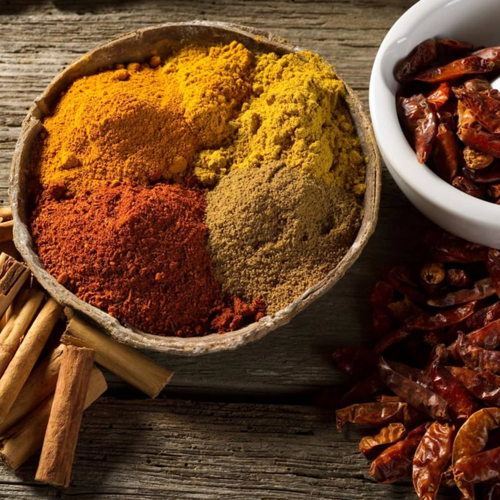

# Spice Mixes

*Most cuisines built their identity not on a single spice but on a blend. Learn the architecture of a few core mixes and most regional cooking becomes legible.*

## Overview
A spice blend is an idea. It is not just a list of spices; it is a balance of warmth, sweetness, depth and lift, tuned for the food a regional cuisine actually cooks. Garam masala is built for long-simmered Indian curries; ras el hanout is built for tagines and slow-cooked North African dishes; herbes de Provence is built for grilled Mediterranean lamb and roast vegetables. Each blend assumes a cooking method and a dominant ingredient.

This lesson lays out a dozen of the most useful blends, their architecture (what does the warmth, what does the lift, what does the heat), and the version you can build from scratch with whole spices you grind yourself. Pre-mixed jars in supermarkets work in a pinch, but a home-mixed version made from fresh whole spices is dramatically better.

## Why Cuisines Have Blends

A blend buys you two things:

1. **Consistency.** A cuisine that uses the same spice profile across hundreds of dishes builds a recognisable flavour signature. You can taste your way to "this is Moroccan" within two bites of food cooked with ras el hanout, because the smell is unmistakable.
2. **Convenience.** A cook who has already balanced cumin, coriander, cardamom, cinnamon, clove, pepper and bay into one jar can add a teaspoon to a dish and trust the blend to do its work, rather than measuring seven things.

Most traditional blends have no fixed recipe. Garam masala in northern India differs from garam masala in the south; every home and shop has its own. The blends below are starting points, not absolutes.

## Garam Masala (Indian)

The warming blend used to finish North Indian dishes. Added at the end of cooking (so the aromatics do not fade in long simmering) and used in small amounts.

A base recipe:
- 2 tbsp cumin seeds
- 2 tbsp coriander seeds
- 2 tbsp black peppercorns
- 1 tbsp green cardamom pods (use only the seeds, discard the pods)
- 1 tbsp cloves
- 2 cinnamon sticks (5 cm each), broken
- 2 bay leaves, crumbled
- 1 piece (2 cm) mace blade
- 1 nutmeg, grated at the end

Dry-toast the whole spices until fragrant. Grind. Stir in the grated nutmeg. No chilli, no turmeric - garam masala is about warmth, not heat or colour.

## Ras El Hanout (Moroccan / North African)

"Top of the shop" - the seller's best blend. Famously variable; some versions contain 30+ ingredients including rosebuds, lavender, ash berries. The core is warm and sweet rather than hot.

A working version:
- 2 tsp cumin seeds, toasted
- 2 tsp coriander seeds, toasted
- 1 tsp black peppercorns
- 1 tsp ginger powder
- 1 tsp turmeric
- 1 tsp paprika
- 1 tsp cinnamon
- 1/2 tsp ground cardamom
- 1/2 tsp ground cloves
- 1/2 tsp ground nutmeg
- 1/2 tsp ground allspice
- pinch of saffron threads (optional)
- pinch of dried ground rosebuds (optional but distinctive)

Goes into tagines, lamb dishes, vegetable stews, couscous. The blend works best with slow-cooked, fatty meats; the sweetness of cinnamon, allspice and cardamom reads as savoury depth against rich braising lamb.

## Baharat (Levantine)

The Arabic word baharat just means "spices" - the blend varies across the region (Syrian, Lebanese, Gulf, Iraqi). The common thread is paprika anchoring a warm-pepper-clove direction.

A Lebanese-style version:
- 2 tbsp sweet paprika
- 1 tbsp black pepper
- 1 tbsp cumin
- 1 tbsp coriander seed
- 1 tsp cinnamon
- 1 tsp cloves
- 1 tsp cardamom (seeds only)
- 1 tsp nutmeg, grated

Used on meatballs (kibbeh), rice (hashweh), stuffed vegetables. Less complex than ras el hanout but more pepper-forward; the paprika gives a colour and a slight sweet smokiness.

## Za'atar (Levantine)

Not just a spice but a finishing condiment. The blend has two non-spice ingredients (sumac and sesame) which make it more like a dukka than a traditional powder.

A working version:
- 4 tbsp dried thyme (or za'atar herb if you can source it - the Origanum syriacum)
- 2 tbsp sesame seeds, toasted
- 2 tbsp ground sumac
- 1 tsp salt
- 1 tsp dried marjoram or oregano (optional)

Goes on flatbread (manakish), labneh, fattoush salad, grilled meat. Eaten with olive oil for dipping bread. Sumac gives the tart lift; sesame gives the body; thyme is the herbal backbone.

## Chinese Five-Spice

The blend that defines Cantonese and Sichuan cooking when it shows up. Note that "five" is symbolic (one spice per element); some blends have six or seven.

The five:
- 2 tbsp star anise (broken)
- 1 tbsp fennel seeds
- 1 tbsp cloves
- 1 tbsp cinnamon stick (broken; Chinese cassia, not Ceylon)
- 1 tbsp Sichuan peppercorns

Toast, grind, store. Used in red-braised dishes, pork belly, duck, roast chicken (rubbed under the skin), some stir-fries. The Sichuan pepper is the distinctive ingredient; without it, the blend reads as generic warm spice rather than Chinese.

## Herbes de Provence (Mediterranean)

Not a spice blend strictly - all herbs - but the role is the same.

The base:
- 2 tbsp dried thyme
- 2 tbsp dried marjoram
- 2 tbsp dried savory
- 2 tbsp dried rosemary
- 1 tbsp dried oregano
- 1 tsp dried lavender flowers (optional, sometimes contested)

Used on grilled meats, fish, roast vegetables, in stews. The lavender question is a real one: a small amount lifts the blend dramatically; too much makes it taste of soap. Build slowly.

## Old Bay (American, Mid-Atlantic)

The American seafood seasoning. Born in 1939 on the Chesapeake Bay. Distinctively celery-forward.

A reasonable home version:
- 2 tbsp celery salt
- 1 tbsp ground bay leaves
- 1 tbsp paprika
- 1 tsp ground black pepper
- 1 tsp ground white pepper
- 1/2 tsp ground cayenne
- 1/2 tsp ground nutmeg
- 1/2 tsp ground cloves
- 1/2 tsp ground cardamom
- 1/2 tsp ground mustard
- 1/2 tsp ground allspice
- 1/2 tsp ground ginger

On crab, shrimp, fries, corn on the cob, popcorn. The celery and bay are the distinctive notes; everything else is supporting.

## Cajun and Creole

Overlapping but different. Cajun is rustic and more about heat and paprika; Creole is more refined with herbs included.

Cajun:
- 2 tbsp paprika
- 1 tbsp cayenne
- 1 tbsp garlic powder
- 1 tbsp onion powder
- 1 tbsp black pepper
- 1 tbsp dried thyme
- 1 tbsp dried oregano
- 1 tsp salt

Creole (additional or distinct):
- 1 tbsp dried basil
- 1 tbsp dried thyme (more than Cajun)
- 1 tbsp white pepper (alongside black)
- Less cayenne

Used on blackened fish, gumbo, jambalaya, etouffee, dirty rice.

## Berbere (Ethiopian)

The blend behind every Ethiopian wat (stew). Distinctive for its chilli backbone and fenugreek depth.

A working version:
- 2 tbsp dried hot chillies (Ethiopian chillies if you can get them; otherwise a mix of dried bird's eye and Kashmiri), seeded and ground
- 1 tbsp paprika
- 1 tbsp coriander seed, toasted and ground
- 1 tbsp fenugreek seeds, toasted and ground
- 1 tsp cardamom (seeds only)
- 1 tsp allspice
- 1 tsp cumin
- 1 tsp cinnamon
- 1 tsp ground ginger
- 1 tsp ground cloves
- 1 tsp nutmeg
- 1 tsp ajwain (optional, traditional)

Used in doro wat (chicken stew), misir wat (red lentils), siga wat (beef). The fenugreek is the distinctive note; without it, the blend reads as a generic chilli mix.

## Madras Curry Powder (Commercial / Colonial)

The British colonial-era invention - a generic "curry powder" with no specific Indian regional equivalent. Still useful for anglo-Indian cooking (kedgeree, coronation chicken, curry-flavoured anything-British) and for cooks who want a single-jar shortcut.

A reasonable home version:
- 3 tbsp ground coriander
- 2 tbsp ground cumin
- 2 tbsp ground turmeric
- 1 tbsp ground fenugreek
- 1 tbsp ground ginger
- 1 tbsp paprika
- 1 tbsp chilli powder (Kashmiri or mild)
- 1 tsp ground black pepper
- 1 tsp ground cardamom
- 1 tsp ground cloves

For most real Indian cooking, this is a substitute for the layered build that the cuisine actually uses (whole spices tempered, ground spices bloomed, garam masala finishing). It is a pre-blended shortcut, not the real method.

## Pumpkin Spice (American Autumn)

Yes, this is a real blend in the same sense as the others - a regional condiment optimised for a regional dish (pumpkin pie). It just happens to be from the modern American cuisine.

The five:
- 4 tsp ground cinnamon
- 2 tsp ground ginger
- 1 tsp ground nutmeg
- 1 tsp ground allspice
- 1 tsp ground cloves

In pies, cakes, lattes, oatmeal, the inside of butternut squash before it goes in the oven. The blend is cinnamon-dominant and warm rather than complex; the entire profile is built around cinnamon plus three supporting warm notes.

## How to Build Your Own

Once you have made a few of the above, a pattern becomes obvious. Most blends are:

1. **A base of two or three workhorses.** Cumin and coriander are the most common pair; paprika is a third in many warm-region blends.
2. **A warm dimension.** Cinnamon, clove, allspice, cardamom, nutmeg - usually two or three in any given blend.
3. **A heat dimension.** Black pepper alone (Indian), black pepper plus dried chilli (Ethiopian, Cajun), Sichuan pepper (Chinese five-spice), or nothing (garam masala, ras el hanout).
4. **A distinctive note or two.** Fenugreek (berbere, madras), Sichuan pepper (Chinese five-spice), saffron (ras el hanout), sumac (za'atar), bay (Old Bay), lavender (herbes de Provence). This is what separates one blend from another structurally.

To build your own, start by picking a cuisine, picking the workhorses (you usually have cumin and coriander on hand), then layering one or two warm notes and a distinctive note. Toast everything whole, grind, taste, adjust. Write down what you actually liked.

## Where Next
- [Spice Pairing](pairing.md): which combinations work, which clash, how to add to or modify a blend.
- [Cuisines](cuisines.md): the cuisines these blends belong to, in context.
- [Storage](storage.md): blends fade faster than whole spices because the grinding has exposed everything to oxygen at once. Mix in small batches.
