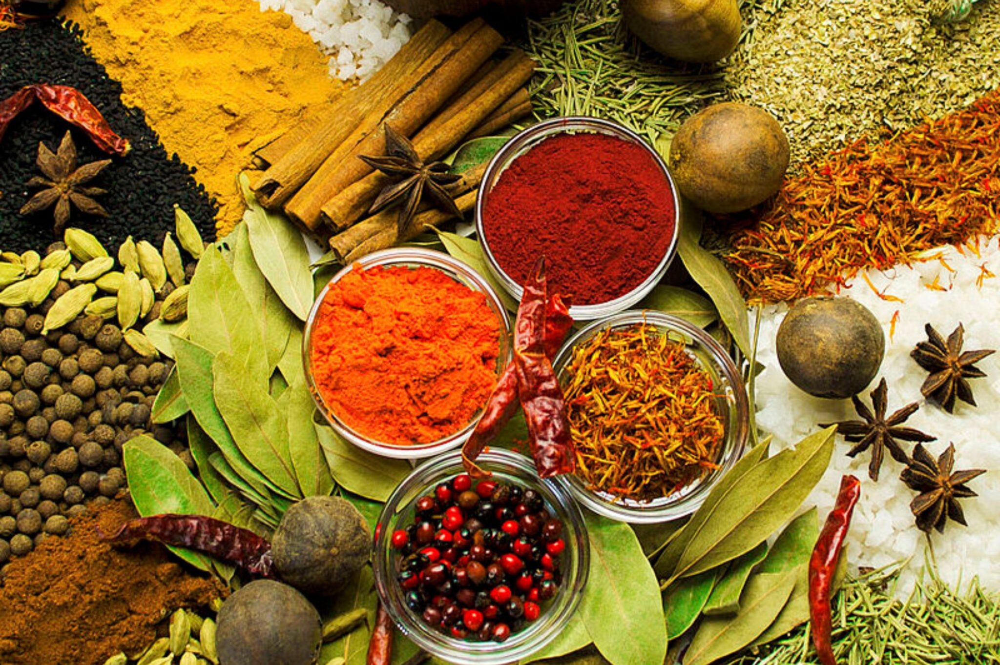

# Spice Pairing

*Most spices play well with each other; a small number clash; a smaller number anchor a dish on their own. Learning the workhorse pairings is the shortcut to inventing your own seasoning.*

## Overview
Pairing is what blends do at scale: lay several aromatics against each other so the dish reads as more than the sum of its parts. This lesson works backwards from blends to first principles, asking which pairings recur across cuisines and why. The recurring pairings are not coincidence; they tend to be combinations where the chemistry complements, one spice supplies citrus, another supplies depth, another supplies a warm note, and together they cover ground no single spice can.

The lesson also covers ingredient pairings: which spices love which proteins, vegetables, fats and acids. A roast chicken does different work with cumin and coriander than it does with thyme and lemon; pork wants fennel; lamb wants cumin; cauliflower wants turmeric or curry leaves. These pairings show up across the world because the chemistry works, not because of regional preference.

## The Workhorse Pairings

These three are the most-used pairs in world cooking. Memorising them gives you a starting point for almost any dish that wants a savoury aromatic profile.

### Cumin + Coriander
The most common pair in spice-using cuisine. Cumin brings earthiness and depth (cuminaldehyde, sesquiterpenes); coriander brings citrus and lift (linalool, limonene). Together they cover both ends of the aromatic spectrum without either dominating. Used in Indian, Mexican, North African, Middle Eastern and South American cooking. Cooks who only own two spices should own these.

### Ginger + Garlic
Not strictly two spices (garlic is an allium and ginger a rhizome) but the most foundational savoury pair in Asian cooking. Garlic supplies the sulphur-based pungency; ginger supplies the bright, warming bite. Most Indian, Chinese, Thai and Korean recipes start with a paste of the two; the proportions shift with the cuisine (garlic-forward in Chinese, ginger-forward in Thai).

### Onion + Bay
The base of most Western braises and stews. Onion supplies sweet depth on long cooking; bay supplies herbal lift. Add wine, tomato, stock and a protein and you have most of French, Italian and Mediterranean cooking.

## Warm-Note Pairings

Warming aromatics layer particularly well with each other; almost any combination works. The classic four are:

### Cinnamon + Clove
Together they cover most of "Christmas spice." Cinnamaldehyde and eugenol are both warm but read slightly differently, cinnamon is sweeter, clove more medicinal-aromatic. Used in mulled wine, pumpkin pie, gingerbread, lamb tagines, biryanis. Two cloves to a cinnamon stick is a reasonable starting ratio in long-simmered dishes; in baking the ratio is similar.

### Cardamom + Saffron
The luxurious Mughal-Indian-Persian pairing. Cardamom supplies a citrus-and-menthol high note; saffron supplies an earthy, honeyed depth and the colour. In milk-based desserts (kheer, kulfi, ras malai), in biryani, in Persian rice. Both are expensive; both are added at the end of cooking so the aromatics do not fade.

### Star Anise + Cinnamon
The Chinese / Vietnamese pairing for long-cooked meats, pho broth, red-braised pork, braised duck. Anethole (star anise) plus cinnamaldehyde gives a sweet-warm base that holds up to hours of simmering. Add ginger and Sichuan pepper and you are at Chinese five-spice territory.

### Nutmeg + Mace
Same plant, different parts (mace is the lacy aril around the nutmeg seed; nutmeg is the seed itself). Mace is brighter and more floral; nutmeg is rounder and more bitter. Used together in French sauces (especially bechamel, where a grating of nutmeg is the classic move), in moussaka, in cured meats, in baked goods.

## Bright-Note Pairings

Citrus-leaning spices layer well with each other and need warm notes to balance them.

### Coriander + Lemon (zest or juice)
Coriander's terpene profile reinforces lemon directly. Used in Middle Eastern lamb dishes, in seafood seasoning, in Greek and Lebanese cooking. A spice-coriander rub plus a finishing squeeze of lemon is one of the most versatile finishing moves in the kitchen.

### Cardamom + Citrus
Green cardamom in particular pairs with orange, lemon and lime. Cardamom-orange milk, cardamom-lemon shortbread, cardamom-rose syrup over fresh oranges. The citrus reinforces the cardamom's already citrus-leaning oil profile.

### Fennel + Anise + Tarragon
All three contain anethole; together they read as deeply herbal rather than separately spicy. Used in French fish dishes, in Italian sausage, in Mediterranean roasts.

## Heat Pairings

Heat-bearing spices layer differently. Capsaicin (chilli) and piperine (black pepper) are not really "warm", they are receptor-pure, and they need warm or bright spices to round them out into something edible.

### Chilli + Cumin
The Mexican pairing. Cumin's earthiness softens the chilli's edge; the chilli supplies heat the cumin lacks. Carne adovada, chilli con carne, mole-adjacent rubs all sit on this pair.

### Chilli + Cinnamon (or Cocoa)
The Mexican mole architecture. Sweet warm spice plus dried chilli plus chocolate. The chocolate (cacao) supplies both bitterness and fat-soluble depth; the cinnamon supplies a rounded warmth that takes the edge off the chilli; the chilli supplies heat. Mole poblano is the canonical example.

### Black Pepper + Cardamom
The Indian rice biryani axis. Pepper bites; cardamom cools and brightens. Cooks who shy away from chilli often use this pair as the heat source in Indian cooking.

### Sichuan Pepper + Chilli
The Sichuan ma-la (numbing-spicy) combination. The sanshool gives a tingling, numbing sensation that reads as cooling against the chilli's heat. Mapo tofu, dan dan noodles, dry-fried green beans, chongqing chicken, the dish architecture in this region is built on the pair.

## Spice + Protein Pairings

Some pairings are so consistent across cuisines that they look like biological truths rather than preferences.

### Lamb + Cumin
Across Indian, Middle Eastern, Moroccan, Greek, Mexican and Chinese (Xinjiang) cooking, lamb gets cumin. The fatty richness of lamb absorbs cumin's earthiness exceptionally well. Coriander and chilli often join the pair; a lamb-cumin-coriander-chilli rub will work on any cuisine's grilled lamb skewer.

### Pork + Fennel (and Sage)
The Italian sausage pair. Fennel's anethole cuts through pork's fat; sage's slight bitterness adds a backbone. Many cured pork products (fennel sausage, finocchiona salami) lean on this pairing.

### Beef + Black Pepper (and Coffee, in Rubs)
Beef's iron-and-blood character takes black pepper better than almost any other meat. Steak au poivre is the textbook example; coffee-and-pepper rubs on brisket are a North American addition.

### Chicken + Tarragon (or Coriander)
Chicken is mild and takes herbal aromatics readily. The French use tarragon (chicken chasseur, poulet a l'estragon); Indian and Middle Eastern cooking use coriander and cardamom; Chinese uses ginger and white pepper.

### Fish (Oily) + Mustard + Dill
Oily fish like mackerel, herring, salmon take mustard and dill across Northern European cooking. The mustard's allyl isothiocyanate cuts the oil; the dill adds bright herbal lift.

### Fish (Delicate) + Lemon + Tarragon (or Chervil)
White flaky fish (sole, plaice, cod) take delicate herbal aromatics rather than spice. Lemon-tarragon butter sauce is the classical move; coriander seed and fennel work too.

### Game + Juniper (and Pepper)
Venison, hare, pheasant, partridge. Juniper berries crushed into a marinade; black pepper and bay alongside. The juniper's pine-resin compounds counter the meat's musky quality.

## Spice + Vegetable Pairings

### Carrot, Squash, Sweet Potato + Cumin, Coriander, Cinnamon
The root-vegetable warm-spice pairing. Roasted carrots with cumin and harissa; pumpkin pie with cinnamon and clove; sweet potato with coriander and chilli. Sweetness in the vegetable wants warm spice to balance.

### Cauliflower + Turmeric or Curry Leaves
Cauliflower has a slight sulphur character that turmeric (in a curry context) or curry leaves (in a south Indian sabzi) covers beautifully. Aloo gobi is the classic combination.

### Aubergine (Eggplant) + Cumin, Smoke
Smoky cumin notes (or actual smoke, from charring) is the Middle Eastern pair, baba ghanoush, moutabal, smoky melitzanosalata. Cumin alone works in Chinese aubergine dishes.

### Tomato + Basil, Oregano, Bay
The Mediterranean trio. Basil for fresh dishes; oregano for cooked; bay for long-simmered tomato sauce. Cumin and tomato work together in Mexican cooking but feel wrong in Italian.

### Mushroom + Thyme, Tarragon, Black Pepper
Earthy meets earthy. The umami of mushroom layers with the herbal-resinous quality of thyme; tarragon adds anise-bright lift. Avoid sweet spices (cinnamon, clove) with mushroom, they clash.

### Cabbage + Caraway, Dill, Mustard
The Eastern European triangle. Caraway for sauerkraut, cabbage rolls; dill for sour cabbage soups; mustard seed for pickled red cabbage. Sulphurous cabbage pairs with sulphurous mustard surprisingly well.

## Clashes to Avoid

Most spices play well together; a few combinations consistently jar:

1. **Saffron and lots of competing aromatics.** Saffron is delicate; pile garlic, ginger, multiple chillies and a heavy garam masala on a saffron rice and the saffron disappears. Use saffron where it can be tasted.
2. **Curry powder and Italian aromatics.** Cumin and oregano can work together (Mexican does it) but a generic "curry powder" plus basil-tomato-garlic reads as a wrong-cuisine mash-up.
3. **Cinnamon and mushroom.** The sweetness fights the umami.
4. **Star anise and dairy in long cooking.** The anethole can take on a fennel-licorice character that goes muddy against milk or cream in extended simmering. Use only briefly, or skip.
5. **Too many distinctive notes at once.** Saffron + cardamom + rose + sumac + smoked paprika is too many anchor points; the dish reads as confused. Pick a hero and supporting cast.

## The Three-Note Rule

A starting heuristic for inventing your own seasoning: pick **one earthy or savoury note** (cumin, coriander, paprika, fennel), **one warm note** (cinnamon, clove, cardamom, allspice, nutmeg), and **one bright or heat note** (chilli, sumac, lemon zest, fresh herb at the end). Three notes is rarely too few; six notes is usually too many.

When you taste an excellent dish and try to deconstruct what is in the seasoning, the answer is often surprisingly close to three. Garam masala has more than three ingredients but its character is the cumin-coriander-cardamom-clove balance; ras el hanout has many but its character is cumin-cinnamon-ginger; berbere is chilli-fenugreek-cardamom. The supporting cast rounds things out; the three hero spices are what you taste.

## Where Next
- [Mixes](mixes.md): the worked examples of how successful pairings get assembled into named blends.
- [Cuisines](cuisines.md): the pairings that each cuisine has institutionalised as its signature.
- [Blooming and Toasting](blooming-and-toasting.md): pairing is irrelevant if the spices are still locked in their jars; heat first.
