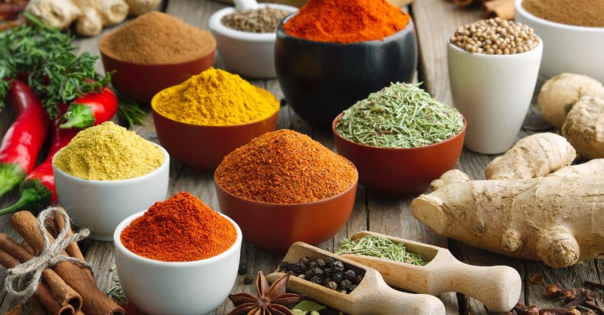

# Spices Course

*A course on spices: what they are, why they smell the way they do, how to wake them up with heat, when fresh beats dried (and when it does not), the regional blends that anchor a cuisine, and how to keep your spice rack from going stale.*

## Overview
Spices are the cheapest meaningful upgrade in the kitchen. A jar of cumin seed costs less than a coffee and rewrites every dish you toast it into. A pinch of saffron, properly bloomed, lifts a rice from nice to memorable. The trouble is that most home cooks own forty jars and use four; the rest sit at the back of the cupboard going slowly flat. This course is about treating spices with enough care that the jars earn their shelf space.

The lessons go in roughly the right order to learn from cold, but each stands on its own. Start with **Types** if you want a taxonomy; start with **Blooming and Toasting** if you want a technique that improves dinner tonight; start with **Cuisines** if you want to learn the spice fingerprints behind the food you already cook.

## Course Outline

### 1. Foundations
- [Types of Spice](types.md): seeds, barks, berries, roots, dried flower buds, resins, stigmata. The part of the plant a spice comes from shapes how you should handle it.
- [Aroma and Science](aroma-and-science.md): the volatile oils that make a spice what it is. Where heat comes from (capsaicin, piperine), where warmth comes from (eugenol, cinnamaldehyde), why old jars taste like sawdust.

### 2. Technique
- [Blooming and Toasting](blooming-and-toasting.md): how heat releases aromatic compounds. Dry-toasting a seed, oil-tempering a tadka, ghee-blooming for an Indian curry. Order matters, and so does the moment you stop.
- [Fresh vs Dried](fresh-vs-dried.md): when fresh wins (green peppercorn, fresh turmeric, kaffir lime leaf), when dried is the only sensible option (cumin, coriander seed), and when the two ingredients are different enough that swapping one for the other does not really make sense.

### 3. Building Blocks
- [Spice Mixes](mixes.md): garam masala, ras el hanout, baharat, za'atar, Chinese five-spice, herbes de Provence, Old Bay, Cajun, berbere. The architecture of a few core blends covers most regional cooking, and shows you how to build your own.
- [Pairing](pairing.md): the workhorse spice-with-spice combinations (cumin and coriander, cinnamon and clove, chilli and cumin), spice-with-protein pairings (lamb wants cumin; pork wants fennel; beef wants pepper) and the clashes to avoid. Three notes is rarely too few; six notes is usually too many.

### 4. Keeping and Knowing
- [Storage](storage.md): what light, oxygen and heat do to a spice over weeks and months. Whole vs ground shelf life, the sniff test, when to throw a jar out.
- [Spice Fingerprints by Cuisine](cuisines.md): the recurring aromas that let you taste your way to "this is Moroccan" or "this is Sichuan" within two bites. The signature blends of a dozen world cuisines.

## The Three Things That Matter

Most of the course collapses into three principles.

1. **Volatile oils are the point.** Every spice's smell is a small chemistry set of essential oils that evaporate over time. Whole spices hold onto these compounds far longer than ground; heat and fat release them; light, oxygen and time take them away. A spice that smells of nothing is one whose volatile oils have left, and no amount of cooking will get them back.

2. **Heat is the lever.** The same teaspoon of cumin in a finished sauce versus dropped into hot oil at the start of cooking is two different ingredients. The toasting and tempering lessons matter more than any other technique in the course, because everything else is helpless if the spices stay locked in their jars.

3. **A blend is an idea.** Garam masala is not a list of spices; it is a balance of warmth, sweetness, depth and lift, tuned for the regional cooking it serves. Learning a few core blends gives you a vocabulary for the rest. You can then bend a blend toward what you have, what is fresh, and what suits the dish.

## Where to Start

- New to spices: [Blooming and Toasting](blooming-and-toasting.md). The single most useful technique in the course. Improves dinner tonight.
- Curious about the science: [Aroma and Science](aroma-and-science.md). Reads more like a chemistry primer than a cooking lesson; sets the foundation for everything else.
- Want a vocabulary for world cooking: [Cuisines](cuisines.md). Skim the spice fingerprints of a dozen cuisines; the patterns are obvious once they are laid out.
- Want to invent your own seasoning: [Pairing](pairing.md). The three-note rule plus the workhorse pairings.
- Spices going stale: [Storage](storage.md). Most home cooks throw money away on jars that fade unseen; one fifteen-minute audit recovers half the rack.

## Where Next
- [Indian Home Cooking](../indian-home-cooking/indian-home-cooking.md): the cuisine where everything in this course lands first. Tempering, blending, dry-roasting, blooming - all built into the daily method.
- [Thai Curry](../thai-curry/thai-curry.md): a different relationship with spice - more about aromatics (galangal, lemongrass, kaffir lime) than dry spice.
- [Middle Eastern Fundamentals](../middle-eastern-fundamentals/middle-eastern-fundamentals.md): baharat, za'atar, sumac, allspice. The Levantine spice rack.
- [Mexican Fundamentals](../mexican-fundamentals/mexican-fundamentals.md): the dried-chilli vocabulary, plus cumin, oregano, achiote.
- [BIR Curry](../bir-curry/bir-curry.md): the British-Indian-Restaurant system, which is built on a pre-cooked spice base.

## A Note on Heat
"Heat" here means two things: the chilli-spice burning sensation, and the warming sensation of clove and cinnamon. Both are covered in [Aroma and Science](aroma-and-science.md). Capsaicin (chilli), piperine (black pepper), allyl isothiocyanate (mustard, horseradish, wasabi) and gingerol/shogaol (ginger) cause the burn. Eugenol (clove), cinnamaldehyde (cinnamon, cassia), anethole (star anise, fennel) and the menthol-like cooling of cardamom cause the warmth without burn. The two have nothing in common chemically; they just both happen to feel like temperature to your mouth.
