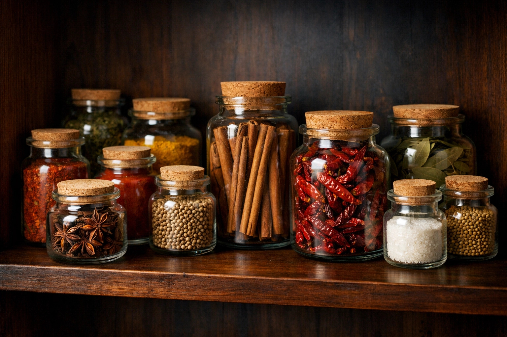

# Storage

*Spices do not spoil in the sense that they make you sick. They fade. The volatile compounds that make them what they are evaporate steadily; a year-old jar of ground cumin is a different ingredient than a fresh one.*

## Overview
Most home cooks own too many spice jars and replace none of them. The result is a drawer of slowly-fading powders that smell vaguely of generic spice but no longer of anything specific. None of them is unsafe to use. All of them are noticeably worse than what is available from a fresh whole-seed grind.

Storage is the rest of the spice question. The chemistry that makes a spice work (essential oils trapped in plant tissue) is fragile; the storage that protects it is mostly about keeping three enemies away. Get the storage right and your spice rack stays alive for years; get it wrong and a six-month-old jar tastes like nothing.

## The Three Enemies

**Light.** UV breaks down terpenes and other unstable aromatic molecules. A jar of paprika sitting on a sunlit windowsill fades visibly (the colour goes from bright red to dusty pink in months) and the aroma fades with it.

**Oxygen.** Essential oils oxidise into less aromatic, sometimes off-tasting compounds. Every time you open a jar, you replace some of the air inside with fresh oxygen. The smaller the jar, the smaller the dose of oxygen per opening.

**Heat.** Volatile compounds evaporate faster at higher temperatures. A spice cabinet above the hob (warmed every time you cook) ages spices significantly faster than one across the kitchen.

A fourth enemy worth mentioning: **moisture.** Damp air can let spices clump and grow surface moulds, particularly in tropical climates. The desiccant sachet that comes in some new spice jars exists for this reason.

## Shelf Life

Rough numbers for spices stored in airtight jars in a cool dark cupboard:

| Form               | Shelf life                              |
|--------------------|-----------------------------------------|
| Whole seeds        | 2-3 years, sometimes longer             |
| Whole peppercorns  | 2-3 years                               |
| Whole berries (allspice, juniper) | 2-3 years                |
| Whole cinnamon, cassia sticks | 2-3 years                    |
| Whole nutmeg       | 4-5 years (very stable)                 |
| Saffron threads    | 2-3 years (kept airtight)               |
| Dried chillies     | 1-2 years (then increasingly dusty)     |
| Cloves             | 2 years (then the eugenol fades)        |
| Ground spices      | 6 months to 1 year (real best-before)   |
| Pre-mixed blends   | 6 months                                |
| Fresh herbs (dried)| 6 months to 1 year                      |

The numbers are not absolutes; a well-sealed jar in a cold cupboard might give you another year, while a poorly-sealed one in a hot kitchen halves the life. The trend is what matters: whole holds, ground fades, blends fade fastest.

## The Sniff Test

The fastest way to audit your spice rack: open each jar, smell it. If you have to lean in close, sniff hard, and think for a second to identify the spice, it has lost most of its aroma. If you can smell it from arm's length, it is still alive.

For a more rigorous test, grind a few seeds of a known-good fresh spice (or buy a new jar) and compare the smell side by side. The difference is usually obvious.

The visual test works for some spices:

- **Paprika:** Bright red is good; dusty pink-brown is faded.
- **Turmeric:** Vivid yellow-orange is good; pale yellow is faded.
- **Dried chillies:** Deep red, slightly oily-looking is good; dull, dusty, brittle is faded.
- **Whole seeds:** Hard, smooth, glossy is good; chalky, brittle, fragmented is faded.

Taste does not help as much as smell; flat spices taste of nothing but they do not taste *bad*, and you might not notice the absence until you cook a dish that depends on the spice.

## Glass Jars vs Tins vs Plastic

**Glass.** The best for most spices. Inert, sealable, easy to clean and refill. Dark glass (amber or cobalt) protects from light additionally. Clear glass is fine if the jar lives in a cupboard.

**Metal tins.** Good for opaque-by-default protection from light. Some metals (uncoated tin, copper) can react with spices over time; lined or stainless is preferred. Tea-style tins with twist-on lids work well.

**Plastic.** Acceptable but not ideal. Plastic is slightly oxygen-permeable over months and can take on spice flavours (a jar that held cumin will smell of cumin even after washing). Use for short-term storage; replace if a jar has been emptied of one spice and you want to use it for another.

**Original spice-jar packaging from supermarkets.** Usually fine for the months of intended life but not designed for years; the seal is often a paper insert that loses its grip over time. If you buy spices in bulk and want them to last, decant into proper jars.

## The Cool-Dark Rule

The single best location: a cupboard away from direct sunlight, away from the hob, away from the dishwasher (which produces heat and humidity when it runs). Below worktop height is usually cooler than overhead cupboards.

Worst locations:

- A spice rack mounted on the wall above the hob. Heat plus light plus steam plus oxygen every time you cook. The jars look pretty but the spices fade fast.
- A windowsill, especially south-facing. Sun ages spices visibly within months.
- The fridge. The cold is fine but the humidity inside the fridge can let spices clump and grow surface mould, especially after the jar is opened. Sealed jars in the fridge are mostly safe; opened jars are a question.

## Freezing

Freezing slows oxidation and volatile-oil evaporation dramatically. Whole spices freeze well in airtight bags; ground spices technically freeze but the freeze-thaw cycle every time you open the bag introduces moisture (and the savings are smaller because grinding has already done much of the damage).

What is worth freezing:

- **Fresh ginger, turmeric, galangal:** Freeze in airtight bags; grate from frozen. Lasts indefinitely.
- **Curry leaves, kaffir lime leaves:** Freeze in small bags; use without thawing.
- **Fresh chillies:** Freeze whole, slice from frozen. The texture is mushy on thaw but the aromatics survive better than when dried.
- **Whole spices in bulk:** If you bought a large bag of cardamom pods or fenugreek seeds, freeze most of it; keep a working portion in the cupboard.

What is not:

- **Ground spices** (already half-faded; freezing only marginally helps)
- **Pre-mixed blends** (same)
- **Dried herbs** (lose more on freeze-thaw than they gain in storage time)

## Whole-Then-Grind as a Strategy

If you take one piece of advice from the storage lesson: **buy whole, grind small batches**. A spice mill, a coffee grinder dedicated to spices (not the one you use for coffee), or a granite mortar and pestle gives you fresh ground spice on demand. The remaining whole spices stay in their jars holding their oils.

The dedicated coffee grinder is the most-recommended setup. A second-hand burr or blade grinder costs less than a year's worth of fresh-ground spice from a good source. Wipe it out with rice (grind a tablespoon of dry rice and discard) between uses to keep flavours from carrying over.

## When to Throw Out

A spice that no longer smells of anything is finished. Cooking with it does not give the dish back its character; it just adds bulk. Throw out and replace.

A spice that smells faintly is borderline. For high-volume dishes (a stew that uses two teaspoons), you can use it up; the small flavour will be augmented by everything else. For dishes that depend on a single spice (saffron rice, a clove-and-cinnamon mulled wine, a pumpkin pie), use the fresh jar.

The annual audit: every January or after a holiday, open every jar in your spice rack and apply the sniff test. The ones that fail go in the bin (or the compost). The ones that pass get replaced sometime in the next twelve months. The rack stays small, alive and used.

## Where Next
- [Cuisines](cuisines.md): the cuisines you cook most determine what to keep stocked.
- [Mixes](mixes.md): blends fade faster than singletons; mix small batches.
- [Spices Course Intro](spices.md): back to the top for the next lesson.
